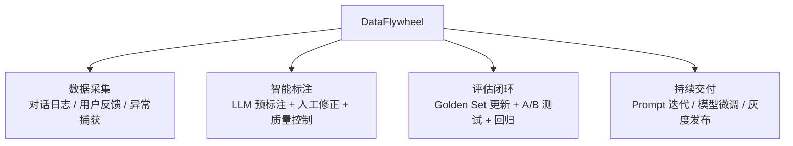

# 数据飞轮平台（DataFlywheel）· 项目总览

> **代号**DataFlywheel —— "让 Agent 越用越聪明：标注 → 训练 → 评估 → 上线 → 再标注"
>
> **核心问题**：你的 Agent 上线后怎么持续改进？没有数据飞轮，Agent 永远停留在 v1 水平。数据飞轮让每一次用户交互都成为改进的燃料。

---

## 项目定位

---

## 四个 Sprint

| Sprint | 主题 | V1→V2→V3 演进 | 时间 |
|--------|------|--------------|------|
| 1 | 数据采集与反馈 | 简单日志 → 结构化采集 → 实时反馈流 | 1 周 |
| 2 | 智能标注管线 | 手动标注 → LLM 预标注 + 人工修正 → 主动学习 | 1.5 周 |
| 3 | 评估闭环 | 静态 Golden Set → 动态更新 + A/B → 回归测试门禁 | 1 周 |
| 4 | 持续交付 | 手动迭代 → Prompt 自动优化 → 灰度发布管线 | 1 周 |

---

## 核心特性

- **全量对话采集**：每次 Agent 交互自动记录（输入 / 输出 / 工具调用 / 延迟 / 成本）
- **用户反馈采集**：👍👎 + 文字反馈 + 用户修正后的回答
- **LLM 预标注**：自动给对话打标签（好/坏/改进空间），降低人工标注成本
- **主动学习**：自动选择"最有价值"的样本送人工标注
- **Golden Set 自动更新**：从生产数据中提取高质量 Q&A 对
- **A/B 测试引擎**：新版本 vs 老版本并行对比
- **持续交付管线**：Prompt 变更 → 评估 → 灰度 → 全量

---

## 飞轮闭环

> **关键洞察**：飞轮每转一圈，Agent 就比上一版好一点。100 圈后，v1 和 v100 的差距是天壤之别。

---

## 知识映射

| 知识点 | 对应教程 |
|--------|---------|
| Eval 驱动开发 | [17-Eval驱动开发](../../阶段4-生产化/17-Eval驱动开发.md) |
| 流量回放与影子模式 | [20-流量回放与影子模式](../../阶段4-生产化/20-流量回放与影子模式.md) |
| Agent 性能调优 | [21-Agent性能调优](../../阶段4-生产化/21-Agent性能调优.md) |
| Agent 版本兼容性 | [23-Agent版本兼容性管理](../../阶段4-生产化/23-Agent版本兼容性管理.md) |
| LLM 成本工程 | [28-LLM成本工程深入](../../阶段4-生产化/28-LLM成本工程深入.md) |
| Prompt 工程化 | [29-Prompt工程化管理](../../阶段4-生产化/29-Prompt工程化管理.md) |
| 可解释性与对齐 | [30-Agent可解释性与对齐](../../阶段4-生产化/30-Agent可解释性与对齐.md) |

---

## 技术选型

| 决策 | 选择 | 原因 |
|------|------|------|
| 数据管道 | Kafka → Flink/Spark | 实时流处理 + 批处理统一 |
| 标注存储 | Postgres + JSONB | 结构化 + 灵活 schema |
| 反馈推送 | **SSE** | 实时单向通知，HTTP 兼容 |
| 实验追踪 | MLflow / 自建 | 参数 + 指标 + 制品追踪 |

---

## 下一步

→ [Sprint 1：数据采集与反馈](Sprint1-数据采集.md)
