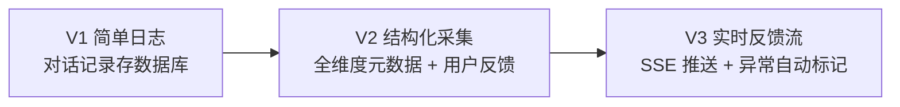
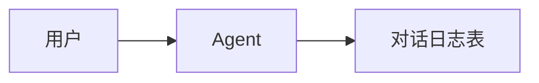
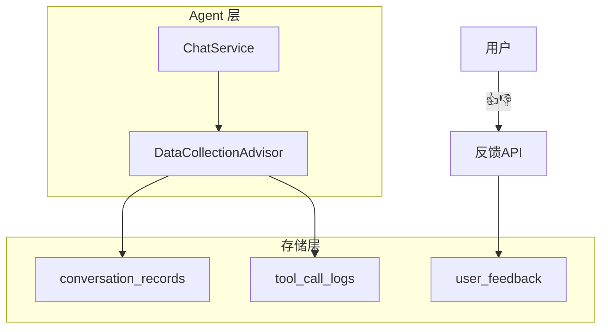
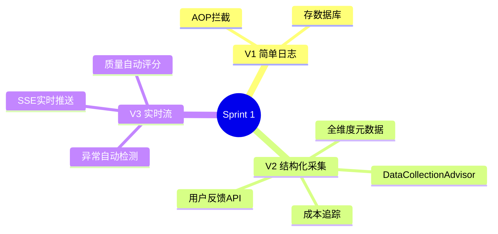

# Sprint 1：数据采集与反馈

> **目标**：把每一次 Agent 交互变成可用的训练数据——自动记录、用户反馈、异常捕获。
>
> **SSE 约束**：用户反馈推送使用 SSE。

---

## Sprint 概览



---

## V1：简单日志（~30 行）

### 架构



### 代码

```java
// V1: 最简对话采集
@Aspect
@Component
public class ConversationLogger {

    private final JdbcTemplate jdbc;

    @AfterReturning(value = "execution(* *..ChatService.chat(..))",
        returning = "result")
    public void log(JoinPoint joinPoint, String result) {
        var args = joinPoint.getArgs();
        var sessionId = args[0].toString();
        var userInput = args[1].toString();

        jdbc.update("""
            INSERT INTO conversation_logs
                (session_id, user_input, agent_output, created_at)
            VALUES (?, ?, ?, NOW())
            """, sessionId, userInput, result);
    }
}
```

### V1 的局限

- ❌ 没有用户反馈——不知道回答好不好
- ❌ 没有元数据——延迟、Token、模型版本都没有
- ❌ 不能实时流式查看

---

## V2：结构化采集 + 用户反馈

### 改进点

| 维度 | V1 | V2 |
|------|----|----|
| 数据维度 | 仅输入输出 | 全维度（延迟/Token/成本/模型/工具调用） |
| 用户反馈 | 无 | 👍👎 + 文字反馈 |
| 查询能力 | SQL | 结构化查询 API + 过滤 |

### 架构



### 核心：全维度采集 Advisor

```java
@Component
public class DataCollectionAdvisor implements BaseAdvisor {

    private final ConversationRepository repo;

    @Override
    public AdvisedResponse aroundCall(AdvisedRequest request,
            CallAdvisorChain chain) {
        var startTime = Instant.now();
        var context = request.adviseContext();

        // 记录请求
        context.put("startTime", startTime);
        context.put("userInput", request.userText());
        context.put("model", request.chatOptions().model());

        var response = chain.nextAroundCall(request);

        // 记录响应 + 元数据
        var duration = Duration.between(startTime, Instant.now());
        var record = ConversationRecord.builder()
            .sessionId(request.sessionId())
            .userInput(request.userText())
            .agentOutput(response.content())
            .modelUsed(request.chatOptions().model())
            .latencyMs(duration.toMillis())
            .inputTokens(response.metadata().usage().inputTokens())
            .outputTokens(response.metadata().usage().outputTokens())
            .cost(calculateCost(response.metadata().usage()))
            .toolCalls(context.getOrDefault("toolCalls", List.of()))
            .timestamp(startTime)
            .build();

        repo.save(record);
        return response;
    }

    private double calculateCost(Usage usage) {
        var inputCost = usage.inputTokens() * 0.001 / 1000;
        var outputCost = usage.outputTokens() * 0.002 / 1000;
        return inputCost + outputCost;
    }
}
```

### 核心：用户反馈采集

```java
@RestController
@RequestMapping("/api/feedback")
public class FeedbackController {

    private final FeedbackRepository repo;
    private final FeedbackNotifier notifier;

    @PostMapping("/{recordId}")
    public String submit(@PathVariable String recordId,
            @RequestBody FeedbackRequest req) {
        var feedback = UserFeedback.builder()
            .recordId(recordId)
            .rating(req.rating())  // THUMBS_UP / THUMBS_DOWN
            .comment(req.comment())
            .correctedAnswer(req.correctedAnswer()) // 用户提供的正确答案
            .userId(req.userId())
            .timestamp(Instant.now())
            .build();

        repo.save(feedback);

        // 实时通知（SSE）
        notifier.broadcast(feedback);

        return "反馈已提交";
    }
}

public record FeedbackRequest(
    FeedbackRating rating,  // THUMBS_UP / THUMBS_DOWN
    String comment,
    String correctedAnswer,
    String userId
) {}
```

### V2 的局限

- ❌ 负面反馈需要人工审查才能变成训练数据
- ❌ 没有实时监控面板
- ❌ 异常回答没有自动标记

---

## V3：实时反馈流 + 异常自动标记

### 改进点

| 维度 | V2 | V3 |
|------|----|----|
| 实时性 | 查询式 | SSE 实时推送 |
| 异常标记 | 手动 | 自动检测（延迟异常/低质量/安全告警） |
| 数据质量 | 依赖用户反馈 | 主动检测 + 质量评分 |

### 核心：异常自动检测

```java
@Service
public class AnomalyDetector {

    private final ConversationRepository repo;

    /**
     * 自动检测异常对话
     */
    public List<Anomaly> detect(ConversationRecord record) {
        var anomalies = new ArrayList<Anomaly>();

        // 1. 延迟异常
        if (record.latencyMs() > 30000) {
            anomalies.add(new Anomaly(
                AnomalyType.HIGH_LATENCY,
                "响应时间 " + record.latencyMs() + "ms 超过阈值 30s",
                Severity.WARNING));
        }

        // 2. 安全异常：Agent 输出包含敏感信息
        if (containsSensitiveInfo(record.agentOutput())) {
            anomalies.add(new Anomaly(
                AnomalyType.SENSITIVE_LEAK,
                "输出可能包含敏感信息",
                Severity.CRITICAL));
        }

        // 3. 空回复或极短回复
        if (record.agentOutput().length() < 10) {
            anomalies.add(new Anomaly(
                AnomalyType.SHORT_RESPONSE,
                "回复过短（" + record.agentOutput().length() + " 字符）",
                Severity.WARNING));
        }

        // 4. 工具调用失败
        var failedTools = record.toolCalls().stream()
            .filter(tc -> !tc.success()).toList();
        if (!failedTools.isEmpty()) {
            anomalies.add(new Anomaly(
                AnomalyType.TOOL_FAILURE,
                failedTools.size() + " 个工具调用失败",
                Severity.HIGH));
        }

        return anomalies;
    }

    private boolean containsSensitiveInfo(String output) {
        var patterns = List.of(
            Pattern.compile("\\d{16,19}"),       // 信用卡号
            Pattern.compile("\\d{15,18}"),        // 身份证号
            Pattern.compile("[\\w.]+@[\\w.]+")    // 邮箱
        );
        return patterns.stream().anyMatch(p -> p.matcher(output).find());
    }
}
```

### 核心：实时监控 SSE

```java
@RestController
@RequestMapping("/api/flywheel/stream")
public class FlywheelStreamController {

    private final ConversationRepository repo;
    private final AnomalyDetector anomalyDetector;

    /**
     * 实时对话流（SSE）
     * 推送每次对话记录 + 异常标记
     */
    @GetMapping(produces = MediaType.TEXT_EVENT_STREAM_VALUE)
    public Flux<ServerSentEvent<StreamEvent>> stream(
            @RequestParam(required = false) String sessionId) {
        return repo.watchNewRecords(sessionId)
            .map(record -> {
                var anomalies = anomalyDetector.detect(record);
                var event = anomalies.isEmpty()
                    ? StreamEvent.normal(record)
                    : StreamEvent.withAnomalies(record, anomalies);

                return ServerSentEvent.<StreamEvent>builder()
                    .id(record.id())
                    .event(event.hasAnomalies() ? "anomaly" : "conversation")
                    .data(event)
                    .build();
            });
    }
}
```

---

## 完整 Sprint 回顾



---

## 下一步

→ [Sprint 2：智能标注管线](Sprint2-智能标注.md)
