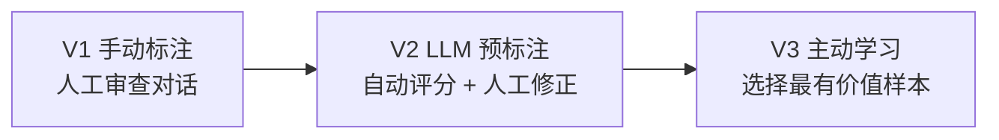
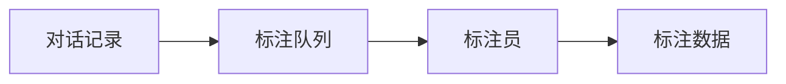
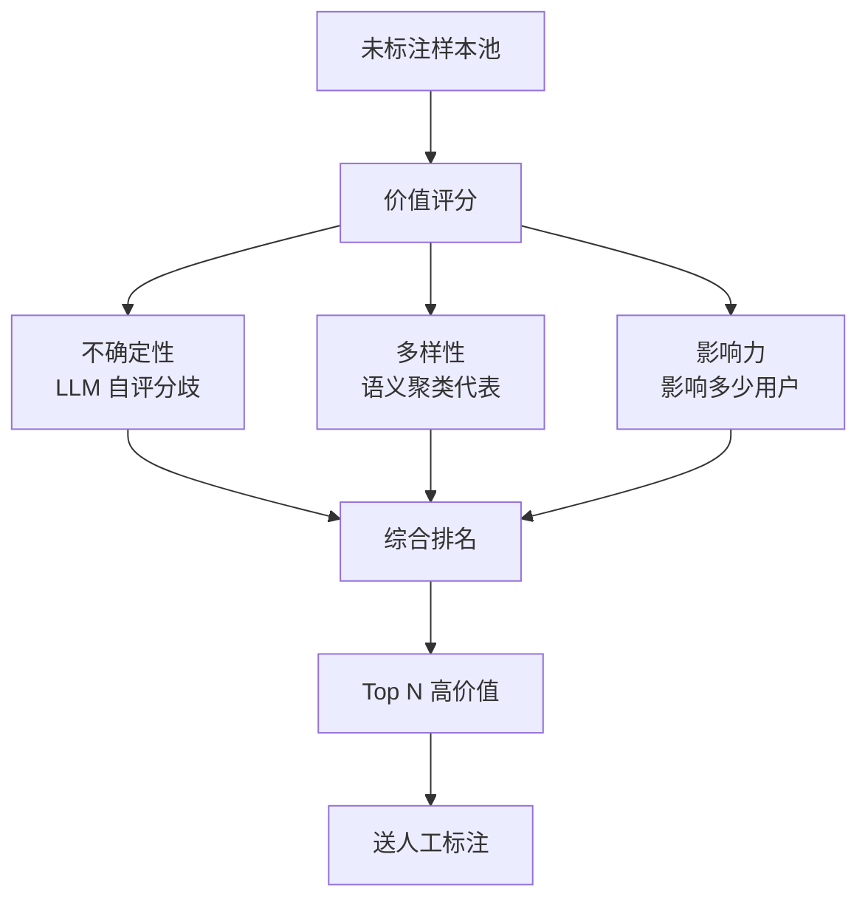
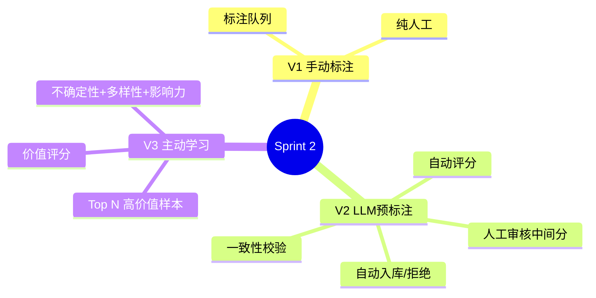

# Sprint 2：智能标注管线

> **目标**：从对话记录中提取训练数据——LLM 预标注 + 人工修正 + 主动学习。

---

## Sprint 概览



---

## V1：手动标注

### 架构



### 代码

```java
// V1: 标注队列
@RestController
@RequestMapping("/api/annotate")
public class AnnotationController {

    @GetMapping("/next")
    public ConversationRecord getNext() {
        return repo.findUnlabeled().get(0);
    }

    @PostMapping("/{recordId}")
    public String annotate(@PathVariable String recordId,
            @RequestBody AnnotationRequest req) {
        var annotation = new Annotation(
            recordId,
            req.quality(),      // GOOD / BAD / NEEDS_IMPROVEMENT
            req.category(),     // 分类标签
            req.improvedAnswer(), // 标注员给出的更好回答
            req.annotatorId(),
            Instant.now()
        );
        annotationRepo.save(annotation);
        return "已标注";
    }
}
```

### V1 的局限

- ❌ 纯人工——慢、贵、不一致
- ❌ 随机选择样本——很多简单对话不值得标
- ❌ 没有标注质量控制

---

## V2：LLM 预标注 + 人工修正

### 改进点

| 维度 | V1 | V2 |
|------|----|----|
| 标注方式 | 纯人工 | LLM 预标注 → 人工审核 |
| 效率 | ~50 条/人/天 | ~200 条/人/天 |
| 一致性 | 依赖标注员 | LLM 统一标准 |
| 质量控制 | 无 | 标注一致性校验 |

### 架构



```mermaid
flowchart TB
    Record["对话记录"] --> PreLabel["LLM 预标注"]
    PreLabel --> Score{"质量评分"}
    Score -->|"GOOD"| AutoApprove["✅ 自动入库"]
    Score -->|"BAD"| AutoReject["❌ 自动标记为差样本"]
    Score -->|"NEEDS_REVIEW"| Queue["📋 人工审核队列"]
    Queue --> HumanReview["人工修正"]
    HumanReview --> Labeled["标注数据"]
```

### 核心：LLM 预标注

```java
@Service
public class LlmPreAnnotator {

    private final ChatClient chatClient;

    private static final String PRE_LABEL_PROMPT = """
        作为标注审查员，评估以下对话。

        用户问题：{question}
        Agent回答：{answer}
        用户反馈：{feedback}

        请给出：
        1. quality: GOOD / BAD / NEEDS_IMPROVEMENT
        2. qualityScore: 0-1
        3. category: 分类标签（如：FACTUAL_ERROR / HALLUCINATION /
           GOOD_ANSWER / INCOMPLETE / OFF_TOPIC / SAFETY_ISSUE）
        4. issues: 具体问题列表（如果有）
        5. improvedAnswer: 改进后的回答（如果有问题）

        返回 JSON。
        """;

    public PreAnnotation annotate(ConversationRecord record) {
        var json = chatClient.prompt()
            .user(u -> u.text(PRE_LABEL_PROMPT)
                .param("question", record.userInput())
                .param("answer", record.agentOutput())
                .param("feedback",
                    record.feedback() != null ? record.feedback() : "无"))
            .call().content();

        return parsePreAnnotation(json);
    }
}

public record PreAnnotation(
    Quality quality,
    double qualityScore,
    String category,
    List<String> issues,
    String improvedAnswer
) {}

public enum Quality { GOOD, BAD, NEEDS_IMPROVEMENT }
```

### 核心：标注管线

```java
@Service
public class AnnotationPipeline {

    private final LlmPreAnnotator preAnnotator;
    private final AnnotationRepository annotationRepo;

    private static final double AUTO_APPROVE_THRESHOLD = 0.9;
    private static final double AUTO_REJECT_THRESHOLD = 0.2;

    /**
     * 批量预标注
     */
    public Flux<PipelineResult> processBatch(List<ConversationRecord> records) {
        return Flux.fromIterable(records)
            .map(this::processSingle);
    }

    private PipelineResult processSingle(ConversationRecord record) {
        // 1. LLM 预标注
        var preAnnotation = preAnnotator.annotate(record);

        // 2. 根据评分路由
        if (preAnnotation.qualityScore() >= AUTO_APPROVE_THRESHOLD) {
            // 高分 → 自动入库
            var annotation = new Annotation(
                record.id(), Quality.GOOD, preAnnotation.category(),
                null, "AI_AUTO", Instant.now());
            annotationRepo.save(annotation);
            return PipelineResult.autoApproved(record.id(), preAnnotation);

        } else if (preAnnotation.qualityScore() <= AUTO_REJECT_THRESHOLD) {
            // 低分 → 自动标记为差样本
            var annotation = new Annotation(
                record.id(), Quality.BAD, preAnnotation.category(),
                preAnnotation.improvedAnswer(),
                "AI_AUTO", Instant.now());
            annotationRepo.save(annotation);
            return PipelineResult.autoRejected(record.id(), preAnnotation);

        } else {
            // 中间分数 → 需人工审核
            return PipelineResult.needsReview(record.id(), preAnnotation);
        }
    }
}
```

### 核心：标注一致性校验

```java
@Service
public class AnnotationConsistencyChecker {

    private final ChatClient chatClient;

    /**
     * 抽取 10% 已标注样本，用另一个 LLM 重新标注
     * 如果不一致率 > 20%，告警
     */
    public ConsistencyReport check(List<Annotation> annotations) {
        var sampled = annotations.stream()
            .filter(a -> Math.random() < 0.1) // 10% 采样
            .toList();

        int consistent = 0;
        int inconsistent = 0;

        for (var ann : sampled) {
            var recheck = reAnnotate(ann);
            if (recheck.quality() == ann.quality()) {
                consistent++;
            } else {
                inconsistent++;
            }
        }

        var inconsistencyRate = (double) inconsistent / (consistent + inconsistent);
        return new ConsistencyReport(consistent, inconsistent, inconsistencyRate);
    }
}
```

### V2 的局限

- ❌ 所有样本等概率送审——简单样本浪费人力
- ❌ 没有"哪些样本最有训练价值"的选择机制

---

## V3：主动学习

### 改进点

| 维度 | V2 | V3 |
|------|----|----|
| 样本选择 | 随机/全量 | **主动学习**：优先标注最有价值的样本 |
| 价值评估 | 质量分数 | 不确定性 + 多样性 + 影响力 |
| 标注效率 | 200 条/人/天 | 300+ 条/人/天（标注的都是高价值样本） |

### 架构



### 核心：样本价值评分

```java
@Service
public class SampleValueScorer {

    /**
     * 计算样本的标注价值
     * value = uncertainty * 0.4 + diversity * 0.3 + impact * 0.3
     */
    public double scoreValue(ConversationRecord record) {
        var uncertainty = computeUncertainty(record);
        var diversity = computeDiversity(record);
        var impact = computeImpact(record);

        return uncertainty * 0.4 + diversity * 0.3 + impact * 0.3;
    }

    /**
     * 不确定性：多次 LLM 标注的结果分歧越大，越有价值
     */
    private double computeUncertainty(ConversationRecord record) {
        var labels = IntStream.range(0, 3)
            .mapToObj(i -> quickLabel(record))
            .toList();

        // 如果 3 次标注一致 → 低不确定性
        // 如果有分歧 → 高不确定性
        var distinct = labels.stream().distinct().count();
        return distinct == 1 ? 0.2 : distinct == 2 ? 0.6 : 1.0;
    }

    /**
     * 多样性：与已标注样本的语义距离
     * 如果已有很多相似样本 → 低多样性
     */
    private double computeDiversity(ConversationRecord record) {
        var existing = annotationRepo.getLabeledEmbeddings();
        var maxSimilarity = existing.stream()
            .mapToDouble(e -> cosineSimilarity(record.embedding(), e))
            .max().orElse(0);

        return 1.0 - maxSimilarity; // 越不相似 → 多样性越高
    }

    /**
     * 影响力：这个问题被问过多少次
     */
    private double computeImpact(ConversationRecord record) {
        var frequency = repo.countSimilarQuestions(
            record.userInput(), 0.85);
        return Math.min(1.0, frequency / 10.0); // 归一化到 0-1
    }
}
```

### 核心：主动学习选择器

```java
@Service
public class ActiveLearningSelector {

    private final SampleValueScorer scorer;

    /**
     * 选择 Top N 个最有价值的样本送人工标注
     */
    public List<ConversationRecord> selectForAnnotation(
            List<ConversationRecord> candidates, int batchSize) {
        return candidates.stream()
            .map(r -> Map.entry(r, scorer.scoreValue(r)))
            .sorted(Map.Entry.<ConversationRecord, Double>comparingByValue()
                .reversed())
            .limit(batchSize)
            .map(Map.Entry::getKey)
            .toList();
    }
}
```

---

## 完整 Sprint 回顾



---

## 下一步

→ [Sprint 3：评估闭环](Sprint3-评估闭环.md)
