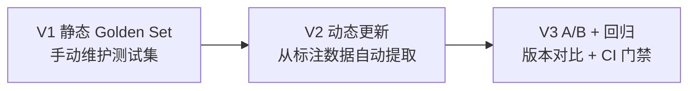
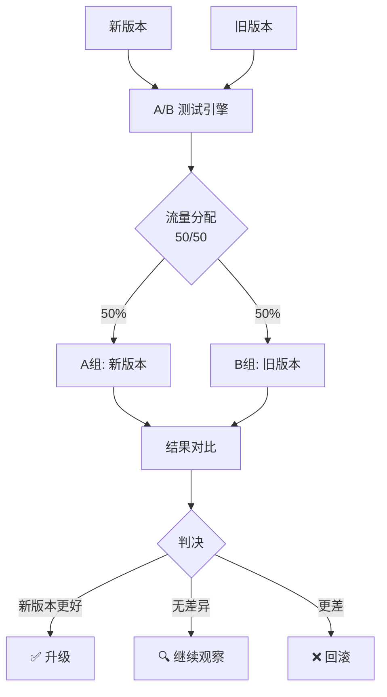
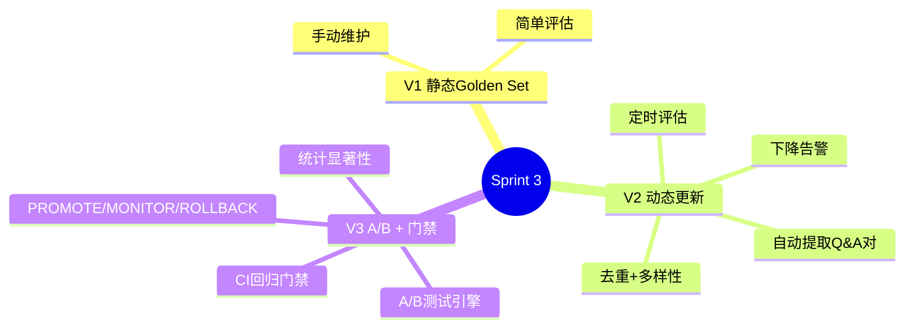

# Sprint 3：评估闭环

> **目标**：从标注数据中自动更新 Golden Set，用 A/B 测试验证改进效果，CI 门禁保证不回退。

---

## Sprint 概览



---

## V1：静态 Golden Set

### 代码

```java
// V1: 手动维护的 Golden Set
@Service
public class GoldenSetService {

    private final List<QaPair> goldenSet = List.of(
        new QaPair("年假政策是什么？",
            "根据《员工手册》第3.2节...", List.of("doc-handbook-3.2")),
        new QaPair("如何申请报销？",
            "请在OA系统提交报销单...", List.of("doc-finance-001"))
        // 手动添加...
    );

    public EvalReport evaluate(ChatClient agent) {
        var results = goldenSet.stream()
            .map(qa -> {
                var actual = agent.prompt().user(qa.question())
                    .call().content();
                var passed = actual.contains(qa.expectedKeywords());
                return new EvalResult(qa, actual, passed);
            })
            .toList();

        var passRate = results.stream()
            .filter(EvalResult::passed).count()
            / (double) results.size();

        return new EvalReport(results, passRate);
    }
}
```

### V1 的局限

- ❌ Golden Set 固定不变——不能反映线上新问题
- ❌ 评估是手动的——不能自动持续
- ❌ 没有 A/B 对比

---

## V2：动态 Golden Set 更新

### 改进点

| 维度 | V1 | V2 |
|------|----|----|
| Golden Set 来源 | 手动编写 | 从高质量标注数据自动提取 |
| 更新频率 | 每月手动 | 每日自动 |
| 覆盖率 | 10-20 个 | 200+ 自动增长 |

### 核心：Golden Set 自动提取

```java
@Service
public class GoldenSetExtractor {

    private final AnnotationRepository annotationRepo;
    private final ChatClient chatClient;

    /**
     * 从标注数据中提取高质量 Q&A 对
     * 筛选条件：
     * 1. 用户反馈 👍
     * 2. 标注质量 GOOD
     * 3. 有改进版回答（improvedAnswer 不为空）
     */
    public List<QaPair> extractGoldenPairs(int targetSize) {
        var candidates = annotationRepo.findHighQualityAnnotations(targetSize * 3);

        // 用 LLM 去重 + 去噪 + 多样性选择
        var prompt = """
            以下是候选的高质量 Q&A 对。
            请选出 {targetSize} 个最有代表性的，
            确保问题类型多样化，去重近似问题。

            候选列表：
            {candidates}

            返回选中的 JSON 数组，格式：
            [{"question": "...", "expectedAnswer": "...",
              "category": "...", "difficulty": "EASY/MEDIUM/HARD"}]
            """;

        var json = chatClient.prompt()
            .user(u -> u.text(prompt)
                .param("targetSize", targetSize)
                .param("candidates", formatCandidates(candidates)))
            .call().content();

        return parseGoldenPairs(json);
    }

    /**
     * 合并新提取的对到现有 Golden Set
     */
    public GoldenSetUpdate mergeIntoGoldenSet(
            List<QaPair> existing, List<QaPair> newPairs) {
        // 去重：基于语义相似度
        var merged = new ArrayList<>(existing);
        var added = new ArrayList<QaPair>();

        for (var pair : newPairs) {
            var isDuplicate = existing.stream()
                .anyMatch(e -> semanticSimilarity(e.question(),
                    pair.question()) > 0.85);
            if (!isDuplicate) {
                merged.add(pair);
                added.add(pair);
            }
        }

        return new GoldenSetUpdate(merged, added, existing.size());
    }

    private double semanticSimilarity(String a, String b) {
        // 基于向量余弦相似度
        // 实现省略
        return 0;
    }
}
```

### 核心：定时评估任务

```java
@Service
public class ScheduledEvaluationService {

    private final GoldenSetService goldenSetService;
    private final AgentVersionRegistry versionRegistry;

    /**
     * 每天凌晨自动评估当前版本
     */
    @Scheduled(cron = "0 0 2 * * *")
    public void dailyEvaluation() {
        var goldenSet = goldenSetService.getCurrentGoldenSet();
        var currentVersion = versionRegistry.getCurrentVersion();

        var report = goldenSetService.evaluate(goldenSet);

        // 记录评估结果
        versionRegistry.recordEvalResult(currentVersion, report);

        // 如果分数下降，告警
        var previousScore = versionRegistry
            .getPreviousVersionScore(currentVersion);
        if (report.passRate() < previousScore) {
            alertService.sendAlert(
                "评估分数下降: " + previousScore + " → " + report.passRate());
        }
    }
}
```

---

## V3：A/B 测试 + CI 门禁

### 架构



### 核心：A/B 测试引擎

```java
@Service
public class AbTestEngine {

    private final AgentVersionRegistry versionRegistry;

    /**
     * 为请求分配版本
     */
    public String assignVersion(String userId) {
        var activeTest = versionRegistry.getActiveAbTest();
        if (activeTest == null) {
            return versionRegistry.getCurrentVersion().id();
        }

        // 基于 userId 的稳定哈希 → 确保同一用户始终分到同一组
        var hash = Math.abs(userId.hashCode()) % 100;
        return hash < activeTest.treatmentSplit()
            ? activeTest.treatmentVersion()  // 新版本
            : activeTest.controlVersion();  // 旧版本
    }

    /**
     * 收集 A/B 测试结果
     */
    public AbTestResult evaluate(String testId) {
        var test = versionRegistry.getAbTest(testId);
        var controlResults = getResultsForVersion(test.controlVersion());
        var treatmentResults = getResultsForVersion(test.treatmentVersion());

        return AbTestResult.builder()
            .controlScore(computeScore(controlResults))
            .treatmentScore(computeScore(treatmentResults))
            .controlSampleSize(controlResults.size())
            .treatmentSampleSize(treatmentResults.size())
            .statisticalSignificance(computeSignificance(
                controlResults, treatmentResults))
            .recommendation(decide(
                computeScore(controlResults),
                computeScore(treatmentResults)))
            .build();
    }

    private String decide(double control, double treatment) {
        var diff = treatment - control;
        if (diff > 0.05) return "PROMOTE";     // 新版本明显更好
        if (diff < -0.05) return "ROLLBACK";    // 新版本更差
        return "MONITOR";                        // 无显著差异
    }
}
```

### 核心：CI 门禁

```java
@Service
public class RegressionGate {

    private final GoldenSetService goldenSetService;

    /**
     * CI 门禁：新版本必须通过回归测试
     */
    public GateResult evaluate(String candidateVersion) {
        var report = goldenSetService.evaluate(candidateVersion);
        var baseline = goldenSetService.getBaselineScore();

        // 门禁条件：
        // 1. 通过率不能低于基线的 95%
        // 2. 不能有新的 FAIL 项（之前通过的不能挂）
        var newFailures = findNewFailures(report, baseline);
        var regression = report.passRate() < baseline.passRate() * 0.95;

        if (newFailures > 0 || regression) {
            return GateResult.blocked(
                "回归测试失败: %d 个新失败, 通过率 %.1f%% (基线 %.1f%%)"
                    .formatted(newFailures,
                        report.passRate() * 100,
                        baseline.passRate() * 100),
                report);
        }

        return GateResult.passed(report);
    }
}
```

---

## 完整 Sprint 回顾



---

## 下一步

→ [Sprint 4：持续交付](Sprint4-持续交付.md)
