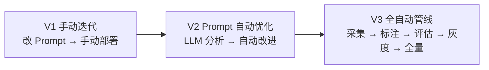
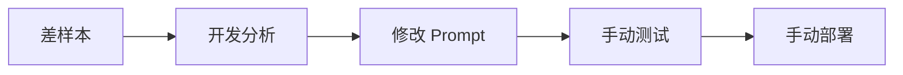
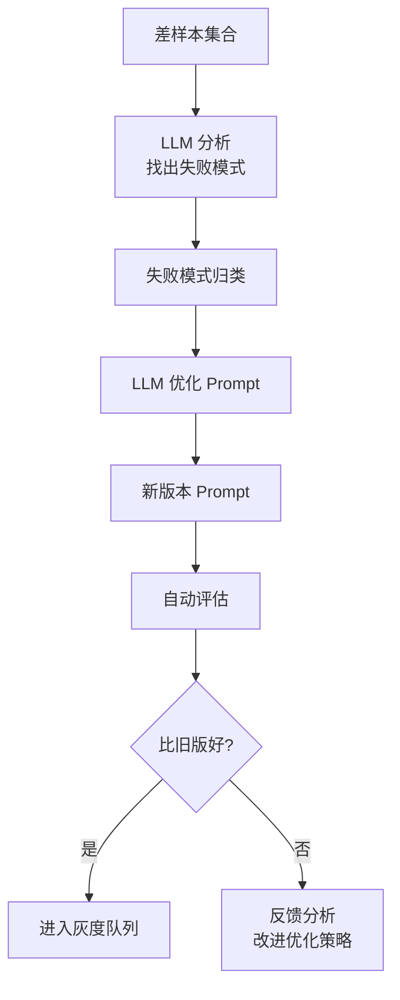
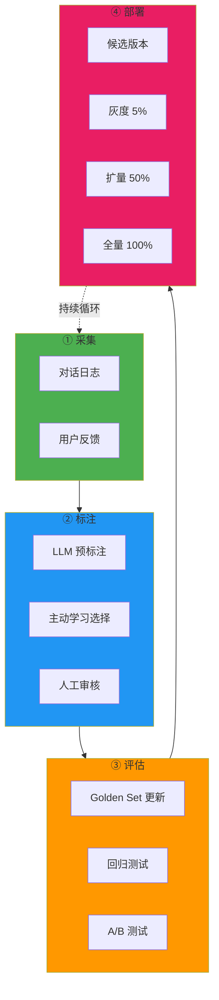
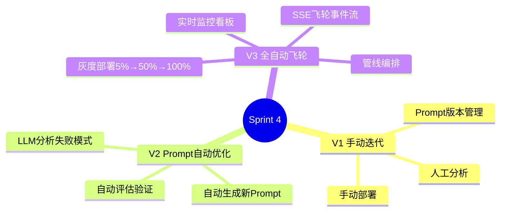
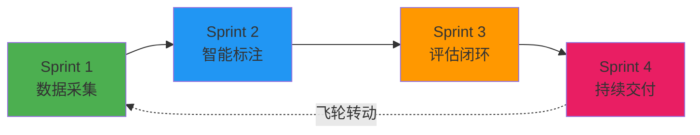

# Sprint 4：持续交付

> **目标**：把评估通过的改进自动部署——Prompt 迭代 → 灰度发布 → 全量上线，形成完整的飞轮闭环。

---

## Sprint 概览



---

## V1：手动迭代

### 架构



### 代码

```java
// V1: Prompt 版本管理
@Service
public class PromptVersionService {

    private final PromptRepository repo;

    public String updatePrompt(String promptId, String newContent,
            String changeReason) {
        var current = repo.getCurrent(promptId);
        var newVersion = new PromptVersion(
            promptId,
            current.version() + 1,
            newContent,
            changeReason,
            Instant.now(),
            "manual"
        );
        repo.save(newVersion);
        return "Prompt 已更新到 v" + newVersion.version();
    }
}
```

### V1 的局限

- ❌ 全靠人工——慢、主观、不可持续
- ❌ 没有灰度——直接全量替换，风险高

---

## V2：Prompt 自动优化

### 改进点

| 维度 | V1 | V2 |
|------|----|----|
| 改进方式 | 人工分析 | LLM 自动分析差样本并优化 Prompt |
| 效率 | 每周 1-2 次 | 每天 1 次 |
| 验证 | 手动 | 自动评估对比 |

### 架构



### 核心：Prompt 自动优化器

```java
@Service
public class PromptAutoOptimizer {

    private final ChatClient chatClient;
    private final GoldenSetService goldenSetService;

    /**
     * 分析差样本，找出失败模式
     */
    public FailureAnalysis analyzeFailures(List<EvalResult> failures) {
        var prompt = """
            以下对话中 Agent 回答有问题。请分析失败模式。

            当前 System Prompt：
            {currentPrompt}

            失败案例：
            {failures}

            请给出：
            1. failurePatterns: 失败模式列表（如"处理否定句不正确"、
               "数字计算错误"等）
            2. rootCause: 根因分析
            3. suggestedFix: 建议的 Prompt 修改（给出完整的新 System Prompt）
            4. expectedImprovement: 预计改进效果

            返回 JSON。
            """;

        var json = chatClient.prompt()
            .user(u -> u.text(prompt)
                .param("currentPrompt", getCurrentSystemPrompt())
                .param("failures", formatFailures(failures)))
            .call().content();

        return parseAnalysis(json);
    }

    /**
     * 验证优化后的 Prompt
     */
    public OptimizationResult optimize() {
        // 1. 获取最近的失败案例
        var recentFailures = goldenSetService.getRecentFailures(50);
        if (recentFailures.size() < 5) {
            return OptimizationResult.skipped("失败样本不足");
        }

        // 2. 分析并生成新 Prompt
        var analysis = analyzeFailures(recentFailures);
        var newPrompt = analysis.suggestedFix();

        // 3. 评估新 Prompt
        var newScore = goldenSetService.evaluateWithPrompt(newPrompt);
        var oldScore = goldenSetService.getCurrentScore();

        // 4. 只有更好才推荐
        if (newScore.passRate() > oldScore.passRate()) {
            return OptimizationResult.improved(
                newPrompt, oldScore.passRate(), newScore.passRate(),
                analysis.failurePatterns());
        } else {
            return OptimizationResult.noImprovement(
                oldScore.passRate(), newScore.passRate());
        }
    }
}

public record FailureAnalysis(
    List<String> failurePatterns,
    String rootCause,
    String suggestedFix,
    String expectedImprovement
) {}
```

### V2 的局限

- ❌ Prompt 改进后直接部署——没有灰度
- ❌ 管线不自动——需要手动触发

---

## V3：全自动飞轮管线

### 架构



### 核心：飞轮编排器

```java
@Service
public class FlywheelOrchestrator {

    private final AnnotationPipeline annotationPipeline;
    private final GoldenSetExtractor goldenSetExtractor;
    private final PromptAutoOptimizer optimizer;
    private final CanaryDeployer canaryDeployer;
    private final AbTestEngine abTestEngine;

    /**
     * 飞轮一轮完整执行
     */
    public FlywheelCycle runCycle() {
        var cycle = new FlywheelCycle();

        // ① 采集：获取最近 7 天的对话
        var records = conversationRepo.findRecent(Duration.ofDays(7));
        cycle.setCollected(records.size());

        // ② 标注：LLM 预标注 + 主动学习
        var preAnnotated = annotationPipeline.processBatch(records);
        var highValue = activeLearningSelector
            .selectForAnnotation(preAnnotated.needsReview(), 100);
        cycle.setSentForReview(highValue.size());

        // ③ 评估：更新 Golden Set + 优化 Prompt
        var newGoldenPairs = goldenSetExtractor.extractGoldenPairs(50);
        goldenSetService.mergeIntoGoldenSet(
            goldenSetService.getCurrentGoldenSet(), newGoldenPairs);

        var optimization = optimizer.optimize();
        cycle.setOptimization(optimization);

        // ④ 部署：如果优化有效，启动灰度
        if (optimization.status() == OptimizationStatus.IMPROVED) {
            var candidate = registerCandidate(optimization.newPrompt());
            deployWithCanary(candidate);
        }

        return cycle;
    }

    /**
     * 灰度部署流程
     */
    private void deployWithCanary(AgentVersion candidate) {
        // 阶段 1: 5% 灰度
        canaryDeployer.deploy(candidate, 0.05);
        waitFor(Duration.ofHours(2));
        var earlyMetrics = collectMetrics(candidate);
        if (earlyMetrics.score() < baseline.score()) {
            canaryDeployer.rollback(candidate);
            notify("灰度阶段 1 失败，已回滚");
            return;
        }

        // 阶段 2: 50% 灰度
        canaryDeployer.ramp(candidate, 0.50);
        waitFor(Duration.ofHours(6));
        var midMetrics = collectMetrics(candidate);
        if (midMetrics.score() < baseline.score()) {
            canaryDeployer.rollback(candidate);
            notify("灰度阶段 2 失败，已回滚");
            return;
        }

        // 阶段 3: 全量部署
        canaryDeployer.ramp(candidate, 1.0);
        notify("新版本已全量部署");
    }
}
```

### 核心：飞轮监控看板

```java
@RestController
@RequestMapping("/api/flywheel/dashboard")
public class FlywheelDashboardController {

    /**
     * 飞轮总览
     */
    @GetMapping("/overview")
    public FlywheelOverview overview() {
        return FlywheelOverview.builder()
            .totalCycles(orchestrator.getTotalCycles())
            .lastCycleAt(orchestrator.getLastCycleTime())
            .goldenSetSize(goldenSetService.size())
            .labeledDataSize(annotationRepo.countLabeled())
            .currentAgentScore(goldenSetService.getCurrentScore())
            .scoreTrend(orchestrator.getScoreTrend(30)) // 30 轮趋势
            .upcomingDeployment(canaryDeployer.getActiveDeployments())
            .build();
    }

    /**
     * 飞轮轮次历史
     */
    @GetMapping("/cycles")
    public List<FlywheelCycle> cycles(
            @RequestParam(defaultValue = "20") int limit) {
        return orchestrator.getRecentCycles(limit);
    }

    /**
     * 实时飞轮流（SSE）
     */
    @GetMapping(value = "/stream",
            produces = MediaType.TEXT_EVENT_STREAM_VALUE)
    public Flux<ServerSentEvent<FlywheelEvent>> stream() {
        return orchestrator.watchEvents()
            .map(event -> ServerSentEvent.<FlywheelEvent>builder()
                .id(event.cycleId())
                .event(event.type())  // COLLECT / LABEL / EVALUATE / DEPLOY
                .data(event)
                .build());
    }
}
```

---

## 完整 Sprint 回顾



---

## 项目总结



DataFlywheel 到此完成。飞轮已经转动——每一轮它都会：

1. **采集**用户真实对话和反馈
2. **标注**高价值样本（LLM 预标注 + 主动学习）
3. **评估**新版本（Golden Set + A/B + 回归门禁）
4. **部署**灰度到全量（5% → 50% → 100%）

> **飞轮效应**：第 1 轮的改进可能只有 1%。但 100 轮之后，Agent 已经脱胎换骨。这就是数据飞轮的力量——**持续改进的复合效应**。
