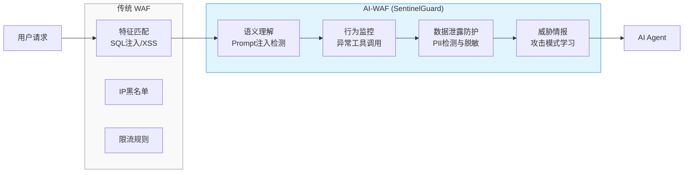
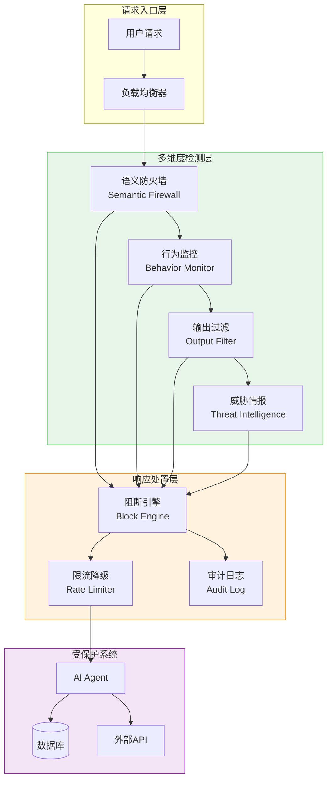

# SentinelGuard：Agent 时代的 AI 安全防御平台

## 项目概述

### 项目定位

**SentinelGuard** 是一个面向 Agent 时代的 AI 安全防御平台，也称为 **AI-WAF**（AI Web Application Firewall）。它与传统 WAF 的核心区别在于防御对象：传统 WAF 防御 SQL 注入、XSS 等 Web 攻击，而 AI-WAF 专门防御针对 AI/Agent 系统的新型安全威胁。

在 Agent 时代，攻击者不再仅仅攻击 Web 应用程序本身，而是通过精心构造的 Prompt 来操控 AI Agent 的行为，窃取敏感数据，或诱导 Agent 执行恶意操作。SentinelGuard 旨在构建一道智能语义防火墙，保护 Agent 系统免受持续演化的 AI 威胁。

### 核心防御威胁

| 威胁类型 | 传统 WAF | AI-WAF (SentinelGuard) |
|---------|----------|------------------------|
| **Prompt 注入** | 无法检测 | 语义理解 + 意图识别 |
| **数据泄露** | 关键词过滤（有限） | PII 检测 + 语义脱敏 |
| **幻觉控制** | 不适用 | 多轮对话追踪 + 事实验证 |
| **工具滥用** | 不适用 | 行为基线 + 异常检测 |
| **对抗攻击** | 不适用 | 对抗样本检测 + 鲁棒性增强 |
| **模型窃取** | 不适用 | 输出指纹 + API 保护 |

### 与传统安全产品的对比



## 架构总览

### 整体架构



### 核心组件职责

| 组件 | 职责 | 关键技术 |
|-----|------|---------|
| **语义防火墙** | 检测 Prompt 注入、恶意意图 | NLP 分类、意图识别、上下文分析 |
| **行为监控** | 监控 Agent 工具调用模式 | 行为指纹、序列建模、异常检测 |
| **输出过滤** | 防止敏感数据泄露 | PII 识别、实体替换、语义判断 |
| **威胁情报** | 学习攻击模式、更新规则 | 对抗学习、规则生成、情报共享 |
| **响应引擎** | 根据威胁等级自动响应 | 风险评分、决策树、自动化处置 |

## Sprint 规划

### 4 个 Sprint 演进表

| Sprint | 主题 | 核心目标 | 关键交付物 | 难度 |
|--------|-----|---------|-----------|-----|
| **Sprint 1** | 语义防火墙 | 构建 Prompt 注入与恶意意图检测能力 | SemanticFirewallAdvisor、IntentClassifier | ★★★☆ |
| **Sprint 2** | 行为监控 | 建立 Agent 行为基线与异常检测 | BehaviorMonitor、AnomalyDetector | ★★★★ |
| **Sprint 3** | 数据泄露防护 | 实现智能 DLP 与敏感信息脱敏 | OutputDlpFilter、PiiRedactor | ★★★★ |
| **Sprint 4** | 自动响应与威胁情报 | 构建自动化响应闭环与威胁情报体系 | AutoResponseEngine、ThreatIntelCollector | ★★★★★ |

### V1 → V2 → V3 演进策略

每个 Sprint 遵循渐进式演进路线：

- **V1（基础版）**：基于规则和简单算法，快速验证核心功能
- **V2（增强版）**：引入机器学习和深度学习，提升检测准确率
- **V3（智能版）**：实现自适应学习和威胁情报闭环

## 知识点映射表

### 技术栈概览

| 领域 | 核心技术 | 应用场景 |
|-----|---------|---------|
| **NLP/文本分析** | 意图识别、实体识别、情感分析 | Prompt 注入检测、PII 识别 |
| **异常检测** | 时间序列分析、孤立森林、行为指纹 | Agent 异常行为检测 |
| **机器学习** | 分类模型、聚类分析、序列建模 | 攻击模式识别、威胁分类 |
| **深度学习** | Transformer、对抗训练 | 对抗样本检测、语义理解 |
| **安全工程** | 规则引擎、风险评估、审计日志 | 自动响应、合规审计 |
| **Spring 生态** | Spring AI、Spring Security、WebFlux | Agent 集成、权限控制、异步处理 |

### 前置知识要求

| 知识点 | 要求级别 | 说明 |
|-------|---------|-----|
| Spring Boot/Spring AI | 熟练 | 项目基于 Spring AI 构建上层应用 |
| 自然语言处理基础 | 了解 | 理解分词、向量化、分类等概念 |
| 机器学习/异常检测 | 了解 | 理解常见的异常检测算法 |
| 安全攻防知识 | 了解 | 了解常见的 Web 攻击和 AI 威胁 |

## 项目目录结构

```
11-企业项目-AI安全防御平台/
├── 00-总览.md                          # 本文件
├── Sprint1-语义防火墙.md                # Sprint 1 详细设计
├── Sprint2-行为监控与异常检测.md        # Sprint 2 详细设计
├── Sprint3-数据泄露防护.md              # Sprint 3 详细设计
├── Sprint4-自动响应与威胁情报.md        # Sprint 4 详细设计
```

## 核心设计原则

### 1. 纵深防御（Defense in Depth）

- 多层检测：语义、行为、输出三层防护
- 多模态信息：文本、工具调用、时间序列综合分析
- 冗余校验：不同检测机制交叉验证

### 2. 持续进化

- 自动学习：从攻击事件中提取模式并更新规则
- 威胁情报：共享攻击签名和防御策略
- A/B 测试：新规则在影子模式下验证

### 3. 性能与安全平衡

- 异步处理：非关键路径异步分析
- 缓存策略：频繁请求的缓存结果
- 降级机制：高负载时启用简化检测

### 4. 可观测性

- 全链路日志：记录每个检测决策
- 指标监控：检测准确率、误报率、响应时间
- 审计追踪：满足合规要求

## 参考实现技术选型

| 组件 | 技术选型 | 理由 |
|-----|---------|-----|
| **规则引擎** | Easy Rules / Drools | 轻量、高性能、易于维护 |
| **NLP 处理** | HuggingFace Transformers | 丰富的预训练模型、易集成 |
| **向量存储** | Milvus / Weaviate | 高性能向量检索 |
| **异常检测** | PyOD / scikit-learn | 成熟的异常检测算法库 |
| **时序数据库** | InfluxDB / TimescaleDB | 高效存储和查询时间序列数据 |
| **消息队列** | Apache Kafka | 高吞吐、持久化、流处理友好 |

## 后续阅读

- **Sprint 1**：构建语义防火墙，实现 Prompt 注入检测
- **Sprint 2**：建立行为监控体系，检测 Agent 异常行为
- **Sprint 3**：实现数据泄露防护，保护敏感信息
- **Sprint 4**：构建自动响应和威胁情报闭环

---

**项目代号**：SentinelGuard  
**代号含义**：Sentinel（哨兵）+ Guard（守护），象征为 Agent 时代构筑智能安全防线
