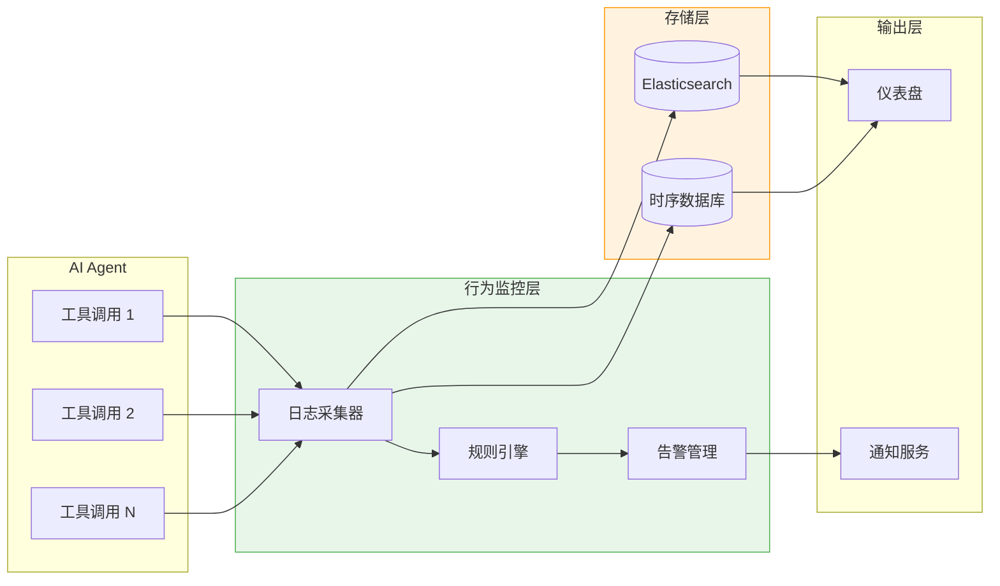
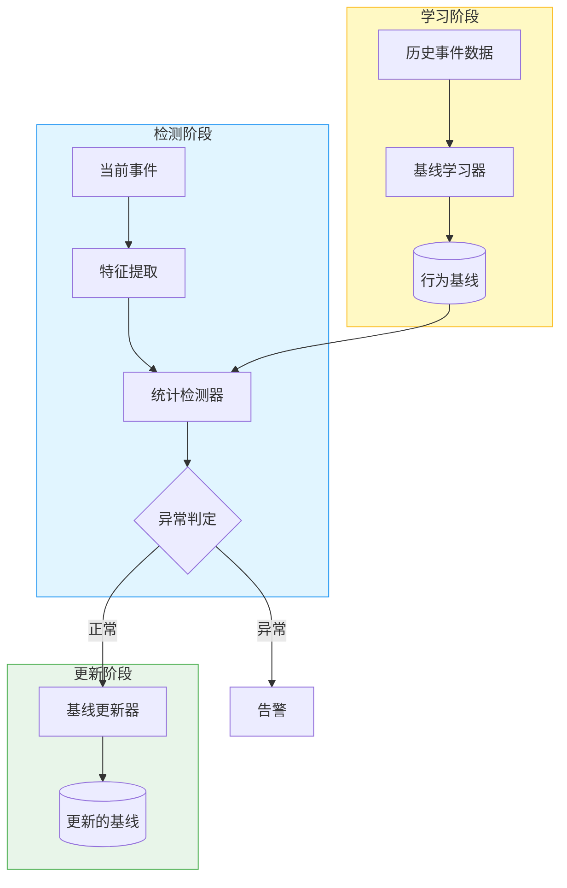
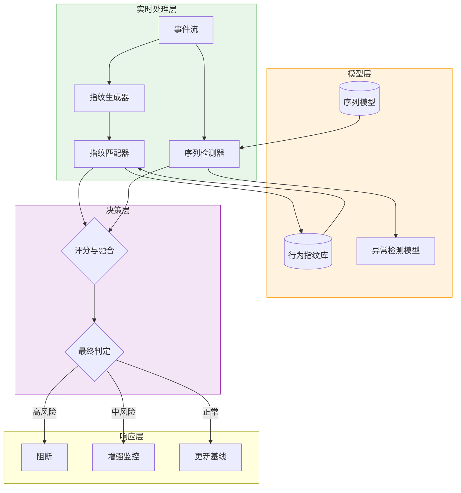

# Sprint 2：行为监控与异常检测

## Sprint 概述

**行为监控与异常检测（Behavior Monitoring and Anomaly Detection）** 是 SentinelGuard 的第二道防线。如果说语义防火墙是"静态防御"（检查单个请求），那么行为监控就是"动态防御"（观察 Agent 的行为模式）。

Agent 系统的特殊性在于：攻击者可能通过精心构造的"正常"请求绕过语义检查，然后诱导 Agent 执行异常操作（如删除数据库、发送大量邮件）。行为监控通过建立 Agent 的正常行为基线，实时检测偏离基线的异常行为。

### Sprint 目标

- **V1**：实现工具调用日志记录和规则告警
- **V2**：建立 Agent 行为基线，实现基于统计的异常检测
- **V3**：构建实时行为指纹和序列异常检测，检测复杂的攻击链

### 核心交付物

| 交付物 | 描述 | 文件 |
|-------|-----|-----|
| BehaviorMonitor | Agent 行为监控器，记录所有工具调用 | BehaviorMonitor.java |
| AnomalyDetector | 异常检测器，识别偏离基线的行为 | AnomalyDetector.java |
| BehaviorBaseline | 行为基线管理器，建立和更新正常行为模式 | BehaviorBaseline.java |

---

## V1：工具调用日志与规则告警

### 设计思路

V1 版本实现基础的监控能力：
1. **全面日志记录**：记录 Agent 的所有工具调用
2. **规则告警**：基于预定义规则触发告警
3. **实时展示**：提供监控面板查看实时行为

### 架构设计



### 核心规则类型

| 规则类型 | 示例 | 检测目标 |
|---------|-----|---------|
| **高频调用** | 同一工具 1 分钟内调用 > 10 次 | DoS 攻击、批量操作 |
| **敏感操作** | 调用 deleteDatabase、sendEmailBulk | 数据破坏、垃圾邮件 |
| **异常时间** | 凌晨 2 点执行批量导出 | 异常时间窗口的恶意操作 |
| **失败率** | 工具调用失败率 > 50% | 攻击探测、系统异常 |

### Java 实现

#### 工具调用事件模型

```java
package com.sentinelguard.behavior.model;

import lombok.Builder;
import lombok.Data;
import java.time.LocalDateTime;
import java.util.Map;

/**
 * 工具调用事件
 * 
 * @author SentinelGuard Team
 */
@Data
@Builder
public class ToolCallEvent {
    
    /**
     * 事件ID
     */
    private String eventId;
    
    /**
     * 会话ID
     */
    private String sessionId;
    
    /**
     * 用户ID
     */
    private String userId;
    
    /**
     * 工具名称
     */
    private String toolName;
    
    /**
     * 工具参数
     */
    private Map<String, Object> parameters;
    
    /**
     * 调用结果
     */
    private String result;
    
    /**
     * 是否成功
     */
    private boolean success;
    
    /**
     * 执行时长（毫秒）
     */
    private long durationMs;
    
    /**
     * 调用时间
     */
    private LocalDateTime timestamp;
    
    /**
     * 附加元数据
     */
    private Map<String, Object> metadata;
}
```

#### 行为监控器

```java
package com.sentinelguard.behavior.monitor;

import com.sentinelguard.behavior.model.ToolCallEvent;
import com.sentinelguard.behavior.repository.ToolCallEventRepository;
import lombok.RequiredArgsConstructor;
import lombok.extern.slf4j.Slf4j;
import org.springframework.stereotype.Component;
import org.springframework.transaction.annotation.Transactional;

import java.time.LocalDateTime;

/**
 * Agent 行为监控器
 * 
 * @author SentinelGuard Team
 */
@Slf4j
@Component
@RequiredArgsConstructor
public class BehaviorMonitor {
    
    private final ToolCallEventRepository eventRepository;
    private final RuleEngine ruleEngine;
    private final AlertManager alertManager;
    
    /**
     * 记录工具调用事件
     * 
     * @param event 工具调用事件
     */
    @Transactional
    public void recordToolCall(ToolCallEvent event) {
        try {
            // 1. 持久化事件
            eventRepository.save(event);
            
            // 2. 执行规则检查
            List<RuleViolation> violations = ruleEngine.evaluate(event);
            
            // 3. 处理违规
            if (!violations.isEmpty()) {
                handleViolations(event, violations);
            }
            
            log.debug("工具调用已记录: tool={}, success={}, duration={}ms", 
                event.getToolName(), event.isSuccess(), event.getDurationMs());
                
        } catch (Exception e) {
            log.error("记录工具调用失败", e);
        }
    }
    
    private void handleViolations(ToolCallEvent event, List<RuleViolation> violations) {
        for (RuleViolation violation : violations) {
            log.warn("检测到规则违规: event={}, rule={}, severity={}", 
                event.getEventId(), violation.getRuleName(), violation.getSeverity());
            
            // 触发告警
            alertManager.triggerAlert(violation, event);
        }
    }
    
    /**
     * 获取会话的所有工具调用
     * 
     * @param sessionId 会话ID
     * @return 工具调用列表
     */
    public List<ToolCallEvent> getSessionEvents(String sessionId) {
        return eventRepository.findBySessionIdOrderByTimestampAsc(sessionId);
    }
    
    /**
     * 获取用户的统计信息
     * 
     * @param userId 用户ID
     * @param timeWindow 时间窗口（分钟）
     * @return 统计信息
     */
    public UserBehaviorStats getUserStats(String userId, int timeWindow) {
        LocalDateTime since = LocalDateTime.now().minusMinutes(timeWindow);
        return eventRepository.calculateStats(userId, since);
    }
}
```

#### 规则引擎

```java
package com.sentinelguard.behavior.rules;

import com.sentinelguard.behavior.model.ToolCallEvent;
import com.sentinelguard.behavior.model.RuleViolation;
import lombok.RequiredArgsConstructor;
import lombok.extern.slf4j.Slf4j;
import org.springframework.stereotype.Component;

import java.util.ArrayList;
import java.util.List;
import java.util.Map;
import java.util.concurrent.ConcurrentHashMap;
import java.util.concurrent.atomic.AtomicInteger;

/**
 * 行为规则引擎
 * 
 * @author SentinelGuard Team
 */
@Slf4j
@Component
@RequiredArgsConstructor
public class RuleEngine {
    
    private final List<BehaviorRule> rules;
    private final Map<String, AtomicInteger> counters = new ConcurrentHashMap<>();
    
    /**
     * 评估事件是否违反规则
     * 
     * @param event 工具调用事件
     * @return 违规列表
     */
    public List<RuleViolation> evaluate(ToolCallEvent event) {
        List<RuleViolation> violations = new ArrayList<>();
        
        for (BehaviorRule rule : rules) {
            if (rule.matches(event)) {
                ViolationContext context = rule.evaluate(event, counters);
                if (context.isViolation()) {
                    violations.add(RuleViolation.builder()
                        .ruleName(rule.getName())
                        .severity(rule.getSeverity())
                        .description(rule.getDescription())
                        .event(event)
                        .context(context)
                        .build());
                }
            }
        }
        
        return violations;
    }
    
    /**
     * 注册新规则
     * 
     * @param rule 行为规则
     */
    public void registerRule(BehaviorRule rule) {
        rules.add(rule);
        log.info("注册行为规则: {}", rule.getName());
    }
}
```

---

## V2：行为基线与统计异常检测

### 设计思路

V2 版本从"规则驱动"转向"数据驱动"：
1. **行为基线学习**：自动学习 Agent 的正常行为模式
2. **统计异常检测**：使用统计方法识别偏离基线的行为
3. **自适应阈值**：根据业务特点自动调整告警阈值

### 架构设计



### 行为基线维度

| 维度 | 描述 | 指标 |
|-----|------|-----|
| **工具频率** | 各工具调用的频率分布 | 每分钟调用次数、日均调用次数 |
| **时间模式** | 工具调用的时间分布 | 小时热力图、工作日/周末差异 |
| **参数范围** | 工具参数的正常范围 | 数值型参数的均值/标准差 |
| **成功率** | 各工具的成功率 | 成功调用占比 |
| **序列模式** | 工具调用的顺序模式 | 马尔可夫链转移概率 |

### Java 实现

#### 行为基线

```java
package com.sentinelguard.behavior.baseline;

import lombok.Data;
import java.time.DayOfWeek;
import java.time.LocalDateTime;
import java.time.LocalTime;
import java.util.*;

/**
 * Agent 行为基线
 * 
 * @author SentinelGuard Team
 */
@Data
public class BehaviorBaseline {
    
    /**
     * 基线ID
     */
    private String baselineId;
    
    /**
     * 创建时间
     */
    private LocalDateTime createdAt;
    
    /**
     * 工具频率基线（工具名 -> 每分钟平均调用次数）
     */
    private Map<String, Double> toolFrequencyBaseline = new HashMap<>();
    
    /**
     * 时间模式基线（小时 -> 调用次数占比）
     */
    private Map<Integer, Double> hourlyPattern = new HashMap<>();
    
    /**
     * 工作日/周末模式
     */
    private Map<DayOfWeek, Double> dayOfWeekPattern = new HashMap<>();
    
    /**
     * 参数范围基线（工具名 -> 参数名 -> 统计信息）
     */
    private Map<String, Map<String, ParameterStats>> parameterRanges = new HashMap<>();
    
    /**
     * 成功率基线（工具名 -> 成功率）
     */
    private Map<String, Double> successRateBaseline = new HashMap<>();
    
    /**
     * 序列模式基线（工具名 -> 下一个工具名 -> 转移概率）
     */
    private Map<String, Map<String, Double>> sequencePattern = new HashMap<>();
    
    @Data
    public static class ParameterStats {
        private double mean;
        private double stdDev;
        private double min;
        private double max;
        private double percentile95;
    }
}
```

#### 基线学习器

```java
package com.sentinelguard.behavior.baseline;

import com.sentinelguard.behavior.model.ToolCallEvent;
import com.sentinelguard.behavior.repository.ToolCallEventRepository;
import lombok.RequiredArgsConstructor;
import lombok.extern.slf4j.Slf4j;
import org.springframework.stereotype.Component;

import java.time.LocalDateTime;
import java.time.temporal.ChronoUnit;
import java.util.*;
import java.util.stream.Collectors;

/**
 * 行为基线学习器
 * 
 * @author SentinelGuard Team
 */
@Slf4j
@Component
@RequiredArgsConstructor
public class BaselineLearner {
    
    private final ToolCallEventRepository eventRepository;
    
    /**
     * 学习指定时间窗口的行为基线
     * 
     * @param userId 用户ID
     * @param days 学习天数
     * @return 行为基线
     */
    public BehaviorBaseline learn(String userId, int days) {
        LocalDateTime since = LocalDateTime.now().minusDays(days);
        List<ToolCallEvent> events = eventRepository.findByUserIdAndTimestampAfter(userId, since);
        
        if (events.isEmpty()) {
            throw new IllegalStateException("没有足够的历史数据来学习基线");
        }
        
        BehaviorBaseline baseline = new BehaviorBaseline();
        baseline.setBaselineId(UUID.randomUUID().toString());
        baseline.setCreatedAt(LocalDateTime.now());
        
        // 1. 学习工具频率
        learnToolFrequency(baseline, events, days);
        
        // 2. 学习时间模式
        learnTimePatterns(baseline, events);
        
        // 3. 学习参数范围
        learnParameterRanges(baseline, events);
        
        // 4. 学习成功率
        learnSuccessRates(baseline, events);
        
        // 5. 学习序列模式
        learnSequencePatterns(baseline, events);
        
        log.info("完成基线学习: userId={}, events={}, baselineId={}", 
            userId, events.size(), baseline.getBaselineId());
        
        return baseline;
    }
    
    private void learnToolFrequency(BehaviorBaseline baseline, List<ToolCallEvent> events, int days) {
        Map<String, Long> toolCounts = events.stream()
            .collect(Collectors.groupingBy(ToolCallEvent::getToolName, Collectors.counting()));
        
        double totalMinutes = days * 24 * 60;
        
        Map<String, Double> frequency = new HashMap<>();
        for (Map.Entry<String, Long> entry : toolCounts.entrySet()) {
            frequency.put(entry.getKey(), entry.getValue() / totalMinutes);
        }
        
        baseline.setToolFrequencyBaseline(frequency);
    }
    
    private void learnTimePatterns(BehaviorBaseline baseline, List<ToolCallEvent> events) {
        // 小时模式
        Map<Integer, Long> hourlyCounts = new HashMap<>();
        for (ToolCallEvent event : events) {
            int hour = event.getTimestamp().getHour();
            hourlyCounts.merge(hour, 1L, Long::sum);
        }
        
        double totalEvents = events.size();
        Map<Integer, Double> hourlyPattern = new HashMap<>();
        for (Map.Entry<Integer, Long> entry : hourlyCounts.entrySet()) {
            hourlyPattern.put(entry.getKey(), entry.getValue() / totalEvents);
        }
        baseline.setHourlyPattern(hourlyPattern);
        
        // 星期模式
        Map<DayOfWeek, Long> dayCounts = new HashMap<>();
        for (ToolCallEvent event : events) {
            DayOfWeek day = event.getTimestamp().getDayOfWeek();
            dayCounts.merge(day, 1L, Long::sum);
        }
        
        Map<DayOfWeek, Double> dayPattern = new HashMap<>();
        for (Map.Entry<DayOfWeek, Long> entry : dayCounts.entrySet()) {
            dayPattern.put(entry.getKey(), entry.getValue() / totalEvents);
        }
        baseline.setDayOfWeekPattern(dayPattern);
    }
    
    private void learnParameterRanges(BehaviorBaseline baseline, List<ToolCallEvent> events) {
        Map<String, List<Double>> paramValues = new HashMap<>();
        
        for (ToolCallEvent event : events) {
            String toolName = event.getToolName();
            if (event.getParameters() != null) {
                for (Map.Entry<String, Object> param : event.getParameters().entrySet()) {
                    String paramName = param.getKey();
                    Object value = param.getValue();
                    
                    if (value instanceof Number) {
                        String key = toolName + "." + paramName;
                        paramValues.computeIfAbsent(key, k -> new ArrayList<>())
                            .add(((Number) value).doubleValue());
                    }
                }
            }
        }
        
        Map<String, Map<String, BehaviorBaseline.ParameterStats>> ranges = new HashMap<>();
        for (Map.Entry<String, List<Double>> entry : paramValues.entrySet()) {
            String[] parts = entry.getKey().split("\\.");
            String toolName = parts[0];
            String paramName = parts[1];
            
            List<Double> values = entry.getValue();
            BehaviorBaseline.ParameterStats stats = calculateStats(values);
            
            ranges.computeIfAbsent(toolName, k -> new HashMap<>())
                .put(paramName, stats);
        }
        
        baseline.setParameterRanges(ranges);
    }
    
    private BehaviorBaseline.ParameterStats calculateStats(List<Double> values) {
        BehaviorBaseline.ParameterStats stats = new BehaviorBaseline.ParameterStats();
        
        double sum = values.stream().mapToDouble(Double::doubleValue).sum();
        stats.setMean(sum / values.size());
        
        double variance = values.stream()
            .mapToDouble(v -> Math.pow(v - stats.getMean(), 2))
            .average()
            .orElse(0);
        stats.setStdDev(Math.sqrt(variance));
        
        List<Double> sorted = new ArrayList<>(values);
        Collections.sort(sorted);
        stats.setMin(sorted.get(0));
        stats.setMax(sorted.get(sorted.size() - 1));
        stats.setPercentile95(sorted.get((int)(sorted.size() * 0.95)));
        
        return stats;
    }
    
    private void learnSuccessRates(BehaviorBaseline baseline, List<ToolCallEvent> events) {
        Map<String, Long> toolCounts = events.stream()
            .collect(Collectors.groupingBy(ToolCallEvent::getToolName, Collectors.counting()));
        
        Map<String, Long> successCounts = events.stream()
            .filter(ToolCallEvent::isSuccess)
            .collect(Collectors.groupingBy(ToolCallEvent::getToolName, Collectors.counting()));
        
        Map<String, Double> successRates = new HashMap<>();
        for (Map.Entry<String, Long> entry : toolCounts.entrySet()) {
            String toolName = entry.getKey();
            long totalCount = entry.getValue();
            long successCount = successCounts.getOrDefault(toolName, 0L);
            successRates.put(toolName, (double) successCount / totalCount);
        }
        
        baseline.setSuccessRateBaseline(successRates);
    }
    
    private void learnSequencePatterns(BehaviorBaseline baseline, List<ToolCallEvent> events) {
        // 按会话和时间排序
        List<ToolCallEvent> sorted = events.stream()
            .sorted(Comparator.comparing(ToolCallEvent::getSessionId)
                .thenComparing(ToolCallEvent::getTimestamp))
            .collect(Collectors.toList());
        
        Map<String, Map<String, Integer>> transitions = new HashMap<>();
        String lastTool = null;
        String lastSession = null;
        
        for (ToolCallEvent event : sorted) {
            String currentTool = event.getToolName();
            String currentSession = event.getSessionId();
            
            if (lastSession != null && lastSession.equals(currentSession) && lastTool != null) {
                transitions.computeIfAbsent(lastTool, k -> new HashMap<>())
                    .merge(currentTool, 1, Integer::sum);
            }
            
            lastTool = currentTool;
            lastSession = currentSession;
        }
        
        // 转换为概率
        Map<String, Map<String, Double>> sequencePattern = new HashMap<>();
        for (Map.Entry<String, Map<String, Integer>> entry : transitions.entrySet()) {
            String fromTool = entry.getKey();
            int total = entry.getValue().values().stream().mapToInt(Integer::intValue).sum();
            
            Map<String, Double> probs = new HashMap<>();
            for (Map.Entry<String, Integer> trans : entry.getValue().entrySet()) {
                probs.put(trans.getKey(), (double) trans.getValue() / total);
            }
            sequencePattern.put(fromTool, probs);
        }
        
        baseline.setSequencePattern(sequencePattern);
    }
}
```

---

## V3：实时行为指纹与序列异常检测

### 设计思路

V3 版本实现高级异常检测：
1. **行为指纹**：为每个工具调用生成唯一指纹，快速识别重复模式
2. **序列异常检测**：检测异常的工具调用序列（攻击链）
3. **实时学习**：基线持续更新，适应行为变化

### 架构设计



### 核心检测技术

| 技术 | 描述 | 应用场景 |
|-----|------|---------|
| **行为指纹** | 工具调用的特征哈希 | 快速识别重复攻击模式 |
| **序列模型** | LSTM/GRU 时间序列模型 | 检测异常工具调用序列 |
| **孤立森林** | 无监督异常检测 | 识别高维特征空间中的异常点 |
| **动态时间规整** | 序列相似度度量 | 检测与已知攻击链的相似性 |

### Java 实现

#### 行为指纹生成器

```java
package com.sentinelguard.behavior.fingerprint;

import com.sentinelguard.behavior.model.ToolCallEvent;
import lombok.extern.slf4j.Slf4j;
import org.springframework.stereotype.Component;

import java.nio.charset.StandardCharsets;
import java.security.MessageDigest;
import java.security.NoSuchAlgorithmException;
import java.util.List;
import java.util.stream.Collectors;

/**
 * 行为指纹生成器
 * 
 * @author SentinelGuard Team
 */
@Slf4j
@Component
public class BehaviorFingerprintGenerator {
    
    /**
     * 生成工具调用的行为指纹
     * 
     * @param event 工具调用事件
     * @return 指纹哈希值
     */
    public String generate(ToolCallEvent event) {
        String normalized = normalizeEvent(event);
        return hash(normalized);
    }
    
    /**
     * 生成会话序列指纹
     * 
     * @param events 工具调用序列
     * @return 序列指纹
     */
    public String generateSequenceFingerprint(List<ToolCallEvent> events) {
        String sequence = events.stream()
            .map(this::normalizeEvent)
            .collect(Collectors.joining("->"));
        return hash(sequence);
    }
    
    private String normalizeEvent(ToolCallEvent event) {
        // 标准化：工具名 + 参数签名 + 时间窗口
        String toolName = event.getToolName();
        
        String params = "";
        if (event.getParameters() != null) {
            params = event.getParameters().entrySet().stream()
                .sorted(Map.Entry.comparingByKey())
                .map(e -> e.getKey() + "=" + normalizeValue(e.getValue()))
                .collect(Collectors.joining(","));
        }
        
        // 5分钟时间窗口
        int timeWindow = event.getTimestamp().getMinute() / 5;
        
        return String.format("%s|%s|%d", toolName, params, timeWindow);
    }
    
    private String normalizeValue(Object value) {
        if (value == null) {
            return "null";
        }
        if (value instanceof Number) {
            return "NUM"; // 数值统一化
        }
        if (value instanceof String) {
            String str = (String) value;
            if (str.length() > 50) {
                return "STR"; // 长字符串统一化
            }
            return str;
        }
        return value.getClass().getSimpleName();
    }
    
    private String hash(String input) {
        try {
            MessageDigest digest = MessageDigest.getInstance("SHA-256");
            byte[] hash = digest.digest(input.getBytes(StandardCharsets.UTF_8));
            return bytesToHex(hash);
        } catch (NoSuchAlgorithmException e) {
            log.error("哈希计算失败", e);
            return String.valueOf(input.hashCode());
        }
    }
    
    private static String bytesToHex(byte[] bytes) {
        StringBuilder result = new StringBuilder();
        for (byte b : bytes) {
            result.append(String.format("%02x", b));
        }
        return result.substring(0, 16); // 取前16位
    }
}
```

#### 序列异常检测器

```java
package com.sentinelguard.behavior.anomaly;

import com.sentinelguard.behavior.model.ToolCallEvent;
import com.sentinelguard.behavior.baseline.BehaviorBaseline;
import lombok.RequiredArgsConstructor;
import lombok.extern.slf4j.Slf4j;
import org.springframework.stereotype.Component;

import java.util.ArrayList;
import java.util.List;

/**
 * 序列异常检测器 - 检测异常的工具调用序列
 * 
 * @author SentinelGuard Team
 */
@Slf4j
@Component
@RequiredArgsConstructor
public class SequenceAnomalyDetector {
    
    private final BehaviorBaseline baseline;
    private static final int SEQUENCE_LENGTH = 5;
    private static final double ANOMALY_THRESHOLD = 0.3;
    
    /**
     * 检测序列是否异常
     * 
     * @param events 工具调用序列
     * @return 异常分数（0-1，越高越异常）
     */
    public double detect(List<ToolCallEvent> events) {
        if (events.size() < SEQUENCE_LENGTH) {
            return 0.0;
        }
        
        double totalAnomaly = 0.0;
        int windowCount = 0;
        
        // 滑动窗口检测
        for (int i = 0; i <= events.size() - SEQUENCE_LENGTH; i++) {
            List<ToolCallEvent> window = events.subList(i, i + SEQUENCE_LENGTH);
            double anomalyScore = detectWindow(window);
            totalAnomaly += anomalyScore;
            windowCount++;
        }
        
        double avgAnomaly = totalAnomaly / windowCount;
        log.debug("序列异常检测: events={}, anomalyScore={}", events.size(), avgAnomaly);
        
        return avgAnomaly;
    }
    
    /**
     * 检测单个窗口的异常
     * 
     * @param window 工具调用窗口
     * @return 异常分数
     */
    private double detectWindow(List<ToolCallEvent> window) {
        double totalTransitionAnomaly = 0.0;
        int transitionCount = 0;
        
        // 检查每个转移的异常性
        for (int i = 0; i < window.size() - 1; i++) {
            String fromTool = window.get(i).getToolName();
            String toTool = window.get(i + 1).getToolName();
            
            double transitionAnomaly = calculateTransitionAnomaly(fromTool, toTool);
            totalTransitionAnomaly += transitionAnomaly;
            transitionCount++;
        }
        
        return transitionCount > 0 ? totalTransitionAnomaly / transitionCount : 0.0;
    }
    
    /**
     * 计算转移的异常分数
     * 
     * @param fromTool 源工具
     * @param toTool 目标工具
     * @return 异常分数
     */
    private double calculateTransitionAnomaly(String fromTool, String toTool) {
        Map<String, Map<String, Double>> sequencePattern = baseline.getSequencePattern();
        
        if (sequencePattern == null || !sequencePattern.containsKey(fromTool)) {
            // 未见过的转移
            return 1.0;
        }
        
        Map<String, Double> transitions = sequencePattern.get(fromTool);
        if (!transitions.containsKey(toTool)) {
            // 未见过的目标工具
            return 0.8;
        }
        
        double probability = transitions.get(toTool);
        
        // 低概率转移 = 高异常
        return Math.max(0, 1 - probability * 10); // 放大低概率的异常性
    }
    
    /**
     * 检测是否为攻击链
     * 
     * @param events 工具调用序列
     * @return 是否为攻击链
     */
    public boolean isAttackChain(List<ToolCallEvent> events) {
        List<String> attackPatterns = List.of(
            "reconnaissance->exploitation->exfiltration",
            "probing->credential_access->data_export",
            "discovery->collection->exfiltration"
        );
        
        String sequence = events.stream()
            .map(ToolCallEvent::getToolName)
            .reduce((a, b) -> a + "->" + b)
            .orElse("");
        
        for (String pattern : attackPatterns) {
            if (sequence.contains(pattern)) {
                log.warn("检测到攻击链模式: {}", pattern);
                return true;
            }
        }
        
        return false;
    }
}
```

#### 综合异常检测器

```java
package com.sentinelguard.behavior.anomaly;

import com.sentinelguard.behavior.baseline.BehaviorBaseline;
import com.sentinelguard.behavior.model.ToolCallEvent;
import com.sentinelguard.behavior.fingerprint.BehaviorFingerprintGenerator;
import lombok.RequiredArgsConstructor;
import lombok.extern.slf4j.Slf4j;
import org.springframework.stereotype.Component;

import java.util.List;
import java.util.Map;

/**
 * 综合异常检测器 - 融合多种检测方法
 * 
 * @author SentinelGuard Team
 */
@Slf4j
@Component
@RequiredArgsConstructor
public class CompositeAnomalyDetector {
    
    private final BehaviorBaseline baseline;
    private final SequenceAnomalyDetector sequenceDetector;
    private final BehaviorFingerprintGenerator fingerprintGenerator;
    private final FingerprintDatabase fingerprintDatabase;
    
    /**
     * 综合检测异常
     * 
     * @param event 当前事件
     * @param recentEvents 最近的事件序列
     * @return 异常检测结果
     */
    public AnomalyResult detect(ToolCallEvent event, List<ToolCallEvent> recentEvents) {
        AnomalyResult result = new AnomalyResult();
        result.setEventId(event.getEventId());
        
        // 1. 指纹匹配
        String fingerprint = fingerprintGenerator.generate(event);
        FingerprintMatch fpMatch = fingerprintDatabase.match(fingerprint);
        result.setFingerprintScore(fpMatch.getSimilarity());
        
        // 2. 频率异常检测
        double frequencyAnomaly = detectFrequencyAnomaly(event);
        result.setFrequencyScore(frequencyAnomaly);
        
        // 3. 参数异常检测
        double parameterAnomaly = detectParameterAnomaly(event);
        result.setParameterScore(parameterAnomaly);
        
        // 4. 序列异常检测
        List<ToolCallEvent> sequence = new ArrayList<>(recentEvents);
        sequence.add(event);
        double sequenceAnomaly = sequenceDetector.detect(sequence);
        result.setSequenceScore(sequenceAnomaly);
        
        // 5. 攻击链检测
        boolean isAttackChain = sequenceDetector.isAttackChain(sequence);
        result.setAttackChain(isAttackChain);
        
        // 6. 综合评分
        double totalScore = calculateTotalScore(result);
        result.setTotalScore(totalScore);
        
        log.info("异常检测结果: event={}, total={:.2f}, fp={:.2f}, freq={:.2f}, param={:.2f}, seq={:.2f}",
            event.getEventId(), totalScore, 
            result.getFingerprintScore(), result.getFrequencyScore(),
            result.getParameterScore(), result.getSequenceScore());
        
        return result;
    }
    
    private double detectFrequencyAnomaly(ToolCallEvent event) {
        String toolName = event.getToolName();
        Double baselineFreq = baseline.getToolFrequencyBaseline().get(toolName);
        
        if (baselineFreq == null) {
            return 0.5; // 中等异常
        }
        
        // 获取最近1分钟的调用频率
        double recentFreq = getRecentFrequency(toolName, 1);
        
        // Z-score计算
        double stdDev = Math.sqrt(baselineFreq * 0.5); // 假设泊松分布
        double zScore = Math.abs((recentFreq - baselineFreq) / stdDev);
        
        return Math.min(1.0, zScore / 3); // 3σ之外为完全异常
    }
    
    private double detectParameterAnomaly(ToolCallEvent event) {
        Map<String, Map<String, BehaviorBaseline.ParameterStats>> ranges = baseline.getParameterRanges();
        String toolName = event.getToolName();
        
        if (!ranges.containsKey(toolName) || event.getParameters() == null) {
            return 0.0;
        }
        
        double maxAnomaly = 0.0;
        Map<String, BehaviorBaseline.ParameterStats> toolRanges = ranges.get(toolName);
        
        for (Map.Entry<String, Object> param : event.getParameters().entrySet()) {
            String paramName = param.getKey();
            Object value = param.getValue();
            
            if (toolRanges.containsKey(paramName) && value instanceof Number) {
                BehaviorBaseline.ParameterStats stats = toolRanges.get(paramName);
                double numValue = ((Number) value).doubleValue();
                
                // 检查是否在正常范围
                if (numValue < stats.getMin() || numValue > stats.getMax()) {
                    maxAnomaly = Math.max(maxAnomaly, 1.0);
                } else if (numValue > stats.getPercentile95()) {
                    maxAnomaly = Math.max(maxAnomaly, 0.5);
                }
            }
        }
        
        return maxAnomaly;
    }
    
    private double calculateTotalScore(AnomalyResult result) {
        double[] weights = {0.2, 0.25, 0.25, 0.3}; // 指纹、频率、参数、序列
        double[] scores = {
            result.getFingerprintScore(),
            result.getFrequencyScore(),
            result.getParameterScore(),
            result.getSequenceScore()
        };
        
        double total = 0.0;
        for (int i = 0; i < weights.length; i++) {
            total += weights[i] * scores[i];
        }
        
        // 攻击链加权
        if (result.isAttackChain()) {
            total = Math.min(1.0, total + 0.3);
        }
        
        return total;
    }
    
    private double getRecentFrequency(String toolName, int minutes) {
        // 实现从缓存或数据库获取最近频率
        return 0.0;
    }
}
```

---

## Spring AI 集成

### 工具调用拦截器

```java
package com.sentinelguard.behavior.integration;

import com.sentinelguard.behavior.anomaly.AnomalyResult;
import com.sentinelguard.behavior.anomaly.CompositeAnomalyDetector;
import com.sentinelguard.behavior.model.ToolCallEvent;
import lombok.RequiredArgsConstructor;
import lombok.extern.slf4j.Slf4j;
import org.springframework.ai.tool.ToolCallback;
import org.springframework.stereotype.Component;
import org.springframework.web.context.request.RequestContextHolder;

import java.time.LocalDateTime;
import java.util.List;

/**
 * 工具调用行为监控拦截器
 * 
 * @author SentinelGuard Team
 */
@Slf4j
@Component
@RequiredArgsConstructor
public class ToolCallBehaviorInterceptor {
    
    private final BehaviorMonitor behaviorMonitor;
    private final CompositeAnomalyDetector anomalyDetector;
    private final RecentEventsBuffer recentEventsBuffer;
    
    /**
     * 拦截工具调用
     * 
     * @param toolName 工具名称
     * @param parameters 工具参数
     * @param originalCall 原始调用
     * @return 执行结果
     */
    public Object interceptToolCall(String toolName, 
                                    Map<String, Object> parameters,
                                    ToolCallback.ToolCall originalCall) {
        
        long startTime = System.currentTimeMillis();
        ToolCallEvent event = buildEvent(toolName, parameters);
        
        try {
            // 执行原始调用
            Object result = originalCall.call();
            
            // 记录成功事件
            event.setSuccess(true);
            event.setResult(String.valueOf(result));
            event.setDurationMs(System.currentTimeMillis() - startTime);
            
            // 行为监控和异常检测
            processEvent(event);
            
            return result;
            
        } catch (Exception e) {
            // 记录失败事件
            event.setSuccess(false);
            event.setResult("ERROR: " + e.getMessage());
            event.setDurationMs(System.currentTimeMillis() - startTime);
            
            processEvent(event);
            throw e;
        }
    }
    
    private void processEvent(ToolCallEvent event) {
        // 1. 记录到监控
        behaviorMonitor.recordToolCall(event);
        
        // 2. 异常检测
        List<ToolCallEvent> recentEvents = recentEventsBuffer.getRecentEvents(
            event.getSessionId(), 10);
        AnomalyResult anomalyResult = anomalyDetector.detect(event, recentEvents);
        
        // 3. 处理异常
        if (anomalyResult.getTotalScore() > 0.7) {
            handleHighAnomaly(event, anomalyResult);
        }
    }
    
    private ToolCallEvent buildEvent(String toolName, Map<String, Object> parameters) {
        return ToolCallEvent.builder()
            .eventId(UUID.randomUUID().toString())
            .sessionId(getCurrentSessionId())
            .userId(getCurrentUserId())
            .toolName(toolName)
            .parameters(parameters)
            .timestamp(LocalDateTime.now())
            .build();
    }
    
    private String getCurrentSessionId() {
        return RequestContextHolder.getRequestAttributes() != null
            ? RequestContextHolder.currentRequestAttributes().getSessionId()
            : "system";
    }
    
    private String getCurrentUserId() {
        // 实现获取当前用户ID的逻辑
        return "anonymous";
    }
    
    private void handleHighAnomaly(ToolCallEvent event, AnomalyResult result) {
        log.warn("检测到高异常行为: event={}, score={}, attackChain={}", 
            event.getEventId(), result.getTotalScore(), result.isAttackChain());
        
        // 触发告警
        // 可以考虑阻断会话等响应措施
    }
}
```

---

## 监控仪表盘指标

| 指标 | 说明 | 可视化 |
|-----|------|--------|
| **工具调用热力图** | 各工具的调用频率分布 | 热力图 |
| **异常分数趋势** | 异常分数随时间的变化 | 时间序列图 |
| **用户行为雷达图** | 多维度用户行为评估 | 雷达图 |
| **序列模式图** | 工具调用序列网络 | 网络图 |
| **告警队列** | 实时告警列表 | 表格 |

---

## Sprint 2 完成标准

- [ ] 实现工具调用日志记录
- [ ] 实现规则引擎和告警系统
- [ ] 实现行为基线学习
- [ ] 实现统计异常检测
- [ ] 实现行为指纹和序列检测
- [ ] 集成 Spring AI 工具调用拦截
- [ ] 编写单元测试（覆盖率 > 80%）
- [ ] 性能测试达到目标指标

---

**下一 Sprint**：数据泄露防护（Sprint 3）
