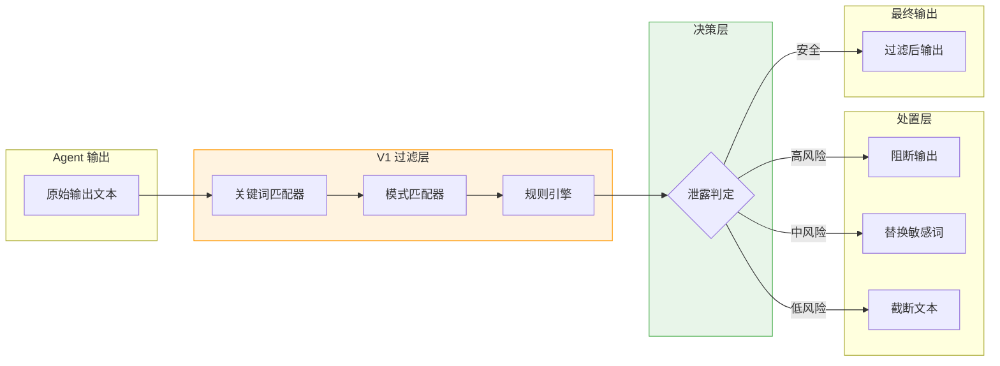
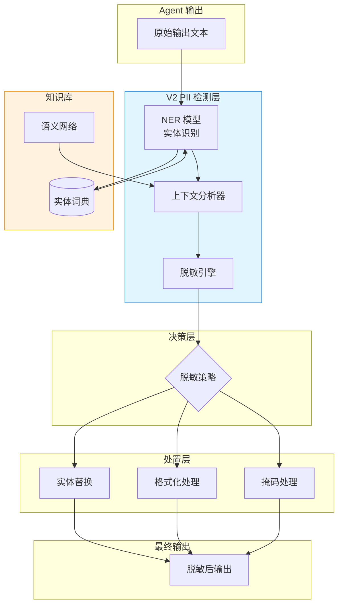
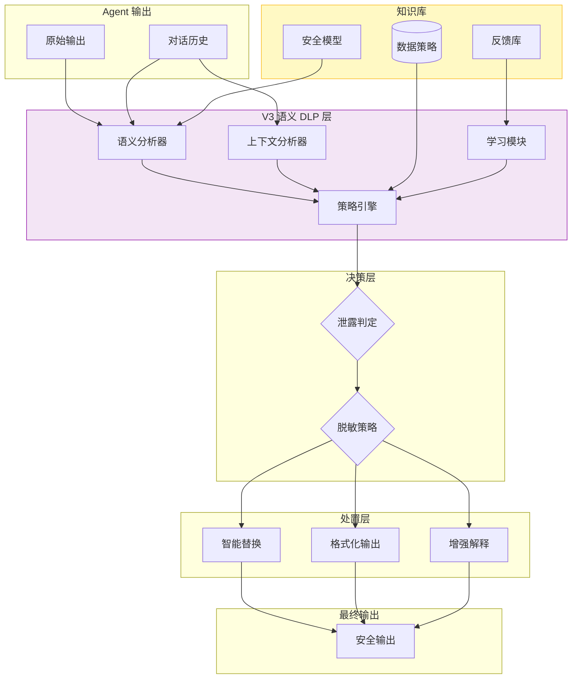

# Sprint 3：数据泄露防护

## Sprint 概述

**数据泄露防护（Data Loss Prevention, DLP）** 是 SentinelGuard 的第三道防线，专门防止 Agent 输出中包含敏感信息。在 Agent 系统中，数据泄露的风险尤为严重：攻击者可能通过精心构造的 Prompt，诱导 Agent 输出数据库内容、用户隐私、商业机密等敏感信息。

传统的 DLP 主要基于关键词匹配，但在 Agent 场景下不够——攻击者可以用各种方式绕过关键词检测。本 Sprint 实现智能 DLP，结合 NER、语义分析和上下文理解，提供更强大的数据泄露防护。

### Sprint 目标

- **V1**：实现输出关键词过滤和敏感词词典匹配
- **V2**：引入 PII（个人身份信息）检测和上下文脱敏
- **V3**：实现语义级别的智能 DLP，判断输出是否包含不应泄露的信息

### 核心交付物

| 交付物 | 描述 | 文件 |
|-------|-----|-----|
| OutputDlpFilter | Agent 输出 DLP 过滤器 | OutputDlpFilter.java |
| PiiRedactor | PII 识别和脱敏处理器 | PiiRedactor.java |
| SemanticLeakDetector | 语义级别的泄露检测器 | SemanticLeakDetector.java |

---

## V1：输出关键词过滤

### 设计思路

V1 版本实现基础的输出过滤：
1. **敏感词词典**：维护敏感词列表，进行精确匹配
2. **模式匹配**：使用正则表达式匹配常见敏感信息格式
3. **上下文切断**：检测到泄露时，截断输出并返回安全消息

### 架构设计



### 敏感信息类型

| 类型 | 模式示例 | 风险等级 |
|-----|---------|---------|
| **身份证号** | `\d{17}[\dXx]` | 高 |
| **手机号** | `1[3-9]\d{9}` | 高 |
| **邮箱** | `[\w.]+@[\w.]+\.\w+` | 中 |
| **银行卡号** | `\d{16,19}` | 高 |
| **密码** | `(password|passwd|pwd).*=.*\w+` | 极高 |
| **API Key** | `(api|key|token).*=.*\w+` | 极高 |

### Java 实现

#### 敏感词配置

```java
package com.sentinelguard.dlp.config;

import lombok.Data;
import org.springframework.boot.context.properties.ConfigurationProperties;
import org.springframework.stereotype.Component;

import java.util.List;
import java.util.Map;

/**
 * DLP 配置
 * 
 * @author SentinelGuard Team
 */
@Data
@Component
@ConfigurationProperties(prefix = "sentinel.dlp")
public class DlpConfig {
    
    /**
     * 是否启用 DLP
     */
    private boolean enabled = true;
    
    /**
     * 敏感词列表
     */
    private Map<String, SensitiveCategory> sensitiveWords;
    
    /**
     * 正则模式列表
     */
    private List<RegexPattern> regexPatterns;
    
    /**
     * 采取的默认动作
     */
    private Action defaultAction = Action.REDACT;
    
    @Data
    public static class SensitiveCategory {
        /**
         * 关键词列表
         */
        private List<String> words;
        
        /**
         * 风险等级
         */
        private RiskLevel riskLevel = RiskLevel.MEDIUM;
        
        /**
         * 处理动作
         */
        private Action action = defaultAction;
    }
    
    @Data
    public static class RegexPattern {
        /**
         * 模式名称
         */
        private String name;
        
        /**
         * 正则表达式
         */
        private String pattern;
        
        /**
         * 风险等级
         */
        private RiskLevel riskLevel = RiskLevel.HIGH;
        
        /**
         * 处理动作
         */
        private Action action = defaultAction;
    }
    
    public enum RiskLevel {
        LOW, MEDIUM, HIGH, CRITICAL
    }
    
    public enum Action {
        BLOCK,      // 完全阻断输出
        REDACT,     // 替换敏感词为 ***
        TRUNCATE,   // 截断到安全位置
        ALLOW       // 允许（仅记录）
    }
}
```

#### V1 DLP 过滤器

```java
package com.sentinelguard.dlp.v1;

import com.sentinelguard.dlp.config.DlpConfig;
import com.sentinelguard.dlp.model.DetectionResult;
import lombok.RequiredArgsConstructor;
import lombok.extern.slf4j.Slf4j;
import org.springframework.stereotype.Component;

import java.util.ArrayList;
import java.util.List;
import java.util.regex.Matcher;
import java.util.regex.Pattern;

/**
 * V1 版本：基于规则的 DLP 过滤器
 * 
 * @author SentinelGuard Team
 */
@Slf4j
@Component
@RequiredArgsConstructor
public class RuleBasedDlpFilter {
    
    private final DlpConfig config;
    
    /**
     * 过滤输出文本
     * 
     * @param output Agent 输出文本
     * @return 过滤结果
     */
    public DetectionResult filter(String output) {
        if (!config.isEnabled() || output == null || output.isEmpty()) {
            return DetectionResult.safe();
        }
        
        List<LeakFinding> findings = new ArrayList<>();
        
        // 1. 敏感词检测
        if (config.getSensitiveWords() != null) {
            findings.addAll(detectSensitiveWords(output));
        }
        
        // 2. 正则模式检测
        if (config.getRegexPatterns() != null) {
            findings.addAll(detectRegexPatterns(output));
        }
        
        // 3. 处理检测结果
        if (findings.isEmpty()) {
            return DetectionResult.safe();
        }
        
        // 根据最高风险等级决定处理方式
        RiskLevel maxRisk = findings.stream()
            .map(LeakFinding::getRiskLevel)
            .max(RiskLevel::compareTo)
            .orElse(RiskLevel.MEDIUM);
        
        log.warn("检测到 {} 处敏感信息泄露，最高风险等级: {}", findings.size(), maxRisk);
        
        return switch (maxRisk) {
            case CRITICAL, HIGH -> DetectionResult.blocked("输出包含高风险敏感信息", findings);
            case MEDIUM -> DetectionResult.retracted("输出包含中风险敏感信息，已脱敏", findings);
            case LOW -> DetectionResult.suspicious("输出包含低风险敏感词", findings);
        };
    }
    
    private List<LeakFinding> detectSensitiveWords(String output) {
        List<LeakFinding> findings = new ArrayList<>();
        String lowerOutput = output.toLowerCase();
        
        for (var entry : config.getSensitiveWords().entrySet()) {
            String category = entry.getKey();
            DlpConfig.SensitiveCategory config = entry.getValue();
            
            if (config.getWords() != null) {
                for (String word : config.getWords()) {
                    int index = lowerOutput.indexOf(word.toLowerCase());
                    if (index != -1) {
                        findings.add(LeakFinding.builder()
                            .type("SENSITIVE_WORD")
                            .category(category)
                            .matchedText(word)
                            .startPosition(index)
                            .endPosition(index + word.length())
                            .riskLevel(config.getRiskLevel())
                            .action(config.getAction())
                            .build());
                    }
                }
            }
        }
        
        return findings;
    }
    
    private List<LeakFinding> detectRegexPatterns(String output) {
        List<LeakFinding> findings = new ArrayList<>();
        
        for (DlpConfig.RegexPattern pattern : config.getRegexPatterns()) {
            try {
                Pattern regex = Pattern.compile(pattern.getPattern());
                Matcher matcher = regex.matcher(output);
                
                while (matcher.find()) {
                    findings.add(LeakFinding.builder()
                        .type("REGEX_PATTERN")
                        .category(pattern.getName())
                        .matchedText(matcher.group())
                        .startPosition(matcher.start())
                        .endPosition(matcher.end())
                        .riskLevel(pattern.getRiskLevel())
                        .action(pattern.getAction())
                        .build());
                }
            } catch (Exception e) {
                log.error("正则模式编译失败: {}", pattern.getName(), e);
            }
        }
        
        return findings;
    }
}
```

---

## V2：PII 检测与上下文脱敏

### 设计思路

V2 版本引入 NLP 技术：
1. **PII 识别**：使用 NER 模型识别个人身份信息
2. **上下文脱敏**：理解信息在上下文中的作用，智能脱敏
3. **实体替换**：用占位符替换真实信息，保留语义

### 架构设计



### PII 类型

| PII 类型 | 英文 | 检测方法 | 脱敏方式 |
|---------|-----|---------|---------|
| **人名** | PER | NER + 词典 | [姓名] |
| **地址** | LOC | NER + 正则 | [地址] |
| **机构** | ORG | NER + 词典 | [机构] |
| **身份证号** | ID_CARD | 正则 + 规则 | 3201**\*\*\*\*\*\*\*\*\*1234 |
| **手机号** | PHONE | 正则 + 规则 | 138****5678 |
| **邮箱** | EMAIL | 正则 + 规则 | j**\*@gmail.com |

### Java 实现

#### PII 识别器

```java
package com.sentinelguard.dlp.v2;

import com.sentinelguard.dlp.model.PiiEntity;
import lombok.RequiredArgsConstructor;
import lombok.extern.slf4j.Slf4j;
import org.springframework.stereotype.Component;

import java.util.ArrayList;
import java.util.List;
import java.util.regex.Matcher;
import java.util.regex.Pattern;

/**
 * PII 识别器
 * 
 * @author SentinelGuard Team
 */
@Slf4j
@Component
@RequiredArgsConstructor
public class PiiDetector {
    
    private final NERModel nerModel;
    private final PatternMatcher patternMatcher;
    
    /**
     * 识别文本中的 PII 实体
     * 
     * @param text 输入文本
     * @return PII 实体列表
     */
    public List<PiiEntity> detect(String text) {
        List<PiiEntity> entities = new ArrayList<>();
        
        // 1. NER 模型识别
        entities.addAll(nerModel.extractEntities(text));
        
        // 2. 规则识别（作为补充）
        entities.addAll(patternMatcher.matchPatterns(text));
        
        // 3. 去重合并
        entities = mergeOverlappingEntities(entities);
        
        log.debug("PII 检测完成: text={}, entities={}", 
            text.substring(0, Math.min(50, text.length())), entities.size());
        
        return entities;
    }
    
    private List<PiiEntity> mergeOverlappingEntities(List<PiiEntity> entities) {
        // 按位置排序
        entities.sort((a, b) -> Integer.compare(a.getStart(), b.getStart()));
        
        List<PiiEntity> merged = new ArrayList<>();
        for (PiiEntity entity : entities) {
            if (merged.isEmpty()) {
                merged.add(entity);
            } else {
                PiiEntity last = merged.get(merged.size() - 1);
                if (entity.getStart() < last.getEnd()) {
                    // 重叠，选择置信度更高的
                    if (entity.getConfidence() > last.getConfidence()) {
                        merged.set(merged.size() - 1, entity);
                    }
                } else {
                    merged.add(entity);
                }
            }
        }
        
        return merged;
    }
}
```

#### 智能脱敏器

```java
package com.sentinelguard.dlp.v2;

import com.sentinelguard.dlp.model.PiiEntity;
import com.sentinelguard.dlp.model.PiiType;
import lombok.RequiredArgsConstructor;
import lombok.extern.slf4j.Slf4j;
import org.springframework.stereotype.Component;

import java.util.List;
import java.util.regex.Matcher;
import java.util.regex.Pattern;

/**
 * PII 脱敏处理器
 * 
 * @author SentinelGuard Team
 */
@Slf4j
@Component
@RequiredArgsConstructor
public class PiiRedactor {
    
    /**
     * 脱敏文本
     * 
     * @param text 原始文本
     * @param entities PII 实体列表
     * @return 脱敏后的文本
     */
    public String redact(String text, List<PiiEntity> entities) {
        if (entities.isEmpty()) {
            return text;
        }
        
        StringBuilder result = new StringBuilder(text);
        int offset = 0;
        
        // 按位置排序后处理
        entities.sort((a, b) -> Integer.compare(a.getStart(), b.getStart()));
        
        for (PiiEntity entity : entities) {
            int start = entity.getStart() + offset;
            int end = entity.getEnd() + offset;
            
            String replacement = getReplacement(entity);
            result.replace(start, end, replacement);
            
            offset += replacement.length() - (entity.getEnd() - entity.getStart());
            
            log.trace("脱敏: type={}, original={}, replacement={}", 
                entity.getType(), 
                text.substring(entity.getStart(), entity.getEnd()),
                replacement);
        }
        
        return result.toString();
    }
    
    /**
     * 根据实体类型生成替换文本
     * 
     * @param entity PII 实体
     * @return 替换文本
     */
    private String getReplacement(PiiEntity entity) {
        return switch (entity.getType()) {
            case PERSON_NAME -> "[姓名]";
            case LOCATION -> "[地址]";
            case ORGANIZATION -> "[机构]";
            case ID_CARD -> maskIdCard(entity.getText());
            case PHONE_NUMBER -> maskPhone(entity.getText());
            case EMAIL_ADDRESS -> maskEmail(entity.getText());
            case CREDIT_CARD -> maskCreditCard(entity.getText());
            default -> "[敏感信息]";
        };
    }
    
    /**
     * 身份证号脱敏
     * 320102199001011234 -> 3201************1234
     */
    private String maskIdCard(String idCard) {
        if (idCard.length() < 8) {
            return "****";
        }
        return idCard.substring(0, 4) + "************" + idCard.substring(idCard.length() - 4);
    }
    
    /**
     * 手机号脱敏
     * 13812345678 -> 138****5678
     */
    private String maskPhone(String phone) {
        if (phone.length() < 7) {
            return "****";
        }
        return phone.substring(0, 3) + "****" + phone.substring(phone.length() - 4);
    }
    
    /**
     * 邮箱脱敏
     * john.doe@gmail.com -> j***@gmail.com
     */
    private String maskEmail(String email) {
        Pattern pattern = Pattern.compile("^(.{1}).*(@.+)$");
        Matcher matcher = pattern.matcher(email);
        if (matcher.find()) {
            return matcher.group(1) + "***" + matcher.group(2);
        }
        return "****@****.***";
    }
    
    /**
     * 银行卡号脱敏
     * 6222021234567890123 -> 6222************0123
     */
    private String maskCreditCard(String card) {
        if (card.length() < 8) {
            return "****";
        }
        return card.substring(0, 4) + "************" + card.substring(card.length() - 4);
    }
}
```

---

## V3：语义级别智能 DLP

### 设计思路

V3 版本实现真正的智能 DLP：
1. **语义理解**：理解 Agent 输出的语义，判断是否包含敏感信息
2. **上下文分析**：结合对话历史，判断输出是否适当
3. **策略学习**：从人工审核中学习，优化脱敏策略

### 架构设计



### 核心能力

| 能力 | 描述 | 实现方式 |
|-----|------|---------|
| **语义分析** | 理解输出是否回答了敏感问题 | 语义相似度计算 + 模式匹配 |
| **上下文分析** | 判断输出在对话上下文中是否适当 | 对话图分析 + 场景识别 |
| **策略学习** | 从人工反馈中学习脱敏策略 | 强化学习 + 在线学习 |
| **智能替换** | 用语义等价的信息替换敏感信息 | 知识图谱 + 模板生成 |

### Java 实现

#### 语义泄露检测器

```java
package com.sentinelguard.dlp.v3;

import com.sentinelguard.dlp.model.LeakAssessment;
import com.sentinelguard.dlp.v2.PiiDetector;
import com.sentinelguard.dlp.v2.PiiRedactor;
import lombok.RequiredArgsConstructor;
import lombok.extern.slf4j.Slf4j;
import org.springframework.ai.chat.client.ChatClient;
import org.springframework.stereotype.Component;

import java.util.List;

/**
 * 语义级别的泄露检测器
 * 
 * @author SentinelGuard Team
 */
@Slf4j
@Component
@RequiredArgsConstructor
public class SemanticLeakDetector {
    
    private final ChatClient.Builder chatClientBuilder;
    private final PiiDetector piiDetector;
    private final DataPolicyManager policyManager;
    
    /**
     * 检测输出是否包含敏感信息泄露
     * 
     * @param output Agent 输出
     * @param context 对话上下文
     * @return 泄露评估结果
     */
    public LeakAssessment detect(String output, ConversationContext context) {
        // 1. 先进行 PII 检测
        List<PiiEntity> piiEntities = piiDetector.detect(output);
        
        // 2. 语义分析
        SemanticAnalysisResult semanticResult = analyzeSemantic(output, context);
        
        // 3. 策略检查
        PolicyCheckResult policyResult = checkPolicy(output, context);
        
        // 4. 综合评估
        LeakAssessment assessment = LeakAssessment.builder()
            .hasPii(!piiEntities.isEmpty())
            .piiEntities(piiEntities)
            .semanticScore(semanticResult.getScore())
            .policyViolation(policyResult.isViolation())
            .policyRules(policyResult.getViolatedRules())
            .build();
        
        assessment.setOverallRisk(calculateOverallRisk(assessment));
        
        log.info("泄露检测完成: hasPii={}, semanticScore={}, policyViolation={}, overallRisk={}",
            assessment.hasPii(), assessment.getSemanticScore(),
            assessment.isPolicyViolation(), assessment.getOverallRisk());
        
        return assessment;
    }
    
    /**
     * 语义分析
     * 
     * @param output 输出文本
     * @param context 对话上下文
     * @return 语义分析结果
     */
    private SemanticAnalysisResult analyzeSemantic(String output, ConversationContext context) {
        String systemPrompt = """
            你是一个数据泄露分析专家。请分析 AI Agent 的输出是否包含敏感信息泄露。
            
            分析维度：
            1. 是否回答了敏感问题（如密码、密钥、内部数据）
            2. 是否透露了不该透露的信息
            3. 是否违反了数据最小化原则
            4. 输出是否在当前上下文中适当
            
            请以JSON格式返回：
            - score: 泄露风险分数（0-100）
            - reason: 判断理由
            - sensitiveTopics: 敏感话题列表
            - recommendations: 建议措施
            
            Agent 输出：%s
            
            对话上下文：%s
            """.formatted(output, context.getRecentMessages(5));
        
        try {
            ChatClient chatClient = chatClientBuilder.build();
            String response = chatClient.prompt()
                .system(systemPrompt)
                .call()
                .content();
            
            return parseSemanticResult(response);
        } catch (Exception e) {
            log.error("语义分析失败", e);
            return SemanticAnalysisResult.safe("分析失败");
        }
    }
    
    /**
     * 策略检查
     * 
     * @param output 输出文本
     * @param context 对话上下文
     * @return 策略检查结果
     */
    private PolicyCheckResult checkPolicy(String output, ConversationContext context) {
        List<DataPolicy> policies = policyManager.getApplicablePolicies(context);
        List<DataPolicy> violatedPolicies = new ArrayList<>();
        
        for (DataPolicy policy : policies) {
            if (policy.violates(output, context)) {
                violatedPolicies.add(policy);
            }
        }
        
        return PolicyCheckResult.builder()
            .isViolation(!violatedPolicies.isEmpty())
            .violatedRules(violatedPolicies)
            .build();
    }
    
    private int calculateOverallRisk(LeakAssessment assessment) {
        int risk = 0;
        
        if (assessment.hasPii()) {
            risk += 30;
        }
        
        risk += assessment.getSemanticScore() / 2;
        
        if (assessment.isPolicyViolation()) {
            risk += 40;
        }
        
        return Math.min(100, risk);
    }
}
```

#### 智能脱敏引擎

```java
package com.sentinelguard.dlp.v3;

import com.sentinelguard.dlp.model.LeakAssessment;
import com.sentinelguard.dlp.model.PiiEntity;
import com.sentinelguard.dlp.v2.PiiRedactor;
import lombok.RequiredArgsConstructor;
import lombok.extern.slf4j.Slf4j;
import org.springframework.ai.chat.client.ChatClient;
import org.springframework.stereotype.Component;

import java.util.HashMap;
import java.util.Map;

/**
 * 智能脱敏引擎
 * 
 * @author SentinelGuard Team
 */
@Slf4j
@Component
@RequiredArgsConstructor
public class IntelligentRedactionEngine {
    
    private final ChatClient.Builder chatClientBuilder;
    private final PiiRedactor piiRedactor;
    
    /**
     * 智能脱敏
     * 
     * @param output 原始输出
     * @param assessment 泄露评估
     * @param context 对话上下文
     * @return 脱敏后的输出
     */
    public String redact(String output, LeakAssessment assessment, ConversationContext context) {
        String result = output;
        
        // 1. PII 脱敏
        if (assessment.hasPii()) {
            result = piiRedactor.redact(result, assessment.getPiiEntities());
        }
        
        // 2. 语义级别脱敏
        if (assessment.getSemanticScore() > 50) {
            result = semanticRedact(result, context);
        }
        
        // 3. 添加安全提示
        if (assessment.getOverallRisk() > 70) {
            result = addSafetyWarning(result);
        }
        
        return result;
    }
    
    /**
     * 语义级别脱敏
     * 
     * @param output 输出文本
     * @param context 对话上下文
     * @return 脱敏后的文本
     */
    private String semanticRedact(String output, ConversationContext context) {
        String systemPrompt = """
            你是一个智能脱敏专家。请对以下文本进行脱敏处理，移除或替换敏感信息，
            同时保持输出的语义完整性和可读性。
            
            脱敏原则：
            1. 移除具体的敏感数值（如密码、密钥、内部数据）
            2. 用泛化描述替换具体信息
            3. 保持回答的结构和可读性
            4. 如无法安全回答，返回"抱歉，我无法回答此问题"
            
            原始输出：%s
            
            请只返回脱敏后的文本，不要添加任何解释。
            """.formatted(output);
        
        try {
            ChatClient chatClient = chatClientBuilder.build();
            return chatClient.prompt()
                .system(systemPrompt)
                .call()
                .content();
        } catch (Exception e) {
            log.error("语义脱敏失败", e);
            return "抱歉，我无法安全地回答此问题。";
        }
    }
    
    /**
     * 添加安全警告
     * 
     * @param output 输出文本
     * @return 带警告的文本
     */
    private String addSafetyWarning(String output) {
        return "[安全提示：此输出已经过脱敏处理，部分敏感信息已被移除]\n\n" + output;
    }
}
```

---

## Spring AI 集成

### 输出过滤 Advisor

```java
package com.sentinelguard.dlp.integration;

import com.sentinelguard.dlp.config.DlpConfig;
import com.sentinelguard.dlp.v1.RuleBasedDlpFilter;
import com.sentinelguard.dlp.v3.SemanticLeakDetector;
import com.sentinelguard.dlp.v3.IntelligentRedactionEngine;
import lombok.RequiredArgsConstructor;
import lombok.extern.slf4j.Slf4j;
import org.springframework.ai.chat.client.advisor.CallAroundAdvisor;
import org.springframework.ai.chat.client.advisor.CallAroundAdvisorChain;
import org.springframework.ai.chat.messages.AssistantMessage;
import org.springframework.ai.chat.model.ChatResponse;
import org.springframework.ai.chat.prompt.ChatOptions;
import org.springframework.stereotype.Component;

/**
 * DLP 输出过滤 Advisor
 * 
 * @author SentinelGuard Team
 */
@Slf4j
@Component
@RequiredArgsConstructor
public class OutputDlpFilterAdvisor implements CallAroundAdvisor {
    
    private final DlpConfig config;
    private final RuleBasedDlpFilter ruleBasedFilter;
    private final SemanticLeakDetector semanticDetector;
    private final IntelligentRedactionEngine redactionEngine;
    
    @Override
    public String getName() {
        return "OutputDlpFilterAdvisor";
    }
    
    @Override
    public int getOrder() {
        return 100; // 在响应处理后执行
    }
    
    @Override
    public ChatResponse aroundCall(ChatOptions options, 
                                   UserMessage userMessage, 
                                   CallAroundAdvisorChain chain) {
        
        // 执行调用链
        ChatResponse response = chain.nextAroundCall(options, userMessage);
        
        // 获取输出文本
        String output = response.getResult().getOutput().getContent();
        
        log.info("DLP 过滤检查输出: {}", output.substring(0, Math.min(100, output.length())));
        
        // 根据版本选择过滤方式
        String filteredOutput = switch (config.getVersion()) {
            case V1 -> filterV1(output);
            case V2 -> filterV2(output);
            case V3 -> filterV3(output);
        };
        
        // 如果输出被修改，返回新的响应
        if (!filteredOutput.equals(output)) {
            return ChatResponse.builder()
                .withText(filteredOutput)
                .build();
        }
        
        return response;
    }
    
    private String filterV1(String output) {
        var result = ruleBasedFilter.filter(output);
        if (result.isBlocked()) {
            return "抱歉，输出包含敏感信息，已被系统拦截。";
        } else if (result.isRedacted()) {
            return applyRedactions(output, result.getFindings());
        }
        return output;
    }
    
    private String filterV2(String output) {
        // V2 逻辑...
        return output;
    }
    
    private String filterV3(String output) {
        ConversationContext context = ConversationContext.fromCurrent();
        LeakAssessment assessment = semanticDetector.detect(output, context);
        
        if (assessment.getOverallRisk() > 80) {
            return "抱歉，输出包含敏感信息，已被系统拦截。";
        } else if (assessment.getOverallRisk() > 50) {
            return redactionEngine.redact(output, assessment, context);
        }
        return output;
    }
}
```

---

## DLP 策略配置

### 数据策略定义

```java
package com.sentinelguard.dlp.policy;

import lombok.Data;
import java.util.List;
import java.util.regex.Pattern;

/**
 * 数据策略定义
 * 
 * @author SentinelGuard Team
 */
@Data
public class DataPolicy {
    
    /**
     * 策略ID
     */
    private String policyId;
    
    /**
     * 策略名称
     */
    private String name;
    
    /**
     * 适用场景
     */
    private List<String> applicableScenarios;
    
    /**
     * 敏感数据类型
     */
    private List<SensitiveDataType> sensitiveDataTypes;
    
    /**
     * 正则模式
     */
    private List<String> patterns;
    
    /**
     * 语义规则
     */
    private List<String> semanticRules;
    
    /**
     * 处理动作
     */
    private DlpAction action;
    
    /**
     * 检查输出是否违反策略
     * 
     * @param output 输出文本
     * @param context 对话上下文
     * @return 是否违反
     */
    public boolean violates(String output, ConversationContext context) {
        // 1. 模式匹配
        if (patterns != null) {
            for (String pattern : patterns) {
                if (Pattern.compile(pattern).matcher(output).find()) {
                    return true;
                }
            }
        }
        
        // 2. 语义规则检查
        if (semanticRules != null && !semanticRules.isEmpty()) {
            // 使用 LLM 检查语义规则
            return checkSemanticRules(output, context);
        }
        
        return false;
    }
}
```

---

## Sprint 3 完成标准

- [ ] 实现基础关键词过滤
- [ ] 实现 PII 检测和脱敏
- [ ] 实现语义级别泄露检测
- [ ] 实现智能脱敏引擎
- [ ] 集成 Spring AI 输出过滤
- [ ] 编写单元测试（覆盖率 > 80%）
- [ ] 性能测试达到目标指标

---

**下一 Sprint**：自动响应与威胁情报（Sprint 4）
