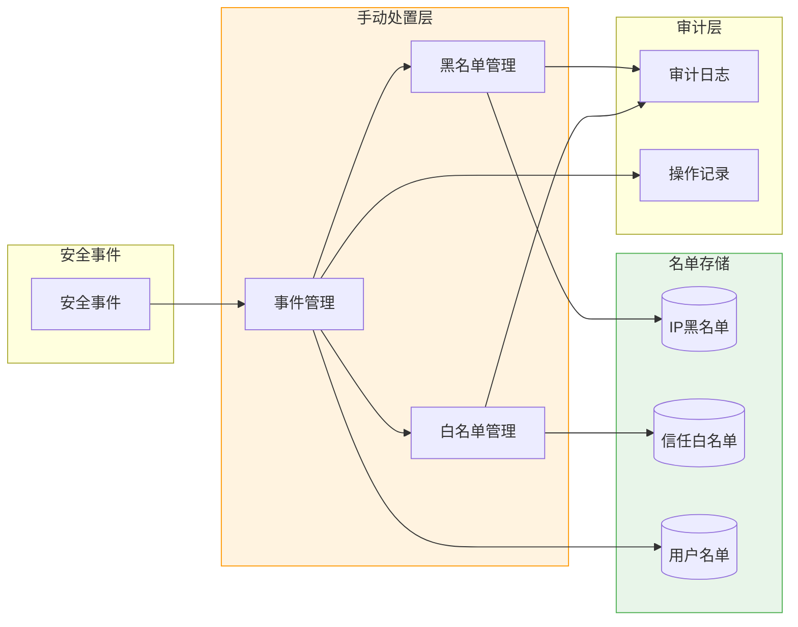
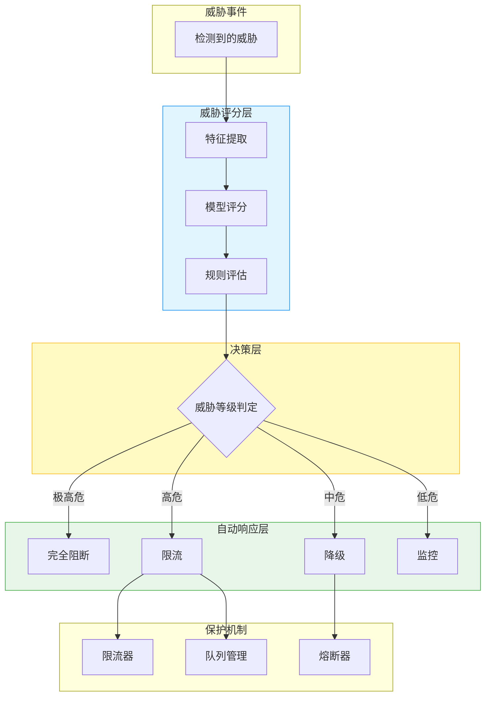
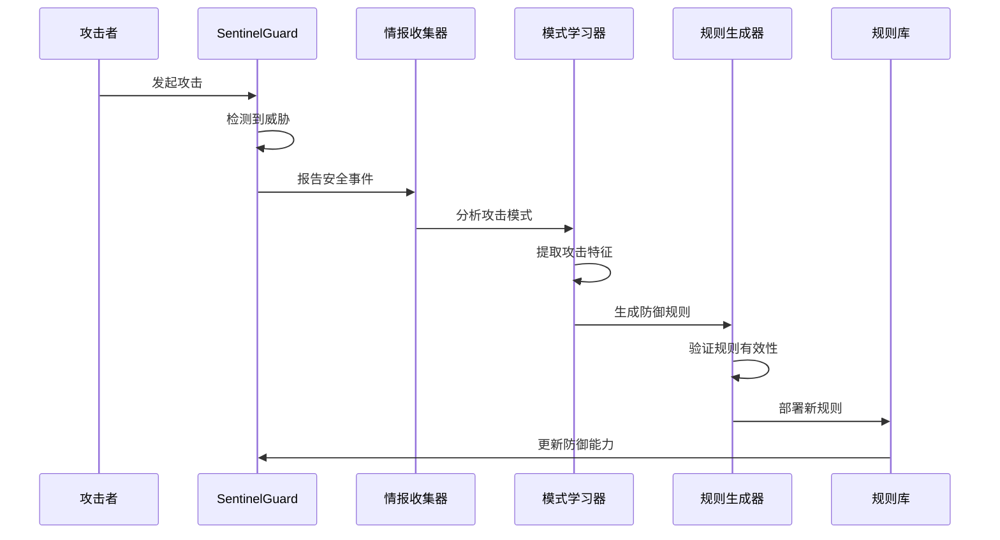

# Sprint 4：自动响应与威胁情报

## Sprint 概述

**自动响应与威胁情报（Automated Response and Threat Intelligence）** 是 SentinelGuard 的最后一环，实现安全事件的自动化处置和威胁情报的闭环学习。前三道防线（语义防火墙、行为监控、数据泄露防护）负责检测威胁，本 Sprint 负责对检测到的威胁进行自动响应，并将攻击模式学习到威胁情报库中，形成持续进化的防御体系。

### Sprint 目标

- **V1**：实现手动处置工具和黑白名单管理
- **V2**：构建自动阻断引擎和基于威胁等级的自动响应
- **V3**：实现威胁情报闭环（攻击模式学习 → 规则自动更新 → 情报共享）

### 核心交付物

| 交付物 | 描述 | 文件 |
|-------|-----|-----|
| AutoResponseEngine | 自动响应引擎，根据威胁等级自动处置 | AutoResponseEngine.java |
| ThreatIntelCollector | 威胁情报收集器，学习攻击模式 | ThreatIntelCollector.java |
| RuleUpdater | 规则更新器，自动更新防御规则 | RuleUpdater.java |

---

## V1：手动处置与黑白名单

### 设计思路

V1 版本提供基础的管理工具：
1. **手动处置**：安全人员可以手动处理安全事件
2. **黑白名单**：管理 IP、用户、会话的黑白名单
3. **审计日志**：记录所有安全相关操作

### 架构设计



### 核心功能

| 功能 | 描述 | 操作 |
|-----|------|-----|
| **事件管理** | 查看、处理安全事件 | 标记状态、添加备注 |
| **IP 黑名单** | 禁止特定 IP 访问 | 添加/移除 IP、设置过期时间 |
| **用户黑名单** | 禁止特定用户操作 | 封禁/解封用户、记录原因 |
| **白名单** | 信任的 IP/用户免检 | 添加信任实体、设置条件 |
| **审计日志** | 记录所有操作 | 查询历史、导出报告 |

### Java 实现

#### 黑白名单服务

```java
package com.sentinelguard.response.v1;

import lombok.Data;
import lombok.RequiredArgsConstructor;
import lombok.extern.slf4j.Slf4j;
import org.springframework.data.redis.core.RedisTemplate;
import org.springframework.stereotype.Service;

import java.time.LocalDateTime;
import java.time.temporal.ChronoUnit;
import java.util.concurrent.TimeUnit;

/**
 * 黑白名单服务
 * 
 * @author SentinelGuard Team
 */
@Slf4j
@Service
@RequiredArgsConstructor
public class BlackWhitelistService {
    
    private final RedisTemplate<String, Object> redisTemplate;
    
    private static final String BLACKLIST_PREFIX = "sentinel:blacklist:";
    private static final String WHITELIST_PREFIX = "sentinel:whitelist:";
    
    /**
     * 添加 IP 到黑名单
     * 
     * @param ip IP 地址
     * @param reason 原因
     * @param duration 持续时间（分钟）
     */
    public void addIpToBlacklist(String ip, String reason, long duration) {
        String key = BLACKLIST_PREFIX + "ip:" + ip;
        BlacklistEntry entry = new BlacklistEntry(ip, reason, LocalDateTime.now());
        
        if (duration > 0) {
            redisTemplate.opsForValue().set(key, entry, duration, TimeUnit.MINUTES);
        } else {
            redisTemplate.opsForValue().set(key, entry);
        }
        
        log.warn("IP 已添加到黑名单: ip={}, reason={}, duration={}min", ip, reason, duration);
    }
    
    /**
     * 从黑名单移除 IP
     * 
     * @param ip IP 地址
     */
    public void removeIpFromBlacklist(String ip) {
        String key = BLACKLIST_PREFIX + "ip:" + ip;
        redisTemplate.delete(key);
        log.info("IP 已从黑名单移除: ip={}", ip);
    }
    
    /**
     * 检查 IP 是否在黑名单
     * 
     * @param ip IP 地址
     * @return 是否在黑名单
     */
    public boolean isIpBlacklisted(String ip) {
        String key = BLACKLIST_PREFIX + "ip:" + ip;
        return Boolean.TRUE.equals(redisTemplate.hasKey(key));
    }
    
    /**
     * 添加用户到黑名单
     * 
     * @param userId 用户ID
     * @param reason 原因
     * @param duration 持续时间（分钟）
     */
    public void addUserToBlacklist(String userId, String reason, long duration) {
        String key = BLACKLIST_PREFIX + "user:" + userId;
        BlacklistEntry entry = new BlacklistEntry(userId, reason, LocalDateTime.now());
        
        if (duration > 0) {
            redisTemplate.opsForValue().set(key, entry, duration, TimeUnit.MINUTES);
        } else {
            redisTemplate.opsForValue().set(key, entry);
        }
        
        log.warn("用户已添加到黑名单: userId={}, reason={}, duration={}min", userId, reason, duration);
    }
    
    /**
     * 添加 IP 到白名单
     * 
     * @param ip IP 地址
     * @param reason 原因
     */
    public void addIpToWhitelist(String ip, String reason) {
        String key = WHITELIST_PREFIX + "ip:" + ip;
        WhitelistEntry entry = new WhitelistEntry(ip, reason, LocalDateTime.now());
        redisTemplate.opsForValue().set(key, entry);
        
        log.info("IP 已添加到白名单: ip={}, reason={}", ip, reason);
    }
    
    /**
     * 检查 IP 是否在白名单
     * 
     * @param ip IP 地址
     * @return 是否在白名单
     */
    public boolean isIpWhitelisted(String ip) {
        String key = WHITELIST_PREFIX + "ip:" + ip;
        return Boolean.TRUE.equals(redisTemplate.hasKey(key));
    }
    
    @Data
    public static class BlacklistEntry {
        private String entity;
        private String reason;
        private LocalDateTime addedAt;
        
        public BlacklistEntry(String entity, String reason, LocalDateTime addedAt) {
            this.entity = entity;
            this.reason = reason;
            this.addedAt = addedAt;
        }
    }
    
    @Data
    public static class WhitelistEntry {
        private String entity;
        private String reason;
        private LocalDateTime addedAt;
        
        public WhitelistEntry(String entity, String reason, LocalDateTime addedAt) {
            this.entity = entity;
            this.reason = reason;
            this.addedAt = addedAt;
        }
    }
}
```

---

## V2：自动阻断与限流降级

### 设计思路

V2 版本实现自动化响应：
1. **威胁评分**：综合多维度信息计算威胁分数
2. **自动阻断**：根据威胁等级自动执行响应措施
3. **限流降级**：保护系统稳定性，防止被拖垮

### 架构设计



### 威胁等级与响应措施

| 威胁等级 | 分数范围 | 响应措施 | 具体动作 |
|---------|---------|---------|---------|
| **极高危** | 90-100 | 完全阻断 | 阻断请求、加入黑名单、触发告警 |
| **高危** | 70-89 | 限流 | 降低请求频率、要求额外验证 |
| **中危** | 50-69 | 降级 | 限制功能、降低响应优先级 |
| **低危** | 30-49 | 监控 | 记录日志、增加监控密度 |
| **安全** | 0-29 | 正常 | 正常处理 |

### Java 实现

#### 自动响应引擎

```java
package com.sentinelguard.response.v2;

import com.sentinelguard.response.model.ThreatEvent;
import com.sentinelguard.response.model.ThreatLevel;
import com.sentinelguard.response.model.ResponseAction;
import lombok.RequiredArgsConstructor;
import lombok.extern.slf4j.Slf4j;
import org.springframework.stereotype.Component;

import java.util.List;

/**
 * 自动响应引擎
 * 
 * @author SentinelGuard Team
 */
@Slf4j
@Component
@RequiredArgsConstructor
public class AutoResponseEngine {
    
    private final ThreatScorer threatScorer;
    private final ResponseExecutor responseExecutor;
    private final BlackWhitelistService blacklistService;
    
    /**
     * 处理威胁事件
     * 
     * @param event 威胁事件
     * @return 响应结果
     */
    public ResponseResult handle(ThreatEvent event) {
        // 1. 威胁评分
        ThreatScore score = threatScorer.score(event);
        event.setScore(score);
        
        log.warn("威胁事件评分: eventId={}, score={}, level={}", 
            event.getEventId(), score.getTotalScore(), score.getLevel());
        
        // 2. 根据等级决定响应
        List<ResponseAction> actions = determineActions(score.getLevel());
        
        // 3. 执行响应
        ResponseResult result = responseExecutor.execute(event, actions);
        
        // 4. 记录响应
        recordResponse(event, actions, result);
        
        return result;
    }
    
    /**
     * 根据威胁等级确定响应措施
     * 
     * @param level 威胁等级
     * @return 响应措施列表
     */
    private List<ResponseAction> determineActions(ThreatLevel level) {
        return switch (level) {
            case CRITICAL -> List.of(
                ResponseAction.BLOCK_REQUEST,
                ResponseAction.ADD_TO_BLACKLIST,
                ResponseAction.TRIGGER_ALERT,
                ResponseAction.NOTIFY_ADMIN
            );
            case HIGH -> List.of(
                ResponseAction.RATE_LIMIT,
                ResponseAction.REQUIRE_VERIFICATION,
                ResponseAction.TRIGGER_ALERT
            );
            case MEDIUM -> List.of(
                ResponseAction.DEGRADE_SERVICE,
                ResponseAction.INCREASE_MONITORING,
                ResponseAction.LOG_DETAILED
            );
            case LOW -> List.of(
                ResponseAction.LOG_ONLY,
                ResponseAction.INCREASE_MONITORING
            );
            case SAFE -> List.of(ResponseAction.NONE);
        };
    }
    
    private void recordResponse(ThreatEvent event, List<ResponseAction> actions, ResponseResult result) {
        // 记录到审计日志
        log.info("威胁响应记录: eventId={}, actions={}, result={}", 
            event.getEventId(), actions, result.getStatus());
    }
}
```

#### 威胁评分器

```java
package com.sentinelguard.response.v2;

import com.sentinelguard.response.model.ThreatEvent;
import com.sentinelguard.response.model.ThreatScore;
import lombok.RequiredArgsConstructor;
import lombok.extern.slf4j.Slf4j;
import org.springframework.stereotype.Component;

import java.util.List;

/**
 * 威胁评分器
 * 
 * @author SentinelGuard Team
 */
@Slf4j
@Component
@RequiredArgsConstructor
public class ThreatScorer {
    
    private final List<ThreatFactor> factors;
    
    /**
     * 计算威胁分数
     * 
     * @param event 威胁事件
     * @return 威胁分数
     */
    public ThreatScore score(ThreatEvent event) {
        double totalScore = 0.0;
        
        // 1. 计算各维度分数
        for (ThreatFactor factor : factors) {
            double factorScore = factor.calculate(event);
            totalScore += factorScore * factor.getWeight();
            
            log.debug("威胁因子: name={}, score={}, weight={}", 
                factor.getName(), factorScore, factor.getWeight());
        }
        
        // 2. 归一化到 0-100
        totalScore = Math.min(100, Math.max(0, totalScore));
        
        // 3. 确定威胁等级
        ThreatLevel level = determineLevel(totalScore);
        
        return ThreatScore.builder()
            .totalScore((int) totalScore)
            .level(level)
            .factors(extractFactorScores(event))
            .build();
    }
    
    private ThreatLevel determineLevel(double score) {
        if (score >= 90) return ThreatLevel.CRITICAL;
        if (score >= 70) return ThreatLevel.HIGH;
        if (score >= 50) return ThreatLevel.MEDIUM;
        if (score >= 30) return ThreatLevel.LOW;
        return ThreatLevel.SAFE;
    }
}
```

#### 限流降级器

```java
package com.sentinelguard.response.v2;

import lombok.RequiredArgsConstructor;
import lombok.extern.slf4j.Slf4j;
import org.springframework.stereotype.Component;
import org.springframework.data.redis.core.RedisTemplate;

import java.util.concurrent.TimeUnit;
import java.util.concurrent.atomic.AtomicInteger;

/**
 * 限流降级器
 * 
 * @author SentinelGuard Team
 */
@Slf4j
@Component
@RequiredArgsConstructor
public class RateLimiterAndDegradation {
    
    private final RedisTemplate<String, Object> redisTemplate;
    
    private static final String RATE_LIMIT_PREFIX = "sentinel:ratelimit:";
    private static final String CIRCUIT_BREAKER_PREFIX = "sentinel:breaker:";
    
    /**
     * 检查是否超过速率限制
     * 
     * @param key 限流键（如 IP、用户 ID）
     * @param limit 限制数量
     * @param window 时间窗口（秒）
     * @return 是否允许
     */
    public boolean allowRequest(String key, int limit, int window) {
        String redisKey = RATE_LIMIT_PREFIX + key;
        
        // 使用 Redis 计数器
        Long count = redisTemplate.opsForValue().increment(redisKey);
        
        if (count == null || count == 1) {
            // 第一次，设置过期时间
            redisTemplate.expire(redisKey, window, TimeUnit.SECONDS);
        }
        
        boolean allowed = count <= limit;
        
        if (!allowed) {
            log.warn("请求被限流: key={}, count={}, limit={}", key, count, limit);
        }
        
        return allowed;
    }
    
    /**
     * 检查熔断器状态
     * 
     * @param service 服务名称
     * @return 是否熔断（熔断时返回 true）
     */
    public boolean isCircuitOpen(String service) {
        String key = CIRCUIT_BREAKER_PREFIX + service;
        CircuitBreakerState state = (CircuitBreakerState) redisTemplate.opsForValue().get(key);
        
        if (state == null) {
            return false;
        }
        
        // 检查是否应该尝试恢复
        if (state.isOpen() && shouldAttemptReset(state)) {
            attemptReset(key);
            return false;
        }
        
        return state.isOpen();
    }
    
    /**
     * 记录失败，触发熔断
     * 
     * @param service 服务名称
     * @param threshold 失败阈值
     */
    public void recordFailure(String service, int threshold) {
        String key = CIRCUIT_BREAKER_PREFIX + service;
        CircuitBreakerState state = (CircuitBreakerState) redisTemplate.opsForValue().get(key);
        
        if (state == null) {
            state = new CircuitBreakerState();
        }
        
        state.incrementFailures();
        
        if (state.getFailureCount() >= threshold) {
            state.open();
            log.warn("熔断器触发: service={}, failures={}", service, state.getFailureCount());
        }
        
        redisTemplate.opsForValue().set(key, state, 1, TimeUnit.HOURS);
    }
}
```

---

## V3：威胁情报闭环

### 设计思路

V3 版本实现完整的威胁情报闭环：
1. **攻击模式学习**：从安全事件中提取攻击模式
2. **规则自动更新**：将学习的模式转化为防御规则
3. **情报共享**：与其他系统共享威胁情报

### 架构设计

```mermaid
flowchart TB
    subgraph Collection[情报收集层]
        E1[语义防火墙事件]
        E2[行为监控事件]
        E3[数据泄露事件]
        C[情报收集器]
    end
    
    subgraph Analysis[分析学习层]
        P[模式提取]
        M[机器学习]
        S[相似度分析]
    end
    
    subgraph Knowledge[情报库]
        AM[(攻击模式库)]
        IR[情报记录]
        ST[统计数据]]
    end
    
    subgraph Update[规则更新层]
        G[规则生成器]
        V[规则验证]
        D[规则部署]]
    end
    
    subgraph Share[共享层]
        API[威胁情报API]
        FB[反馈收集]
    end
    
    E1 --> C
    E2 --> C
    E3 --> C
    C --> P
    P --> M
    M --> S
    
    AM --> S
    S --> AM
    S --> IR
    IR --> AM
    
    AM --> G
    G --> V
    V --> D
    
    D --> API
    API --> FB
    FB --> M
    
    style Collection fill:#e8f5e9,stroke:#4caf50
    style Analysis fill:#e1f5ff,stroke:#2196f3
    style Knowledge fill:#fff9c4,stroke:#fbc02d
    style Update fill:#f3e5f5,stroke:#9c27b0
```

### 核心流程



### Java 实现

#### 威胁情报收集器

```java
package com.sentinelguard.response.v3;

import com.sentinelguard.firewall.model.DetectionResult;
import com.sentinelguard.behavior.model.AnomalyResult;
import com.sentinelguard.dlp.model.LeakAssessment;
import lombok.RequiredArgsConstructor;
import lombok.extern.slf4j.Slf4j;
import org.springframework.stereotype.Component;
import org.springframework.kafka.core.KafkaTemplate;

import java.time.LocalDateTime;
import java.util.UUID;

/**
 * 威胁情报收集器
 * 
 * @author SentinelGuard Team
 */
@Slf4j
@Component
@RequiredArgsConstructor
public class ThreatIntelCollector {
    
    private final KafkaTemplate<String, ThreatIntelEvent> kafkaTemplate;
    private static final String THREAT_INTEL_TOPIC = "sentinel.threat-intel";
    
    /**
     * 收集语义防火墙事件
     * 
     * @param result 检测结果
     * @param context 上下文信息
     */
    public void collectFirewallEvent(DetectionResult result, SecurityContext context) {
        if (!result.isThreat()) {
            return;
        }
        
        ThreatIntelEvent event = ThreatIntelEvent.builder()
            .eventId(UUID.randomUUID().toString())
            .eventType("FIREWALL_DETECTION")
            .severity(result.getSeverity())
            .timestamp(LocalDateTime.now())
            .context(context)
            .details(result.toMap())
            .build();
        
        publish(event);
    }
    
    /**
     * 收集行为异常事件
     * 
     * @param result 异常检测结果
     * @param context 上下文信息
     */
    public void collectBehaviorEvent(AnomalyResult result, SecurityContext context) {
        if (result.getTotalScore() < 50) {
            return;
        }
        
        ThreatIntelEvent event = ThreatIntelEvent.builder()
            .eventId(UUID.randomUUID().toString())
            .eventType("BEHAVIOR_ANOMALY")
            .severity(mapScoreToSeverity(result.getTotalScore()))
            .timestamp(LocalDateTime.now())
            .context(context)
            .details(result.toMap())
            .build();
        
        publish(event);
    }
    
    /**
     * 收集数据泄露事件
     * 
     * @param assessment 泄露评估
     * @param context 上下文信息
     */
    public void collectDlpEvent(LeakAssessment assessment, SecurityContext context) {
        if (assessment.getOverallRisk() < 50) {
            return;
        }
        
        ThreatIntelEvent event = ThreatIntelEvent.builder()
            .eventId(UUID.randomUUID().toString())
            .eventType("DATA_LEAK")
            .severity(mapScoreToSeverity(assessment.getOverallRisk()))
            .timestamp(LocalDateTime.now())
            .context(context)
            .details(assessment.toMap())
            .build();
        
        publish(event);
    }
    
    private void publish(ThreatIntelEvent event) {
        try {
            kafkaTemplate.send(THREAT_INTEL_TOPIC, event.getEventId(), event);
            log.debug("威胁情报已发布: eventId={}, type={}", event.getEventId(), event.getEventType());
        } catch (Exception e) {
            log.error("发布威胁情报失败", e);
        }
    }
    
    private String mapScoreToSeverity(int score) {
        if (score >= 90) return "CRITICAL";
        if (score >= 70) return "HIGH";
        if (score >= 50) return "MEDIUM";
        return "LOW";
    }
}
```

#### 攻击模式学习器

```java
package com.sentinelguard.response.v3;

import com.sentinelguard.response.model.AttackPattern;
import com.sentinelguard.response.repository.AttackPatternRepository;
import lombok.RequiredArgsConstructor;
import lombok.extern.slf4j.Slf4j;
import org.springframework.ai.chat.client.ChatClient;
import org.springframework.stereotype.Component;

import java.util.List;
import java.util.stream.Collectors;

/**
 * 攻击模式学习器
 * 
 * @author SentinelGuard Team
 */
@Slf4j
@Component
@RequiredArgsConstructor
public class AttackPatternLearner {
    
    private final ChatClient.Builder chatClientBuilder;
    private final AttackPatternRepository patternRepository;
    
    /**
     * 从事件列表中学习攻击模式
     * 
     * @param events 威胁情报事件列表
     * @return 学习到的攻击模式
     */
    public List<AttackPattern> learnPatterns(List<ThreatIntelEvent> events) {
        if (events.isEmpty()) {
            return List.of();
        }
        
        // 1. 按类型分组
        var groupedEvents = events.stream()
            .collect(Collectors.groupingBy(ThreatIntelEvent::getEventType));
        
        List<AttackPattern> patterns = new ArrayList<>();
        
        // 2. 为每种事件类型学习模式
        for (var entry : groupedEvents.entrySet()) {
            String eventType = entry.getKey();
            List<ThreatIntelEvent> typeEvents = entry.getValue();
            
            if (typeEvents.size() >= 5) { // 至少5个相似事件才学习
                AttackPattern pattern = learnPatternForType(eventType, typeEvents);
                if (pattern != null) {
                    patterns.add(pattern);
                }
            }
        }
        
        // 3. 保存模式
        for (AttackPattern pattern : patterns) {
            patternRepository.save(pattern);
            log.info("学习到新的攻击模式: type={}, patternId={}", pattern.getType(), pattern.getPatternId());
        }
        
        return patterns;
    }
    
    /**
     * 为特定事件类型学习模式
     * 
     * @param eventType 事件类型
     * @param events 事件列表
     * @return 攻击模式
     */
    private AttackPattern learnPatternForType(String eventType, List<ThreatIntelEvent> events) {
        String systemPrompt = """
            你是一个安全分析专家。请从以下威胁情报事件中提取共同的攻击模式。
            
            事件类型：%s
            
            事件列表：
            %s
            
            请分析并返回：
            1. 攻击特征：共同的模式、特征
            2. 检测规则：如何检测此类攻击
            3. 响应建议：如何防御此类攻击
            
            请以JSON格式返回。
            """.formatted(eventType, formatEvents(events));
        
        try {
            ChatClient chatClient = chatClientBuilder.build();
            String response = chatClient.prompt()
                .system(systemPrompt)
                .call()
                .content();
            
            return parsePattern(response, eventType);
        } catch (Exception e) {
            log.error("攻击模式学习失败: type={}", eventType, e);
            return null;
        }
    }
}
```

#### 规则更新器

```java
package com.sentinelguard.response.v3;

import com.sentinelguard.response.model.AttackPattern;
import com.sentinelguard.firewall.config.FirewallConfig;
import lombok.RequiredArgsConstructor;
import lombok.extern.slf4j.Slf4j;
import org.springframework.stereotype.Component;
import org.springframework.kafka.annotation.KafkaListener;

import java.util.List;

/**
 * 规则自动更新器
 * 
 * @author SentinelGuard Team
 */
@Slf4j
@Component
@RequiredArgsConstructor
public class RuleUpdater {
    
    private final FirewallConfig firewallConfig;
    private final PatternValidator patternValidator;
    
    /**
     * 监听新攻击模式，自动更新规则
     * 
     * @param pattern 攻击模式
     */
    @KafkaListener(topics = "sentinel.attack-patterns")
    public void onNewAttackPattern(AttackPattern pattern) {
        log.info("收到新攻击模式: patternId={}, type={}", pattern.getPatternId(), pattern.getType());
        
        // 1. 验证模式
        if (!patternValidator.validate(pattern)) {
            log.warn("攻击模式验证失败: patternId={}", pattern.getPatternId());
            return;
        }
        
        // 2. 生成规则
        List<GeneratedRule> rules = generateRules(pattern);
        
        // 3. 影子模式测试
        if (testInShadowMode(rules)) {
            // 4. 正式部署
            deployRules(rules);
            log.info("新规则已部署: patternId={}, count={}", pattern.getPatternId(), rules.size());
        } else {
            log.warn("新规则测试失败，暂不部署: patternId={}", pattern.getPatternId());
        }
    }
    
    /**
     * 生成检测规则
     * 
     * @param pattern 攻击模式
     * @return 生成的规则列表
     */
    private List<GeneratedRule> generateRules(AttackPattern pattern) {
        // 根据模式类型生成不同规则
        return switch (pattern.getType()) {
            case "FIREWALL_DETECTION" -> generateFirewallRules(pattern);
            case "BEHAVIOR_ANOMALY" -> generateBehaviorRules(pattern);
            case "DATA_LEAK" -> generateDlpRules(pattern);
            default -> List.of();
        };
    }
    
    private List<GeneratedRule> generateFirewallRules(AttackPattern pattern) {
        // 使用 LLM 生成正则规则
        String prompt = String.format("""
            基于以下攻击模式，生成一个或多个正则表达式规则来检测此类攻击。
            
            攻击特征：%s
            
            请只返回正则表达式，每行一个。
            """, pattern.getFeatures());
        
        // ... 调用 LLM 生成规则
        
        return List.of();
    }
    
    private boolean testInShadowMode(List<GeneratedRule> rules) {
        // 在影子模式下测试规则
        // 只记录命中，不影响实际流量
        return true;
    }
    
    private void deployRules(List<GeneratedRule> rules) {
        // 部署规则到配置
        for (GeneratedRule rule : rules) {
            firewallConfig.getRegexRules().add(rule.toConfigRule());
        }
    }
}
```

---

## Spring AI 集成

### 安全事件拦截器

```java
package com.sentinelguard.response.integration;

import com.sentinelguard.response.v2.AutoResponseEngine;
import com.sentinelguard.response.v3.ThreatIntelCollector;
import com.sentinelguard.response.model.ThreatEvent;
import lombok.RequiredArgsConstructor;
import lombok.extern.slf4j.Slf4j;
import org.springframework.stereotype.Component;
import org.springframework.web.servlet.HandlerInterceptor;

import jakarta.servlet.http.HttpServletRequest;
import jakarta.servlet.http.HttpServletResponse;

/**
 * 安全请求拦截器
 * 
 * @author SentinelGuard Team
 */
@Slf4j
@Component
@RequiredArgsConstructor
public class SecurityRequestInterceptor implements HandlerInterceptor {
    
    private final BlackWhitelistService blacklistService;
    private final AutoResponseEngine responseEngine;
    private final ThreatIntelCollector intelCollector;
    
    @Override
    public boolean preHandle(HttpServletRequest request, HttpServletResponse response, 
                            Object handler) throws Exception {
        
        String ip = getClientIp(request);
        String userId = getCurrentUserId(request);
        
        // 1. 检查黑名单
        if (blacklistService.isIpBlacklisted(ip)) {
            log.warn("请求来自黑名单IP: ip={}", ip);
            response.sendError(HttpServletResponse.SC_FORBIDDEN, "Access denied");
            return false;
        }
        
        if (blacklistService.isUserBlacklisted(userId)) {
            log.warn("请求来自黑名单用户: userId={}", userId);
            response.sendError(HttpServletResponse.SC_FORBIDDEN, "Access denied");
            return false;
        }
        
        // 2. 检查白名单（白名单用户跳过部分检查）
        if (blacklistService.isIpWhitelisted(ip)) {
            log.debug("请求来自白名单IP: ip={}, 跳过安全检查", ip);
            return true;
        }
        
        // 3. 正常安全检查（由其他组件处理）
        return true;
    }
    
    private String getClientIp(HttpServletRequest request) {
        String ip = request.getHeader("X-Forwarded-For");
        if (ip == null) {
            ip = request.getRemoteAddr();
        }
        return ip;
    }
    
    private String getCurrentUserId(HttpServletRequest request) {
        // 从 session 或 token 中获取用户ID
        return request.getRemoteUser();
    }
}
```

---

## 威胁情报共享

### 威胁情报 API

```java
package com.sentinelguard.response.v3;

import com.sentinelguard.response.model.ThreatIntel;
import lombok.RequiredArgsConstructor;
import lombok.extern.slf4j.Slf4j;
import org.springframework.web.bind.annotation.*;

import java.util.List;

/**
 * 威胁情报 API
 * 
 * @author SentinelGuard Team
 */
@Slf4j
@RestController
@RequestMapping("/api/threat-intel")
@RequiredArgsConstructor
public class ThreatIntelController {
    
    private final ThreatIntelService intelService;
    
    /**
     * 获取最新威胁情报
     * 
     * @param limit 数量限制
     * @return 威胁情报列表
     */
    @GetMapping("/latest")
    public List<ThreatIntel> getLatest(@RequestParam(defaultValue = "10") int limit) {
        return intelService.getLatest(limit);
    }
    
    /**
     * 搜索威胁情报
     * 
     * @param query 搜索查询
     * @return 威胁情报列表
     */
    @GetMapping("/search")
    public List<ThreatIntel> search(@RequestParam String query) {
        return intelService.search(query);
    }
    
    /**
     * 提交威胁情报
     * 
     * @param intel 威胁情报
     * @return 提交结果
     */
    @PostMapping("/submit")
    public ApiResponse submit(@RequestBody ThreatIntel intel) {
        intelService.submit(intel);
        return ApiResponse.success();
    }
    
    /**
     * 同步威胁情报（内部系统调用）
     * 
     * @param intelList 威胁情报列表
     * @return 同步结果
     */
    @PostMapping("/sync")
    public ApiResponse sync(@RequestBody List<ThreatIntel> intelList) {
        intelService.sync(intelList);
        return ApiResponse.success();
    }
}
```

---

## Sprint 4 完成标准

- [ ] 实现黑白名单服务
- [ ] 实现威胁评分器
- [ ] 实现自动响应引擎
- [ ] 实现限流降级器
- [ ] 实现威胁情报收集器
- [ ] 实现攻击模式学习器
- [ ] 实现规则自动更新器
- [ ] 实现威胁情报共享 API
- [ ] 编写单元测试（覆盖率 > 80%）
- [ ] 性能测试达到目标指标

---

## 项目总结

**SentinelGuard** 项目通过 4 个 Sprint 完整实现了 AI 安全防御平台的核心能力：

1. **Sprint 1（语义防火墙）**：构建了第一道防线，检测 Prompt 注入和恶意意图
2. **Sprint 2（行为监控）**：建立了动态防御，检测 Agent 异常行为
3. **Sprint 3（数据泄露防护）**：实现了智能 DLP，保护敏感信息
4. **Sprint 4（自动响应与威胁情报）**：形成了闭环，实现自动化防御和持续进化

这套体系为 Agent 时代提供了全面的安全防护能力。

---

**项目完成** 🎉
