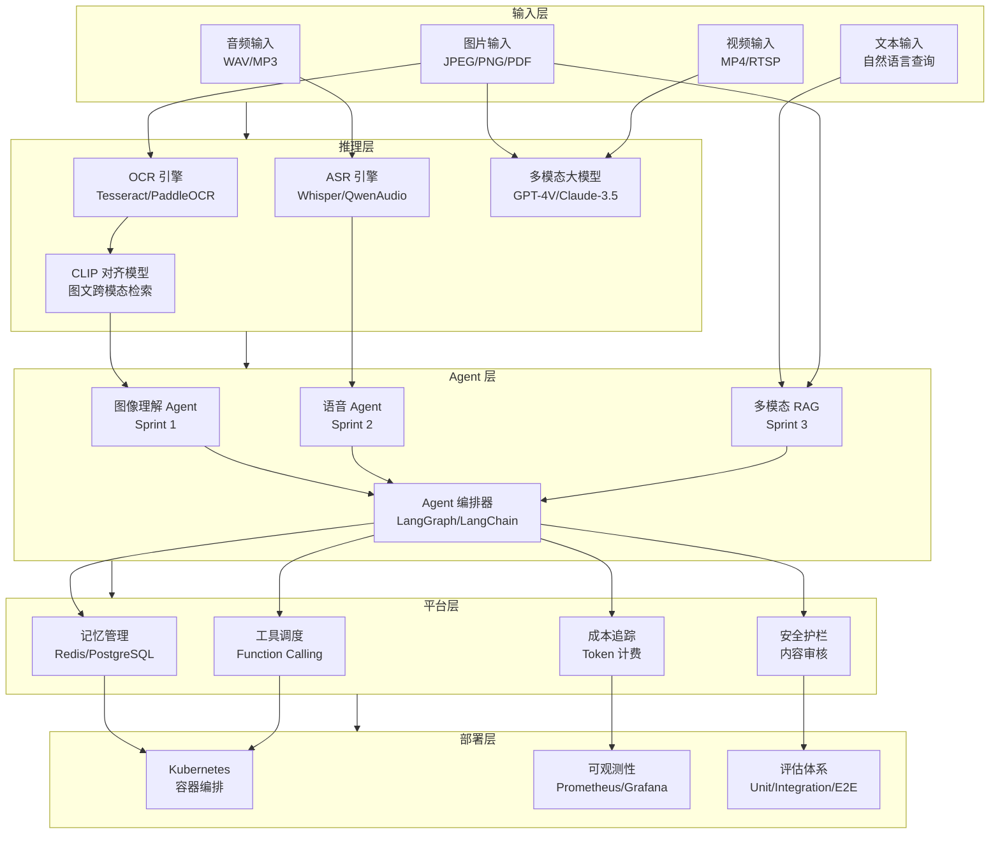
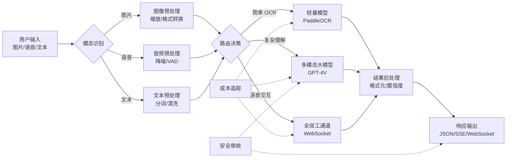

# OmniAgent - 看懂世界的多模态 Agent 平台

> 项目代号：OmniAgent  
> 定位：企业级多模态 Agent 平台

## 1 项目定位

### 1.1 核心价值主张

OmniAgent 是一个**企业级多模态 Agent 平台**，旨在打破传统 AI Agent 仅能处理文本的局限，让 Agent 具备"看懂世界"的能力。在真实企业场景中，信息从来不是纯文本形式——合同扫描件需要 OCR + 理解、客户会议需要语音转写 + 情感分析、产品图纸需要视觉问答、操作手册需要图文检索。

传统解决方案痛点：
- **割裂的工具链**：OCR 系统、语音识别、图像理解各自独立，需要多轮 API 调用和复杂编排
- **上下文断裂**：不同模态间的语义对齐困难（如"图中红色部分"在纯文本 RAG 中无法匹配）
- **成本高昂**：每次多模态处理都需要调用大模型，企业大规模应用成本不可控
- **生产就绪差**：缺乏评估体系、安全护栏、成本优化、性能监控

OmniAgent 通过统一的 Agent 框架，将文本、图像、语音、视频等模态无缝融合，提供：
- **统一的接口**：一次调用，自动识别输入模态并路由到最佳处理流程
- **跨模态理解**：CLIP 对齐 + 多模态 RAG 让"看图说话"成为可能
- **成本可控**：智能缓存、小模型预过滤、大模型兜底的分层策略
- **生产就绪**：完整的评估、监控、安全、部署方案

### 1.2 目标用户

| 用户角色 | 核心痛点 | OmniAgent 价值 |
|---------|---------|---------------|
| **企业 IT 负责人** | 需要 AI 能力但担心成本失控 | 分层架构让成本透明可控，企业级 SLA 保证 |
| **产品经理** | 想要"智能客服"但现有方案太笨 | 多模态理解让用户可发图片/语音提问 |
| **开发者** | 集成多个 AI 接口太复杂 | 统一 API，一行代码接入所有能力 |
| **数据科学家** | 需要灵活实验但缺少框架 | 模块化设计，可替换任意组件 |

### 1.3 与竞品对比

| 特性 | OmniAgent | LangChain | LlamaIndex | MultiOn |
|-----|-----------|-----------|------------|---------|
| **多模态统一** | ✅ 原生设计 | ⚠️ 需手动编排 | ⚠️ 侧重 RAG | ❌ 专注 Web |
| **语音全双工** | ✅ 原生支持 | ❌ 需自行实现 | ❌ 不支持 | ❌ 不支持 |
| **成本优化** | ✅ 分层策略 | ⚠️ 基础缓存 | ⚠️ 基础缓存 | ❌ 无 |
| **生产部署** | ✅ 完整方案 | ⚠️ 需自行搭建 | ⚠️ 需自行搭建 | ⚠️ SaaS 依赖 |
| **企业级 SLA** | ✅ 自托管 | ⚠️ 取决于实现 | ⚠️ 取决于实现 | ❌ SaaS 依赖 |
| **开箱即用** | ✅ 4 Sprint 覆盖核心场景 | ⚠️ 需大量定制 | ⚠️ 需定制 | ✅ 有限场景 |

## 2 架构总览

### 2.1 系统架构图



### 2.2 分层说明

| 层级 | 职责 | 核心技术 | Sprint 覆盖 |
|-----|------|---------|------------|
| **输入层** | 多模态输入统一接入 | MultipartFile, WebSocket | 全部 |
| **推理层** | 底层模型能力封装 | ONNX Runtime, vLLM | Sprint 1-2 |
| **Agent 层** | 业务逻辑编排 | LangGraph, State Machine | Sprint 1-3 |
| **平台层** | 横切能力 | Spring Boot, Redis | Sprint 4 |
| **部署层** | 生产运行 | K8s, Helm, ArgoCD | Sprint 4 |

### 2.3 数据流



## 3 Sprint 规划

### 3.1 Sprint 1：图像理解 Agent (2 周)

**目标**：让 Agent 能够"看懂"图片内容

| 版本 | 能力 | 技术栈 |
|-----|------|-------|
| V1 | 基础 OCR + 文本理解 | Tesseract + Regular Expression |
| V2 | 多模态大模型视觉问答 | GPT-4V / Claude 3.5 Sonnet |
| V3 | 多图推理 + 图表理解 | 多轮对话 + Structured Output |

**交付物**：
- `ImageAnalysisTool` - 图像分析工具
- `MultimodalChatClient` - 多模态聊天客户端
- 3 个版本的完整代码 + 单元测试

**关键挑战**：
- 如何处理大图（Token 超限）
- 如何提高 OCR 准确率（复杂版式、手写体）
- 如何让模型"聚焦"到图片的关键区域

### 3.2 Sprint 2：语音 Agent (2 周)

**目标**：让 Agent 能"听会说"，实现自然语音交互

| 版本 | 能力 | 技术栈 |
|-----|------|-------|
| V1 | ASR → LLM → TTS 串行 | Whisper + OpenAI + Azure TTS |
| V2 | 流式语音 Agent | WebSocket + SSE 流式输出 |
| V3 | 全双工 + 情感 + 打断 | Bidirectional Streaming + VAD |

**交付物**：
- `VoiceAgentPipeline` - 语音处理流水线
- 支持打断的 WebSocket 服务
- 情感识别与语音合成参数动态调整

**关键挑战**：
- 如何降低端到端延迟（首字延迟 < 1s）
- 如何实现自然打断（VAD + 语义完整性）
- 如何让语音"有感情"（根据对话情感调整 TTS 参数）

### 3.3 Sprint 3：多模态 RAG (2 周)

**目标**：让 Agent 能"跨模态检索"和"图文并茂地回答"

| 版本 | 能力 | 技术栈 |
|-----|------|-------|
| V1 | 图文分离检索 | Elasticsearch + CLIP |
| V2 | CLIP 跨模态对齐 | OpenAI CLIP / SigLIP |
| V3 | 多模态知识图谱 | Neo4j + Multimodal Entity Linking |

**交付物**：
- `MultimodalEmbeddingService` - 多模态嵌入服务
- 图文混合索引和检索管道
- 多模态知识图谱构建和查询

**关键挑战**：
- 如何让图像和文本在同一向量空间对齐
- 如何处理"图中红色圆圈部分"这类指代消解
- 如何评估检索质量（多模态 Recall@K）

### 3.4 Sprint 4：多模态 Agent 生产化 (2 周)

**目标**：让系统能"稳定、安全、经济"地运行

| 版本 | 能力 | 技术栈 |
|-----|------|-------|
| V1 | 基本可用 | Docker Compose, 基础监控 |
| V2 | 性能优化 | vLLM, Redis 缓存, Token 估算 |
| V3 | 生产部署 | Kubernetes, Helm, 完整评估 |

**交付物**：
- 成本优化策略（小模型预过滤、智能缓存）
- 安全护栏（内容审核、PII 识别）
- 评估体系（Unit + Integration + E2E）

**关键挑战**：
- 如何在成本和质量间取得平衡
- 如何构建全面的安全体系
- 如何自动化评估多模态 Agent 质量

## 4 知识点映射表

### 4.1 技术栈全景

| 领域 | 技术 | 应用场景 | Sprint |
|-----|------|---------|--------|
| **多模态大模型** | GPT-4V, Claude 3.5 Sonnet, Qwen-VL | 视觉问答、图像理解 | 1 |
| **OCR** | Tesseract, PaddleOCR, DocAI | 文档数字化 | 1 |
| **语音识别** | Whisper, Qwen-Audio, Conformer | ASR | 2 |
| **语音合成** | Azure TTS, ElevenLabs, VITS | TTS | 2 |
| **向量模型** | CLIP, SigLIP, E5 | 跨模态嵌入 | 3 |
| **向量数据库** | Milvus, Pinecone, pgvector | 相似度检索 | 3 |
| **图数据库** | Neo4j, NebulaGraph | 多模态知识图谱 | 3 |
| **流式处理** | SSE, WebSocket | 实时交互 | 2 |
| **Agent 框架** | LangGraph, LangChain, AutoGen | Agent 编排 | 全部 |
| **缓存** | Redis, Caffeine | 成本优化 | 4 |
| **容器化** | Docker, Kubernetes | 部署 | 4 |
| **可观测性** | Prometheus, Grafana, ELK | 监控 | 4 |

### 4.2 核心概念

| 概念 | 说明 | 相关技术 |
|-----|------|---------|
| **Multimodal Embedding** | 将不同模态映射到统一向量空间 | CLIP, SigLIP |
| **VAD (Voice Activity Detection)** | 检测语音活动，识别说话开始/结束 | Silero VAD, Pyannote |
| **Full-duplex** | 全双工通信，双方可同时发送/接收 | WebSocket, WebRTC |
| **Barge-in** | 打断机制，允许用户在 TTS 播放时插话 | VAD + 流控制 |
| **Token Estimation** | 预估 Token 消耗，用于成本控制 | Tiktoken, Tokenizer |
| **Structured Output** | 强制模型输出结构化 JSON | JSON Mode, Function Calling |
| **Cross-modal Attention** | 跨模态注意力机制 | CLIP, Flamingo |
| **Multimodal RAG** | 结合图文检索的增强生成 | CLIP + Rerank + LLM |
| **Semantic Cache** | 基于语义的缓存，非精确匹配 | Vector DB + L2 Distance |
| **Guardrails** | 安全护栏，防止有害输出 | Llama Guard, NeMo Guardrails |

### 4.3 设计模式

| 模式 | 问题 | 解决方案 | 应用场景 |
|-----|------|---------|---------|
| **Router Chain** | 如何选择合适的处理路径 | 根据输入特征路由到不同 Agent | 模态识别、难度分级 |
| **Tool Calling** | 如何让 Agent 使用外部工具 | Function Calling + Tool Registry | OCR、查询数据库 |
| **Memory Pattern** | 如何管理对话历史 | 滑动窗口 + 摘要压缩 | 长对话、上下文保持 |
| **COT (Chain of Thought)** | 如何提高复杂推理准确率 | 让模型"逐步思考" | 多图推理、复杂 QA |
| **ReAct** | 如何让 Agent 推理+行动协同 | Reasoning + Acting 循环 | 多步骤任务 |
| **Self-Consistency** | 如何提高输出稳定性 | 多路径采样 + 投票 | 关键决策点 |

## 5 快速开始

### 5.1 环境准备

```bash
# 克隆项目
git clone https://github.com/your-org/omni-agent.git
cd omni-agent

# 启动依赖服务（Docker Compose）
docker-compose up -d

# 配置环境变量
cp .env.example .env
# 编辑 .env，填入 API Keys
```

### 5.2 运行第一个图像理解 Agent

```java
// 示例：V1 基础 OCR + 文本理解
ImageAnalysisTool tool = new ImageAnalysisTool();
ImageAnalysisRequest request = ImageAnalysisRequest.builder()
    .imagePath("/path/to/invoice.jpg")
    .task(TaskType.EXTRACTION)
    .build();

ImageAnalysisResponse response = tool.analyze(request);
System.out.println(response.getText());
// 输出：发票号码：INV-2024-001，金额：¥12,800.00...
```

### 5.3 运行语音 Agent

```bash
# 启动 WebSocket 服务
./gradlew bootRun

# 客户端连接（示例使用 wscat）
wscat -c ws://localhost:8080/voice-agent
```

### 5.4 典型应用场景

| 场景 | 输入 | 输出 | Sprint |
|-----|------|------|--------|
| **智能客服** | 用户上传截图询问"这个怎么用" | 步骤指导 + 高亮标注 | 1 + 3 |
| **合同审核** | 上传合同扫描件 | 风险条款标注 + 修改建议 | 1 + 3 |
| **会议助手** | 实时语音输入 | 会议纪要 + 行动项提取 | 2 + 3 |
| **技术支持** | 仪表盘截图 + "这个红灯是什么意思" | 故障诊断 + 解决方案 | 1 + 3 |
| **教育培训** | 上传手写公式照片 | LaTeX 转换 + 解题步骤 | 1 |

## 6 下一步

- 📖 阅读 [Sprint 1：图像理解 Agent](./Sprint1-图像理解Agent.md) 了解如何让 Agent "看懂"图片
- 🎙️ 阅读 [Sprint 2：语音 Agent](./Sprint2-语音Agent.md) 了解如何实现自然语音交互
- 🔍 阅读 [Sprint 3：多模态 RAG](./Sprint3-多模态RAG.md) 了解跨模态检索与知识图谱
- 🚀 阅读 [Sprint 4：多模态 Agent 生产化](./Sprint4-多模态Agent生产化.md) 了解如何部署到生产环境
