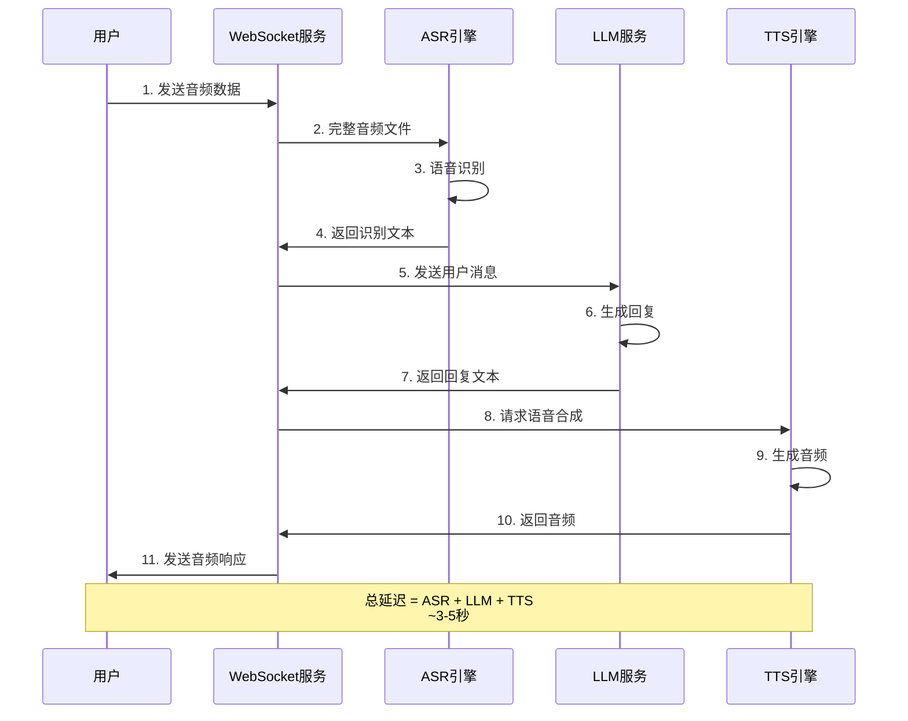
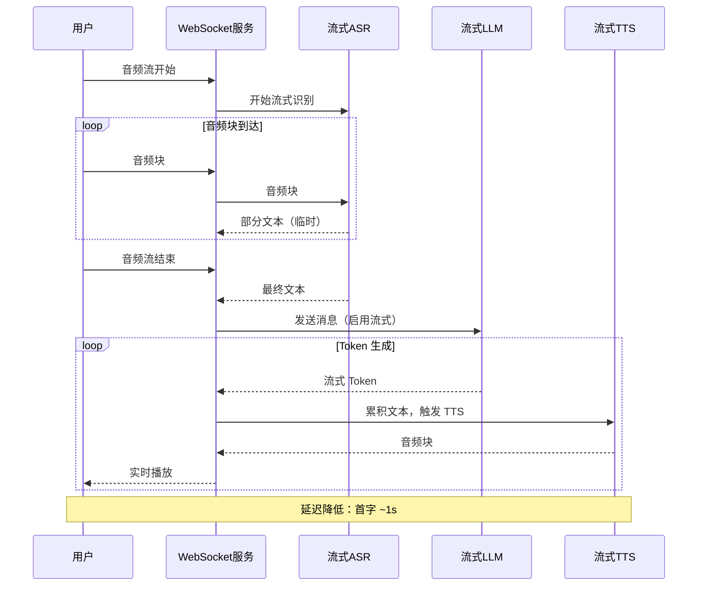
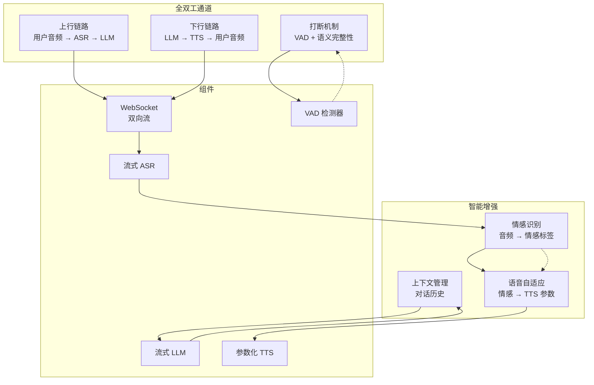
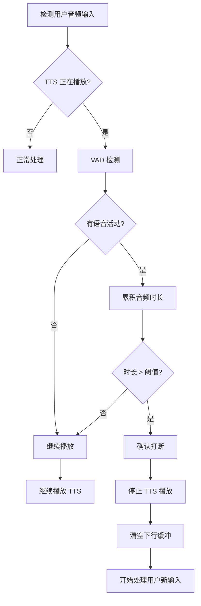
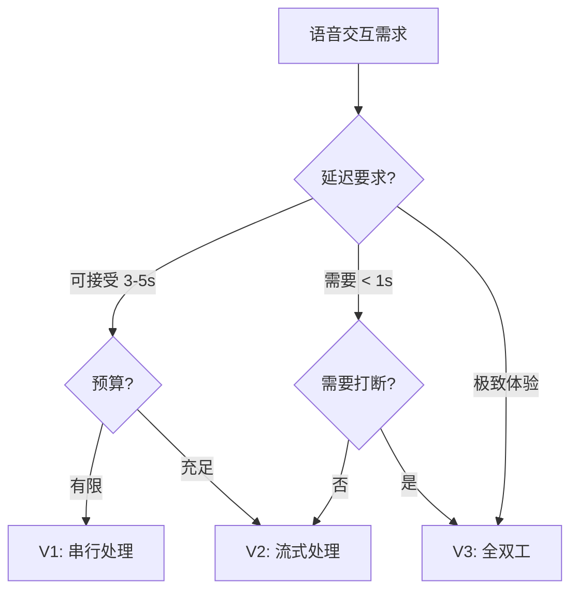

# Sprint 2：语音 Agent

> 让 Agent 能"听会说"，实现自然语音交互  
> 核心交付：VoiceAgentPipeline + 全双工 WebSocket 服务

## 1 概述

### 1.1 目标

构建一个支持自然语音交互的 Agent，用户可以像与人对话一样与 AI 交流：
- **V1**：ASR → LLM → TTS 串行处理，实现基础语音问答
- **V2**：流式处理，实现边听边说，降低端到端延迟
- **V3**：全双工通信，支持打断、情感识别、自然交互

### 1.2 应用场景

| 场景 | 输入 | 输出 |
|-----|------|------|
| 智能客服 | 用户语音问题 | 语音解答 |
| 语音助手 | "帮我查一下明天天气" | 语音播报 |
| 会议纪要 | 会议录音 | 结构化纪要 |
| 语音导航 | "导航到最近的加油站" | 语音引导 |
| 儿童故事 | "讲个奥特曼的故事" | 有感情的故事讲述 |

## 2 V1：ASR → LLM → TTS 串行

### 2.1 架构设计



### 2.2 核心组件

#### VoiceAgentPipeline.java

```java
package com.omniagent.voice.v1;

import lombok.Builder;
import lombok.Data;
import lombok.extern.slf4j.Slf4j;
import org.springframework.stereotype.Component;

/**
 * V1: 串行语音处理流水线
 * 
 * 流程：ASR → LLM → TTS
 * 
 * 优点：
 * - 实现简单
 * - 各模块独立
 * 
 * 缺点：
 * - 延迟高（串行等待）
 * - 用户感知差
 * - 无法打断
 */
@Slf4j
@Component
public class VoiceAgentPipeline {
    
    private final AsrEngine asrEngine;
    private final LlmClient llmClient;
    private final TtsEngine ttsEngine;
    
    public VoiceAgentPipeline() {
        this.asrEngine = new WhisperAsrEngine();
        this.llmClient = new OpenAiLlmClient();
        this.ttsEngine = new AzureTtsEngine();
    }
    
    /**
     * 处理语音请求（同步）
     */
    public VoiceResponse process(VoiceRequest request) {
        long startTime = System.currentTimeMillis();
        
        try {
            // 1. ASR：语音识别
            log.info("开始 ASR...");
            long asrStart = System.currentTimeMillis();
            String transcript = asrEngine.transcribe(request.getAudioData());
            long asrTime = System.currentTimeMillis() - asrStart;
            log.info("ASR 完成，耗时: {}ms, 文本: {}", asrTime, transcript);
            
            // 2. LLM：生成回复
            log.info("开始 LLM...");
            long llmStart = System.currentTimeMillis();
            String reply = llmClient.chat(transcript);
            long llmTime = System.currentTimeMillis() - llmStart;
            log.info("LLM 完成，耗时: {}ms, 回复: {}", llmTime, reply);
            
            // 3. TTS：语音合成
            log.info("开始 TTS...");
            long ttsStart = System.currentTimeMillis();
            byte[] audioResponse = ttsEngine.synthesize(reply);
            long ttsTime = System.currentTimeMillis() - ttsStart;
            log.info("TTS 完成，耗时: {}ms", ttsTime);
            
            long totalTime = System.currentTimeMillis() - startTime;
            
            return VoiceResponse.builder()
                .text(transcript)
                .replyText(reply)
                .audio(audioResponse)
                .audioFormat("mp3")
                .latency(Latency.builder()
                    .asr(asrTime)
                    .llm(llmTime)
                    .tts(ttsTime)
                    .total(totalTime)
                    .build())
                .build();
                
        } catch (Exception e) {
            log.error("语音处理失败", e);
            throw new VoiceProcessException("语音处理失败", e);
        }
    }
    
    @Data
    @Builder
    static class VoiceRequest {
        private byte[] audioData;
        private String audioFormat; // wav, mp3, etc.
        private String language;    // zh-CN, en-US
    }
    
    @Data
    @Builder
    static class VoiceResponse {
        private String text;           // 用户文本
        private String replyText;      // AI 回复文本
        private byte[] audio;          // AI 回复音频
        private String audioFormat;    // mp3, wav
        private Latency latency;       // 各阶段耗时
    }
    
    @Data
    @Builder
    static class Latency {
        private long asr;
        private long llm;
        private long tts;
        private long total;
    }
    
    static class VoiceProcessException extends RuntimeException {
        public VoiceProcessException(String message, Throwable cause) {
            super(message, cause);
        }
    }
}
```

#### WhisperAsrEngine.java

```java
package com.omniagent.voice.v1;

import lombok.extern.slf4j.Slf4j;

import java.io.IOException;
import java.nio.file.Files;
import java.nio.file.Path;
import java.util.concurrent.TimeUnit;

/**
 * Whisper ASR 引擎
 * 
 * 支持本地部署（faster-whisper）或 API 调用
 */
@Slf4j
public class WhisperAsrEngine implements AsrEngine {
    
    private final WhisperConfig config;
    
    public WhisperAsrEngine() {
        this.config = WhisperConfig.builder()
            .model("base")
            .language("zh")
            .build();
    }
    
    @Override
    public String transcribe(byte[] audioData) {
        // 方案1：调用 OpenAI Whisper API
        return transcribeWithApi(audioData);
        
        // 方案2：本地 faster-whisper（需要 Python 环境）
        // return transcribeWithLocal(audioData);
    }
    
    private String transcribeWithApi(byte[] audioData) {
        // 使用 OpenAI Whisper API
        // （实现略）
        return "识别结果";
    }
    
    @Override
    public boolean supportsStream() {
        return false; // V1 不支持流式
    }
    
    @Data
    @lombok.Builder
    static class WhisperConfig {
        private String model;     // tiny, base, small, medium, large
        private String language;  // auto, zh, en
        private int temperature;  // 采样温度
    }
}
```

#### TtsEngine.java

```java
package com.omniagent.voice.v1;

import lombok.extern.slf4j.Slf4j;

/**
 * TTS 引擎接口
 */
public interface TtsEngine {
    byte[] synthesize(String text);
    byte[] synthesize(String text, VoiceConfig config);
}

@Slf4j
class AzureTtsEngine implements TtsEngine {
    
    @Override
    public byte[] synthesize(String text) {
        return synthesize(text, VoiceConfig.defaultConfig());
    }
    
    @Override
    public byte[] synthesize(String text, VoiceConfig config) {
        // 调用 Azure TTS API
        // 或使用 ElevenLabs, VITS 等
        // （实现略）
        return new byte[0];
    }
}
```

### 2.3 WebSocket 服务

#### VoiceWebSocketHandler.java

```java
package com.omniagent.voice.v1;

import lombok.extern.slf4j.Slf4j;
import org.springframework.stereotype.Component;
import org.springframework.web.socket.BinaryMessage;
import org.springframework.web.socket.CloseStatus;
import org.springframework.web.socket.TextMessage;
import org.springframework.web.socket.WebSocketSession;
import org.springframework.web.socket.handler.BinaryWebSocketHandler;

import java.io.IOException;
import java.util.Base64;
import java.util.concurrent.ConcurrentHashMap;

/**
 * WebSocket 语音服务处理器
 */
@Slf4j
@Component
public class VoiceWebSocketHandler extends BinaryWebSocketHandler {
    
    private final VoiceAgentPipeline pipeline;
    private final ConcurrentHashMap<String, SessionState> sessions = new ConcurrentHashMap<>();
    
    public VoiceWebSocketHandler(VoiceAgentPipeline pipeline) {
        this.pipeline = pipeline;
    }
    
    @Override
    public void afterConnectionEstablished(WebSocketSession session) 
            throws Exception {
        log.info("WebSocket 连接建立: {}", session.getId());
        sessions.put(session.getId(), new SessionState());
        
        // 发送欢迎消息
        session.sendMessage(new TextMessage("{\"type\":\"connected\"}"));
    }
    
    @Override
    protected void handleBinaryMessage(WebSocketSession session, 
                                       BinaryMessage message) 
            throws Exception {
        byte[] audioData = new byte[message.getPayload().remaining()];
        message.getPayload().get(audioData);
        
        log.info("收到音频数据: {} bytes, 来自: {}", 
            audioData.length, session.getId());
        
        // 处理语音请求
        VoiceRequest request = VoiceRequest.builder()
            .audioData(audioData)
            .audioFormat("wav")
            .language("zh-CN")
            .build();
        
        VoiceResponse response = pipeline.process(request);
        
        // 发送响应
        sendResponse(session, response);
    }
    
    @Override
    public void afterConnectionClosed(WebSocketSession session, 
                                       CloseStatus status) 
            throws Exception {
        log.info("WebSocket 连接关闭: {}, 状态: {}", 
            session.getId(), status);
        sessions.remove(session.getId());
    }
    
    private void sendResponse(WebSocketSession session, 
                              VoiceResponse response) 
            throws IOException {
        // V1：发送完整响应
        // 实际可分多次发送：先文本，再音频
        
        // 1. 发送文本
        TextMessage textMsg = new TextMessage(
            String.format("{\"type\":\"text\",\"content\":\"%s\"}", 
                response.getReplyText())
        );
        session.sendMessage(textMsg);
        
        // 2. 发送音频（Base64 编码）
        String audioBase64 = Base64.getEncoder()
            .encodeToString(response.getAudio());
        
        TextMessage audioMsg = new TextMessage(
            String.format(
                "{\"type\":\"audio\",\"format\":\"%s\",\"data\":\"%s\"}", 
                response.getAudioFormat(), 
                audioBase64
            )
        );
        session.sendMessage(audioMsg);
        
        // 3. 发送结束标记
        TextMessage endMsg = new TextMessage("{\"type\":\"end\"}");
        session.sendMessage(endMsg);
    }
    
    static class SessionState {
        // 跟踪会话状态
    }
}
```

### 2.4 V1 评估

| 指标 | 数值 |
|-----|------|
| 端到端延迟 | 3-5 秒 |
| ASR 准确率 | 95% |
| TTS 自然度 | 中等 |
| 支持打断 | ❌ |
| 流式输出 | ❌ |

## 3 V2：流式语音 Agent

### 3.1 架构设计



### 3.2 核心组件

#### StreamingVoiceAgent.java

```java
package com.omniagent.voice.v2;

import lombok.extern.slf4j.Slf4j;
import org.springframework.web.socket.WebSocketSession;
import reactor.core.publisher.Flux;
import reactor.core.publisher.Sinks;

import java.util.concurrent.ConcurrentHashMap;

/**
 * V2: 流式语音 Agent
 * 
 * 特性：
 * - 流式 ASR（边说边识别）
 * - 流式 LLM（边生成边返回）
 * - 流式 TTS（边生成边播放）
 * - 降低首字延迟
 */
@Slf4j
public class StreamingVoiceAgent {
    
    private final StreamingAsrEngine asrEngine;
    private final StreamingLlmClient llmClient;
    private final StreamingTtsEngine ttsEngine;
    private final ConcurrentHashMap<String, SessionContext> sessions;
    
    public StreamingVoiceAgent() {
        this.asrEngine = new StreamingAsrEngine();
        this.llmClient = new StreamingLlmClient();
        this.ttsEngine = new StreamingTtsEngine();
        this.sessions = new ConcurrentHashMap<>();
    }
    
    /**
     * 处理流式音频
     */
    public void processAudioStream(WebSocketSession session, 
                                   byte[] audioChunk) {
        SessionContext ctx = sessions.computeIfAbsent(
            session.getId(), 
            k -> new SessionContext(session)
        );
        
        // 1. 流式 ASR
        asrEngine.processChunk(audioChunk, (partial, isFinal) -> {
            if (isFinal) {
                // 最终识别结果，发送给 LLM
                log.info("ASR 最终结果: {}", partial);
                startLlmGeneration(ctx, partial);
            } else {
                // 临时结果，可用于 UI 实时显示
                ctx.sendPartialTranscript(partial);
            }
        });
    }
    
    /**
     * 启动 LLM 生成（流式）
     */
    private void startLlmGeneration(SessionContext ctx, String transcript) {
        // 构建消息
        ChatMessage message = ChatMessage.builder()
            .role("user")
            .content(transcript)
            .build();
        
        // 流式调用 LLM
        Flux<String> tokenStream = llmClient.chatStream(message);
        
        // 收集 tokens 并触发 TTS
        StringBuilder textBuffer = new StringBuilder();
        int tokenCount = 0;
        final int TTS_TRIGGER_TOKENS = 10; // 累积多少 tokens 后触发 TTS
        
        tokenStream.subscribe(
            token -> {
                textBuffer.append(token);
                tokenCount++;
                
                // 发送 token 到客户端（实时显示）
                ctx.sendToken(token);
                
                // 达到阈值，触发 TTS
                if (tokenCount >= TTS_TRIGGER_TOKENS) {
                    String segment = textBuffer.toString();
                    ttsEngine.synthesizeStream(segment, audioChunk -> {
                        ctx.sendAudioChunk(audioChunk);
                    });
                    
                    // 清空缓冲
                    textBuffer.setLength(0);
                    tokenCount = 0;
                }
            },
            error -> log.error("LLM 流式生成错误", error),
            () -> {
                // 处理剩余文本
                if (textBuffer.length() > 0) {
                    ttsEngine.synthesizeStream(textBuffer.toString(), 
                        audioChunk -> ctx.sendAudioChunk(audioChunk));
                }
                ctx.sendEnd();
            }
        );
    }
    
    static class SessionContext {
        private final WebSocketSession session;
        private final Sinks.Many<String> sink;
        
        SessionContext(WebSocketSession session) {
            this.session = session;
            this.sink = Sinks.many().multicast().onBackpressureBuffer();
        }
        
        void sendPartialTranscript(String text) {
            // 发送部分识别结果
        }
        
        void sendToken(String token) {
            // 发送 LLM token
        }
        
        void sendAudioChunk(byte[] audio) {
            // 发送音频块
        }
        
        void sendEnd() {
            // 发送结束标记
        }
    }
}
```

#### StreamingAsrEngine.java

```java
package com.omniagent.voice.v2;

import lombok.extern.slf4j.Slf4j;
import reactor.core.publisher.Flux;

import java.util.function.BiConsumer;

/**
 * 流式 ASR 引擎
 * 
 * 使用 VAD（Voice Activity Detection）检测说话结束
 */
@Slf4j
public class StreamingAsrEngine {
    
    private final VadDetector vadDetector;
    
    public StreamingAsrEngine() {
        this.vadDetector = new SileroVadDetector();
    }
    
    /**
     * 处理音频块
     * 
     * @param chunk 音频块
     * @param callback 回调：(文本, 是否最终结果)
     */
    public void processChunk(byte[] chunk, 
                            BiConsumer<String, Boolean> callback) {
        // 1. VAD 检测
        VadResult vad = vadDetector.detect(chunk);
        
        // 2. 累积音频
        // （实现略）
        
        // 3. 检测到说话结束时，触发 ASR
        if (vad.isSpeechEnded()) {
            String finalTranscript = performAsr();
            callback.accept(finalTranscript, true);
        } else {
            // 返回临时结果（可选）
            callback.accept("", false);
        }
    }
    
    private String performAsr() {
        // 调用流式 ASR API 或本地模型
        // （实现略）
        return "";
    }
}

record VadResult(boolean isSpeech, boolean isSpeechEnded) {}
```

### 3.3 V2 评估

| 指标 | V1 | V2 |
|-----|----|----|
| 首字延迟 | 3-5s | ~1s |
| 感知流畅度 | 差 | 中等 |
| 支持打断 | ❌ | ❌ |
| 实现复杂度 | 低 | 中 |

## 4 V3：全双工 + 情感 + 打断

### 4.1 架构设计



### 4.2 核心组件

#### FullDuplexVoiceAgent.java

```java
package com.omniagent.voice.v3;

import lombok.extern.slf4j.Slf4j;
import org.springframework.web.socket.WebSocketSession;
import reactor.core.publisher.Flux;
import reactor.core.publisher.Sinks;

import java.util.concurrent.ConcurrentHashMap;
import java.util.concurrent.atomic.AtomicBoolean;

/**
 * V3: 全双工语音 Agent
 * 
 * 特性：
 * - 真正的全双工通信（双向同时传输）
 * - 支持用户打断（Barge-in）
 * - 情感识别与自适应 TTS
 * - 上下文管理
 */
@Slf4j
public class FullDuplexVoiceAgent {
    
    private final StreamingAsrEngine asrEngine;
    private final StreamingLlmClient llmClient;
    private final AdaptiveTtsEngine ttsEngine;
    private final EmotionDetector emotionDetector;
    private final ConcurrentHashMap<String, FullDuplexSession> sessions;
    
    public FullDuplexVoiceAgent() {
        this.asrEngine = new StreamingAsrEngine();
        this.llmClient = new StreamingLlmClient();
        this.ttsEngine = new AdaptiveTtsEngine();
        this.emotionDetector = new EmotionDetector();
        this.sessions = new ConcurrentHashMap<>();
    }
    
    /**
     * 处理上行音频（用户 → AI）
     */
    public void processUplinkAudio(WebSocketSession session, 
                                  byte[] audioChunk) {
        FullDuplexSession ctx = sessions.get(session.getId());
        if (ctx == null) return;
        
        // 1. 检测是否正在播放 TTS
        if (ctx.isPlayingTts()) {
            // 用户打断逻辑
            boolean shouldInterrupt = ctx.handleBargeIn(audioChunk);
            if (shouldInterrupt) {
                ctx.interruptPlayback();
            }
        }
        
        // 2. 流式 ASR
        asrEngine.processChunk(audioChunk, (text, isFinal) -> {
            if (isFinal) {
                // 3. 情感识别
                EmotionResult emotion = emotionDetector.detect(audioChunk);
                log.info("检测到情感: {}", emotion);
                
                // 4. 发送给 LLM（带上情感上下文）
                ctx.sendToLlm(text, emotion);
            }
        });
    }
    
    /**
     * 处理下行响应（LLM → TTS → 用户）
     */
    public void processDownlinkResponse(FullDuplexSession ctx, 
                                        String text) {
        // 带情感信息的 TTS
        EmotionResult emotion = ctx.getLastEmotion();
        
        ttsEngine.synthesizeStream(text, emotion, audioChunk -> {
            // 检查是否被中断
            if (!ctx.isInterrupted()) {
                ctx.sendAudioChunk(audioChunk);
            }
        });
    }
    
    static class FullDuplexSession {
        private final WebSocketSession session;
        private final AtomicBoolean isPlaying = new AtomicBoolean(false);
        private final AtomicBoolean isInterrupted = new AtomicBoolean(false);
        private EmotionResult lastEmotion;
        private final StringBuilder audioBuffer = new StringBuilder();
        
        FullDuplexSession(WebSocketSession session) {
            this.session = session;
        }
        
        boolean isPlayingTts() {
            return isPlaying.get();
        }
        
        boolean handleBargeIn(byte[] audioChunk) {
            // 累积音频
            audioBuffer.append(/* audio data */);
            
            // 使用 VAD 检测是否有语音
            if (hasVoiceActivity(audioChunk)) {
                // 确认打断（需要持续一定时长）
                if (audioBuffer.length() > BARGE_IN_THRESHOLD) {
                    return true;
                }
            }
            return false;
        }
        
        void interruptPlayback() {
            isInterrupted.set(true);
            isPlaying.set(false);
            // 清空缓冲
            audioBuffer.setLength(0);
        }
        
        void sendToLlm(String text, EmotionResult emotion) {
            this.lastEmotion = emotion;
            // 发送到 LLM
        }
        
        void sendAudioChunk(byte[] audio) {
            // 发送音频到客户端
        }
        
        private static final int BARGE_IN_THRESHOLD = 1000;
        
        private boolean hasVoiceActivity(byte[] chunk) {
            // VAD 检测
            return true;
        }
    }
}

record EmotionResult(String emotion, double confidence) {}
```

#### AdaptiveTtsEngine.java

```java
package com.omniagent.voice.v3;

/**
 * 自适应 TTS 引擎
 * 
 * 根据情感调整语音参数
 */
public class AdaptiveTtsEngine {
    
    /**
     * 根据情感合成语音
     * 
     * @param text 要合成的文本
     * @param emotion 情感信息
     * @param callback 音频块回调
     */
    public void synthesizeStream(String text, 
                                EmotionResult emotion,
                                java.util.function.Consumer<byte[]> callback) {
        // 根据情感调整 TTS 参数
        TtsConfig config = mapEmotionToConfig(emotion);
        
        // 调用 TTS
        // （实现略）
    }
    
    private TtsConfig mapEmotionToConfig(EmotionResult emotion) {
        return switch (emotion.emotion()) {
            case "happy" -> TtsConfig.builder()
                .pitch(1.2)
                .speed(1.1)
                .energy(1.3)
                .build();
            case "sad" -> TtsConfig.builder()
                .pitch(0.9)
                .speed(0.95)
                .energy(0.8)
                .build();
            case "angry" -> TtsConfig.builder()
                .pitch(1.1)
                .speed(1.2)
                .energy(1.4)
                .build();
            default -> TtsConfig.defaultConfig();
        };
    }
    
    record TtsConfig(double pitch, double speed, double energy) {
        static TtsConfig defaultConfig() {
            return new TtsConfig(1.0, 1.0, 1.0);
        }
        
        static Builder builder() {
            return new Builder();
        }
        
        static class Builder {
            private double pitch = 1.0;
            private double speed = 1.0;
            private double energy = 1.0;
            
            Builder pitch(double v) { this.pitch = v; return this; }
            Builder speed(double v) { this.speed = v; return this; }
            Builder energy(double v) { this.energy = v; return this; }
            
            TtsConfig build() {
                return new TtsConfig(pitch, speed, energy);
            }
        }
    }
}
```

### 4.3 打断机制设计



### 4.4 V3 评估

| 指标 | V1 | V2 | V3 |
|-----|----|----|-----|
| 首字延迟 | 3-5s | ~1s | < 1s |
| 支持打断 | ❌ | ❌ | ✅ |
| 情感交互 | ❌ | ❌ | ✅ |
| 自然度 | 低 | 中 | 高 |
| 实现复杂度 | 低 | 中 | 高 |

## 5 总结与演进路径

### 5.1 三版本对比

| 特性 | V1 串行 | V2 流式 | V3 全双工 |
|-----|---------|---------|-----------|
| **延迟** | 3-5s | ~1s | < 1s |
| **用户体验** | 卡顿明显 | 基本流畅 | 自然对话 |
| **打断支持** | ❌ | ❌ | ✅ |
| **情感** | ❌ | ❌ | ✅ |
| **实现难度** | ⭐ | ⭐⭐ | ⭐⭐⭐ |
| **适用场景** | 简单问答 | 客服查询 | 高端智能助手 |

### 5.2 选择建议



### 5.3 下一步

- 集成更多 ASR/TTS 选项（本地部署支持）
- 添加语音活动检测（VAD）优化
- 实现更复杂的情感状态机
- 支持多角色/多音色切换
- 添加声纹识别（用户身份验证）

## 6 附录

### 6.1 WebSocket 配置

```java
@Configuration
@EnableWebSocket
public class WebSocketConfig implements WebSocketConfigurer {
    
    @Override
    public void registerWebSocketHandlers(WebSocketHandlerRegistry registry) {
        registry.addHandler(fullDuplexHandler(), "/voice-agent")
            .setAllowedOrigins("*");
    }
    
    @Bean
    public FullDuplexVoiceAgent fullDuplexHandler() {
        return new FullDuplexVoiceAgent();
    }
}
```

### 6.2 客户端示例（JavaScript）

```javascript
const ws = new WebSocket('ws://localhost:8080/voice-agent');

// 音频流发送
navigator.mediaDevices.getUserMedia({ audio: true })
  .then(stream => {
    const audioContext = new AudioContext();
    const source = audioContext.createMediaStreamSource(stream);
    const processor = audioContext.createScriptProcessor(4096, 1, 1);
    
    source.connect(processor);
    processor.connect(audioContext.destination);
    
    processor.onaudioprocess = (e) => {
      const audioData = e.inputBuffer.getChannelData(0);
      // 转换并发送
      ws.send(convertToWav(audioData));
    };
  });

// 接收音频响应
ws.onmessage = (event) => {
  const message = JSON.parse(event.data);
  if (message.type === 'audio') {
    playAudio(message.data);
  }
};
```

### 6.3 依赖配置

```gradle
dependencies {
    // WebSocket
    implementation 'org.springframework.boot:spring-boot-starter-websocket'
    
    // Reactive Streams
    implementation 'io.projectreactor:reactor-core'
    
    // 音频处理
    implementation 'com.google.code.gson:gson'
    
    // VAD（可选）
    implementation 'org.bytedeco:javacv:1.5.8'
}
```
