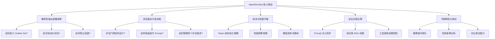
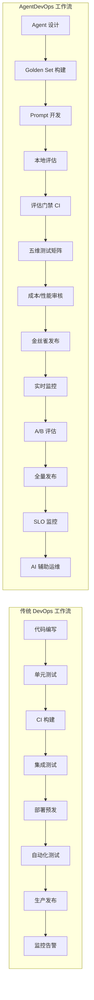
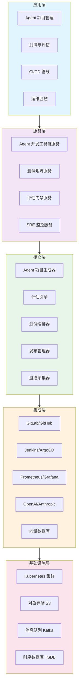
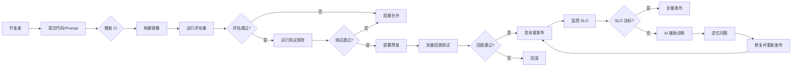
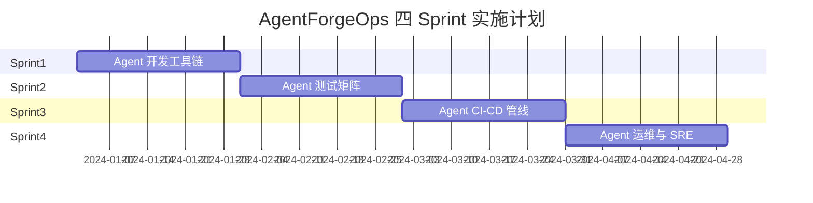
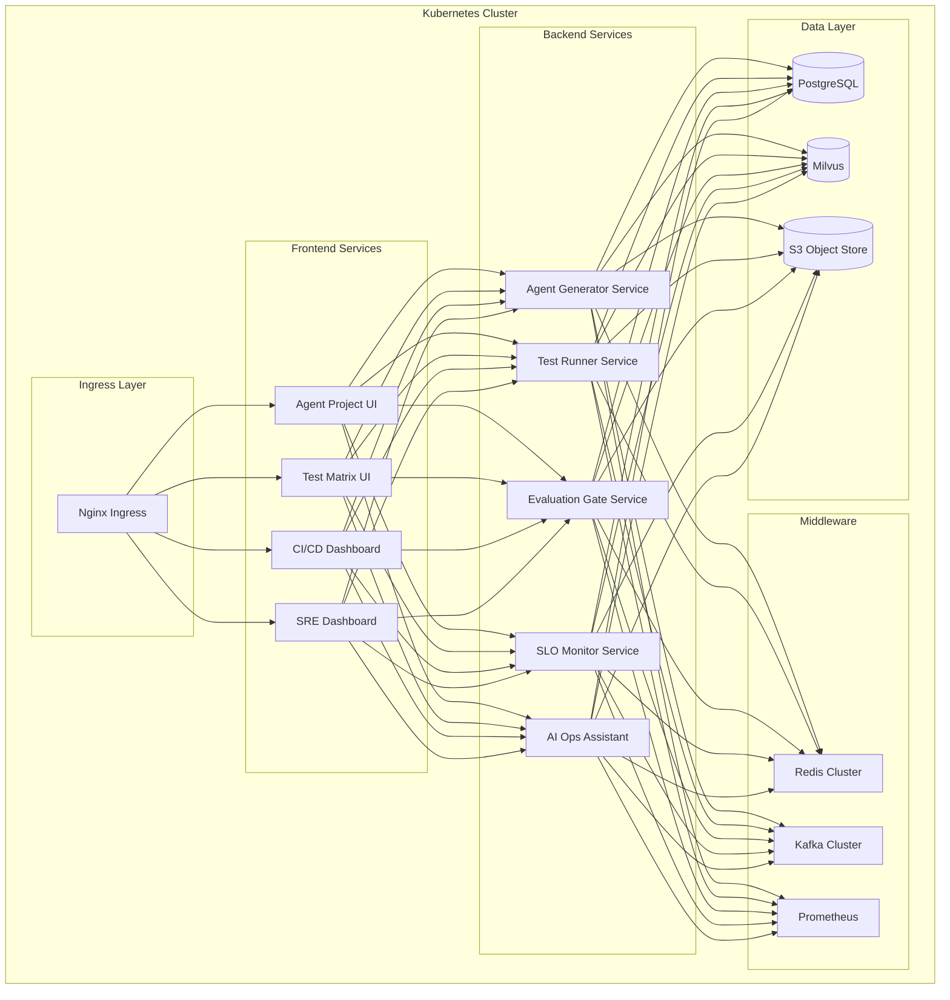

# AgentForgeOps — Agent 全生命周期 DevOps 平台

## 项目定位

AgentForgeOps 是一个面向 AI Agent 应用的企业级 DevOps 平台，旨在解决 Agent 全生命周期管理中的开发、测试、部署和运维挑战。与传统的 DevOps 平台不同，AgentForgeOps 深度集成 AI 特性，提供智能化的 Agent 项目管理、评估驱动的 CI/CD 流水线、多维测试矩阵和 AI 辅助的 SRE 能力。

**核心价值主张**：

- **全生命周期覆盖**：从 Agent 脚手架生成到生产环境监控，一站式管理
- **评估驱动质量**：将 AI 评估深度集成到开发流程，确保 Agent 输出质量
- **智能运维体系**：基于 SLO/错误预算的 Agent SRE，配合 AI 辅助故障定位
- **渐进式演进**：V1→V2→V3 架构演进，支持企业从基础到高级的逐步升级

**适用场景**：

- 企业内部 Agent 应用开发团队（10-100人规模）
- 需要标准化 Agent 开发流程的中大型组织
- 对 Agent 输出质量有严格要求的生产环境
- 需要 CI/CD 自动化的 Agent 应用交付场景

## 传统 DevOps vs AgentDevOps 对比

传统 DevOps 和 AgentDevOps 在核心关注点上存在显著差异。AgentDevOps 需要处理 AI 的概率性输出、评估指标管理、Prompt 版本控制等独特挑战。

### 核心差异对比

| 维度 | 传统 DevOps | AgentDevOps |
|------|------------|-------------|
| **输出确定性** | 确定性输出（代码编译即确定） | 概率性输出（同一输入可产生不同输出） |
| **质量验证** | 单元测试/集成测试 | 评估集（Evaluation Set）+ 五维测试矩阵 |
| **版本控制** | 代码版本控制 | 代码 + Prompt + 知识库 + 工具配置版本控制 |
| **部署策略** | 蓝绿部署/金丝雀发布 | 评估门禁 + 流量回放 + A/B 测试 |
| **监控指标** | 延迟/吞吐/错误率 | 延迟/成本/幻觉率/安全合规/工具成功率 |
| **故障定位** | 日志/调用链 | Prompt 剖析/工具调用分析/知识库命中分析 |
| **SLO 定义** | 99.9% 可用性 | 功能正确性 + 安全合规 + 成本预算 + 响应质量 |

### AgentDevOps 独特挑战



### 工作流对比



## 架构总览

AgentForgeOps 采用分层架构设计，从底层基础设施到顶层应用体验，形成完整的 Agent DevOps 能力矩阵。

### 整体架构



### 核心组件说明

| 组件 | 功能描述 | 技术选型 |
|------|----------|----------|
| **AgentProjectGenerator** | Agent 项目脚手架生成器，支持多框架模板 | Java + Spring Boot + Freemarker |
| **PromptEditor** | 可视化 Prompt 编辑器，支持版本对比和 A/B 测试 | React + Monaco Editor |
| **TestMatrixRunner** | 五维测试矩阵编排和执行引擎 | Java + JUnit5 + TestContainers |
| **EvaluationGate** | 评估驱动的 CI 门禁服务 | Java + Spring Boot + Jenkins API |
| **ReleaseManager** | 支持流量回放和金丝雀发布的发布管理器 | Java + Istio + Prometheus |
| **AgentSreDashboard** | Agent SRE 监控仪表板和告警系统 | React + Grafana + Prometheus |
| **AIOpsAssistant** | AI 辅助故障诊断和根因分析服务 | Python + LangChain + RAG |

### 数据流架构



## 四 Sprint 概述

AgentForgeOps 分为四个 Sprint，每个 Sprint 聚焦一个核心能力域，支持企业按需逐步建设。

### Sprint 规划时间线



### Sprint 1: Agent 开发工具链

**目标**：建立标准化的 Agent 开发环境，提升开发效率。

**核心能力**：
- Agent 项目脚手架生成（支持多框架模板）
- Prompt 可视化编辑器（语法高亮、变量管理）
- Agent 沙箱环境（隔离测试和快速验证）
- Prompt 版本管理（Git 集成和对比）

**V1→V2→V3 演进**：

| 阶段 | 特性 | 技术亮点 |
|------|------|----------|
| V1 | CLI 脚手架 + 文本 Prompt 编辑器 | 基于 Freemarker 的模板引擎 |
| V2 | IDE 插件集成 + 可视化 Prompt 编辑 | VS Code 插件 + React 组件库 |
| V3 | Agent 沙箱 + 热重载 + Prompt A/B 测试 | Docker Compose + WebSocket 热更新 |

**关键产出**：
- `AgentProjectGenerator`：Java 实现的项目生成器
- `PromptEditor`：Web 端 Prompt 编辑器
- `AgentSandbox`：本地开发沙箱环境

**Java 代码示例**：

```java
@Service
public class AgentProjectGenerator {
    
    private final TemplateEngine templateEngine;
    private final Map<String, ProjectTemplate> templateRegistry;
    
    public GeneratedProject generate(ProjectRequest request) {
        // 1. 选择合适的模板
        ProjectTemplate template = selectTemplate(request);
        
        // 2. 渲染项目结构
        ProjectStructure structure = template.render(request);
        
        // 3. 生成配置文件
        generateConfigs(structure, request);
        
        // 4. 初始化 Git 仓库
        initializeGit(structure);
        
        return GeneratedProject.from(structure);
    }
    
    private ProjectTemplate selectTemplate(ProjectRequest request) {
        return templateRegistry.values().stream()
            .filter(t -> t.supports(request.getFramework()))
            .findFirst()
            .orElseThrow(() -> new TemplateNotFoundException(
                "No template found for: " + request.getFramework()
            ));
    }
}
```

### Sprint 2: Agent 测试矩阵

**目标**：建立多维度的 Agent 质量保障体系。

**核心能力**：
- Golden Set 管理（标准评估集）
- 五维测试矩阵（功能、安全、性能、成本、回归）
- 自动化测试编排（并行执行和结果聚合）
- 对抗测试（Prompt 注入和越狱测试）

**V1→V2→V3 演进**：

| 阶段 | 特性 | 技术亮点 |
|------|------|----------|
| V1 | Golden Set + 基础功能测试 | JUnit5 + 参数化测试 |
| V2 | 五维测试矩阵 + 自动化报告 | TestContainers + Allure 报告 |
| V3 | 混沌测试 + 对抗测试 + 蜕变测试 | Chaos Engineering + Adversarial Framework |

**关键产出**：
- `TestMatrixRunner`：测试矩阵执行引擎
- `GoldenSetRepository`：评估集管理服务
- `AdversarialTestSuite`：对抗测试套件

**Java 代码示例**：

```java
@Service
public class TestMatrixRunner {
    
    private final List<DimensionTester> testers;
    private final TestReportAggregator aggregator;
    
    public TestMatrixReport run(TestMatrixRequest request) {
        // 1. 准备测试环境
        TestEnvironment env = prepareEnvironment(request);
        
        // 2. 并行执行各维度测试
        List<CompletableFuture<DimensionResult>> futures = testers.stream()
            .map(tester -> CompletableFuture.supplyAsync(
                () -> tester.test(request, env), 
                testExecutor
            ))
            .toList();
        
        // 3. 聚合测试结果
        List<DimensionResult> results = futures.stream()
            .map(CompletableFuture::join)
            .toList();
        
        // 4. 生成综合报告
        return aggregator.aggregate(results, request.getMetadata());
    }
    
    private TestEnvironment prepareEnvironment(TestMatrixRequest request) {
        return TestEnvironment.builder()
            .agentVersion(request.getAgentVersion())
            .testDataVersion(request.getTestDataVersion())
            .evaluationSet(request.getEvaluationSet())
            .build();
    }
}
```

### Sprint 3: Agent CI-CD 管线

**目标**：建立评估驱动的自动化交付流水线。

**核心能力**：
- 评估门禁（质量门禁自动化）
- 多环境部署（开发、测试、预发、生产）
- 流量回放（生产流量仿真测试）
- 金丝雀发布（渐进式灰度发布）

**V1→V2→V3 演进**：

| 阶段 | 特性 | 技术亮点 |
|------|------|----------|
| V1 | 基础 CI + 评估门禁 | Jenkins + 共享库 |
| V2 | 评估门禁 CI + CD 自动化 | Jenkins X + ArgoCD |
| V3 | 流量回放 + 全自动 CD + A/B 测试 | Gatling + Istio + Flagger |

**关键产出**：
- `EvaluationGate`：评估门禁服务
- `ReleaseManager`：发布管理器
- `CanaryController`：金丝雀控制器

**Java 代码示例**：

```java
@Service
public class EvaluationGate {
    
    private final List<Evaluator> evaluators;
    private final GateDecisionEngine decisionEngine;
    
    public GateResult evaluate(GateRequest request) {
        // 1. 执行所有评估器
        List<EvaluationResult> results = evaluators.stream()
            .parallel()
            .map(evaluator -> evaluator.evaluate(request))
            .toList();
        
        // 2. 计算综合分数
        double overallScore = decisionEngine.calculateScore(results);
        
        // 3. 应用门禁规则
        GateDecision decision = decisionEngine.decide(
            overallScore, 
            request.getGateRules()
        );
        
        // 4. 生成详细报告
        return GateResult.builder()
            .decision(decision)
            .overallScore(overallScore)
            .detailedResults(results)
            .build();
    }
    
    public enum GateDecision {
        PASS,           // 通过，可以继续
        CONDITIONAL,    // 有条件通过（需人工审批）
        BLOCK           // 阻塞，必须修复
    }
}
```

### Sprint 4: Agent 运维与 SRE

**目标**：建立 Agent 专属的 SRE 体系和智能运维能力。

**核心能力**：
- SLO 定义和监控（功能、安全、成本、性能）
- 错误预算管理（基于 SLO 的发布控制）
- AI 辅助故障诊断（根因分析和推荐修复）
- Agent 可观测性（调用链、Prompt 剖析、工具分析）

**V1→V2→V3 演进**：

| 阶段 | 特性 | 技术亮点 |
|------|------|----------|
| V1 | 基础监控 + 告警 | Prometheus + Grafana |
| V2 | SLO 管理 + 错误预算 + SRE Dashboard | Thanos + Custom SLO Controller |
| V3 | AI 辅助运维 + 自动修复 | LangChain + RAG + 自动化脚本 |

**关键产出**：
- `AgentSreDashboard`：SRE 监控仪表板
- `SloMonitor`：SLO 监控服务
- `AIOpsAssistant`：AI 辅助运维助手

**Java 代码示例**：

```java
@Service
public class SloMonitor {
    
    private final List<SloMetric> sloMetrics;
    private final AlertManager alertManager;
    private final ErrorBudgetCalculator budgetCalculator;
    
    public void monitor(SloWindow window) {
        // 1. 收集所有 SLO 指标
        Map<String, MetricValue> values = sloMetrics.stream()
            .collect(Collectors.toMap(
                SloMetric::getName,
                metric -> metric.collect(window)
            ));
        
        // 2. 计算 SLO 达标情况
        SloStatus status = calculateStatus(values, window);
        
        // 3. 更新错误预算
        ErrorBudget budget = budgetCalculator.update(status, window);
        
        // 4. 触发告警（如需要）
        if (status.isViolation()) {
            alertManager.fire(AlertLevel.from(status.getSeverity()));
        }
        
        // 5. 记录监控结果
        recordMonitoringResult(status, budget, window);
    }
    
    private SloStatus calculateStatus(
        Map<String, MetricValue> values, 
        SloWindow window
    ) {
        // SLO 计算逻辑
        return SloStatus.builder()
            .objective(window.getTarget())
            .actual(calculateActual(values))
            .isBreached(checkBreached(values))
            .build();
    }
}
```

## 知识点映射表

| Sprint | 核心知识点 | 技术栈 | 相关文档 |
|--------|-----------|--------|----------|
| **Sprint 1** | Agent 项目脚手架 | Java, Spring Boot, Freemarker | Sprint1-Agent开发工具链.md |
| | Prompt 工程实践 | Prompt Engineering, 变量管理 | 同上 |
| | 版本控制最佳实践 | Git, Git LFS | 同上 |
| | 沙箱环境设计 | Docker, Compose, 网络隔离 | 同上 |
| **Sprint 2** | 测试理论 | Golden Set, 评估方法论 | Sprint2-Agent测试矩阵.md |
| | 多维测试设计 | 五维测试矩阵设计 | 同上 |
| | 对抗测试 | Adversarial Testing, Prompt Injection | 同上 |
| | 蜕变测试 | Metamorphic Testing | 同上 |
| **Sprint 3** | CI/CD 理论 | 评估门禁, 流量回放 | Sprint3-AgentCI-CD管线.md |
| | 评估驱动开发 | Evaluation-Driven Development | 同上 |
| | 金丝雀发布 | Istio, Flagger, 渐进式交付 | 同上 |
| | A/B 测试 | 实验设计, 统计显著性 | 同上 |
| **Sprint 4** | SRE 理论 | SLO, SLI, 错误预算 | Sprint4-Agent运维与SRE.md |
| | 可观测性 | Tracing, Logging, Metrics | 同上 |
| | AI 辅助运维 | RAG, 根因分析, 推荐系统 | 同上 |
| | 告警管理 | Alerting, 告警疲劳管理 | 同上 |

## 技术栈总览

### 后端技术栈

| 组件 | 技术选型 | 用途 |
|------|----------|------|
| 应用框架 | Spring Boot 3.x | 微服务基础框架 |
| ORM | MyBatis Plus | 数据访问层 |
| 缓存 | Redis + Caffeine | 分布式缓存和本地缓存 |
| 消息队列 | Kafka | 事件驱动架构 |
| 调度 | Quartz + XXL-Job | 任务调度 |
| 监控 | Micrometer + Prometheus | 指标采集 |
| 日志 | Logback + ELK | 日志聚合分析 |

### 前端技术栈

| 组件 | 技术选型 | 用途 |
|------|----------|------|
| 框架 | React 18 | UI 框架 |
| 状态管理 | Zustand | 轻量状态管理 |
| UI 组件 | Ant Design 5.x | 企业级 UI 组件 |
| 编辑器 | Monaco Editor | 代码编辑器 |
| 图表 | ECharts | 数据可视化 |
| 构建 | Vite | 前端构建工具 |

### DevOps 技术栈

| 组件 | 技术选型 | 用途 |
|------|----------|------|
| 容器编排 | Kubernetes | 容器编排 |
| CI/CD | Jenkins X + ArgoCD | 持续集成交付 |
| 服务网格 | Istio | 流量管理和金丝雀发布 |
| 监控 | Prometheus + Grafana | 监控告警 |
| 链路追踪 | Jaeger | 分布式追踪 |
| 日志 | ELK Stack | 日志聚合分析 |

### AI 技术栈

| 组件 | 技术选型 | 用途 |
|------|----------|------|
| LLM 集成 | LangChain4j | LLM 调用框架 |
| 向量数据库 | Milvus | 向量存储和检索 |
| 评估框架 | RAGAS | Agent 评估 |
| 对抗测试 | GANDalf | Prompt 注入测试 |

## 部署架构



## 项目结构

```
AgentForgeOps/
├── docs/                          # 项目文档
│   ├── 00-总览.md                # 本文档
│   ├── Sprint1-Agent开发工具链.md
│   ├── Sprint2-Agent测试矩阵.md
│   ├── Sprint3-AgentCI-CD管线.md
│   └── Sprint4-Agent运维与SRE.md
├── agent-generator/              # Agent 生成器服务
│   ├── generator-core/           # 核心生成逻辑
│   ├── template-registry/       # 模板注册
│   └── prompt-editor/           # Prompt 编辑器
├── test-matrix/                 # 测试矩阵服务
│   ├── test-runner/            # 测试执行器
│   ├── golden-set/             # Golden Set 管理
│   └── adversarial/            # 对抗测试
├── ci-cd-pipeline/             # CI/CD 管线
│   ├── evaluation-gate/        # 评估门禁
│   ├── release-manager/       # 发布管理
│   └── canary-controller/     # 金丝雀控制
├── sre-monitoring/            # SRE 监控
│   ├── slo-monitor/          # SLO 监控
│   ├── sre-dashboard/        # SRE 仪表板
│   └── ai-ops/               # AI 运维助手
└── deployment/               # 部署配置
    ├── helm/                # Helm Charts
    ├── kustomize/          # Kustomize 配置
    └── terraform/         # 基础设施即代码
```

## 快速开始

### 前置要求

- Java 17+
- Node.js 18+
- Docker & Docker Compose
- Kubernetes 1.25+ (可选，用于生产部署)
- Helm 3.x (可选)

### 本地开发环境启动

```bash
# 1. 克隆仓库
git clone https://github.com/your-org/AgentForgeOps.git
cd AgentForgeOps

# 2. 启动基础设施
docker-compose up -d postgres redis kafka prometheus grafana

# 3. 启动后端服务
cd agent-generator
./gradlew bootRun

# 4. 启动前端服务
cd prompt-editor
npm install && npm start

# 5. 访问 UI
open http://localhost:3000
```

### 生产环境部署

```bash
# 使用 Helm 部署到 Kubernetes
helm install agentforgeops ./deployment/helm/agentforgeops \
  --namespace agentforgeops \
  --create-namespace \
  --set global.domain=your-domain.com \
  --set global.image.tag=v1.0.0
```

## 学习路径建议

### 初学者路径（2周）

1. **Day 1-3**：阅读 `00-总览.md`，理解 AgentDevOps 概念
2. **Day 4-7**：学习 Sprint 1，动手实践 Agent 生成器
3. **Day 8-10**：学习 Sprint 2，运行测试矩阵示例
4. **Day 11-14**：了解 Sprint 3-4 概念，部署演示环境

### 进阶路径（4周）

1. **Week 1**：深入学习 Sprint 1-2，阅读源码
2. **Week 2**：实践 Sprint 3，搭建 CI/CD 管线
3. **Week 3**：学习 Sprint 4，配置 SRE 监控
4. **Week 4**：端到端实践，完成完整项目周期

### 专家路径（8周）

1. **Week 1-2**：掌握全部 Sprint 核心原理
2. **Week 3-4**：深度定制和扩展平台能力
3. **Week 5-6**：生产环境部署和优化
4. **Week 7-8**：贡献开源社区，分享最佳实践

## 参考资料

### 官方文档

- [LangChain4j Documentation](https://docs.langchain4j.dev/)
- [Spring Boot Documentation](https://spring.io/projects/spring-boot)
- [Kubernetes Documentation](https://kubernetes.io/docs/)
- [Istio Documentation](https://istio.io/latest/docs/)

### 推荐阅读

- "Google SRE Workbook" - SRE 实践指南
- "Continuous Delivery" - Jez Humble
- "Site Reliability Engineering" - Google SRE 团队
- "Designing Machine Learning Systems" - Chip Huyen

### 社区资源

- [AgentForgeOps GitHub](https://github.com/your-org/AgentForgeOps)
- [AgentDevOps Community Slack](https://agentdevops.slack.com/)
- [Agent Engineering Blog](https://blog.agentdevops.io/)
