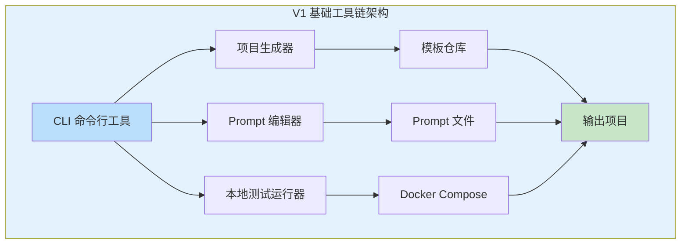
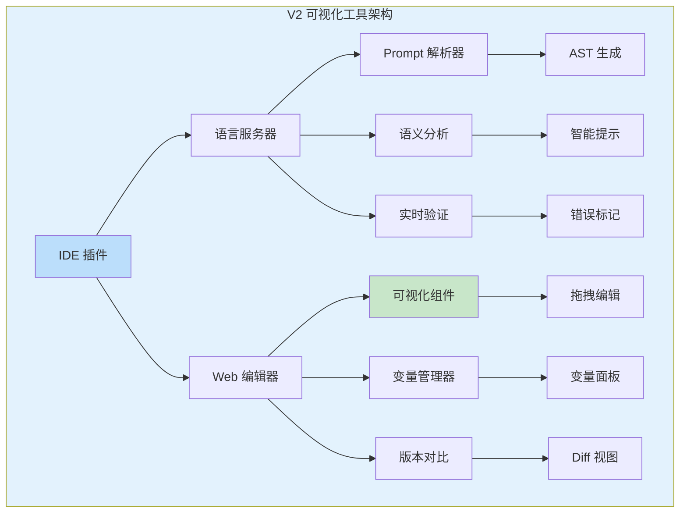
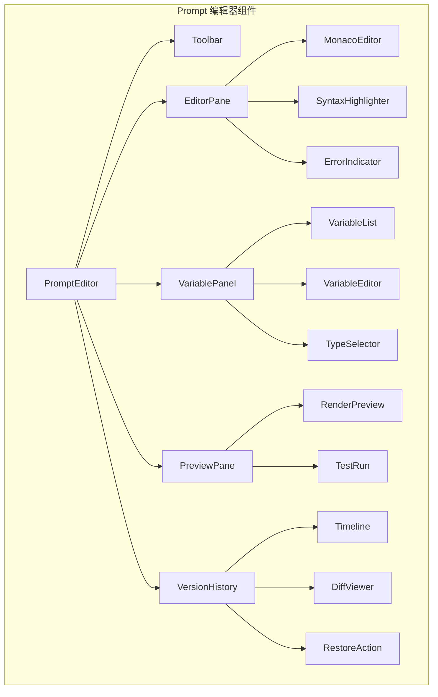
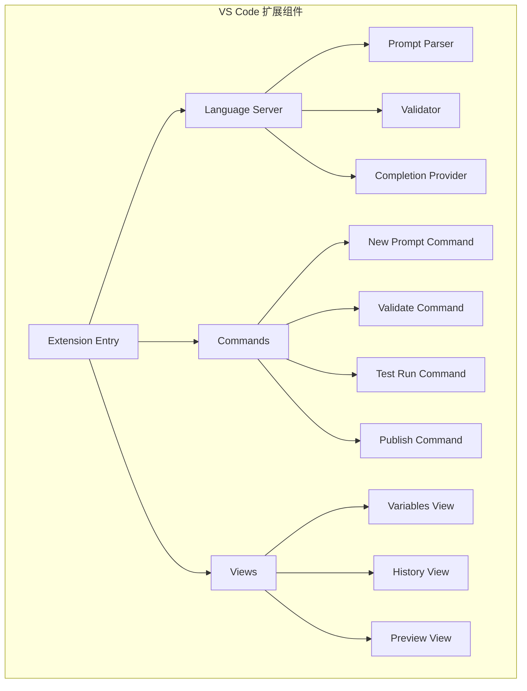
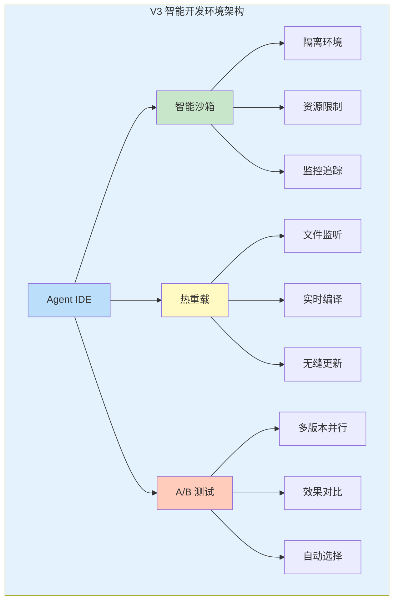
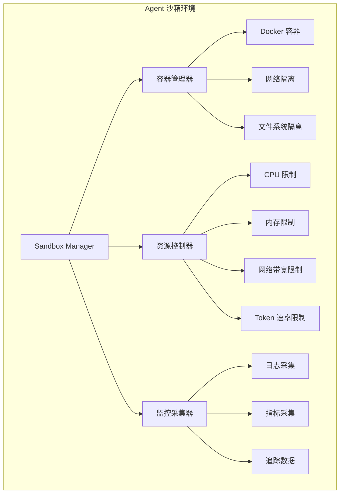
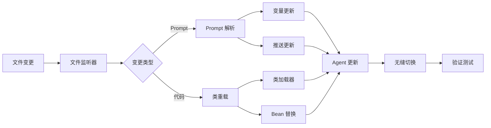
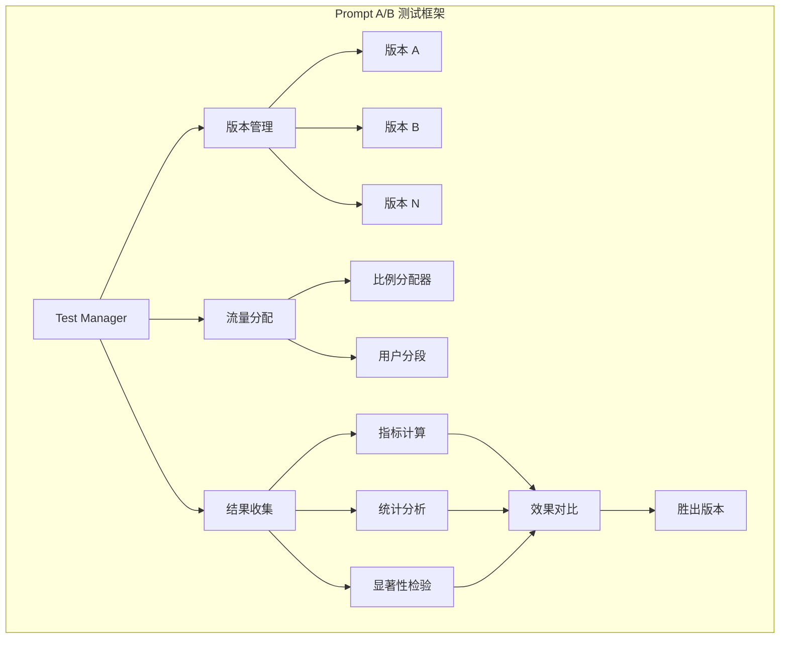
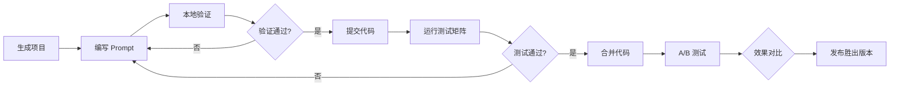

# Sprint 1: Agent 开发工具链

## 概述

Sprint 1 聚焦于构建 Agent 开发的基础工具链，旨在提升开发效率、标准化开发流程、降低 Agent 开发门槛。通过提供项目脚手架、Prompt 编辑器、版本管理和沙箱环境，开发者可以快速启动 Agent 项目并高效迭代。

**核心目标**：

- 从零到一启动 Agent 项目时间从 2 天缩短到 10 分钟
- 提供 Prompt 可视化编辑能力，减少 80% 的 Prompt 语法错误
- 建立标准化的版本管理流程，支持 Prompt 和代码的协同版本控制
- 提供隔离的沙箱环境，支持本地快速验证和测试

## V1: 基础工具链

### V1 架构设计



### AgentProjectGenerator 实现

V1 的核心是 `AgentProjectGenerator`，负责根据用户选择生成标准化的 Agent 项目结构。

**项目模板结构**：

```
agent-project-template/
├── src/main/java/
│   └── com/example/agent/
│       ├── AgentApplication.java       # 应用入口
│       ├── agent/
│       │   ├── AgentOrchestrator.java  # Agent 编排器
│       │   ├── ToolExecutor.java       # 工具执行器
│       │   └── ChatMemory.java         # 记忆管理
│       ├── config/
│       │   ├── LangChainConfig.java    # LLM 配置
│       │   └── ToolConfig.java         # 工具配置
│       └── prompts/
│           ├── system_prompt.tmpl      # 系统 Prompt 模板
│           └── tool_descriptions.json  # 工具描述
├── src/main/resources/
│   ├── application.yml                 # 应用配置
│   └── prompts/                        # Prompt 资源文件
└── src/test/java/
    └── com/example/agent/
        └── AgentEvaluationTest.java    # 评估测试
```

**Java 实现代码**：

```java
package com.agentforge.generator.core;

import lombok.Builder;
import lombok.Data;
import org.springframework.stereotype.Service;
import freemarker.template.Configuration;
import freemarker.template.Template;

import java.io.File;
import java.io.FileWriter;
import java.io.Writer;
import java.util.Map;
import java.util.HashMap;

/**
 * Agent 项目生成器核心服务
 * 
 * 功能：
 * 1. 根据用户选择生成项目脚手架
 * 2. 支持多种框架模板（Spring Boot、Quarkus、Micronaut）
 * 3. 自动配置 LLM 集成（OpenAI、Anthropic、Azure）
 * 4. 生成基础代码结构和测试模板
 * 
 * @author AgentForgeOps Team
 * @version 1.0.0
 */
@Service
public class AgentProjectGenerator {
    
    private final Configuration freemarkerConfig;
    private final TemplateRegistry templateRegistry;
    
    /**
     * 生成 Agent 项目
     * 
     * @param request 项目生成请求
     * @return 生成结果
     */
    public GenerationResult generate(GenerationRequest request) {
        try {
            // 1. 验证请求参数
            validateRequest(request);
            
            // 2. 选择合适的模板
            ProjectTemplate template = selectTemplate(request);
            
            // 3. 准备模板变量
            Map<String, Object> templateVariables = prepareVariables(request);
            
            // 4. 创建项目目录结构
            File projectRoot = createProjectStructure(request.getProjectName());
            
            // 5. 渲染并生成所有文件
            generateFiles(template, templateVariables, projectRoot);
            
            // 6. 生成配置文件
            generateConfigurations(request, projectRoot);
            
            // 7. 初始化 Git 仓库
            initializeGitRepository(projectRoot);
            
            return GenerationResult.success(projectRoot.getAbsolutePath());
            
        } catch (Exception e) {
            return GenerationResult.failure(e.getMessage());
        }
    }
    
    /**
     * 项目生成请求
     */
    @Data
    @Builder
    public static class GenerationRequest {
        private String projectName;
        private String groupId;
        private String artifactId;
        private Framework framework;
        private LlmProvider llmProvider;
        private String llmModel;
        private String packageName;
        private boolean includeMemory;
        private boolean includeTools;
        private List<String> tools;
    }
    
    /**
     * 支持的框架
     */
    public enum Framework {
        SPRING_BOOT("spring-boot", "Spring Boot 3.x"),
        QUARKUS("quarkus", "Quarkus 3.x"),
        MICRONAUT("micronaut", "Micronaut 4.x");
        
        private final String code;
        private final String description;
        
        Framework(String code, String description) {
            this.code = code;
            this.description = description;
        }
    }
    
    /**
     * LLM 提供商
     */
    public enum LlmProvider {
        OPENAI("OpenAI", "gpt-4", "gpt-3.5-turbo"),
        ANTHROPIC("Anthropic", "claude-3-opus-20240229", "claude-3-sonnet-20240229"),
        AZURE("Azure OpenAI", "gpt-4", "gpt-35-turbo");
        
        private final String name;
        private final String defaultModel;
        private final String fallbackModel;
        
        LlmProvider(String name, String defaultModel, String fallbackModel) {
            this.name = name;
            this.defaultModel = defaultModel;
            this.fallbackModel = fallbackModel;
        }
    }
    
    /**
     * 生成结果
     */
    @Data
    @Builder
    public static class GenerationResult {
        private boolean success;
        private String projectPath;
        private String message;
        private List<String> generatedFiles;
        
        public static GenerationResult success(String projectPath) {
            return GenerationResult.builder()
                .success(true)
                .projectPath(projectPath)
                .message("Project generated successfully")
                .build();
        }
        
        public static GenerationResult failure(String message) {
            return GenerationResult.builder()
                .success(false)
                .message(message)
                .build();
        }
    }
    
    // 私有辅助方法
    
    private void validateRequest(GenerationRequest request) {
        if (request.getProjectName() == null || request.getProjectName().isBlank()) {
            throw new IllegalArgumentException("Project name is required");
        }
        if (request.getFramework() == null) {
            request.setFramework(Framework.SPRING_BOOT); // 默认框架
        }
        if (request.getLlmProvider() == null) {
            request.setLlmProvider(LlmProvider.OPENAI); // 默认提供商
        }
    }
    
    private ProjectTemplate selectTemplate(GenerationRequest request) {
        return templateRegistry.getTemplate(
            request.getFramework(),
            request.getLlmProvider()
        ).orElseThrow(() -> new TemplateNotFoundException(
            "No template found for framework: " + request.getFramework() +
            " and provider: " + request.getLlmProvider()
        ));
    }
    
    private Map<String, Object> prepareVariables(GenerationRequest request) {
        Map<String, Object> variables = new HashMap<>();
        variables.put("projectName", request.getProjectName());
        variables.put("groupId", request.getGroupId());
        variables.put("artifactId", request.getArtifactId());
        variables.put("packageName", request.getPackageName());
        variables.put("framework", request.getFramework());
        variables.put("llmProvider", request.getLlmProvider());
        variables.put("llmModel", request.getLlmModel());
        variables.put("includeMemory", request.isIncludeMemory());
        variables.put("includeTools", request.isIncludeTools());
        variables.put("tools", request.getTools() != null ? request.getTools() : List.of());
        variables.put("currentYear", java.time.Year.now().getValue());
        return variables;
    }
    
    private File createProjectStructure(String projectName) throws IOException {
        File projectRoot = new File(System.getProperty("user.dir"), projectName);
        if (projectRoot.exists()) {
            throw new IllegalStateException("Project directory already exists: " + projectName);
        }
        
        // 创建标准 Maven/Gradle 项目结构
        new File(projectRoot, "src/main/java").mkdirs();
        new File(projectRoot, "src/main/resources").mkdirs();
        new File(projectRoot, "src/test/java").mkdirs();
        new File(projectRoot, "src/test/resources").mkdirs();
        
        return projectRoot;
    }
    
    private void generateFiles(
        ProjectTemplate template, 
        Map<String, Object> variables,
        File projectRoot
    ) throws Exception {
        
        for (TemplateFile templateFile : template.getFiles()) {
            File targetFile = new File(projectRoot, templateFile.getTargetPath());
            targetFile.getParentFile().mkdirs();
            
            Template freemarkerTemplate = freemarkerConfig.getTemplate(
                templateFile.getTemplatePath()
            );
            
            try (Writer writer = new FileWriter(targetFile)) {
                freemarkerTemplate.process(variables, writer);
            }
        }
    }
    
    private void generateConfigurations(GenerationRequest request, File projectRoot) 
            throws Exception {
        // 生成 application.yml
        generateApplicationYaml(request, projectRoot);
        
        // 生成 pom.xml 或 build.gradle
        if (request.getFramework() == Framework.SPRING_BOOT) {
            generatePomXml(request, projectRoot);
        }
        
        // 生成 .gitignore
        generateGitIgnore(projectRoot);
        
        // 生成 README.md
        generateReadme(request, projectRoot);
    }
    
    private void initializeGitRepository(File projectRoot) throws Exception {
        ProcessBuilder pb = new ProcessBuilder("git", "init")
            .directory(projectRoot);
        Process process = pb.start();
        int exitCode = process.waitFor();
        if (exitCode != 0) {
            throw new RuntimeException("Failed to initialize git repository");
        }
    }
}
```

### Prompt 文本编辑器

V1 提供简单的文本 Prompt 编辑器，支持语法高亮和基础验证。

**Prompt 编辑器特性**：

```java
package com.agentforge.editor.service;

import org.springframework.stereotype.Service;
import lombok.Data;

import java.util.regex.Pattern;
import java.util.List;

/**
 * Prompt 编辑器服务
 * 
 * 功能：
 * 1. Prompt 语法高亮
 * 2. 变量识别和验证
 * 3. 基础格式检查
 * 4. Prompt 版本对比
 */
@Service
public class PromptEditorService {
    
    /**
     * 验证 Prompt 语法
     */
    public ValidationResult validatePrompt(String promptContent) {
        ValidationResult result = new ValidationResult();
        
        // 1. 检查变量语法
        List<String> variables = extractVariables(promptContent);
        result.setVariables(variables);
        
        // 2. 检查变量命名规范
        for (String variable : variables) {
            if (!isValidVariableName(variable)) {
                result.addError("Invalid variable name: " + variable);
            }
        }
        
        // 3. 检查 Prompt 长度
        if (promptContent.length() > getMaxPromptLength()) {
            result.addWarning("Prompt exceeds recommended length");
        }
        
        // 4. 检查特殊标记
        checkSpecialMarkers(promptContent, result);
        
        return result;
    }
    
    /**
     * 提取 Prompt 中的变量
     * 支持 {{variable}} 和 {variable} 两种格式
     */
    private List<String> extractVariables(String content) {
        List<String> variables = new ArrayList<>();
        
        // 匹配 {{variable}} 格式
        Pattern doubleBrace = Pattern.compile("\\{\\{([^}]+)\\}\\}");
        Matcher matcher1 = doubleBrace.matcher(content);
        while (matcher1.find()) {
            variables.add(matcher1.group(1).trim());
        }
        
        // 匹配 {variable} 格式
        Pattern singleBrace = Pattern.compile("\\{([^}]+)\\}");
        Matcher matcher2 = singleBrace.matcher(content);
        while (matcher2.find()) {
            String var = matcher2.group(1).trim();
            if (!variables.contains(var)) {
                variables.add(var);
            }
        }
        
        return variables;
    }
    
    /**
     * 验证结果
     */
    @Data
    public static class ValidationResult {
        private boolean valid = true;
        private List<String> errors = new ArrayList<>();
        private List<String> warnings = new ArrayList<>();
        private List<String> variables = new ArrayList<>();
        private int estimatedTokens;
        
        public void addError(String error) {
            this.errors.add(error);
            this.valid = false;
        }
        
        public void addWarning(String warning) {
            this.warnings.add(warning);
        }
    }
}
```

### 本地测试运行器

```java
package com.agentforge.runner.service;

import org.springframework.stereotype.Service;
import docker.Client;

/**
 * 本地测试运行器
 * 
 * 使用 Docker Compose 启动本地测试环境
 */
@Service
public class LocalTestRunner {
    
    private final DockerClient dockerClient;
    
    /**
     * 启动本地测试环境
     */
    public void startLocalEnvironment(AgentProject project) throws Exception {
        // 1. 生成 docker-compose.yml
        String composeContent = generateDockerCompose(project);
        Files.writeString(
            project.getRoot().resolve("docker-compose.yml"),
            composeContent
        );
        
        // 2. 启动容器
        dockerClient.composeUp(project.getRoot());
        
        // 3. 等待服务就绪
        awaitServicesReady(project);
    }
    
    /**
     * 运行本地测试
     */
    public TestResult runLocalTest(TestRequest request) throws Exception {
        // 1. 准备测试输入
        String testInput = prepareTestInput(request);
        
        // 2. 调用本地 Agent 服务
        String response = callLocalAgent(request.getAgentEndpoint(), testInput);
        
        // 3. 验证响应
        return validateResponse(response, request.getExpectedOutput());
    }
    
    private String generateDockerCompose(AgentProject project) {
        return """
            version: '3.8'
            services:
              agent:
                build: .
                ports:
                  - "8080:8080"
                environment:
                  - LLM_PROVIDER=${LLM_PROVIDER:-openai}
                  - LLM_API_KEY=${LLM_API_KEY}
                  - LLM_MODEL=${LLM_MODEL:-gpt-4}
                volumes:
                  - ./prompts:/app/prompts
                networks:
                  - agent-network
              
              redis:
                image: redis:7-alpine
                ports:
                  - "6379:6379"
                networks:
                  - agent-network
            
            networks:
              agent-network:
                driver: bridge
            """;
    }
}
```

## V2: 可视化编辑工具

### V2 架构设计



### Prompt 可视化编辑器

V2 提供基于 React 的 Web 端可视化 Prompt 编辑器。

**核心组件架构**：



**React 实现代码**：

```typescript
import React, { useState, useEffect, useCallback } from 'react';
import { useSelector, useDispatch } from 'react-redux';
import Editor from '@monaco-editor/react';
import { VariablePanel } from './VariablePanel';
import { PreviewPane } from './PreviewPane';
import { VersionHistory } from './VersionHistory';
import { validatePrompt, extractVariables } from '../services/promptParser';
import { savePrompt, loadPromptVersion } from '../api/promptApi';
import { 
  setPromptContent, 
  setVariables, 
  setErrors, 
  setWarnings 
} from '../store/promptEditorSlice';

interface PromptEditorProps {
  agentId: string;
  promptId: string;
  initialContent?: string;
}

/**
 * Prompt 可视化编辑器主组件
 * 
 * 特性：
 * 1. 实时语法验证和错误提示
 * 2. 变量提取和管理
 * 3. 版本历史和对比
 * 4. 实时预览
 */
export const PromptEditor: React.FC<PromptEditorProps> = ({
  agentId,
  promptId,
  initialContent = ''
}) => {
  const dispatch = useDispatch();
  
  // Redux 状态
  const content = useSelector((state: RootState) => state.promptEditor.content);
  const variables = useSelector((state: RootState) => state.promptEditor.variables);
  const errors = useSelector((state: RootState) => state.promptEditor.errors);
  const warnings = useSelector((state: RootState) => state.promptEditor.warnings);
  
  // 本地状态
  const [isDirty, setIsDirty] = useState(false);
  const [isValid, setIsValid] = useState(true);
  const [selectedVersion, setSelectedVersion] = useState<string | null>(null);

  /**
   * 内容变更处理
   */
  const handleContentChange = useCallback((value: string | undefined) => {
    const newContent = value || '';
    dispatch(setPromptContent(newContent));
    setIsDirty(true);
    
    // 实时验证
    const validationResult = validatePrompt(newContent);
    dispatch(setErrors(validationResult.errors));
    dispatch(setWarnings(validationResult.warnings));
    dispatch(setVariables(validationResult.variables));
    setIsValid(validationResult.valid);
  }, [dispatch]);

  /**
   * 保存 Prompt
   */
  const handleSave = async () => {
    if (!isValid) {
      // 显示错误提示
      return;
    }
    
    try {
      await savePrompt({
        agentId,
        promptId,
        content,
        variables,
        version: generateNextVersion()
      });
      setIsDirty(false);
    } catch (error) {
      console.error('Failed to save prompt:', error);
    }
  };

  /**
   * 加载历史版本
   */
  const handleLoadVersion = async (version: string) => {
    try {
      const versionData = await loadPromptVersion(agentId, promptId, version);
      dispatch(setPromptContent(versionData.content));
      dispatch(setVariables(versionData.variables));
      setSelectedVersion(version);
    } catch (error) {
      console.error('Failed to load version:', error);
    }
  };

  /**
   * 变量更新处理
   */
  const handleVariableUpdate = useCallback((updatedVariables: Variable[]) => {
    // 重新生成包含更新后变量的 Prompt 内容
    const newContent = updateVariablesInContent(content, updatedVariables);
    dispatch(setPromptContent(newContent));
    dispatch(setVariables(updatedVariables));
    setIsDirty(true);
  }, [content, dispatch]);

  return (
    <div className="prompt-editor-container">
      {/* 工具栏 */}
      <EditorToolbar
        onSave={handleSave}
        isDirty={isDirty}
        isValid={isValid}
        canUndo={canUndo}
        canRedo={canRedo}
        onUndo={handleUndo}
        onRedo={handleRedo}
      />
      
      {/* 主编辑区域 */}
      <div className="editor-main">
        {/* Monaco 编辑器 */}
        <div className="editor-pane">
          <Editor
            height="600px"
            defaultLanguage="prompt"
            value={content}
            onChange={handleContentChange}
            options={{
              minimap: { enabled: false },
              scrollBeyondLastLine: false,
              fontSize: 14,
              lineNumbers: 'on',
              wordWrap: 'on',
              automaticLayout: true,
              suggest: {
                showKeywords: true,
                showSnippets: true
              },
              quickSuggestions: {
                other: true,
                comments: false,
                strings: false
              }
            }}
            beforeMount={(monaco) => {
              // 注册 Prompt 语言
              registerPromptLanguage(monaco);
            }}
          />
          
          {/* 错误和警告显示 */}
          <ValidationPanel
            errors={errors}
            warnings={warnings}
          />
        </div>
        
        {/* 变量面板 */}
        <VariablePanel
          variables={variables}
          onUpdateVariables={handleVariableUpdate}
        />
      </div>
      
      {/* 预览面板 */}
      <PreviewPane
        content={content}
        variables={variables}
      />
      
      {/* 版本历史 */}
      <VersionHistory
        promptId={promptId}
        selectedVersion={selectedVersion}
        onLoadVersion={handleLoadVersion}
      />
    </div>
  );
};

/**
 * 注册 Prompt 语言支持
 */
function registerPromptLanguage(monaco: any): void {
  // 注册语言
  monaco.languages.register({ id: 'prompt' });
  
  // 定义语言配置
  monaco.languages.setLanguageConfiguration('prompt', {
    comments: {
      lineComment: '//',
      blockComment: ['/*', '*/']
    },
    brackets: [
      ['{', '}'],
      ['[', ']'],
      ['(', ')']
    ],
    autoClosingPairs: [
      { open: '{', close: '}' },
      { open: '[', close: ']' },
      { open: '(', close: ')' },
      { open: '"', close: '"' },
      { open: "'", close: "'" }
    ]
  });
  
  // 定义语法高亮规则
  monaco.languages.setMonarchTokensProvider('prompt', {
    tokenizer: {
      root: [
        // 变量 {{variable}}
        [/\{\{[^\}]+\}\}/, 'variable'],
        
        // 注释
        [/\/\/.*$/, 'comment'],
        [/\/\*/, 'comment', '@comment'],
        
        // 系统指令
        [/\b(SYSTEM|USER|ASSISTANT|TOOL)\b/, 'keyword'],
        
        // 特殊标记
        [/\b(REQUIRE|ENSURE|EXAMPLE|FORMAT)\b/, 'type'],
        
        // 字符串
        ["\"", 'string', '@string'],
        
        // 数字
        [/\d+/, 'number']
      ],
      
      comment: [
        [/\*\//, 'comment', '@pop'],
        [/./, 'comment']
      ],
      
      string: [
        [/"/, 'string', '@pop'],
        [/./, 'string']
      ]
    }
  });
  
  // 提供智能提示
  monaco.languages.registerCompletionItemProvider('prompt', {
    provideCompletionItems: (model: any, position: any) => {
      const word = model.getWordUntilPosition(position);
      const range = {
        startLineNumber: position.lineNumber,
        endLineNumber: position.lineNumber,
        startColumn: word.startColumn,
        endColumn: word.endColumn
      };
      
      return {
        suggestions: [
          {
            label: 'SYSTEM',
            kind: monaco.languages.CompletionItemKind.Keyword,
            insertText: 'SYSTEM',
            range: range
          },
          {
            label: '{{user_name}}',
            kind: monaco.languages.CompletionItemKind.Variable,
            insertText: '{{user_name}}',
            range: range,
            detail: '用户名变量'
          },
          {
            label: '{{current_date}}',
            kind: monaco.languages.CompletionItemKind.Variable,
            insertText: '{{current_date}}',
            range: range,
            detail: '当前日期变量'
          }
        ]
      };
    }
  });
}
```

### IDE 插件集成

V2 提供 VS Code 插件，支持直接在 IDE 中编辑 Prompt。

**VS Code 扩展架构**：



**TypeScript 实现代码**：

```typescript
import * as vscode from 'vscode';
import { 
  PromptLanguageServer, 
  PromptCompletionProvider,
  PromptDiagnosticsProvider 
} from './languageServer';

/**
 * VS Code Prompt 编辑器扩展主类
 */
export class PromptEditorExtension {
  
  private languageServer: PromptLanguageServer;
  private completionProvider: PromptCompletionProvider;
  private diagnosticsProvider: PromptDiagnosticsProvider;
  
  constructor(private context: vscode.ExtensionContext) {
    this.languageServer = new PromptLanguageServer();
    this.completionProvider = new PromptCompletionProvider();
    this.diagnosticsProvider = new PromptDiagnosticsProvider();
  }
  
  /**
   * 激活扩展
   */
  public async activate(): Promise<void> {
    // 1. 注册语言服务器
    await this.languageServer.start();
    
    // 2. 注册完成提供程序
    this.registerCompletionProvider();
    
    // 3. 注册诊断提供程序
    this.registerDiagnosticsProvider();
    
    // 4. 注册命令
    this.registerCommands();
    
    // 5. 注册视图
    this.registerViews();
    
    console.log('Prompt Editor Extension activated');
  }
  
  /**
   * 注册命令
   */
  private registerCommands(): void {
    // 创建新 Prompt
    vscode.commands.registerCommand(
      'promptEditor.newPrompt',
      this.createNewPrompt.bind(this)
    );
    
    // 验证 Prompt
    vscode.commands.registerCommand(
      'promptEditor.validate',
      this.validateCurrentPrompt.bind(this)
    );
    
    // 运行测试
    vscode.commands.registerCommand(
      'promptEditor.testRun',
      this.runPromptTest.bind(this)
    );
    
    // 发布 Prompt
    vscode.commands.registerCommand(
      'promptEditor.publish',
      this.publishPrompt.bind(this)
    );
    
    // 显示变量面板
    vscode.commands.registerCommand(
      'promptEditor.showVariables',
      this.showVariablesPanel.bind(this)
    );
  }
  
  /**
   * 注册视图
   */
  private registerViews(): void {
    // 变量视图
    const variablesProvider = new VariablesProvider();
    vscode.window.registerTreeDataProvider(
      'promptEditor.variables',
      variablesProvider
    );
    
    // 历史版本视图
    const historyProvider = new HistoryProvider();
    vscode.window.registerTreeDataProvider(
      'promptEditor.history',
      historyProvider
    );
  }
  
  /**
   * 创建新 Prompt
   */
  private async createNewPrompt(): Promise<void> {
    const promptName = await vscode.window.showInputBox({
      prompt: 'Enter prompt name',
      placeHolder: 'my-prompt'
    });
    
    if (!promptName) {
      return;
    }
    
    const template = this.getNewPromptTemplate(promptName);
    const document = await vscode.workspace.openTextDocument({
      language: 'prompt',
      content: template
    });
    
    await vscode.window.showTextDocument(document);
  }
  
  /**
   * 验证当前 Prompt
   */
  private async validateCurrentPrompt(): Promise<void> {
    const editor = vscode.window.activeTextEditor;
    if (!editor) {
      vscode.window.showWarningMessage('No active prompt editor');
      return;
    }
    
    const content = editor.document.getText();
    const diagnostics = await this.diagnosticsProvider.validate(content, editor.document);
    
    // 显示诊断结果
    vscode.languages.setTextDocumentDiagnostics(editor.document.uri, diagnostics);
    
    // 显示通知
    const errorCount = diagnostics.filter(d => d.severity === vscode.DiagnosticSeverity.Error).length;
    const warningCount = diagnostics.filter(d => d.severity === vscode.DiagnosticSeverity.Warning).length;
    
    vscode.window.showInformationMessage(
      `Validation complete: ${errorCount} errors, ${warningCount} warnings`
    );
  }
  
  /**
   * 获取新 Prompt 模板
   */
  private getNewPromptTemplate(name: string): string {
    return `// ${name}
// Created with AgentForgeOps Prompt Editor

SYSTEM:
You are a helpful AI assistant.

USER:
{{user_input}}

ASSISTANT:
`;
  }
}
```

## V3: 智能开发环境

### V3 架构设计



### Agent 沙箱环境

V3 提供完整的 Agent 沙箱，支持隔离测试和资源监控。

**沙箱架构**：



**Java 实现代码**：

```java
package com.agentforge.sandbox.service;

import org.springframework.stereotype.Service;
import com.github.dockerjava.api.DockerClient;
import com.github.dockerjava.api.command.*;
import io.fabric8.kubernetes.api.model.*;
import io.fabric8.kubernetes.client.KubernetesClient;

import java.util.Map;
import java.util.HashMap;

/**
 * Agent 沙箱管理服务
 * 
 * 功能：
 * 1. 创建隔离的容器/K8s Pod 环境
 * 2. 资源限制（CPU、内存、网络、Token 速率）
 * 3. 实时监控和日志采集
 * 4. 自动清理和资源回收
 */
@Service
public class AgentSandboxManager {
    
    private final DockerClient dockerClient;
    private final KubernetesClient k8sClient;
    private final SandboxMonitor monitor;
    
    /**
     * 创建沙箱环境
     */
    public SandboxEnvironment createSandbox(SandboxRequest request) {
        // 1. 生成唯一沙箱 ID
        String sandboxId = generateSandboxId();
        
        // 2. 准备资源限制
        ResourceLimits limits = ResourceLimits.builder()
            .cpu(request.getCpuLimit())
            .memory(request.getMemoryLimit())
            .networkBandwidth(request.getNetworkBandwidth())
            .tokenRate(request.getTokenRateLimit())
            .build();
        
        // 3. 创建容器/Pod
        ContainerConfig containerConfig = buildContainerConfig(request, limits);
        String containerId = createContainer(containerConfig);
        
        // 4. 设置网络隔离
        setupNetworkIsolation(containerId, request.getNetworkPolicy());
        
        // 5. 启动监控
        monitor.startMonitoring(sandboxId, containerId);
        
        // 6. 返回沙箱环境信息
        return SandboxEnvironment.builder()
            .sandboxId(sandboxId)
            .containerId(containerId)
            .status(SandboxStatus.STARTING)
            .endpoint(getSandboxEndpoint(containerId))
            .limits(limits)
            .build();
    }
    
    /**
     * 启动沙箱中的 Agent
     */
    public void startAgent(SandboxEnvironment sandbox, AgentConfig config) {
        // 1. 注入 Agent 配置
        String[] envVars = prepareEnvironmentVariables(config);
        
        // 2. 挂载 Prompt 文件
        mountPromptFiles(sandbox.getContainerId(), config.getPrompts());
        
        // 3. 启动 Agent 进程
        executeCommand(sandbox.getContainerId(), 
            "java -jar /app/agent.jar"
        );
        
        // 4. 等待 Agent 就绪
        awaitAgentReady(sandbox.getEndpoint());
        
        // 5. 更新状态
        sandbox.setStatus(SandboxStatus.RUNNING);
    }
    
    /**
     * 执行沙箱测试
     */
    public SandboxTestResult executeTest(SandboxEnvironment sandbox, TestCase testCase) {
        // 1. 记录测试开始时间
        long startTime = System.currentTimeMillis();
        
        // 2. 发送测试输入
        TestInput input = prepareTestInput(testCase);
        String response = callAgent(sandbox.getEndpoint(), input);
        
        // 3. 记录测试结束时间和资源使用
        long endTime = System.currentTimeMillis();
        ResourceUsage usage = monitor.getResourceUsage(sandbox.getSandboxId());
        
        // 4. 验证响应
        ValidationResult validation = validateResponse(response, testCase.getExpectedOutput());
        
        // 5. 收集追踪数据
        TraceData trace = monitor.collectTrace(sandbox.getSandboxId());
        
        return SandboxTestResult.builder()
            .testCase(testCase)
            .response(response)
            .validation(validation)
            .duration(endTime - startTime)
            .resourceUsage(usage)
            .traceData(trace)
            .build();
    }
    
    /**
     * 销毁沙箱环境
     */
    public void destroySandbox(String sandboxId) {
        SandboxEnvironment sandbox = getSandbox(sandboxId);
        
        // 1. 停止监控
        monitor.stopMonitoring(sandboxId);
        
        // 2. 导出日志和追踪数据
        exportSandboxData(sandbox);
        
        // 3. 停止并删除容器
        dockerClient.stopContainerCmd(sandbox.getContainerId()).exec();
        dockerClient.removeContainerCmd(sandbox.getContainerId()).exec();
        
        // 4. 清理网络资源
        cleanupNetworkResources(sandbox);
        
        // 5. 删除沙箱记录
        removeSandbox(sandboxId);
    }
    
    /**
     * 资源限制配置
     */
    @Data
    @Builder
    public static class ResourceLimits {
        private double cpu;              // CPU 核心数
        private long memory;            // 内存字节数
        private long networkBandwidth;  // 网络带宽 bps
        private int tokenRate;         // Token 速率 tpm
    }
    
    /**
     * 沙箱环境信息
     */
    @Data
    @Builder
    public static class SandboxEnvironment {
        private String sandboxId;
        private String containerId;
        private SandboxStatus status;
        private String endpoint;
        private ResourceLimits limits;
        private Map<String, String> metadata;
    }
    
    /**
     * 沙箱状态
     */
    public enum SandboxStatus {
        CREATING,
        STARTING,
        RUNNING,
        STOPPING,
        STOPPED,
        ERROR
    }
}
```

### 热重载机制

V3 支持代码和 Prompt 的热重载，无需重启即可看到变更效果。

**热重载架构**：



**Java 实现代码**：

```java
package com.agentforge.reload.service;

import org.springframework.stereotype.Service;
import org.springframework.context.ConfigurableApplicationContext;
import org.springframework.devtools.restart.classloader.RestartClassLoader;

import java.nio.file.*;
import java.util.Map;
import java.util.concurrent.ConcurrentHashMap;

/**
 * 热重载服务
 * 
 * 功能：
 * 1. 监听文件系统变更
 * 2. 自动解析 Prompt 变更
 * 3. 类热重载
 * 4. Bean 动态替换
 */
@Service
public class HotReloadService {
    
    private final ConfigurableApplicationContext context;
    private final PromptUpdateNotifier notifier;
    private final Map<String, Object> reloadableBeans = new ConcurrentHashMap<>();
    private WatchService watchService;
    
    /**
     * 启动文件监听
     */
    public void startWatching(String projectPath) throws Exception {
        watchService = FileSystems.getDefault().newWatchService();
        
        // 监听 prompts 目录
        Path promptsPath = Paths.get(projectPath, "src/main/resources/prompts");
        promptsPath.register(watchService, 
            StandardWatchEventKinds.ENTRY_CREATE,
            StandardWatchEventKinds.ENTRY_MODIFY,
            StandardWatchEventKinds.ENTRY_DELETE
        );
        
        // 启动监听线程
        Thread watcherThread = new Thread(() -> {
            while (true) {
                try {
                    WatchKey key = watchService.take();
                    handleEvents(key);
                    key.reset();
                } catch (Exception e) {
                    Thread.currentThread().interrupt();
                    break;
                }
            }
        }, "Prompt-Watcher");
        
        watcherThread.setDaemon(true);
        watcherThread.start();
    }
    
    /**
     * 处理文件变更事件
     */
    private void handleEvents(WatchKey key) throws Exception {
        for (WatchEvent<?> event : key.pollEvents()) {
            WatchEvent.Kind<?> kind = event.kind();
            
            if (kind == StandardWatchEventKinds.OVERFLOW) {
                continue;
            }
            
            @SuppressWarnings("unchecked")
            WatchEvent<Path> ev = (WatchEvent<Path>) event;
            Path filename = ev.context();
            
            Path fullPath = ((Path) key.watchable()).resolve(filename);
            
            if (fullPath.toString().endsWith(".prompt")) {
                if (kind == StandardWatchEventKinds.ENTRY_MODIFY) {
                    handlePromptModification(fullPath);
                }
            } else if (fullPath.toString().endsWith(".class")) {
                if (kind == StandardWatchEventKinds.ENTRY_MODIFY) {
                    handleClassModification(fullPath);
                }
            }
        }
    }
    
    /**
     * 处理 Prompt 修改
     */
    private void handlePromptModification(Path promptFile) throws Exception {
        // 1. 读取新内容
        String newContent = Files.readString(promptFile);
        
        // 2. 解析变量
        Map<String, Object> newVariables = parseVariables(newContent);
        
        // 3. 验证 Prompt
        ValidationResult validation = validatePrompt(newContent);
        if (!validation.isValid()) {
            notifier.notifyError("Invalid prompt: " + validation.getErrors());
            return;
        }
        
        // 4. 通知所有订阅的 Agent 更新
        notifier.notifyPromptUpdate(
            promptFile.getFileName().toString(),
            newContent,
            newVariables
        );
        
        // 5. 记录变更
        logReloadEvent("Prompt", promptFile.toString());
    }
    
    /**
     * 处理类修改
     */
    private void handleClassModification(Path classFile) throws Exception {
        // 1. 获取类名
        String className = getClassName(classFile);
        
        // 2. 检查是否是可重载的 Bean
        if (!reloadableBeans.containsKey(className)) {
            return;
        }
        
        // 3. 重新加载类
        ClassLoader classLoader = context.getBean(RestartClassLoader.class);
        Class<?> newClass = classLoader.loadClass(className);
        
        // 4. 替换 Bean
        Object oldBean = reloadableBeans.get(className);
        Object newBean = context.getBeanFactory().createBean(newClass);
        context.getBeanFactory().registerSingleton(className, newBean);
        
        // 5. 触发初始化回调
        if (newBean instanceof InitializingBean) {
            ((InitializingBean) newBean).afterPropertiesSet();
        }
        
        // 6. 记录变更
        logReloadEvent("Class", className);
        
        // 7. 通知更新
        notifier.notifyClassUpdate(className, newBean);
    }
    
    /**
     * 注册可重载 Bean
     */
    public void registerReloadableBean(String beanName, Object bean) {
        reloadableBeans.put(beanName, bean);
    }
}
```

### Prompt A/B 测试

V3 支持在开发环境中对 Prompt 进行 A/B 测试对比。

**A/B 测试架构**：



**Java 实现代码**：

```java
package com.agentforge.abtest.service;

import org.springframework.stereotype.Service;
import lombok.Data;

import java.util.Map;
import java.util.HashMap;
import java.util.concurrent.ThreadLocalRandom;

/**
 * Prompt A/B 测试服务
 * 
 * 功能：
 * 1. 管理多个 Prompt 版本
 * 2. 按比例分配测试流量
 * 3. 收集和对比效果指标
 * 4. 统计显著性检验
 */
@Service
public class PromptAbTestService {
    
    private final Map<String, AbTestExperiment> experiments = new ConcurrentHashMap<>();
    private final MetricsCollector metricsCollector;
    
    /**
     * 创建 A/B 测试实验
     */
    public AbTestExperiment createExperiment(AbTestConfig config) {
        String experimentId = generateExperimentId();
        
        AbTestExperiment experiment = AbTestExperiment.builder()
            .experimentId(experimentId)
            .name(config.getName())
            .status(ExperimentStatus.RUNNING)
            .variants(config.getVariants())
            .trafficAllocation(config.getTrafficAllocation())
            .startTime(System.currentTimeMillis())
            .build();
        
        experiments.put(experimentId, experiment);
        return experiment;
    }
    
    /**
     * 分配实验版本
     */
    public String assignVariant(String experimentId, String userId) {
        AbTestExperiment experiment = experiments.get(experimentId);
        if (experiment == null || !experiment.isRunning()) {
            return null;
        }
        
        // 1. 检查用户是否已分配（确保一致性）
        String cachedVariant = getUserAssignment(experimentId, userId);
        if (cachedVariant != null) {
            return cachedVariant;
        }
        
        // 2. 按比例随机分配
        String variant = allocateVariant(experiment);
        
        // 3. 记录分配
        recordAssignment(experimentId, userId, variant);
        
        return variant;
    }
    
    /**
     * 记录实验指标
     */
    public void recordMetric(
        String experimentId,
        String variantId,
        String userId,
        MetricData metric
    ) {
        AbTestExperiment experiment = experiments.get(experimentId);
        if (experiment == null) {
            return;
        }
        
        // 1. 记录指标
        metricsCollector.record(
            experimentId,
            variantId,
            userId,
            metric
        );
        
        // 2. 检查是否达到统计显著性
        if (shouldCheckSignificance(experiment)) {
            checkSignificance(experiment);
        }
    }
    
    /**
     * 获取实验结果
     */
    public AbTestResult getResult(String experimentId) {
        AbTestExperiment experiment = experiments.get(experimentId);
        if (experiment == null) {
            throw new ExperimentNotFoundException(experimentId);
        }
        
        // 1. 获取各版本的指标
        Map<String, VariantMetrics> variantMetrics = new HashMap<>();
        for (ExperimentVariant variant : experiment.getVariants()) {
            VariantMetrics metrics = metricsCollector.getMetrics(
                experimentId,
                variant.getVariantId()
            );
            variantMetrics.put(variant.getVariantId(), metrics);
        }
        
        // 2. 执行统计检验
        StatisticalTestResult testResult = performStatisticalTest(
            experiment.getSuccessMetric(),
            variantMetrics
        );
        
        // 3. 生成推荐
        String recommendedVariant = recommendVariant(
            experiment,
            variantMetrics,
            testResult
        );
        
        return AbTestResult.builder()
            .experimentId(experimentId)
            .variantMetrics(variantMetrics)
            .statisticalTest(testResult)
            .recommendedVariant(recommendedVariant)
            .build();
    }
    
    /**
     * 实验配置
     */
    @Data
    @Builder
    public static class AbTestConfig {
        private String name;
        private List<ExperimentVariant> variants;
        private Map<String, Double> trafficAllocation;
        private String successMetric;      // 主要成功指标
        private long minSampleSize;        // 最小样本量
        private double confidenceLevel;    // 置信水平
    }
    
    /**
     * 实验版本
     */
    @Data
    @Builder
    public static class ExperimentVariant {
        private String variantId;
        private String name;
        private String promptContent;
        private Map<String, Object> config;
    }
    
    /**
     * 指标数据
     */
    @Data
    @Builder
    public static class MetricData {
        private String metricName;
        private double value;
        private Map<String, String> metadata;
    }
    
    /**
     * 版本指标统计
     */
    @Data
    @Builder
    public static class VariantMetrics {
        private String variantId;
        private long sampleSize;
        private Map<String, MetricStats> metrics;
    }
    
    /**
     * 指标统计
     */
    @Data
    @Builder
    public static class MetricStats {
        private String metricName;
        private double mean;
        private double variance;
        private double min;
        private double max;
        private double percentile95;
    }
    
    /**
     * 实验状态
     */
    public enum ExperimentStatus {
        CREATING,
        RUNNING,
        PAUSED,
        COMPLETED,
        ARCHIVED
    }
}
```

## 架构演进总结

| 能力 | V1 | V2 | V3 |
|------|----|----|----|
| **项目生成** | CLI 脚手架 | IDE 集成 | 智能推荐模板 |
| **Prompt 编辑** | 文本编辑器 | 可视化编辑器 | 协同编辑 + AI 辅助 |
| **版本管理** | Git 基础 | 可视化对比 | 分支管理 + 自动合并 |
| **测试环境** | Docker Compose | 隔离沙箱 | 智能沙箱 + 自动扩展 |
| **热更新** | 不支持 | 支持 Prompt | 全栈热重载 |
| **A/B 测试** | 不支持 | 基础支持 | 完整 A/B 框架 |

## 最佳实践

### Prompt 编码规范

```markdown
# Prompt 文件命名规范

- 使用 kebab-case 命名：`customer-service.prompt`
- 按功能模块组织目录结构
- 版本信息通过 Git 标签管理

# Prompt 模板规范

```prompt
// {{prompt_name}}
// Version: {{version}}
// Author: {{author}}
// Description: {{description}}

SYSTEM:
{{system_message}}

CONTEXT:
{{context_information}}

INSTRUCTIONS:
{{instructions}}

EXAMPLES:
{{few_shot_examples}}

FORMAT:
{{output_format}}
```

### 项目结构最佳实践

```
agent-project/
├── prompts/                    # Prompt 文件目录
│   ├── system/                # 系统 Prompts
│   │   ├── default.prompt
│   │   └── specialized.prompt
│   ├── tools/                 # 工具描述 Prompts
│   └── templates/             # Prompt 模板
├── src/
│   ├── main/
│   │   ├── java/
│   │   └── resources/
│   └── test/
│       ├── java/
│       └── resources/
│           └── golden-sets/  # 评估集
├── tests/                     # 测试配置
│   ├── test-matrix.json      # 测试矩阵配置
│   └── ab-tests/             # A/B 测试配置
└── scripts/                   # 开发脚本
    ├── dev.sh               # 开发环境启动
    └── test.sh              # 测试运行
```

### 开发工作流



## 参考资源

- [Spring Boot Developer Tools](https://docs.spring.io/spring-boot/docs/current/reference/html/using.html#using.devtools)
- [Monaco Editor API](https://microsoft.github.io/monaco-editor/api/index.html)
- [VS Code Extension API](https://code.visualstudio.com/api)
- [Docker Java API](https://github.com/docker-java/docker-java)
