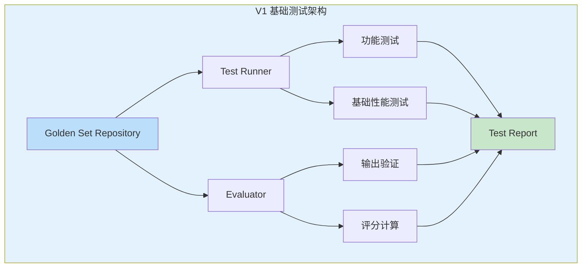
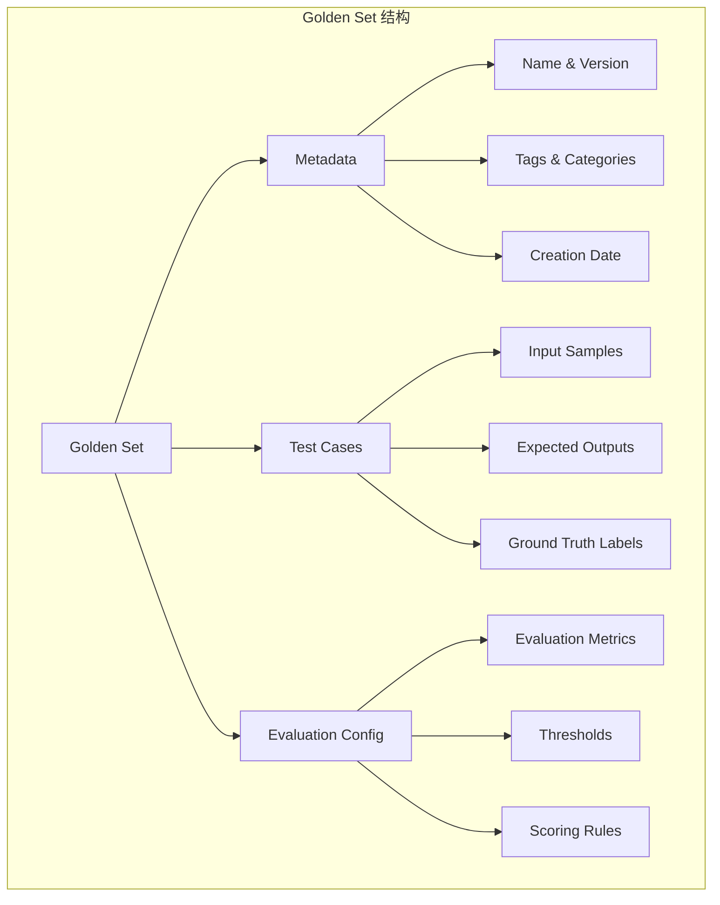
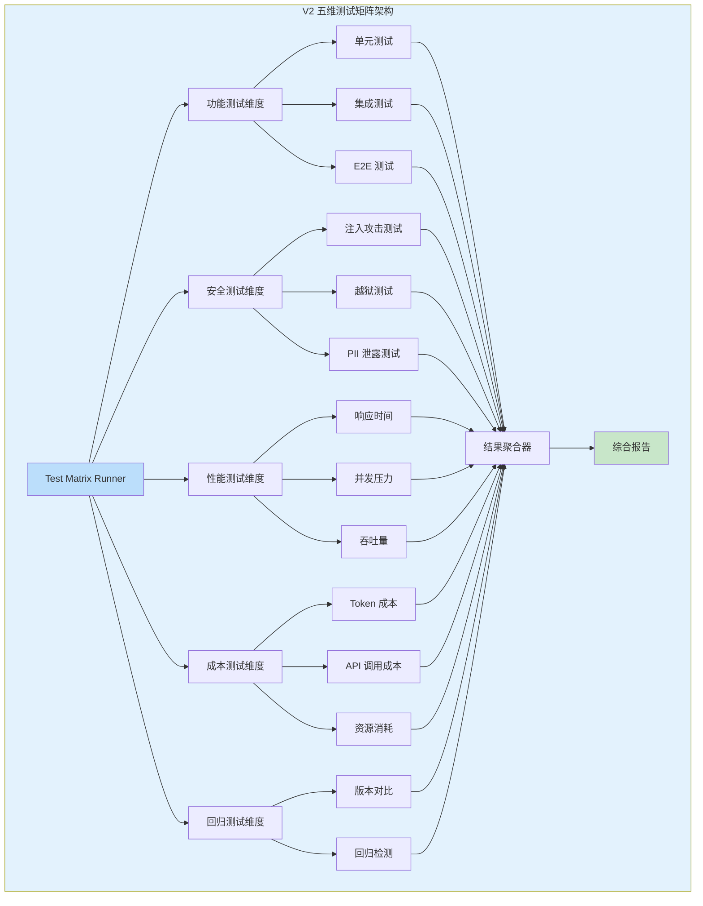
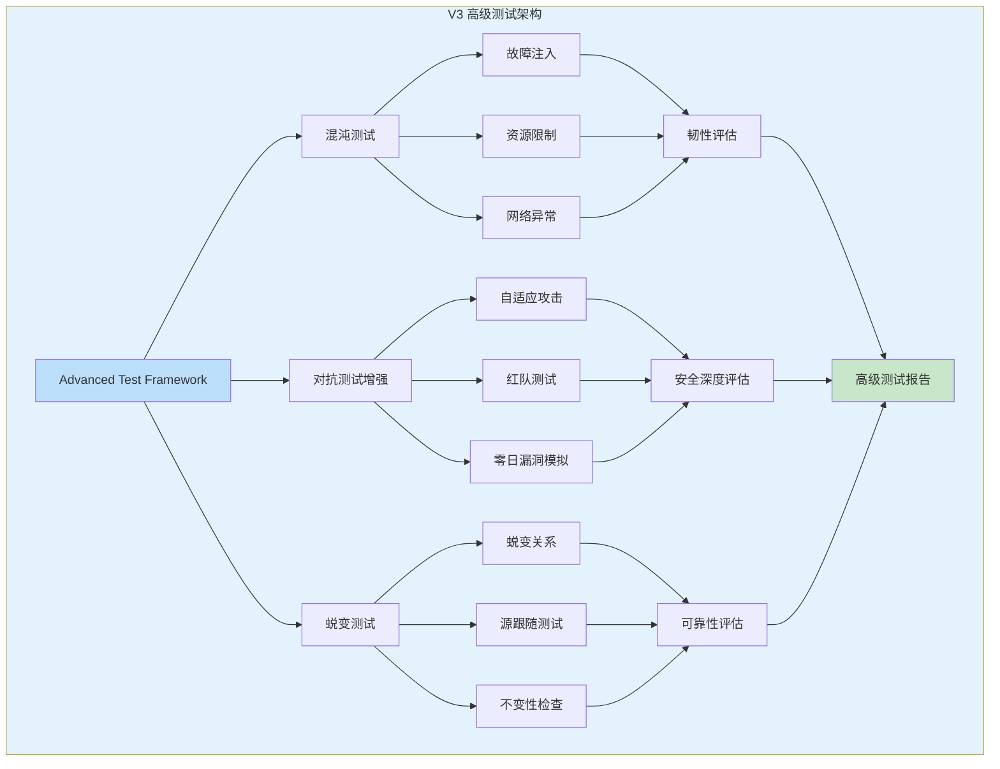
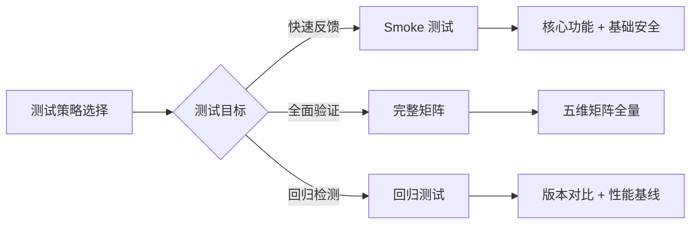

# Sprint 2: Agent 测试矩阵

## 概述

Sprint 2 聚焦于建立 Agent 质量保障的多维测试体系。传统软件测试侧重于确定性输出的验证，而 Agent 应用由于 LLM 的概率性特性，需要一套全新的测试方法论。本 Sprint 构建"五维测试矩阵"——功能、安全、性能、成本和回归五个维度，配合 Golden Set 管理和自动化测试编排，形成完整的 Agent 质量保障体系。

**核心目标**：

- 建立 Agent 评估的标准化方法论和 Golden Set 管理体系
- 实现五维测试矩阵的自动化执行和报告聚合
- 提供对抗测试和蜕变测试能力，覆盖边缘场景
- 支持测试结果的持续追踪和趋势分析

## V1: Golden Set 与基础测试

### V1 架构设计



### Golden Set 管理

Golden Set（黄金集）是 Agent 测试的基础，它定义了标准化的评估数据集和预期输出。

**Golden Set 结构设计**：



**Java 实现代码**：

```java
package com.agentforge.goldenset.service;

import org.springframework.stereotype.Service;
import lombok.Data;
import lombok.Builder;

import java.util.Map;
import java.util.HashMap;
import java.util.List;
import java.util.ArrayList;

/**
 * Golden Set 管理服务
 * 
 * 功能：
 * 1. Golden Set 的 CRUD 管理
 * 2. 版本控制和变更追踪
 * 3. 分类和标签管理
 * 4. 导入导出支持
 */
@Service
public class GoldenSetService {
    
    private final GoldenSetRepository repository;
    private final VersionControlService versionControl;
    
    /**
     * 创建 Golden Set
     */
    public GoldenSet createGoldenSet(CreateGoldenSetRequest request) {
        // 1. 验证请求数据
        validateRequest(request);
        
        // 2. 生成唯一 ID
        String goldenSetId = generateId();
        
        // 3. 构建 Golden Set
        GoldenSet goldenSet = GoldenSet.builder()
            .id(goldenSetId)
            .name(request.getName())
            .description(request.getDescription())
            .version("1.0.0")
            .category(request.getCategory())
            .tags(request.getTags())
            .testCases(new ArrayList<>())
            .evaluationConfig(request.getEvaluationConfig())
            .metadata(buildMetadata(request))
            .createdAt(Instant.now())
            .build();
        
        // 4. 添加测试用例
        if (request.getTestCases() != null) {
            request.getTestCases().forEach(testCase -> 
                goldenSet.addTestCase(testCase)
            );
        }
        
        // 5. 保存到存储
        repository.save(goldenSet);
        
        // 6. 创建版本记录
        versionControl.createVersion(goldenSetId, "1.0.0", goldenSet);
        
        return goldenSet;
    }
    
    /**
     * 添加测试用例到 Golden Set
     */
    public void addTestCase(String goldenSetId, TestCase testCase) {
        GoldenSet goldenSet = repository.findById(goldenSetId)
            .orElseThrow(() -> new GoldenSetNotFoundException(goldenSetId));
        
        // 1. 验证测试用例
        validateTestCase(testCase, goldenSet.getEvaluationConfig());
        
        // 2. 添加用例
        goldenSet.addTestCase(testCase);
        
        // 3. 更新版本号
        String newVersion = incrementVersion(goldenSet.getVersion());
        goldenSet.setVersion(newVersion);
        
        // 4. 保存变更
        repository.save(goldenSet);
        
        // 5. 创建新版本
        versionControl.createVersion(goldenSetId, newVersion, goldenSet);
    }
    
    /**
     * 批量导入测试用例
     */
    public ImportResult importTestCases(String goldenSetId, ImportRequest request) {
        GoldenSet goldenSet = repository.findById(goldenSetId)
            .orElseThrow(() -> new GoldenSetNotFoundException(goldenSetId));
        
        ImportResult result = ImportResult.builder()
            .goldenSetId(goldenSetId)
            .successCount(0)
            .failureCount(0)
            .errors(new ArrayList<>())
            .build();
        
        for (ImportTestCase importCase : request.getTestCases()) {
            try {
                // 1. 转换为标准测试用例
                TestCase testCase = convertTestCase(importCase);
                
                // 2. 验证
                validateTestCase(testCase, goldenSet.getEvaluationConfig());
                
                // 3. 添加
                goldenSet.addTestCase(testCase);
                result.incrementSuccess();
                
            } catch (Exception e) {
                result.addError(importCase.getId(), e.getMessage());
                result.incrementFailure();
            }
        }
        
        // 保存变更
        if (result.getSuccessCount() > 0) {
            String newVersion = incrementVersion(goldenSet.getVersion());
            goldenSet.setVersion(newVersion);
            repository.save(goldenSet);
            versionControl.createVersion(goldenSetId, newVersion, goldenSet);
        }
        
        return result;
    }
    
    /**
     * Golden Set 数据模型
     */
    @Data
    @Builder
    public static class GoldenSet {
        private String id;
        private String name;
        private String description;
        private String version;
        private String category;
        private List<String> tags;
        private List<TestCase> testCases;
        private EvaluationConfig evaluationConfig;
        private Map<String, String> metadata;
        private Instant createdAt;
        private Instant updatedAt;
        
        public void addTestCase(TestCase testCase) {
            if (this.testCases == null) {
                this.testCases = new ArrayList<>();
            }
            this.testCases.add(testCase);
            this.updatedAt = Instant.now();
        }
    }
    
    /**
     * 测试用例模型
     */
    @Data
    @Builder
    public static class TestCase {
        private String id;
        private String name;
        private String description;
        private TestCaseInput input;
        private ExpectedOutput expectedOutput;
        private Map<String, Object> metadata;
        private List<String> tags;
        
        /**
         * 测试用例输入
         */
        @Data
        @Builder
        public static class TestCaseInput {
            private String userMessage;
            private Map<String, Object> context;
            private List<ChatMessage> conversationHistory;
            private Map<String, Object> variables;
        }
        
        /**
         * 预期输出
         */
        @Data
        @Builder
        public static class ExpectedOutput {
            private String exactMatch;              // 精确匹配
            private List<String> contains;          // 包含内容
            private List<String> notContains;       // 不包含内容
            private OutputFormat format;            // 输出格式
            private Map<String, Object> structuredData; // 结构化数据
            private List<String> keyPoints;         // 关键点
        }
    }
    
    /**
     * 评估配置
     */
    @Data
    @Builder
    public static class EvaluationConfig {
        private List<EvaluationMetric> metrics;
        private Map<String, Double> thresholds;
        private ScoringStrategy scoringStrategy;
        private boolean requireAllMetrics;
    }
    
    /**
     * 评估指标
     */
    public enum EvaluationMetric {
        EXACT_MATCH,           // 精确匹配
        SEMANTIC_SIMILARITY,   // 语义相似度
        CONTAINS_REQUIRED,     // 包含必需内容
        FORMAT_COMPLIANCE,     // 格式符合
        KEY_POINT_COVERAGE,    // 关键点覆盖
        HALLUCINATION_FREE,    // 无幻觉
        SAFETY_COMPLIANCE      // 安全合规
    }
}
```

### 基础评估器实现

```java
package com.agentforge.evaluator.service;

import org.springframework.stereotype.Service;
import lombok.Data;

import java.util.List;
import java.util.Map;

/**
 * 基础评估器
 * 
 * 执行 Golden Set 的基础评估任务
 */
@Service
public class BasicEvaluator {
    
    private final LlmClient llmClient;
    private final EmbeddingService embeddingService;
    
    /**
     * 评估单个测试用例
     */
    public EvaluationResult evaluate(TestCase testCase, AgentResponse response) {
        EvaluationResult result = EvaluationResult.builder()
            .testCaseId(testCase.getId())
            .response(response)
            .build();
        
        ExpectedOutput expected = testCase.getExpectedOutput();
        
        // 1. 精确匹配评估
        if (expected.getExactMatch() != null) {
            boolean exactMatch = evaluateExactMatch(
                response.getContent(),
                expected.getExactMatch()
            );
            result.addMetric("exact_match", exactMatch ? 1.0 : 0.0);
        }
        
        // 2. 内容包含评估
        if (expected.getContains() != null && !expected.getContains().isEmpty()) {
            double containsScore = evaluateContains(
                response.getContent(),
                expected.getContains()
            );
            result.addMetric("contains", containsScore);
        }
        
        // 3. 内容排除评估
        if (expected.getNotContains() != null && !expected.getNotContains().isEmpty()) {
            double notContainsScore = evaluateNotContains(
                response.getContent(),
                expected.getNotContains()
            );
            result.addMetric("not_contains", notContainsScore);
        }
        
        // 4. 格式符合评估
        if (expected.getFormat() != null) {
            double formatScore = evaluateFormat(response, expected.getFormat());
            result.addMetric("format_compliance", formatScore);
        }
        
        // 5. 语义相似度评估
        if (testCase.getExpectedOutput().getStructuredData() != null) {
            double similarity = evaluateSemanticSimilarity(
                response.getContent(),
                testCase.getExpectedOutput().getStructuredData()
            );
            result.addMetric("semantic_similarity", similarity);
        }
        
        // 6. 计算总分
        double overallScore = calculateOverallScore(result.getMetrics());
        result.setOverallScore(overallScore);
        
        return result;
    }
    
    /**
     * 评估精确匹配
     */
    private boolean evaluateExactMatch(String actual, String expected) {
        return expected.trim().equals(actual.trim());
    }
    
    /**
     * 评估内容包含
     */
    private double evaluateContains(String content, List<String> requiredItems) {
        long matchedCount = requiredItems.stream()
            .filter(item -> content.toLowerCase().contains(item.toLowerCase()))
            .count();
        
        return (double) matchedCount / requiredItems.size();
    }
    
    /**
     * 评估内容排除
     */
    private double evaluateNotContains(String content, List<String> forbiddenItems) {
        long forbiddenCount = forbiddenItems.stream()
            .filter(item -> content.toLowerCase().contains(item.toLowerCase()))
            .count();
        
        return forbiddenCount == 0 ? 1.0 : 0.0;
    }
    
    /**
     * 评估格式符合
     */
    private double evaluateFormat(AgentResponse response, OutputFormat format) {
        switch (format.getType()) {
            case JSON:
                return evaluateJsonFormat(response.getContent());
            case XML:
                return evaluateXmlFormat(response.getContent());
            case MARKDOWN:
                return evaluateMarkdownFormat(response.getContent());
            case PLAIN_TEXT:
                return 1.0; // 任何文本都符合纯文本格式
            default:
                return 0.0;
        }
    }
    
    /**
     * 评估语义相似度
     */
    private double evaluateSemanticSimilarity(String content, Map<String, Object> expectedData) {
        // 使用嵌入模型计算语义相似度
        float[] contentEmbedding = embeddingService.embed(content);
        float[] expectedEmbedding = embeddingService.embed(
            expectedData.toString()
        );
        
        return cosineSimilarity(contentEmbedding, expectedEmbedding);
    }
    
    /**
     * 计算余弦相似度
     */
    private double cosineSimilarity(float[] v1, float[] v2) {
        double dotProduct = 0.0;
        double norm1 = 0.0;
        double norm2 = 0.0;
        
        for (int i = 0; i < v1.length; i++) {
            dotProduct += v1[i] * v2[i];
            norm1 += v1[i] * v1[i];
            norm2 += v2[i] * v2[i];
        }
        
        return dotProduct / (Math.sqrt(norm1) * Math.sqrt(norm2));
    }
}
```

## V2: 五维测试矩阵

### V2 架构设计



### TestMatrixRunner 实现

```java
package com.agentforge.testmatrix.service;

import org.springframework.stereotype.Service;
import lombok.Data;
import lombok.Builder;

import java.util.List;
import java.util.Map;
import java.util.concurrent.CompletableFuture;
import java.util.concurrent.Executor;

/**
 * 测试矩阵运行器
 * 
 * 功能：
 * 1. 并行执行五维测试
 * 2. 聚合测试结果
 * 3. 生成综合报告
 * 4. 支持测试超时和重试
 */
@Service
public class TestMatrixRunner {
    
    private final List<DimensionTester> dimensionTesters;
    private final TestReportAggregator aggregator;
    private final Executor testExecutor;
    
    /**
     * 运行完整测试矩阵
     */
    public TestMatrixReport run(TestMatrixRequest request) {
        // 1. 准备测试环境
        TestEnvironment environment = prepareEnvironment(request);
        
        // 2. 记录开始时间
        long startTime = System.currentTimeMillis();
        
        // 3. 并行执行各维度测试
        List<CompletableFuture<DimensionResult>> futures = dimensionTesters.stream()
            .map(tester -> CompletableFuture.supplyAsync(
                () -> {
                    try {
                        return tester.test(request, environment);
                    } catch (Exception e) {
                        return DimensionResult.failed(tester.getDimension(), e);
                    }
                },
                testExecutor
            ))
            .toList();
        
        // 4. 等待所有测试完成
        List<DimensionResult> results = futures.stream()
            .map(CompletableFuture::join)
            .toList();
        
        // 5. 记录结束时间
        long endTime = System.currentTimeMillis();
        
        // 6. 聚合结果
        TestMatrixReport report = aggregator.aggregate(
            results,
            TestReportMetadata.builder()
                .requestId(request.getRequestId())
                .agentVersion(request.getAgentVersion())
                .testDataVersion(request.getTestDataVersion())
                .startTime(startTime)
                .endTime(endTime)
                .duration(endTime - startTime)
                .build()
        );
        
        // 7. 保存报告
        saveReport(report);
        
        return report;
    }
    
    /**
     * 准备测试环境
     */
    private TestEnvironment prepareEnvironment(TestMatrixRequest request) {
        return TestEnvironment.builder()
            .agentVersion(request.getAgentVersion())
            .testDataVersion(request.getTestDataVersion())
            .goldenSetVersion(request.getGoldenSetVersion())
            .testConfig(request.getTestConfig())
            .build();
    }
    
    /**
     * 测试矩阵请求
     */
    @Data
    @Builder
    public static class TestMatrixRequest {
        private String requestId;
        private String agentVersion;
        private String testDataVersion;
        private String goldenSetVersion;
        private TestConfig testConfig;
        private List<TestDimension> dimensions;  // 要运行的维度
        private Map<String, Object> metadata;
    }
    
    /**
     * 测试维度
     */
    public enum TestDimension {
        FUNCTIONAL,    // 功能测试
        SECURITY,      // 安全测试
        PERFORMANCE,    // 性能测试
        COST,          // 成本测试
        REGRESSION     // 回归测试
    }
    
    /**
     * 维度测试器接口
     */
    public interface DimensionTester {
        TestDimension getDimension();
        DimensionResult test(TestMatrixRequest request, TestEnvironment env);
    }
    
    /**
     * 维度测试结果
     */
    @Data
    @Builder
    public static class DimensionResult {
        private TestDimension dimension;
        private boolean passed;
        private double score;
        private List<TestCaseResult> testCaseResults;
        private List<String> errors;
        private List<String> warnings;
        private Map<String, Object> metrics;
        private long duration;
        
        public static DimensionResult failed(TestDimension dimension, Throwable e) {
            return DimensionResult.builder()
                .dimension(dimension)
                .passed(false)
                .errors(List.of(e.getMessage()))
                .build();
        }
    }
    
    /**
     * 测试矩阵报告
     */
    @Data
    @Builder
    public static class TestMatrixReport {
        private String reportId;
        private TestReportMetadata metadata;
        private Map<TestDimension, DimensionResult> dimensionResults;
        private OverallScore overallScore;
        private List<Recommendation> recommendations;
        private String summary;
    }
}
```

### 功能测试维度

```java
package com.agentforge.testmatrix.functional;

import org.springframework.stereotype.Service;
import lombok.Data;

import java.util.List;
import java.util.ArrayList;

/**
 * 功能测试维度
 * 
 * 覆盖：
 * 1. 单元功能测试
 * 2. 集成功能测试
 * 3. 端到端场景测试
 */
@Service
public class FunctionalTester implements DimensionTester {
    
    private final AgentTestClient agentClient;
    private final GoldenSetService goldenSetService;
    
    @Override
    public TestDimension getDimension() {
        return TestDimension.FUNCTIONAL;
    }
    
    @Override
    public DimensionResult test(TestMatrixRequest request, TestEnvironment env) {
        DimensionResult result = DimensionResult.builder()
            .dimension(TestDimension.FUNCTIONAL)
            .testCaseResults(new ArrayList<>())
            .build();
        
        // 1. 加载 Golden Set
        GoldenSet goldenSet = goldenSetService.loadVersion(env.getGoldenSetVersion());
        
        // 2. 执行测试用例
        List<TestCaseResult> results = new ArrayList<>();
        for (TestCase testCase : goldenSet.getTestCases()) {
            try {
                TestCaseResult caseResult = executeTestCase(testCase, env);
                results.add(caseResult);
                
                if (!caseResult.isPassed()) {
                    result.addWarning("Failed test case: " + testCase.getName());
                }
            } catch (Exception e) {
                result.addError("Test case error: " + testCase.getName() + " - " + e.getMessage());
            }
        }
        
        // 3. 计算功能得分
        double functionalScore = calculateFunctionalScore(results);
        
        // 4. 判断是否通过
        boolean passed = functionalScore >= env.getTestConfig().getFunctionalThreshold();
        
        result.setPassed(passed);
        result.setScore(functionalScore);
        result.setTestCaseResults(results);
        
        return result;
    }
    
    /**
     * 执行单个测试用例
     */
    private TestCaseResult executeTestCase(TestCase testCase, TestEnvironment env) {
        // 1. 准备输入
        AgentInput input = prepareInput(testCase.getInput());
        
        // 2. 调用 Agent
        long startTime = System.currentTimeMillis();
        AgentResponse response = agentClient.call(env.getAgentEndpoint(), input);
        long endTime = System.currentTimeMillis();
        
        // 3. 评估结果
        EvaluationResult evaluation = evaluateResponse(testCase, response);
        
        return TestCaseResult.builder()
            .testCaseId(testCase.getId())
            .passed(evaluation.isPassed())
            .response(response)
            .evaluation(evaluation)
            .duration(endTime - startTime)
            .build();
    }
    
    /**
     * 计算功能得分
     */
    private double calculateFunctionalScore(List<TestCaseResult> results) {
        if (results.isEmpty()) {
            return 0.0;
        }
        
        long passedCount = results.stream()
            .filter(TestCaseResult::isPassed)
            .count();
        
        return (double) passedCount / results.size();
    }
}
```

### 安全测试维度

```java
package com.agentforge.testmatrix.security;

import org.springframework.stereotype.Service;
import lombok.Data;

import java.util.List;
import java.util.ArrayList;

/**
 * 安全测试维度
 * 
 * 覆盖：
 * 1. Prompt 注入攻击
 * 2. 越狱测试
 * 3. PII 数据泄露测试
 * 4. 有害内容生成测试
 */
@Service
public class SecurityTester implements DimensionTester {
    
    private final AgentTestClient agentClient;
    private final AdversarialTestSuites adversarialSuites;
    private final PiiDetector piiDetector;
    private final ContentModerator contentModerator;
    
    @Override
    public TestDimension getDimension() {
        return TestDimension.SECURITY;
    }
    
    @Override
    public DimensionResult test(TestMatrixRequest request, TestEnvironment env) {
        DimensionResult result = DimensionResult.builder()
            .dimension(TestDimension.SECURITY)
            .testCaseResults(new ArrayList<>())
            .build();
        
        List<SecurityTestResult> securityResults = new ArrayList<>();
        
        // 1. Prompt 注入测试
        List<InjectionTestResult> injectionResults = testPromptInjections(env);
        securityResults.addAll(injectionResults);
        
        // 2. 越狱测试
        List<JailbreakTestResult> jailbreakResults = testJailbreaks(env);
        securityResults.addAll(jailbreakResults);
        
        // 3. PII 泄露测试
        List<PiiLeakTestResult> piiResults = testPiiLeaks(env);
        securityResults.addAll(piiResults);
        
        // 4. 有害内容测试
        List<HarmfulContentTestResult> harmfulResults = testHarmfulContent(env);
        securityResults.addAll(harmfulResults);
        
        // 5. 计算安全得分
        double securityScore = calculateSecurityScore(securityResults);
        
        // 6. 判断是否通过
        boolean passed = securityScore >= env.getTestConfig().getSecurityThreshold();
        
        result.setPassed(passed);
        result.setScore(securityScore);
        result.setTestCaseResults(securityResults);
        
        return result;
    }
    
    /**
     * Prompt 注入测试
     */
    private List<InjectionTestResult> testPromptInjections(TestEnvironment env) {
        List<InjectionTestResult> results = new ArrayList<>();
        
        for (InjectionTestCase testCase : adversarialSuites.getInjectionTests()) {
            try {
                AgentInput input = AgentInput.builder()
                    .message(testCase.getPayload())
                    .build();
                
                AgentResponse response = agentClient.call(env.getAgentEndpoint(), input);
                
                // 检查是否成功注入
                boolean injectionSuccessful = checkInjectionSuccess(response, testCase);
                
                results.add(InjectionTestResult.builder()
                    .testCase(testCase)
                    .injectionSuccessful(injectionSuccessful)
                    .response(response)
                    .passed(!injectionSuccessful)  // 注入失败才是通过
                    .build());
                
            } catch (Exception e) {
                results.add(InjectionTestResult.failed(testCase, e));
            }
        }
        
        return results;
    }
    
    /**
     * 越狱测试
     */
    private List<JailbreakTestResult> testJailbreaks(TestEnvironment env) {
        List<JailbreakTestResult> results = new ArrayList<>();
        
        for (JailbreakTestCase testCase : adversarialSuites.getJailbreakTests()) {
            try {
                AgentInput input = AgentInput.builder()
                    .message(testCase.getPayload())
                    .conversationHistory(testCase.getConversationHistory())
                    .build();
                
                AgentResponse response = agentClient.call(env.getAgentEndpoint(), input);
                
                // 检查是否越狱成功
                boolean jailbreakSuccessful = checkJailbreakSuccess(response, testCase);
                
                results.add(JailbreakTestResult.builder()
                    .testCase(testCase)
                    .jailbreakSuccessful(jailbreakSuccessful)
                    .response(response)
                    .passed(!jailbreakSuccessful)
                    .build());
                
            } catch (Exception e) {
                results.add(JailbreakTestResult.failed(testCase, e));
            }
        }
        
        return results;
    }
    
    /**
     * PII 泄露测试
     */
    private List<PiiLeakTestResult> testPiiLeaks(TestEnvironment env) {
        List<PiiLeakTestResult> results = new ArrayList<>();
        
        // 构造包含 PII 数据的测试输入
        PiiTestData piiData = generatePiiTestData();
        AgentInput input = AgentInput.builder()
            .message("请总结以下用户信息：" + piiData.getOriginalContent())
            .context(Map.of("user_data", piiData.getStructuredData()))
            .build();
        
        AgentResponse response = agentClient.call(env.getAgentEndpoint(), input);
        
        // 检测响应中的 PII
        List<PiiDetection> detectedPii = piiDetector.detect(response.getContent());
        
        results.add(PiiLeakTestResult.builder()
            .inputPii(piiData.getAllPii())
            .detectedPii(detectedPii)
            .leaked(!detectedPii.isEmpty())
            .passed(detectedPii.isEmpty())
            .response(response)
            .build());
        
        return results;
    }
    
    /**
     * 有害内容测试
     */
    private List<HarmfulContentTestResult> testHarmfulContent(TestEnvironment env) {
        List<HarmfulContentTestResult> results = new ArrayList<>();
        
        for (HarmfulContentTestCase testCase : adversarialSuites.getHarmfulContentTests()) {
            try {
                AgentInput input = AgentInput.builder()
                    .message(testCase.getTriggeringInput())
                    .build();
                
                AgentResponse response = agentClient.call(env.getAgentEndpoint(), input);
                
                // 检查是否生成有害内容
                ModerationResult moderation = contentModerator.moderate(response.getContent());
                
                results.add(HarmfulContentTestResult.builder()
                    .testCase(testCase)
                    .moderationResult(moderation)
                    .passed(!moderation.isFlagged())
                    .response(response)
                    .build());
                
            } catch (Exception e) {
                results.add(HarmfulContentTestResult.failed(testCase, e));
            }
        }
        
        return results;
    }
    
    /**
     * 计算安全得分
     */
    private double calculateSecurityScore(List<SecurityTestResult> results) {
        if (results.isEmpty()) {
            return 0.0;
        }
        
        long passedCount = results.stream()
            .filter(SecurityTestResult::isPassed)
            .count();
        
        // 任何安全测试失败都应该导致整体失败
        return passedCount == results.size() ? 1.0 : 0.0;
    }
}
```

### 性能与成本测试维度

```java
package com.agentforge.testmatrix.performance;

import org.springframework.stereotype.Service;
import lombok.Data;

import java.util.List;
import java.util.ArrayList;
import java.util.concurrent.ExecutorService;
import java.util.concurrent.Executors;
import java.util.concurrent.TimeUnit;

/**
 * 性能和成本测试维度
 * 
 * 覆盖：
 * 1. 响应时间测试
 * 2. 并发压力测试
 * 3. 吞吐量测试
 * 4. Token 成本测试
 * 5. 资源消耗测试
 */
@Service
public class PerformanceCostTester implements DimensionTester {
    
    private final AgentTestClient agentClient;
    private final CostCalculator costCalculator;
    
    @Override
    public TestDimension getDimension() {
        return TestDimension.PERFORMANCE;
    }
    
    @Override
    public DimensionResult test(TestMatrixRequest request, TestEnvironment env) {
        DimensionResult result = DimensionResult.builder()
            .dimension(TestDimension.PERFORMANCE)
            .testCaseResults(new ArrayList<>())
            .build();
        
        List<PerformanceTestResult> perfResults = new ArrayList<>();
        
        // 1. 响应时间测试
        perfResults.add(testResponseTime(env));
        
        // 2. 并发压力测试
        perfResults.add(testConcurrency(env));
        
        // 3. 吞吐量测试
        perfResults.add(testThroughput(env));
        
        // 4. Token 成本测试
        List<CostTestResult> costResults = testCost(env);
        
        // 5. 计算综合性能得分
        double performanceScore = calculatePerformanceScore(perfResults);
        
        // 6. 判断是否通过
        boolean passed = performanceScore >= env.getTestConfig().getPerformanceThreshold();
        
        result.setPassed(passed);
        result.setScore(performanceScore);
        result.setTestCaseResults(perfResults);
        result.addMetrics("cost_results", costResults);
        
        return result;
    }
    
    /**
     * 响应时间测试
     */
    private PerformanceTestResult testResponseTime(TestEnvironment env) {
        GoldenSet goldenSet = goldenSetService.loadVersion(env.getGoldenSetVersion());
        
        List<Long> responseTimes = new ArrayList<>();
        
        for (TestCase testCase : goldenSet.getTestCases()) {
            AgentInput input = prepareInput(testCase.getInput());
            
            long startTime = System.nanoTime();
            agentClient.call(env.getAgentEndpoint(), input);
            long endTime = System.nanoTime();
            
            responseTimes.add(TimeUnit.NANOSECONDS.toMillis(endTime - startTime));
        }
        
        // 计算统计数据
        ResponseTimeStats stats = ResponseTimeStats.builder()
            .mean(calculateMean(responseTimes))
            .median(calculateMedian(responseTimes))
            .p95(calculatePercentile(responseTimes, 95))
            .p99(calculatePercentile(responseTimes, 99))
            .max(Collections.max(responseTimes))
            .min(Collections.min(responseTimes))
            .build();
        
        return PerformanceTestResult.builder()
            .type(PerformanceTestType.RESPONSE_TIME)
            .stats(stats)
            .passed(stats.getP95() <= env.getTestConfig().getMaxResponseTime())
            .build();
    }
    
    /**
     * 并发压力测试
     */
    private PerformanceTestResult testConcurrency(TestEnvironment env) {
        int concurrency = env.getTestConfig().getConcurrencyLevel();
        ExecutorService executor = Executors.newFixedThreadPool(concurrency);
        
        List<CompletableFuture<Long>> futures = new ArrayList<>();
        
        for (int i = 0; i < concurrency; i++) {
            CompletableFuture<Long> future = CompletableFuture.supplyAsync(() -> {
                AgentInput input = createStandardInput();
                long startTime = System.nanoTime();
                try {
                    agentClient.call(env.getAgentEndpoint(), input);
                    return System.nanoTime() - startTime;
                } catch (Exception e) {
                    return -1;  // 失败标记
                }
            }, executor);
            
            futures.add(future);
        }
        
        // 等待所有请求完成
        CompletableFuture.allOf(futures.toArray(new CompletableFuture[0])).join();
        
        // 收集结果
        List<Long> latencies = futures.stream()
            .map(CompletableFuture::join)
            .filter(latency -> latency >= 0)
            .toList();
        
        executor.shutdown();
        
        return PerformanceTestResult.builder()
            .type(PerformanceTestType.CONCURRENCY)
            .concurrencyLevel(concurrency)
            .successRate((double) latencies.size() / concurrency)
            .passed(latencies.size() >= concurrency * 0.95)  // 95% 成功率
            .build();
    }
    
    /**
     * 成本测试
     */
    private List<CostTestResult> testCost(TestEnvironment env) {
        List<CostTestResult> results = new ArrayList<>();
        
        GoldenSet goldenSet = goldenSetService.loadVersion(env.getGoldenSetVersion());
        
        // 1. Token 成本测试
        TokenUsageStats tokenStats = testTokenCost(goldenSet, env);
        
        // 2. API 调用成本
        ApiCostStats apiStats = testApiCost(goldenSet, env);
        
        // 3. 资源消耗成本
        ResourceCostStats resourceStats = testResourceCost(env);
        
        results.add(CostTestResult.builder()
            .type(CostType.TOKEN)
            .stats(tokenStats)
            .passed(tokenStats.getTotalCost() <= env.getTestConfig().getMaxTokenCost())
            .build());
        
        results.add(CostTestResult.builder()
            .type(CostType.API)
            .stats(apiStats)
            .passed(apiStats.getTotalCost() <= env.getTestConfig().getMaxApiCost())
            .build());
        
        results.add(CostTestResult.builder()
            .type(CostType.RESOURCE)
            .stats(resourceStats)
            .passed(resourceStats.getTotalCost() <= env.getTestConfig().getMaxResourceCost())
            .build());
        
        return results;
    }
}
```

## V3: 高级测试能力

### V3 架构设计



### 混沌测试

```java
package com.agentforge.testmatrix.chaos;

import org.springframework.stereotype.Service;
import lombok.Data;

import java.util.List;
import java.util.Random;

/**
 * Agent 混沌测试
 * 
 * 功能：
 * 1. 故障注入（LLM 服务故障、工具调用失败）
 * 2. 资源限制（CPU、内存、网络）
 * 3. 网络异常（延迟、丢包、断连）
 */
@Service
public class ChaosTester {
    
    private final FaultInjector faultInjector;
    private final ResourceLimiter resourceLimiter;
    private final NetworkSimulator networkSimulator;
    
    /**
     * 执行混沌测试
     */
    public ChaosTestResult executeChaosTest(ChaosTestRequest request) {
        ChaosTestResult result = ChaosTestResult.builder()
            .testId(request.getTestId())
            .scenarios(new ArrayList<>())
            .build();
        
        for (ChaosScenario scenario : request.getScenarios()) {
            try {
                ChaosScenarioResult scenarioResult = executeScenario(scenario);
                result.addScenarioResult(scenarioResult);
            } catch (Exception e) {
                result.addError("Failed to execute scenario: " + scenario.getName(), e);
            }
        }
        
        // 评估整体韧性
        double resilienceScore = calculateResilienceScore(result);
        result.setResilienceScore(resilienceScore);
        
        return result;
    }
    
    /**
     * 执行混沌场景
     */
    private ChaosScenarioResult executeScenario(ChaosScenario scenario) {
        // 1. 设置混沌条件
        switch (scenario.getType()) {
            case LLM_FAILURE:
                faultInjector.injectLlmFailure(scenario.getConfig());
                break;
            case TOOL_FAILURE:
                faultInjector.injectToolFailure(scenario.getConfig());
                break;
            case RESOURCE_LIMIT:
                resourceLimiter.applyLimit(scenario.getConfig());
                break;
            case NETWORK_ISSUE:
                networkSimulator.simulateNetworkIssue(scenario.getConfig());
                break;
        }
        
        // 2. 执行测试
        List<TestCaseExecution> executions = new ArrayList<>();
        for (TestCase testCase : scenario.getTestCases()) {
            TestCaseExecution execution = executeTestCase(testCase);
            executions.add(execution);
        }
        
        // 3. 恢复正常状态
        restoreNormalState(scenario);
        
        // 4. 评估结果
        return ChaosScenarioResult.builder()
            .scenario(scenario)
            .executions(executions)
            .passed(evalScenarioPassed(executions, scenario))
            .build();
    }
    
    /**
     * LLM 故障注入
     */
    @Service
    public static class FaultInjector {
        
        public void injectLlmFailure(FaultConfig config) {
            // 拦截 LLM 调用并返回错误或超时
            switch (config.getFailureType()) {
                case TIMEOUT:
                    // 模拟超时
                    break;
                case RATE_LIMIT:
                    // 模拟速率限制
                    break;
                case SERVER_ERROR:
                    // 模拟服务器错误
                    break;
                case MALFORMED_RESPONSE:
                    // 模拟畸形响应
                    break;
            }
        }
        
        public void injectToolFailure(FaultConfig config) {
            // 注入工具调用失败
        }
    }
    
    /**
     * 混沌场景类型
     */
    public enum ChaosScenarioType {
        LLM_FAILURE,       // LLM 服务故障
        TOOL_FAILURE,      // 工具调用失败
        RESOURCE_LIMIT,    // 资源限制
        NETWORK_ISSUE,     // 网络问题
        COMBINATION        // 组合故障
    }
}
```

### 蜕变测试

```java
package com.agentforge.testmatrix.metamorphic;

import org.springframework.stereotype.Service;
import lombok.Data;

import java.util.List;

/**
 * 蜕变测试
 * 
 * 基于蜕变关系（Metamorphic Relation）测试 Agent 的不变性
 * 即使输入变化，输出也应该遵循预期的关系
 */
@Service
public class MetamorphicTester {
    
    /**
     * 执行蜕变测试
     */
    public MetamorphicTestResult executeMetamorphicTest(
        List<MetamorphicRelation> relations,
        AgentSystem agent
    ) {
        MetamorphicTestResult result = MetamorphicTestResult.builder()
            .relationResults(new ArrayList<>())
            .build();
        
        for (MetamorphicRelation relation : relations) {
            MetamorphicRelationResult relationResult = testRelation(relation, agent);
            result.addRelationResult(relationResult);
            
            if (!relationResult.isPassed()) {
                result.addViolation(
                    "Relation violated: " + relation.getName(),
                    relationResult
                );
            }
        }
        
        result.setPassed(result.getViolations().isEmpty());
        return result;
    }
    
    /**
     * 测试蜕变关系
     */
    private MetamorphicRelationResult testRelation(
        MetamorphicRelation relation,
        AgentSystem agent
    ) {
        // 1. 生成源测试用例和跟随测试用例
        SourceTestCase sourceCase = relation.generateSourceCase();
        List<FollowUpTestCase> followCases = relation.generateFollowCases(sourceCase);
        
        // 2. 执行源测试用例
        AgentResponse sourceResponse = agent.execute(sourceCase.getInput());
        
        // 3. 执行跟随测试用例
        List<AgentResponse> followResponses = followCases.stream()
            .map(followCase -> agent.execute(followCase.getInput()))
            .toList();
        
        // 4. 验证蜕变关系
        boolean relationHolds = relation.verify(sourceResponse, followResponses);
        
        return MetamorphicRelationResult.builder()
            .relation(relation)
            .sourceCase(sourceCase)
            .sourceResponse(sourceResponse)
            .followCases(followCases)
            .followResponses(followResponses)
            .passed(relationHolds)
            .build();
    }
    
    /**
     * 蜕变关系示例
     */
    public static class SummarizationRelation implements MetamorphicRelation {
        
        @Override
        public String getName() {
            return "Summarization Consistency";
        }
        
        @Override
        public String getDescription() {
            return "长文本的摘要应该与分段摘要的组合保持一致";
        }
        
        @Override
        public SourceTestCase generateSourceCase() {
            // 生成长文本输入
            String longText = generateLongText();
            return new SourceTestCase(
                "请总结以下文本：" + longText
            );
        }
        
        @Override
        public List<FollowUpTestCase> generateFollowCases(SourceTestCase source) {
            String longText = extractLongText(source.getInput());
            List<String> segments = splitIntoSegments(longText);
            
            // 生成分段摘要请求
            return segments.stream()
                .map(segment -> new FollowUpTestCase(
                    "请总结这段文本：" + segment
                ))
                .toList();
        }
        
        @Override
        public boolean verify(AgentResponse sourceResponse, List<AgentResponse> followResponses) {
            // 验证完整摘要是否与分段摘要组合一致
            String fullSummary = sourceResponse.getContent();
            String combinedSummary = combineSummaries(followResponses);
            
            return compareSummaries(fullSummary, combinedSummary);
        }
    }
}
```

### 高级对抗测试

```java
package com.agentforge.testmatrix.adversarial;

import org.springframework.stereotype.Service;
import lombok.Data;

import java.util.List;

/**
 * 高级对抗测试
 * 
 * 功能：
 * 1. 自适应攻击（根据响应动态调整攻击策略）
 * 2. 红队测试（模拟真实攻击场景）
 * 3. 零日漏洞模拟
 */
@Service
public class AdvancedAdversarialTester {
    
    private final LlmOrchestrator attacker;
    private final AttackStrategyGenerator strategyGenerator;
    
    /**
     * 执行自适应攻击测试
     */
    public AdaptiveAttackResult testAdaptiveAttack(AgentSystem target) {
        AdaptiveAttackResult result = AdaptiveAttackResult.builder()
            .attackAttempts(new ArrayList<>())
            .build();
        
        // 1. 初始化攻击策略
        AttackStrategy strategy = strategyGenerator.generateInitialStrategy();
        
        // 2. 自适应攻击循环
        for (int round = 0; round < getMaxRounds(); round++) {
            AttackAttempt attempt = executeAttack(target, strategy);
            result.addAttempt(attempt);
            
            // 3. 分析结果并调整策略
            if (attempt.isSuccessful()) {
                result.setBreached(true);
                result.setBreachedRound(round);
                break;
            }
            
            strategy = strategyGenerator.refineStrategy(strategy, attempt);
        }
        
        result.setResilienceScore(calculateResilienceScore(result));
        return result;
    }
    
    /**
     * 执行红队测试
     */
    public RedTeamTestResult testRedTeam(RedTeamScenario scenario) {
        RedTeamTestResult result = RedTeamTestResult.builder()
            .scenario(scenario)
            .attackVectors(new ArrayList<>())
            .build();
        
        // 1. 规划攻击向量
        List<AttackVector> vectors = planAttackVectors(scenario);
        
        // 2. 执行攻击
        for (AttackVector vector : vectors) {
            VectorExecutionResult execution = executeAttackVector(vector, scenario);
            result.addVectorResult(execution);
            
            if (execution.isBreached()) {
                result.addBreachedVector(vector);
            }
        }
        
        // 3. 生成红队报告
        result.setPassed(result.getBreachedVectors().isEmpty());
        result.setReport(generateRedTeamReport(result));
        
        return result;
    }
    
    /**
     * 攻击向量
     */
    @Data
    @Builder
    public static class AttackVector {
        private String name;
        private String description;
        private AttackType type;
        private List<AttackStep> steps;
        private SuccessCriteria successCriteria;
    }
    
    /**
     * 攻击类型
     */
    public enum AttackType {
        PROMPT_INJECTION,      // Prompt 注入
        JAILBREAK,             // 越狱
        DATA_EXTRACTION,       // 数据提取
        BEHAVIOR_MANIPULATION, // 行为操纵
        PRIVILEGE_ESCALATION,  // 权限提升
        BACKDOOR               // 后门
    }
}
```

## 测试报告与可视化

```java
package com.agentforge.testmatrix.report;

import org.springframework.stereotype.Service;
import lombok.Data;

import java.util.Map;

/**
 * 测试报告生成服务
 */
@Service
public class TestReportGenerator {
    
    /**
     * 生成测试矩阵报告
     */
    public TestMatrixReport generateReport(TestMatrixRequest request, List<DimensionResult> results) {
        // 1. 生成执行摘要
        ExecutionSummary summary = generateSummary(results);
        
        // 2. 生成维度详情
        Map<TestDimension, DimensionDetail> details = generateDimensionDetails(results);
        
        // 3. 生成趋势分析
        TrendAnalysis trends = analyzeTrends(request, results);
        
        // 4. 生成推荐
        List<Recommendation> recommendations = generateRecommendations(results);
        
        // 5. 生成可视化数据
        VisualizationData vizData = prepareVisualizationData(results);
        
        return TestMatrixReport.builder()
            .requestId(request.getRequestId())
            .summary(summary)
            .dimensionDetails(details)
            .trends(trends)
            .recommendations(recommendations)
            .visualizationData(vizData)
            .generatedAt(Instant.now())
            .build();
    }
    
    /**
     * 生成可视化数据
     */
    private VisualizationData prepareVisualizationData(List<DimensionResult> results) {
        return VisualizationData.builder()
            .radarChartData(prepareRadarChart(results))
            .timelineChartData(prepareTimelineChart(results))
            .comparisonChartData(prepareComparisonChart(results))
            .build();
    }
}
```

## 最佳实践

### Golden Set 设计原则

1. **覆盖性**：确保测试用例覆盖所有关键场景
2. **独立性**：测试用例之间相互独立
3. **可维护性**：使用清晰的命名和结构
4. **版本管理**：Golden Set 也需要版本控制

### 测试执行策略



### 测试数据管理

- 使用版本控制的 Golden Set
- 敏感数据脱敏处理
- 测试数据隔离（生产数据不直接用于测试）
- 定期更新测试数据以保持相关性

## 参考资源

- [RAGAS - Evaluation Framework](https://docs.ragas.ai/)
- [Prompt Injection Guidelines](https://owasp.org/www-project-top-10-for-large-language-model-applications/)
- [Metamorphic Testing](https://en.wikipedia.org/wiki/Metamorphic_testing)
- [Google AI Testing](https://google.github.io/testing-journalism/testing-ai/)