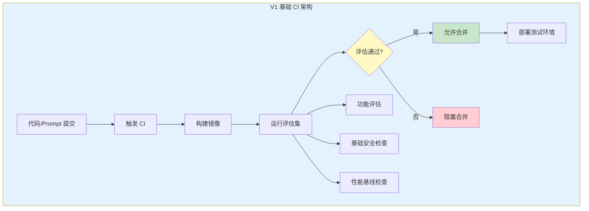
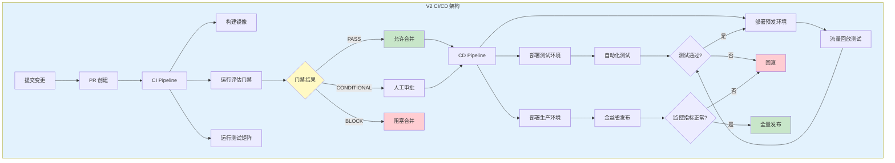
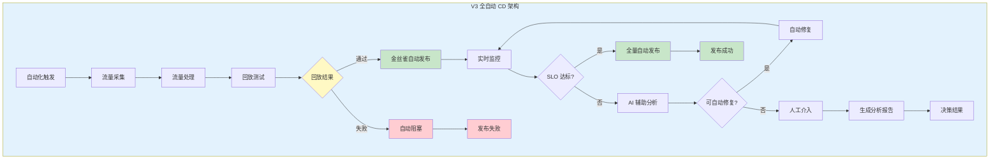
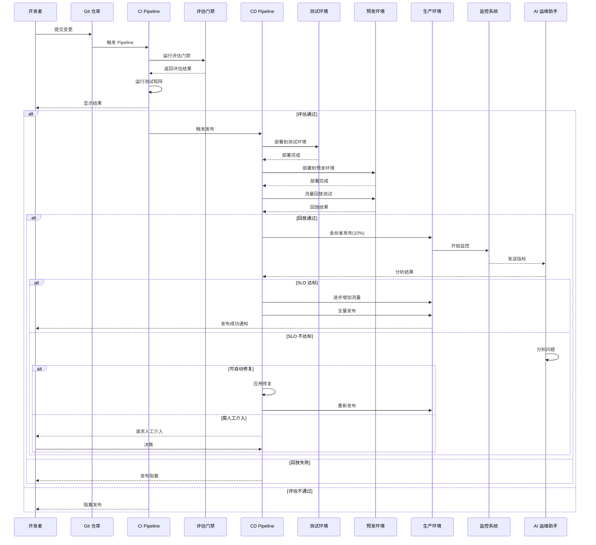

# Sprint 3: Agent CI-CD 管线

## 概述

Sprint 3 聚焦于建立评估驱动的 CI/CD 流水线，将 Agent 质量保障深度集成到持续交付流程中。与传统 CI/CD 不同，Agent CI/CD 需要处理 Prompt 版本、评估门禁、流量回放、金丝雀发布等独特挑战。本 Sprint 构建完整的 Agent CI/CD 体系，实现从代码/Prompt 变更到生产部署的全自动化流程。

**核心目标**：

- 建立评估门禁机制，自动阻断质量不达标的变更
- 实现多环境部署流程（开发、测试、预发、生产）
- 支持流量回放和仿真测试
- 实现金丝雀发布和 A/B 测试
- 提供完整的发布回滚能力

## V1: 基础 CI 与评估门禁

### V1 架构设计



### 评估门禁实现

```java
package com.agentforge.cicd.gate;

import org.springframework.stereotype.Service;
import lombok.Data;
import lombok.Builder;

import java.util.List;
import java.util.Map;

/**
 * 评估门禁服务
 * 
 * 功能：
 * 1. 定义评估门禁规则
 * 2. 执行评估并计算综合分数
 * 3. 根据规则决定是否通过
 * 4. 生成详细报告
 */
@Service
public class EvaluationGateService {
    
    private final List<Evaluator> evaluators;
    private final GateDecisionEngine decisionEngine;
    private final GateReportGenerator reportGenerator;
    
    /**
     * 执行评估门禁
     */
    public GateResult evaluate(GateRequest request) {
        // 1. 准备评估上下文
        EvaluationContext context = prepareContext(request);
        
        // 2. 执行所有评估器
        List<EvaluationResult> results = evaluators.stream()
            .parallel()
            .map(evaluator -> {
                try {
                    return evaluator.evaluate(context);
                } catch (Exception e) {
                    return EvaluationResult.failed(evaluator.getName(), e);
                }
            })
            .toList();
        
        // 3. 计算综合分数
        OverallScore score = decisionEngine.calculateScore(results);
        
        // 4. 应用门禁规则
        GateDecision decision = decisionEngine.decide(
            score,
            request.getGateRules()
        );
        
        // 5. 生成详细报告
        GateReport report = reportGenerator.generate(
            request,
            results,
            score,
            decision
        );
        
        return GateResult.builder()
            .decision(decision)
            .score(score)
            .detailedResults(results)
            .report(report)
            .build();
    }
    
    /**
     * 门禁请求
     */
    @Data
    @Builder
    public static class GateRequest {
        private String gateId;
        private String agentVersion;
        private String commitSha;
        private String branch;
        List<String> changedFiles;          // 变更文件列表
        Map<String, String> changedPrompts; // 变更的 Prompt
        GateRules gateRules;                // 门禁规则
        EvaluationContext context;         // 评估上下文
    }
    
    /**
     * 门禁规则
     */
    @Data
    @Builder
    public static class GateRules {
        private Map<String, Double> minimumScores;      // 各维度最低分数
        private boolean requireAllTestsPass;            // 是否要求所有测试通过
        private boolean requireSecurityPass;            // 安全必须通过
        private boolean allowManualOverride;            // 是否允许人工覆盖
        private int requiredApprovals;                 // 所需审批数
    }
    
    /**
     * 门禁决策
     */
    public enum GateDecision {
        PASS,           // 通过，可以继续
        CONDITIONAL,    // 有条件通过（需人工审批）
        BLOCK           // 阻塞，必须修复
    }
    
    /**
     * 综合分数
     */
    @Data
    @Builder
    public static class OverallScore {
        private double totalScore;           // 总分 0-100
        private Map<String, Double> dimensionScores;  // 各维度分数
        private Map<String, String> strengths;         // 优势项
        private Map<String, String> weaknesses;        // 弱点
        private String recommendation;                 // 建议
    }
    
    /**
     * 门禁结果
     */
    @Data
    @Builder
    public static class GateResult {
        private GateDecision decision;
        private OverallScore score;
        private List<EvaluationResult> detailedResults;
        private GateReport report;
        private Instant evaluatedAt;
        
        public boolean isPass() {
            return decision == GateDecision.PASS;
        }
        
        public boolean isConditional() {
            return decision == GateDecision.CONDITIONAL;
        }
        
        public boolean isBlock() {
            return decision == GateDecision.BLOCK;
        }
    }
}
```

### 评估器实现

```java
package com.agentforge.cicd.gate.evaluator;

import org.springframework.stereotype.Component;
import lombok.Data;

import java.util.List;
import java.util.Map;

/**
 * 功能评估器
 * 
 * 评估 Agent 的功能正确性
 */
@Component
public class FunctionalEvaluator implements Evaluator {
    
    private final TestMatrixRunner testRunner;
    private final GoldenSetService goldenSetService;
    
    @Override
    public String getName() {
        return "functional";
    }
    
    @Override
    public EvaluationResult evaluate(EvaluationContext context) {
        // 1. 运行功能测试矩阵
        TestMatrixRequest request = TestMatrixRequest.builder()
            .agentVersion(context.getAgentVersion())
            .goldenSetVersion(context.getGoldenSetVersion())
            .dimensions(List.of(TestDimension.FUNCTIONAL))
            .build();
        
        TestMatrixReport report = testRunner.run(request);
        DimensionResult functionalResult = report.getDimensionResults().get(TestDimension.FUNCTIONAL);
        
        // 2. 计算功能分数
        double score = functionalResult.getScore();
        
        // 3. 生成详细报告
        return EvaluationResult.builder()
            .evaluatorName(getName())
            .passed(score >= context.getThresholds().getFunctional())
            .score(score)
            .metrics(Map.of(
                "pass_rate", functionalResult.getPassRate(),
                "total_tests", functionalResult.getTotalTests(),
                "passed_tests", functionalResult.getPassedTests(),
                "failed_tests", functionalResult.getFailedTests()
            ))
            .details(functionalResult.getTestCaseResults())
            .build();
    }
}

/**
 * 安全评估器
 * 
 * 评估 Agent 的安全性
 */
@Component
public class SecurityEvaluator implements Evaluator {
    
    private final TestMatrixRunner testRunner;
    
    @Override
    public String getName() {
        return "security";
    }
    
    @Override
    public EvaluationResult evaluate(EvaluationContext context) {
        // 1. 运行安全测试矩阵
        TestMatrixRequest request = TestMatrixRequest.builder()
            .agentVersion(context.getAgentVersion())
            .goldenSetVersion(context.getGoldenSetVersion())
            .dimensions(List.of(TestDimension.SECURITY))
            .build();
        
        TestMatrixReport report = testRunner.run(request);
        DimensionResult securityResult = report.getDimensionResults().get(TestDimension.SECURITY);
        
        // 2. 安全测试任何失败都是严重问题
        boolean passed = securityResult.isPassed();
        double score = passed ? 100.0 : 0.0;
        
        // 3. 生成报告
        return EvaluationResult.builder()
            .evaluatorName(getName())
            .passed(passed)
            .score(score)
            .metrics(Map.of(
                "injection_tests", securityResult.getInjectionTestResults(),
                "jailbreak_tests", securityResult.getJailbreakTestResults(),
                "pii_leak_tests", securityResult.getPiiLeakTestResults(),
                "critical_issues", securityResult.getCriticalIssues()
            ))
            .details(securityResult.getTestResults())
            .severity(Severity.CRITICAL)  // 安全是关键维度
            .build();
    }
}

/**
 * 性能评估器
 * 
 * 评估 Agent 的性能表现
 */
@Component
public class PerformanceEvaluator implements Evaluator {
    
    private final TestMatrixRunner testRunner;
    
    @Override
    public String getName() {
        return "performance";
    }
    
    @Override
    public EvaluationResult evaluate(EvaluationContext context) {
        // 1. 运行性能测试
        TestMatrixRequest request = TestMatrixRequest.builder()
            .agentVersion(context.getAgentVersion())
            .dimensions(List.of(TestDimension.PERFORMANCE))
            .build();
        
        TestMatrixReport report = testRunner.run(request);
        DimensionResult perfResult = report.getDimensionResults().get(TestDimension.PERFORMANCE);
        
        // 2. 计算性能分数
        double score = calculatePerformanceScore(perfResult);
        
        // 3. 生成报告
        return EvaluationResult.builder()
            .evaluatorName(getName())
            .passed(score >= context.getThresholds().getPerformance())
            .score(score)
            .metrics(Map.of(
                "avg_response_time", perfResult.getAvgResponseTime(),
                "p95_response_time", perfResult.getP95ResponseTime(),
                "throughput", perfResult.getThroughput(),
                "concurrency_success_rate", perfResult.getConcurrencySuccessRate()
            ))
            .details(perfResult.getPerformanceDetails())
            .build();
    }
}
```

### 决策引擎

```java
package com.agentforge.cicd.gate.engine;

import org.springframework.stereotype.Service;
import lombok.Data;

import java.util.List;
import java.util.Map;

/**
 * 门禁决策引擎
 * 
 * 根据评估结果和门禁规则做出决策
 */
@Service
public class GateDecisionEngine {
    
    /**
     * 计算综合分数
     */
    public OverallScore calculateScore(List<EvaluationResult> results) {
        OverallScore.OverallScoreBuilder builder = OverallScore.builder();
        
        Map<String, Double> dimensionScores = new HashMap<>();
        Map<String, String> strengths = new HashMap<>();
        Map<String, String> weaknesses = new HashMap<>();
        
        double totalWeight = 0.0;
        double weightedSum = 0.0;
        
        for (EvaluationResult result : results) {
            double weight = getWeight(result.getEvaluatorName());
            double score = result.getScore();
            
            dimensionScores.put(result.getEvaluatorName(), score);
            
            if (score >= 80.0) {
                strengths.put(result.getEvaluatorName(), 
                    String.format("Excellent: %.1f", score));
            } else if (score < 60.0) {
                weaknesses.put(result.getEvaluatorName(), 
                    String.format("Needs improvement: %.1f", score));
            }
            
            weightedSum += score * weight;
            totalWeight += weight;
        }
        
        double totalScore = totalWeight > 0 ? weightedSum / totalWeight : 0.0;
        
        return builder
            .totalScore(totalScore)
            .dimensionScores(dimensionScores)
            .strengths(strengths)
            .weaknesses(weaknesses)
            .recommendation(generateRecommendation(totalScore, weaknesses))
            .build();
    }
    
    /**
     * 做出门禁决策
     */
    public GateDecision decide(OverallScore score, GateRules rules) {
        // 1. 检查所有必需维度
        for (Map.Entry<String, Double> entry : rules.getMinimumScores().entrySet()) {
            String dimension = entry.getKey();
            double minimum = entry.getValue();
            double actual = score.getDimensionScores().getOrDefault(dimension, 0.0);
            
            if (actual < minimum) {
                return GateDecision.BLOCK;
            }
        }
        
        // 2. 检查安全维度（如果要求必须通过）
        if (rules.isRequireSecurityPass()) {
            double securityScore = score.getDimensionScores().getOrDefault("security", 0.0);
            if (securityScore < 100.0) {  // 安全必须满分
                return GateDecision.BLOCK;
            }
        }
        
        // 3. 检查总分
        if (score.getTotalScore() < 70.0) {
            return GateDecision.BLOCK;
        } else if (score.getTotalScore() < 85.0) {
            return GateDecision.CONDITIONAL;
        }
        
        // 4. 如果所有检查通过，则通过
        return GateDecision.PASS;
    }
    
    /**
     * 生成建议
     */
    private String generateRecommendation(double score, Map<String, String> weaknesses) {
        if (weaknesses.isEmpty()) {
            return "Excellent performance across all dimensions.";
        }
        
        StringBuilder sb = new StringBuilder();
        sb.append("Focus on improving: ");
        sb.append(String.join(", ", weaknesses.keySet()));
        return sb.toString();
    }
    
    private double getWeight(String evaluatorName) {
        // 默认权重，可配置
        return switch (evaluatorName) {
            case "functional" -> 0.35;
            case "security" -> 0.30;
            case "performance" -> 0.20;
            case "cost" -> 0.10;
            case "regression" -> 0.05;
            default -> 0.1;
        };
    }
}
```

## V2: 评估门禁 CI 与多环境部署

### V2 架构设计



### Jenkins Pipeline 实现

```groovy
// Jenkinsfile for Agent CI/CD Pipeline

pipeline {
    agent any
    
    parameters {
        string(name: 'AGENT_VERSION', defaultValue: '', description: 'Agent version to build')
        choice(name: 'DEPLOY_ENV', choices: ['dev', 'staging', 'prod'], description: 'Deployment environment')
    }
    
    environment {
        DOCKER_REGISTRY = 'registry.example.com'
        AGENT_IMAGE = "${DOCKER_REGISTRY}/agent:${AGENT_VERSION}"
        EVALUATION_GATE_URL = 'http://evaluation-gate-service:8080'
        KUBECONFIG = credentials('kubeconfig')
    }
    
    stages {
        stage('Checkout') {
            steps {
                checkout scm
                script {
                    AGENT_VERSION = sh(
                        script: 'git describe --tags --always',
                        returnStdout: true
                    ).trim()
                }
            }
        }
        
        stage('Build Docker Image') {
            steps {
                script {
                    docker.build("${DOCKER_REGISTRY}/agent:${AGENT_VERSION}", '.')
                    docker.withRegistry("https://${DOCKER_REGISTRY}", 'docker-credentials') {
                        docker.image("${DOCKER_REGISTRY}/agent:${AGENT_VERSION}").push()
                    }
                }
            }
        }
        
        stage('Run Evaluation Gate') {
            steps {
                script {
                    def gateRequest = readJSON file: 'gate-request.json'
                    gateRequest.agentVersion = AGENT_VERSION
                    
                    def response = sh(
                        script: """
                            curl -X POST ${EVALUATION_GATE_URL}/api/v1/evaluate \\
                                -H 'Content-Type: application/json' \\
                                -d '${groovy.json.JsonOutput.toJson(gateRequest)}'
                        """,
                        returnStdout: true
                    ).trim()
                    
                    def gateResult = readJSON text: response
                    
                    currentBuild.result = 'SUCCESS'
                    
                    if (gateResult.decision == 'BLOCK') {
                        currentBuild.result = 'FAILURE'
                        error("Evaluation gate blocked: ${gateResult.report.summary}")
                    } else if (gateResult.decision == 'CONDITIONAL') {
                        currentBuild.result = 'UNSTABLE'
                        println("Evaluation gate conditional: ${gateResult.report.summary}")
                        // 需要人工审批
                    }
                    
                    // 保存评估报告
                    writeFile file: 'evaluation-report.json', text: response
                    archiveArtifacts artifacts: 'evaluation-report.json'
                }
            }
        }
        
        stage('Run Test Matrix') {
            when {
                anyOf {
                    branch 'main'
                    branch 'develop'
                }
            }
            steps {
                script {
                    docker.image("${AGENT_IMAGE}").inside {
                        sh './gradlew testMatrix'
                    }
                }
                publishHTML([
                    reportDir: 'build/reports/test-matrix',
                    reportFiles: 'index.html',
                    reportName: 'Test Matrix Report',
                    keepAll: true
                ])
            }
        }
        
        stage('Deploy to Test') {
            when {
                branch 'develop'
            }
            steps {
                script {
                    helmDeploy('test', AGENT_VERSION)
                }
            }
        }
        
        stage('Deploy to Staging') {
            when {
                branch 'release/*'
            }
            steps {
                script {
                    helmDeploy('staging', AGENT_VERSION)
                }
            }
        }
        
        stage('Traffic Replay Test') {
            when {
                branch 'release/*'
            }
            steps {
                script {
                    // 运行流量回放测试
                    sh """
                        docker run --rm \\
                            -v /path/to/traffic:/traffic \\
                            -v /path/to/results:/results \\
                            traffic-replayer:latest \\
                            --target http://agent-staging:8080 \\
                            --traffic /traffic/staging-sample.json \\
                            --output /results/replay-report.json
                    """
                    
                    def replayReport = readJSON file: 'replay-report.json'
                    
                    if (replayReport.successRate < 0.95) {
                        currentBuild.result = 'FAILURE'
                        error("Traffic replay test failed: success rate ${replayReport.successRate}")
                    }
                }
            }
        }
        
        stage('Deploy to Production') {
            when {
                tag pattern: "v\\d+\\.\\d+\\.\\d+"
            }
            steps {
                script {
                    input(message: 'Deploy to Production?', ok: 'Deploy')
                    helmDeploy('prod', AGENT_VERSION)
                }
            }
        }
    }
    
    post {
        success {
            echo 'Pipeline succeeded!'
        }
        failure {
            echo 'Pipeline failed!'
            // 发送通知
            emailext(
                to: 'team@example.com',
                subject: "CI Pipeline Failed: ${env.JOB_NAME} #${env.BUILD_NUMBER}",
                body: "Check console output at ${env.BUILD_URL}"
            )
        }
    }
}

def helmDeploy(String env, String version) {
    sh """
        helm upgrade --install agent-${env} ./helm/agent \\
            --namespace ${env} \\
            --set image.tag=${version} \\
            --set env=${env} \\
            --wait \\
            --timeout 5m
    """
}
```

### 发布管理器

```java
package com.agentforge.cicd.release;

import org.springframework.stereotype.Service;
import lombok.Data;
import lombok.Builder;

import java.util.List;

/**
 * 发布管理服务
 * 
 * 功能：
 * 1. 多环境部署管理
 * 2. 发布策略执行
 * 3. 回滚管理
 * 4. 发布历史追踪
 */
@Service
public class ReleaseManager {
    
    private final KubernetesClient k8sClient;
    private final HelmClient helmClient;
    private final DeploymentMonitor monitor;
    
    /**
     * 执行发布
     */
    public ReleaseResult executeRelease(ReleaseRequest request) {
        // 1. 验证发布请求
        validateRelease(request);
        
        // 2. 创建发布记录
        Release release = createRelease(request);
        
        try {
            // 3. 预发布检查
            preReleaseChecks(release);
            
            // 4. 执行发布策略
            switch (request.getStrategy()) {
                case ROLLING -> executeRollingUpdate(release);
                case CANARY -> executeCanaryRelease(release);
                case BLUE_GREEN -> executeBlueGreenRelease(release);
            }
            
            // 5. 发布后验证
            postReleaseValidation(release);
            
            // 6. 标记发布成功
            release.setStatus(ReleaseStatus.SUCCESS);
            
            return ReleaseResult.success(release);
            
        } catch (Exception e) {
            // 发布失败，尝试回滚
            release.setStatus(ReleaseStatus.FAILED);
            
            if (request.isAutoRollback()) {
                rollbackRelease(release.getId());
            }
            
            return ReleaseResult.failure(release, e);
        }
    }
    
    /**
     * 执行金丝雀发布
     */
    private void executeCanaryRelease(Release release) {
        CanaryConfig config = release.getCanaryConfig();
        
        // 1. 初始金丝雀部署
        int initialTraffic = config.getInitialTrafficPercentage();
        deployCanaryInstance(release, initialTraffic);
        
        // 2. 监控金丝雀
        CanaryMetrics metrics = monitorCanary(release, config.getInitialDuration());
        
        // 3. 逐步增加流量
        for (CanaryStage stage : config.getStages()) {
            if (metrics.isHealthy()) {
                // 增加流量
                updateCanaryTraffic(release, stage.getTrafficPercentage());
                
                // 监控该阶段
                metrics = monitorCanary(release, stage.getDuration());
            } else {
                throw new ReleaseException("Canary metrics unhealthy: " + metrics.getIssues());
            }
        }
        
        // 4. 全量切换
        switchToNewVersion(release);
    }
    
    /**
     * 部署金丝雀实例
     */
    private void deployCanaryInstance(Release release, int trafficPercentage) {
        // 1. 创建金丝雀 Deployment
        Deployment canaryDeployment = buildCanaryDeployment(release);
        k8sClient.apps().deployments()
            .inNamespace(release.getNamespace())
            .create(canaryDeployment);
        
        // 2. 创建 Service
        Service service = buildCanaryService(release);
        k8sClient.services()
            .inNamespace(release.getNamespace())
            .create(service);
        
        // 3. 配置流量分割（通过 Istio VirtualService）
        configureTrafficSplit(release, trafficPercentage);
    }
    
    /**
     * 配置流量分割
     */
    private void configureTrafficSplit(Release release, int canaryTrafficPercentage) {
        VirtualService virtualService = new VirtualServiceBuilder()
            .withNewMetadata()
                .withName(release.getServiceName())
                .withNamespace(release.getNamespace())
            .endMetadata()
            .withNewSpec()
                .withHosts(release.getServiceName())
                .withHttp()
                    .addNewRoute()
                        .withDestination(
                            new DestinationBuilder()
                                .withHost(release.getServiceName())
                                .withSubset("stable")
                                .build()
                        )
                        .withWeight(100 - canaryTrafficPercentage)
                    .endRoute()
                    .addNewRoute()
                        .withDestination(
                            new DestinationBuilder()
                                .withHost(release.getServiceName())
                                .withSubset("canary")
                                .build()
                        )
                        .withWeight(canaryTrafficPercentage)
                    .endRoute()
                .endHttp()
            .endSpec()
            .build();
        
        k8sClient.customResources(virtualServiceGvr)
            .inNamespace(release.getNamespace())
            .create(virtualService);
    }
    
    /**
     * 监控金丝雀
     */
    private CanaryMetrics monitorCanary(Release release, Duration duration) {
        CanaryMetrics metrics = new CanaryMetrics();
        Instant endTime = Instant.now().plus(duration);
        
        while (Instant.now().isBefore(endTime)) {
            // 收集指标
            collectCanaryMetrics(release, metrics);
            
            // 检查健康状态
            if (!metrics.isHealthy()) {
                return metrics;
            }
            
            try {
                Thread.sleep(30000);  // 30秒检查一次
            } catch (InterruptedException e) {
                Thread.currentThread().interrupt();
                break;
            }
        }
        
        return metrics;
    }
    
    /**
     * 回滚发布
     */
    public void rollbackRelease(String releaseId) {
        Release release = getRelease(releaseId);
        
        // 1. 执行回滚策略
        switch (release.getStrategy()) {
            case CANARY:
                // 移除金丝雀，保持稳定版本
                removeCanary(release);
                break;
            case BLUE_GREEN:
                // 切换回旧版本
                switchTrafficToOldVersion(release);
                break;
            case ROLLING:
                // Kubernetes 回滚
                k8sClient.apps().deployments()
                    .inNamespace(release.getNamespace())
                    .withName(release.getDeploymentName())
                    .rollback();
                break;
        }
        
        // 2. 更新发布状态
        release.setStatus(ReleaseStatus.ROLLED_BACK);
        release.setRolledBackAt(Instant.now());
        
        // 3. 发送通知
        sendRollbackNotification(release);
    }
    
    /**
     * 发布请求
     */
    @Data
    @Builder
    public static class ReleaseRequest {
        private String releaseId;
        private String agentVersion;
        private String environment;
        private ReleaseStrategy strategy;
        private CanaryConfig canaryConfig;
        private boolean autoRollback;
        private Map<String, String> metadata;
    }
    
    /**
     * 发布策略
     */
    public enum ReleaseStrategy {
        ROLLING,     // 滚动更新
        CANARY,      // 金丝雀发布
        BLUE_GREEN   // 蓝绿部署
    }
    
    /**
     * 金丝雀配置
     */
    @Data
    @Builder
    public static class CanaryConfig {
        private int initialTrafficPercentage;
        private Duration initialDuration;
        private List<CanaryStage> stages;
        private SuccessCriteria successCriteria;
    }
    
    /**
     * 金丝雀阶段
     */
    @Data
    @Builder
    public static class CanaryStage {
        private int trafficPercentage;
        private Duration duration;
    }
    
    /**
     * 成功标准
     */
    @Data
    @Builder
    public static class SuccessCriteria {
        private double maxErrorRate;
        private double maxLatencyIncrease;
        private double minSuccessRate;
    }
}
```

## V3: 流量回放与全自动 CD

### V3 架构设计



### 流量回放实现

```java
package com.agentforge.cicd.traffic;

import org.springframework.stereotype.Service;
import lombok.Data;
import lombok.Builder;

import java.util.List;
import java.util.concurrent.ExecutorService;
import java.util.concurrent.Executors;

/**
 * 流量回放服务
 * 
 * 功能：
 * 1. 生产流量采集和录制
 * 2. 流量处理和筛选
 * 3. 回放测试执行
 * 4. 结果对比分析
 */
@Service
public class TrafficReplayService {
    
    private final TrafficRecorder recorder;
    private final TrafficProcessor processor;
    private final ReplayExecutor executor;
    private final ResultComparator comparator;
    
    /**
     * 执行流量回放测试
     */
    public ReplayTestResult executeReplay(ReplayTestRequest request) {
        // 1. 采集流量样本
        TrafficSample sample = recorder.sample(
            request.getSourceEnvironment(),
            request.getSamplingConfig()
        );
        
        // 2. 处理流量
        List<ReplayableRequest> requests = processor.process(sample);
        
        // 3. 执行回放
        ReplayExecutionResult execution = executor.execute(
            requests,
            request.getTargetEnvironment()
        );
        
        // 4. 对比结果
        ComparisonResult comparison = comparator.compare(
            execution,
            request.getBaselineResults()
        );
        
        // 5. 生成报告
        return ReplayTestResult.builder()
            .sampleSize(sample.getSize())
            .replayedCount(execution.getReplayedCount())
            .successRate(execution.getSuccessRate())
            .comparison(comparison)
            .passed(comparison.isAcceptable())
            .report(generateReport(sample, execution, comparison))
            .build();
    }
    
    /**
     * 流量录制器
     */
    @Component
    public static class TrafficRecorder {
        
        private final TrafficStore trafficStore;
        
        /**
         * 录制流量
         */
        public void record(String environment, RecordingConfig config) {
            // 1. 启动流量捕获
            startCapture(environment, config);
            
            // 2. 持续采集
            while (shouldContinueRecording(config)) {
                TrafficRequest request = captureRequest(environment);
                TrafficResponse response = captureResponse(environment);
                
                // 3. 存储流量记录
                TrafficRecord record = TrafficRecord.builder()
                    .request(request)
                    .response(response)
                    .timestamp(Instant.now())
                    .environment(environment)
                    .build();
                
                trafficStore.store(record);
            }
            
            // 4. 停止捕获
            stopCapture(environment);
        }
        
        /**
         * 采样流量
         */
        public TrafficSample sample(String environment, SamplingConfig config) {
            List<TrafficRecord> records = trafficStore.query(
                environment,
                config.getTimeWindow(),
                config.getSampleSize(),
                config.getFilters()
            );
            
            return TrafficSample.builder()
                .environment(environment)
                .records(records)
                .sampledAt(Instant.now())
                .build();
        }
    }
    
    /**
     * 流量处理器
     */
    @Component
    public static class TrafficProcessor {
        
        /**
         * 处理流量，生成可回放请求
         */
        public List<ReplayableRequest> process(TrafficSample sample) {
            return sample.getRecords().stream()
                .map(this::convertToReplayable)
                .filter(this::isReplayable)
                .map(this::sanitize)
                .toList();
        }
        
        /**
         * 清理敏感数据
         */
        private ReplayableRequest sanitize(ReplayableRequest request) {
            // 移除或脱敏敏感数据
            String sanitized = request.getPayload()
                .replaceAll("\"password\":\"[^\"]+\"", "\"password\":\"***\"")
                .replaceAll("\"token\":\"[^\"]+\"", "\"token\":\"***\"")
                .replaceAll("\"ssn\":\"[^\"]+\"", "\"ssn\":\"***\"");
            
            return request.toBuilder()
                .payload(sanitized)
                .build();
        }
    }
    
    /**
     * 回放执行器
     */
    @Component
    public static class ReplayExecutor {
        
        private final ExecutorService executor = Executors.newFixedThreadPool(50);
        
        /**
         * 执行回放
         */
        public ReplayExecutionResult execute(
            List<ReplayableRequest> requests,
            String targetEnvironment
        ) {
            ReplayExecutionResult result = ReplayExecutionResult.builder()
                .targetEnvironment(targetEnvironment)
                .startedAt(Instant.now())
                .results(new ArrayList<>())
                .build();
            
            // 并行执行回放请求
            List<CompletableFuture<ReplayResult>> futures = requests.stream()
                .map(request -> CompletableFuture.supplyAsync(
                    () -> executeReplay(request, targetEnvironment),
                    executor
                ))
                .toList();
            
            // 等待所有回放完成
            CompletableFuture.allOf(futures.toArray(new CompletableFuture[0])).join();
            
            // 收集结果
            List<ReplayResult> replayResults = futures.stream()
                .map(CompletableFuture::join)
                .toList();
            
            result.setResults(replayResults);
            result.setCompletedAt(Instant.now());
            
            return result;
        }
        
        private ReplayResult executeReplay(
            ReplayableRequest request,
            String targetEnvironment
        ) {
            long startTime = System.nanoTime();
            
            try {
                // 发送请求到目标环境
                TrafficResponse response = sendRequest(request, targetEnvironment);
                
                return ReplayResult.builder()
                    .request(request)
                    .response(response)
                    .success(true)
                    .latency(Duration.ofNanos(System.nanoTime() - startTime))
                    .build();
                    
            } catch (Exception e) {
                return ReplayResult.builder()
                    .request(request)
                    .success(false)
                    .error(e.getMessage())
                    .latency(Duration.ofNanos(System.nanoTime() - startTime))
                    .build();
            }
        }
    }
    
    /**
     * 结果对比器
     */
    @Component
    public static class ResultComparator {
        
        /**
         * 对比回放结果
         */
        public ComparisonResult compare(
            ReplayExecutionResult execution,
            BaselineResults baseline
        ) {
            ComparisonResult result = ComparisonResult.builder()
                .comparisons(new ArrayList<>())
                .build();
            
            for (ReplayResult replay : execution.getResults()) {
                BaselineResult baselineResult = baseline.get(replay.getRequest().getId());
                
                if (baselineResult != null) {
                    ItemComparison comparison = compareResults(
                        replay,
                        baselineResult
                    );
                    result.addComparison(comparison);
                }
            }
            
            result.calculateOverallMatch();
            return result;
        }
        
        private ItemComparison compareResults(
            ReplayResult replay,
            BaselineResult baseline
        ) {
            // 1. 对比状态码
            boolean statusMatch = replay.getResponse().getStatus() 
                == baseline.getStatus();
            
            // 2. 对比响应体（语义相似度）
            double contentSimilarity = calculateSimilarity(
                replay.getResponse().getBody(),
                baseline.getBody()
            );
            
            // 3. 对比关键指标
            boolean latencyMatch = replay.getLatency().compareTo(
                baseline.getLatency().multipliedBy(2)  // 允许2倍延迟
            ) <= 0;
            
            return ItemComparison.builder()
                .requestId(replay.getRequest().getId())
                .statusMatch(statusMatch)
                .contentSimilarity(contentSimilarity)
                .latencyMatch(latencyMatch)
                .passed(statusMatch && contentSimilarity > 0.8 && latencyMatch)
                .build();
        }
    }
}
```

### 全自动 CD 实现

```java
package com.agentforge.cicd.autocd;

import org.springframework.stereotype.Service;
import lombok.Data;
import lombok.Scheduled;

/**
 * 全自动 CD 服务
 * 
 * 功能：
 * 1. 监控代码仓库变更
 * 2. 自动触发 CI/CD 流程
 * 3. 自动执行发布决策
 * 4. AI 辅助问题分析
 */
@Service
public class AutoCDEngine {
    
    private final ReleaseManager releaseManager;
    private final TrafficReplayService replayService;
    private final AIOpsAssistant aiOpsAssistant;
    private final SLOMonitor sloMonitor;
    
    /**
     * 监控并自动发布
     */
    @Scheduled(fixedRate = 300000)  // 每5分钟检查一次
    public void monitorAndAutoRelease() {
        // 1. 检查待发布版本
        List<PendingRelease> pending = findPendingReleases();
        
        for (PendingRelease pendingRelease : pending) {
            try {
                // 2. 执行预发布检查
                PreReleaseCheckResult checkResult = performPreReleaseChecks(pendingRelease);
                
                if (checkResult.isReady()) {
                    // 3. 执行自动发布
                    AutoReleaseResult result = executeAutoRelease(pendingRelease);
                    
                    // 4. 监控发布状态
                    monitorRelease(result);
                }
                
            } catch (Exception e) {
                handleAutoReleaseFailure(pendingRelease, e);
            }
        }
    }
    
    /**
     * 执行自动发布
     */
    private AutoReleaseResult executeAutoRelease(PendingRelease pending) {
        AutoReleaseResult result = AutoReleaseResult.builder()
            .releaseId(pending.getReleaseId())
            .startedAt(Instant.now())
            .build();
        
        try {
            // 1. 流量回放测试
            ReplayTestResult replayResult = replayService.executeReplay(
                ReplayTestRequest.builder()
                    .sourceEnvironment("prod")
                    .targetEnvironment(pending.getStagingEnv())
                    .samplingConfig(pending.getSamplingConfig())
                    .build()
            );
            
            if (!replayResult.isPassed()) {
                throw new ReleaseException("Traffic replay failed: " + 
                    replayResult.getComparison().getOverallMatch());
            }
            
            result.setReplayResult(replayResult);
            
            // 2. 金丝雀发布
            Release canaryRelease = releaseManager.executeRelease(
                ReleaseRequest.builder()
                    .releaseId(pending.getReleaseId())
                    .agentVersion(pending.getVersion())
                    .environment("prod")
                    .strategy(ReleaseStrategy.CANARY)
                    .canaryConfig(pending.getCanaryConfig())
                    .autoRollback(true)
                    .build()
            );
            
            result.setCanaryRelease(canaryRelease);
            
            // 3. 持续监控金丝雀
            CanaryMonitorResult monitorResult = monitorCanary(
                canaryRelease,
                pending.getCanaryConfig()
            );
            
            result.setMonitorResult(monitorResult);
            
            // 4. 根据监控结果决定是否全量发布
            if (monitorResult.shouldPromote()) {
                promoteToFullRelease(canaryRelease);
                result.setPromoted(true);
            } else {
                // AI 辅助分析问题
                AIAnalysis analysis = aiOpsAssistant.analyzeCanaryFailure(monitorResult);
                result.setAiAnalysis(analysis);
                
                if (analysis.canAutoFix()) {
                    applyAutoFix(canaryRelease, analysis);
                } else {
                    rollbackRelease(canaryRelease);
                    result.setRolledBack(true);
                }
            }
            
            result.setCompletedAt(Instant.now());
            result.setSuccess(result.isPromoted() || result.isRolledBack());
            
        } catch (Exception e) {
            result.setError(e);
            result.setSuccess(false);
        }
        
        return result;
    }
    
    /**
     * 监控金丝雀
     */
    private CanaryMonitorResult monitorCanary(
        Release canaryRelease,
        CanaryConfig config
    ) {
        CanaryMonitorResult result = CanaryMonitorResult.builder()
            .releaseId(canaryRelease.getId())
            .build();
        
        Instant endTime = Instant.now().plus(config.getMonitoringWindow());
        
        while (Instant.now().isBefore(endTime)) {
            // 1. 收集 SLO 指标
            SLOMetrics metrics = sloMonitor.getCurrentMetrics(
                canaryRelease.getNamespace(),
                canaryRelease.getServiceName()
            );
            
            // 2. 检查是否达标
            if (!metrics.meetsSLO(config.getSuccessCriteria())) {
                result.addViolation(metrics);
                
                // 如果严重违反 SLO，立即停止
                if (metrics.isCriticalViolation()) {
                    result.setCriticalViolation(true);
                    break;
                }
            }
            
            // 3. 记录指标
            result.addMetrics(metrics);
            
            try {
                Thread.sleep(config.getCheckInterval().toMillis());
            } catch (InterruptedException e) {
                Thread.currentThread().interrupt();
                break;
            }
        }
        
        // 4. 生成决策建议
        result.setShouldPromote(
            !result.hasCriticalViolation() && 
            result.getViolationRate() < config.getMaxViolationRate()
        );
        
        return result;
    }
    
    /**
     * 提升到全量发布
     */
    private void promoteToFullRelease(Release canaryRelease) {
        // 逐步增加流量到 100%
        updateTrafficSplit(canaryRelease, 100);
        
        // 等待稳定
        waitForStable(canaryRelease);
        
        // 删除金丝雀，完成发布
        cleanupCanary(canaryRelease);
    }
    
    /**
     * AI 辅助运维助手
     */
    @Component
    public static class AIOpsAssistant {
        
        private final RAGService ragService;
        private final LLMClient llmClient;
        
        /**
         * 分析金丝雀失败原因
         */
        public AIAnalysis analyzeCanaryFailure(CanaryMonitorResult monitorResult) {
            // 1. 收集相关数据
            ContextData context = collectContextData(monitorResult);
            
            // 2. 使用 RAG 检索相似历史案例
            List<SimilarCase> similarCases = ragService.searchSimilarCases(context);
            
            // 3. 使用 LLM 分析
            String analysisPrompt = buildAnalysisPrompt(context, similarCases);
            LLMResponse response = llmClient.complete(analysisPrompt);
            
            // 4. 解析分析结果
            return parseAnalysis(response);
        }
        
        /**
         * 检查是否可以自动修复
         */
        public boolean canAutoFix(AIAnalysis analysis) {
            return analysis.getRecommendedActions().stream()
                .allMatch(action -> action.isAutoExecutable());
        }
        
        /**
         * 生成修复建议
         */
        public List<AutoFixAction> generateFixActions(AIAnalysis analysis) {
            return analysis.getRecommendedActions().stream()
                .filter(AutoFixAction::isAutoExecutable)
                .toList();
        }
    }
}
```

### 发布流程总览



## 最佳实践

### 评估门禁配置

```yaml
# gate-rules.yaml

functional:
  min_score: 85
  weight: 0.35
  
security:
  min_score: 100  # 安全必须满分
  weight: 0.30
  
performance:
  min_score: 75
  weight: 0.20
  
cost:
  min_score: 70
  weight: 0.10
  
regression:
  min_score: 80
  weight: 0.05

overall:
  pass_threshold: 85
  conditional_threshold: 70
  block_threshold: 50
```

### 金丝雀配置

```yaml
# canary-config.yaml

initial_traffic: 10
initial_duration: 5m

stages:
  - traffic: 25
    duration: 10m
  - traffic: 50
    duration: 15m
  - traffic: 75
    duration: 20m
  - traffic: 100
    duration: 0m

success_criteria:
  max_error_rate: 0.01
  max_latency_increase: 1.5
  min_success_rate: 0.99
  
auto_rollback: true
```

### 发布检查清单

- [ ] 评估门禁通过
- [ ] 测试矩阵全部通过
- [ ] 流量回放成功率 > 95%
- [ ] 性能回归测试通过
- [ ] 安全扫描无高危问题
- [ ] 成本预算在范围内
- [ ] 监控告警规则已配置
- [ ] 回滚方案已准备

## 参考资源

- [Jenkins Pipeline Documentation](https://www.jenkins.io/doc/book/pipeline/)
- [Istio Traffic Management](https://istio.io/latest/docs/concepts/traffic-management/)
- [Flagger Progressive Delivery](https://flagger.app/)
- [Google SRE Workbook](https://sre.google/workbook/table-of-contents/)