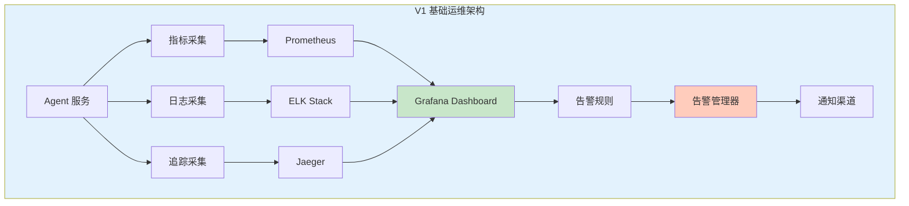
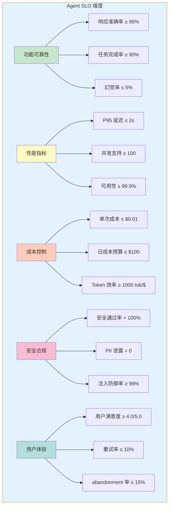
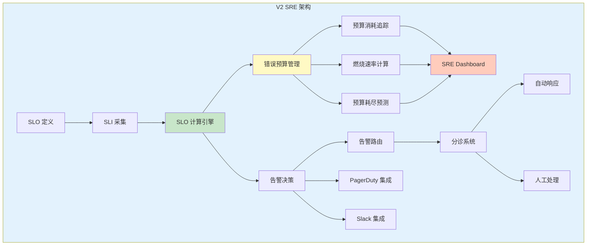
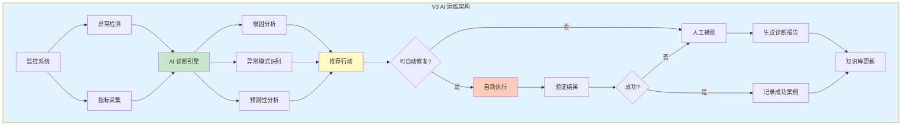
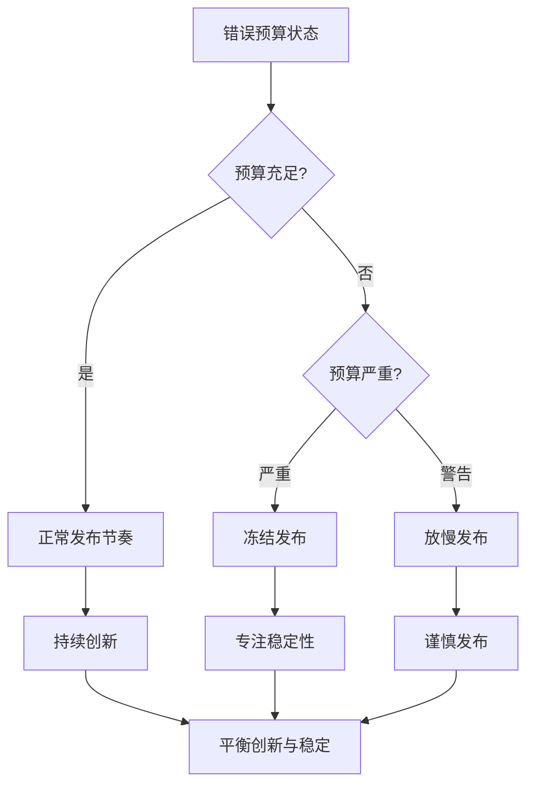

# Sprint 4: Agent 运维与 SRE

## 概述

Sprint 4 聚焦于建立 Agent 专属的 SRE（Site Reliability Engineering）体系和智能运维能力。与传统应用运维不同，Agent 应用需要监控 LLM 调用、Prompt 效果、工具使用情况、Token 消耗等独特指标。本 Sprint 构建 Agent SRE 的完整体系，包括 SLO/SLI 定义、错误预算管理、可观测性设计和 AI 辅助运维能力。

**核心目标**：

- 定义 Agent 应用的 SLO（Service Level Objectives）和 SLI（Service Level Indicators）
- 建立错误预算机制，平衡可靠性和创新速度
- 实现全链路可观测性（追踪、日志、指标）
- 提供 AI 辅助的故障诊断和自动修复能力
- 构建 Agent SRE 仪表板和告警体系

## V1: 基础运维与监控

### V1 架构设计



### Agent SLO 定义

Agent 应用的 SLO 需要覆盖功能、性能、成本和安全等多个维度。

**SLO 维度设计**：



**Java SLO 实现代码**：

```java
package com.agentforge.sre.slo;

import org.springframework.stereotype.Service;
import lombok.Data;
import lombok.Builder;

import java.util.Map;
import java.util.HashMap;

/**
 * SLO 管理服务
 * 
 * 功能：
 * 1. 定义和管理 SLO
 * 2. 计算 SLO 达标情况
 * 3. 错误预算管理
 * 4. SLO 报告生成
 */
@Service
public class SLOManagementService {
    
    private final SLICollector sliCollector;
    private final ErrorBudgetCalculator budgetCalculator;
    private final SLORepository sloRepository;
    
    /**
     * 注册 SLO
     */
    public void registerSLO(SLODefinition definition) {
        // 1. 验证 SLO 定义
        validateSLODefinition(definition);
        
        // 2. 存储到数据库
        sloRepository.save(definition);
        
        // 3. 配置 Prometheus 告警规则
        if (definition.hasAlertThreshold()) {
            configureAlertRules(definition);
        }
    }
    
    /**
     * 计算 SLO 达标情况
     */
    public SLOStatus calculateSLOStatus(String sloId, TimeWindow window) {
        // 1. 加载 SLO 定义
        SLODefinition slo = sloRepository.findById(sloId)
            .orElseThrow(() -> new SLONotFoundException(sloId));
        
        // 2. 收集 SLI 数据
        Map<String, SLIData> sliData = sliCollector.collect(
            slo.getRequiredSLIs(),
            window
        );
        
        // 3. 计算实际值
        double actualValue = calculateActualValue(slo, sliData);
        
        // 4. 判断是否达标
        boolean compliant = actualValue >= slo.getTargetValue();
        
        // 5. 更新错误预算
        ErrorBudget budget = budgetCalculator.update(
            sloId,
            compliant,
            window
        );
        
        return SLOStatus.builder()
            .sloId(sloId)
            .sloName(slo.getName())
            .targetValue(slo.getTargetValue())
            .actualValue(actualValue)
            .compliant(compliant)
            .window(window)
            .errorBudget(budget)
            .build();
    }
    
    /**
     * SLO 定义
     */
    @Data
    @Builder
    public static class SLODefinition {
        private String id;
        private String name;
        private SLOCategory category;
        private String description;
        private double targetValue;           // 目标值
        private double alertThreshold;         // 告警阈值
        private List<SLIType> requiredSLIs;   // 需要的 SLI
        private TimeWindow measurementWindow; // 测量窗口
        private boolean enabled;
        
        /**
         * SLO 类别
         */
        public enum SLOCategory {
            RELIABILITY,    // 可靠性
            PERFORMANCE,    // 性能
            COST,          // 成本
            SECURITY,      // 安全
            USER_EXPERIENCE // 用户体验
        }
        
        /**
         * SLI 类型
         */
        public enum SLIType {
            // 可靠性指标
            ACCURACY_RATE,           // 准确率
            COMPLETION_RATE,          // 完成率
            HALLUCINATION_RATE,       // 幻觉率
            ERROR_RATE,               // 错误率
            
            // 性能指标
            LATENCY_P50,             // P50 延迟
            LATENCY_P95,             // P95 延迟
            LATENCY_P99,             // P99 延迟
            THROUGHPUT,              // 吞吐量
            
            // 成本指标
            COST_PER_REQUEST,       // 单次请求成本
            DAILY_COST,             // 日成本
            TOKEN_EFFICIENCY,       // Token 效率
            
            // 安全指标
            SECURITY_PASS_RATE,     // 安全通过率
            PII_LEAK_COUNT,         // PII 泄露次数
            INJECTION_DEFENSE_RATE  // 注入防御率
        }
    }
    
    /**
     * SLO 状态
     */
    @Data
    @Builder
    public static class SLOStatus {
        private String sloId;
        private String sloName;
        private double targetValue;
        private double actualValue;
        private boolean compliant;
        private double gap;                      // 差距
        private ErrorBudget errorBudget;
        private TimeWindow window;
        private Instant calculatedAt;
        
        /**
         * 错误预算
         */
        @Data
        @Builder
        public static class ErrorBudget {
            private double totalBudget;      // 总预算（百分比）
            private double remainingBudget;  // 剩余预算
            private double burnRate;        // 燃烧速率
            private Instant exhaustedAt;    // 预计耗尽时间
            
            public boolean isExhausted() {
                return remainingBudget <= 0;
            }
            
            public boolean isLow() {
                return remainingBudget < totalBudget * 0.1;
            }
        }
    }
}
```

### SLI 采集器实现

```java
package com.agentforge.sre.collector;

import org.springframework.stereotype.Service;
import lombok.Data;

import java.util.List;
import java.util.Map;

/**
 * SLI 数据采集器
 * 
 * 从多个数据源采集 Agent 应用的性能指标
 */
@Service
public class SLICollector {
    
    private final PrometheusClient prometheusClient;
    private final AgentMetricsRegistry metricsRegistry;
    
    /**
     * 采集 SLI 数据
     */
    public Map<String, SLIData> collect(
        List<SLODefinition.SLIType> sliTypes,
        TimeWindow window
    ) {
        Map<String, SLIData> result = new HashMap<>();
        
        for (SLODefinition.SLIType sliType : sliTypes) {
            SLIData data = collectSLI(sliType, window);
            result.put(sliType.name(), data);
        }
        
        return result;
    }
    
    /**
     * 采集单个 SLI
     */
    private SLIData collectSLI(SLODefinition.SLIType sliType, TimeWindow window) {
        return switch (sliType) {
            case ACCURACY_RATE -> collectAccuracyRate(window);
            case COMPLETION_RATE -> collectCompletionRate(window);
            case HALLUCINATION_RATE -> collectHallucinationRate(window);
            case LATENCY_P95 -> collectLatencyP95(window);
            case COST_PER_REQUEST -> collectCostPerRequest(window);
            case SECURITY_PASS_RATE -> collectSecurityPassRate(window);
            default -> SLIData.notAvailable();
        };
    }
    
    /**
     * 采集准确率
     */
    private SLIData collectAccuracyRate(TimeWindow window) {
        // 从评估结果统计准确率
        String query = String.format(
            "sum(rate(agent_evaluation_accuracy_total{status=\"correct\"}[5m])) / " +
            "sum(rate(agent_evaluation_accuracy_total[5m]))"
        );
        
        PrometheusResult result = prometheusClient.query(query, window);
        
        return SLIData.builder()
            .type(SLODefinition.SLIType.ACCURACY_RATE)
            .value(result.getValue())
            .timestamp(result.getTimestamp())
            .build();
    }
    
    /**
     * 采集 P95 延迟
     */
    private SLIData collectLatencyP95(TimeWindow window) {
        String query = "histogram_quantile(0.95, rate(agent_request_duration_seconds_bucket[5m]))";
        
        PrometheusResult result = prometheusClient.query(query, window);
        
        return SLIData.builder()
            .type(SLODefinition.SLIType.LATENCY_P95)
            .value(result.getValue())
            .timestamp(result.getTimestamp())
            .build();
    }
    
    /**
     * 采集成本指标
     */
    private SLIData collectCostPerRequest(TimeWindow window) {
        // 从成本追踪系统获取
        String query = "sum(rate(agent_llm_cost_usd[5m])) / sum(rate(agent_requests_total[5m]))";
        
        PrometheusResult result = prometheusClient.query(query, window);
        
        return SLIData.builder()
            .type(SLODefinition.SLIType.COST_PER_REQUEST)
            .value(result.getValue())
            .timestamp(result.getTimestamp())
            .build();
    }
    
    /**
     * 采集安全通过率
     */
    private SLIData collectSecurityPassRate(TimeWindow window) {
        String query = String.format(
            "sum(rate(agent_security_tests_total{result=\"pass\"}[5m])) / " +
            "sum(rate(agent_security_tests_total[5m]))"
        );
        
        PrometheusResult result = prometheusClient.query(query, window);
        
        return SLIData.builder()
            .type(SLODefinition.SLIType.SECURITY_PASS_RATE)
            .value(result.getValue())
            .timestamp(result.getTimestamp())
            .build();
    }
    
    /**
     * SLI 数据
     */
    @Data
    @Builder
    public static class SLIData {
        private SLODefinition.SLIType type;
        private double value;
        private Instant timestamp;
        private Map<String, String> labels;
        private boolean available;
        
        public static SLIData notAvailable() {
            return SLIData.builder()
                .available(false)
                .build();
        }
    }
}
```

### 基础监控仪表板

```java
package com.agentforge.sre.dashboard;

import org.springframework.stereotype.Service;
import lombok.Data;

import java.util.List;
import java.util.Map;

/**
 * Agent SRE 仪表板服务
 * 
 * 生成和配置 Grafana 仪表板
 */
@Service
public class AgentSREDashboardService {
    
    private final GrafanaClient grafanaClient;
    
    /**
     * 创建 SRE 仪表板
     */
    public String createSREDashboard(DashboardConfig config) {
        Dashboard dashboard = buildDashboard(config);
        return grafanaClient.createDashboard(dashboard);
    }
    
    /**
     * 构建 SLO 仪表板
     */
    private Dashboard buildSLODashboard() {
        return Dashboard.builder()
            .title("Agent SLO Overview")
            .panels(List.of(
                // 功能可靠性面板
                Panel.builder()
                    .title("Functional Reliability")
                    .type(PanelType.STAT)
                    .targets(List.of(
                        buildAccuracyRateTarget(),
                        buildCompletionRateTarget(),
                        buildHallucinationRateTarget()
                    ))
                    .build(),
                
                // 性能面板
                Panel.builder()
                    .title("Performance Metrics")
                    .type(PanelType.GRAPH)
                    .targets(List.of(
                        buildLatencyTarget(),
                        buildThroughputTarget()
                    ))
                    .build(),
                
                // 成本面板
                Panel.builder()
                    .title("Cost Overview")
                    .type(PanelType.GAUGE)
                    .targets(List.of(
                        buildCostPerRequestTarget(),
                        buildDailyCostTarget()
                    ))
                    .build(),
                
                // 安全面板
                Panel.builder()
                    .title("Security Status")
                    .type(PanelType.STAT)
                    .targets(List.of(
                        buildSecurityPassRateTarget(),
                        buildPiiLeakTarget()
                    ))
                    .build(),
                
                // 错误预算面板
                Panel.builder()
                    .title("Error Budget Status")
                    .type(PanelType.BAR_GAUGE)
                    .targets(List.of(
                        buildErrorBudgetTarget()
                    ))
                    .build()
            ))
            .build();
    }
    
    /**
     * 构建准确率查询
     */
    private Target buildAccuracyRateTarget() {
        return Target.builder()
            .expr("sum(rate(agent_evaluation_accuracy_total{status=\"correct\"}[5m])) / sum(rate(agent_evaluation_accuracy_total[5m]))")
            .legendFormat("Accuracy Rate")
            .build();
    }
    
    /**
     * 构建延迟查询
     */
    private Target buildLatencyTarget() {
        return Target.builder()
            .expr("histogram_quantile(0.95, rate(agent_request_duration_seconds_bucket[5m]))")
            .legendFormat("P95 Latency")
            .build();
    }
}
```

## V2: SRE 体系与错误预算

### V2 架构设计



### 错误预算计算器

```java
package com.agentforge.sre.budget;

import org.springframework.stereotype.Service;
import lombok.Data;
import lombok.Builder;

import java.time.Instant;
import java.time.temporal.ChronoUnit;

/**
 * 错误预算计算服务
 * 
 * 管理 Agent SLO 的错误预算
 */
@Service
public class ErrorBudgetCalculator {
    
    /**
     * 更新错误预算
     */
    public ErrorBudget update(
        String sloId,
        boolean compliant,
        TimeWindow window
    ) {
        // 1. 获取 SLO 定义
        SLODefinition slo = loadSLO(sloId);
        
        // 2. 计算总预算
        double totalBudget = calculateTotalBudget(slo, window);
        
        // 3. 计算当前消耗
        double currentBurn = compliant ? 0 : calculateBurnAmount(slo, window);
        
        // 4. 计算剩余预算
        double remainingBudget = totalBudget - currentBurn;
        
        // 5. 计算燃烧速率
        double burnRate = calculateBurnRate(sloId, window);
        
        // 6. 预测预算耗尽时间
        Instant exhaustedAt = predictExhaustion(remainingBudget, burnRate);
        
        return ErrorBudget.builder()
            .sloId(sloId)
            .totalBudget(totalBudget)
            .remainingBudget(remainingBudget)
            .burnedBudget(currentBurn)
            .burnRate(burnRate)
            .exhaustedAt(exhaustedAt)
            .window(window)
            .updatedAt(Instant.now())
            .build();
    }
    
    /**
     * 计算总预算
     */
    private double calculateTotalBudget(SLODefinition slo, TimeWindow window) {
        // 错误预算 = 1 - SLO 目标
        // 例如：SLO 99.9% -> 错误预算 0.1%
        return 1.0 - slo.getTargetValue() / 100.0;
    }
    
    /**
     * 计算燃烧速率
     */
    private double calculateBurnRate(String sloId, TimeWindow window) {
        // 获取历史错误率数据
        List<Double> historicalErrors = getHistoricalErrorRates(sloId, window);
        
        if (historicalErrors.isEmpty()) {
            return 0.0;
        }
        
        // 计算平均错误率
        double avgErrorRate = historicalErrors.stream()
            .mapToDouble(Double::doubleValue)
            .average()
            .orElse(0.0);
        
        return avgErrorRate;
    }
    
    /**
     * 预测预算耗尽时间
     */
    private Instant predictExhaustion(double remainingBudget, double burnRate) {
        if (burnRate <= 0) {
            return null;  // 不会耗尽
        }
        
        long secondsToExhaustion = (long) (remainingBudget / burnRate);
        return Instant.now().plus(secondsToExhaustion, ChronoUnit.SECONDS);
    }
    
    /**
     * 评估错误预算状态
     */
    public BudgetStatus evaluateStatus(ErrorBudget budget) {
        if (budget.getRemainingBudget() <= 0) {
            return BudgetStatus.EXHAUSTED;
        } else if (budget.getRemainingBudget() < budget.getTotalBudget() * 0.1) {
            return BudgetStatus.CRITICAL;
        } else if (budget.getRemainingBudget() < budget.getTotalBudget() * 0.25) {
            return BudgetStatus.WARNING;
        } else {
            return BudgetStatus.HEALTHY;
        }
    }
    
    /**
     * 错误预算
     */
    @Data
    @Builder
    public static class ErrorBudget {
        private String sloId;
        private double totalBudget;        // 总预算（0-1）
        private double remainingBudget;    // 剩余预算
        private double burnedBudget;       // 已消耗预算
        private double burnRate;          // 燃烧速率（每秒）
        private Instant exhaustedAt;       // 预计耗尽时间
        private TimeWindow window;
        private Instant updatedAt;
        
        public boolean isExhausted() {
            return remainingBudget <= 0;
        }
        
        public boolean isCritical() {
            return remainingBudget < totalBudget * 0.1;
        }
    }
    
    /**
     * 预算状态
     */
    public enum BudgetStatus {
        HEALTHY,     // 健康
        WARNING,     // 警告
        CRITICAL,    // 严重
        EXHAUSTED    // 已耗尽
    }
}
```

### SRE 决策引擎

```java
package com.agentforge.sre.decision;

import org.springframework.stereotype.Service;
import lombok.Data;

import java.util.List;
import java.util.Map;

/**
 * SRE 决策引擎
 * 
 * 根据错误预算状态做出决策
 */
@Service
public class SREDecisionEngine {
    
    /**
     * 做出发布决策
     */
    public ReleaseDecision makeReleaseDecision(
        Map<String, ErrorBudget> budgets,
        ReleaseRequest request
    ) {
        // 1. 检查所有 SLO 的错误预算
        List<BudgetStatus> problematicBudgets = budgets.values().stream()
            .map(budgetCalculator::evaluateStatus)
            .filter(status -> status != BudgetStatus.HEALTHY)
            .toList();
        
        // 2. 评估发布风险
        ReleaseRisk risk = assessReleaseRisk(budgets, request);
        
        // 3. 做出决策
        if (problematicBudgets.isEmpty()) {
            // 所有预算健康，可以发布
            return ReleaseDecision.allowed(
                "All SLO error budgets are healthy"
            );
        } else if (hasExhaustedBudget(problematicBudgets)) {
            // 有预算耗尽，阻止发布
            return ReleaseDecision.blocked(
                "Error budget exhausted for one or more SLOs"
            );
        } else if (risk == ReleaseRisk.HIGH) {
            // 高风险但预算未耗尽，需要审批
            return ReleaseDecision.conditional(
                "High risk release requires approval",
                List.of("sre-lead", "tech-lead")
            );
        } else {
            // 中等风险，可以发布但需要监控
            return ReleaseDecision.allowedWithMonitoring(
                "Release allowed with enhanced monitoring",
                buildEnhancedMonitoringPlan(problematicBudgets)
            );
        }
    }
    
    /**
     * 评估发布风险
     */
    private ReleaseRisk assessReleaseRisk(
        Map<String, ErrorBudget> budgets,
        ReleaseRequest request
    ) {
        // 1. 检查变更范围
        if (request.containsPromptChanges() && request.containsModelChanges()) {
            return ReleaseRisk.HIGH;
        }
        
        // 2. 检查历史表现
        if (request.hasRecentRollbacks()) {
            return ReleaseRisk.HIGH;
        }
        
        // 3. 检查错误预算燃烧速率
        boolean highBurnRate = budgets.values().stream()
            .anyMatch(budget -> budget.getBurnRate() > budget.getTotalBudget() * 0.01);
        
        if (highBurnRate) {
            return ReleaseRisk.HIGH;
        }
        
        // 4. 检查测试覆盖
        if (!request.hasCompleteTestCoverage()) {
            return ReleaseRisk.MEDIUM;
        }
        
        return ReleaseRisk.LOW;
    }
    
    /**
     * 构建增强监控计划
     */
    private MonitoringPlan buildEnhancedMonitoringPlan(
        List<BudgetStatus> problematicBudgets
    ) {
        return MonitoringPlan.builder()
            .monitoringInterval(Duration.ofMinutes(1))
            .extendedDuration(Duration.ofHours(24))
            .additionalMetrics(List.of(
                "error_rate",
                "latency_p99",
                "cost_per_request"
            ))
            .autoRollbackThreshold(0.05)
            .build();
    }
    
    /**
     * 发布决策
     */
    @Data
    @Builder
    public static class ReleaseDecision {
        private Decision decision;
        private String reason;
        private List<String> requiredApprovers;
        private MonitoringPlan monitoringPlan;
        
        public boolean isAllowed() {
            return decision == Decision.ALLOWED || 
                   decision == Decision.ALLOWED_WITH_MONITORING;
        }
        
        public boolean isBlocked() {
            return decision == Decision.BLOCKED;
        }
        
        public boolean needsApproval() {
            return decision == Decision.CONDITIONAL;
        }
        
        public static ReleaseDecision allowed(String reason) {
            return ReleaseDecision.builder()
                .decision(Decision.ALLOWED)
                .reason(reason)
                .build();
        }
        
        public static ReleaseDecision blocked(String reason) {
            return ReleaseDecision.builder()
                .decision(Decision.BLOCKED)
                .reason(reason)
                .build();
        }
        
        public static ReleaseDecision conditional(
            String reason,
            List<String> approvers
        ) {
            return ReleaseDecision.builder()
                .decision(Decision.CONDITIONAL)
                .reason(reason)
                .requiredApprovers(approvers)
                .build();
        }
    }
    
    public enum Decision {
        ALLOWED,
        ALLOWED_WITH_MONITORING,
        CONDITIONAL,
        BLOCKED
    }
    
    public enum ReleaseRisk {
        LOW,
        MEDIUM,
        HIGH
    }
}
```

### SLO 监控服务

```java
package com.agentforge.sre.monitor;

import org.springframework.stereotype.Service;
import lombok.Scheduled;

import java.util.Map;

/**
 * SLO 监控服务
 * 
 * 持续监控 SLO 达标情况
 */
@Service
public class SLOMonitorService {
    
    private final SLOManagementService sloService;
    private final ErrorBudgetCalculator budgetCalculator;
    private final SREDecisionEngine decisionEngine;
    private final AlertRouter alertRouter;
    
    /**
     * 定期检查所有 SLO
     */
    @Scheduled(fixedRate = 60000)  // 每分钟检查
    public void monitorAllSLOs() {
        // 1. 获取所有启用的 SLO
        List<SLODefinition> slos = sloService.getAllEnabledSLOs();
        
        // 2. 检查每个 SLO
        for (SLODefinition slo : slos) {
            try {
                checkSLO(slo);
            } catch (Exception e) {
                log.error("Failed to check SLO: {}", slo.getId(), e);
            }
        }
    }
    
    /**
     * 检查单个 SLO
     */
    private void checkSLO(SLODefinition slo) {
        TimeWindow window = slo.getMeasurementWindow();
        
        // 1. 计算 SLO 状态
        SLOStatus status = sloService.calculateSLOStatus(slo.getId(), window);
        
        // 2. 获取错误预算
        ErrorBudget budget = status.getErrorBudget();
        
        // 3. 评估预算状态
        BudgetStatus budgetStatus = budgetCalculator.evaluateStatus(budget);
        
        // 4. 根据状态采取行动
        switch (budgetStatus) {
            case EXHAUSTED:
                handleExhaustedBudget(slo, status);
                break;
            case CRITICAL:
                handleCriticalBudget(slo, status);
                break;
            case WARNING:
                handleWarningBudget(slo, status);
                break;
            case HEALTHY:
                // 正常状态，记录指标即可
                recordMetrics(status);
                break;
        }
    }
    
    /**
     * 处理预算耗尽
     */
    private void handleExhaustedBudget(SLODefinition slo, SLOStatus status) {
        // 1. 发送紧急告警
        Alert alert = Alert.builder()
            .severity(AlertSeverity.CRITICAL)
            .title("Error Budget Exhausted: " + slo.getName())
            .description(String.format(
                "SLO %s error budget has been exhausted. " +
                "Target: %.2f%%, Actual: %.2f%%",
                slo.getName(),
                slo.getTargetValue(),
                status.getActualValue()
            ))
            .sloId(slo.getId())
            .build();
        
        alertRouter.route(alert);
        
        // 2. 自动冻结发布
        if (slo.isFreezeOnExhaustion()) {
            freezeReleases(slo.getId());
        }
        
        // 3. 触发事故响应
        if (slo.isTriggerIncident()) {
            triggerIncidentResponse(slo, status);
        }
    }
    
    /**
     * 处理严重预算状态
     */
    private void handleCriticalBudget(SLODefinition slo, SLOStatus status) {
        // 1. 发送严重告警
        Alert alert = Alert.builder()
            .severity(AlertSeverity.HIGH)
            .title("Error Budget Critical: " + slo.getName())
            .description(String.format(
                "SLO %s error budget is critical. " +
                "Remaining: %.2f%%, Burn Rate: %.6f/s",
                slo.getName(),
                status.getErrorBudget().getRemainingBudget() * 100,
                status.getErrorBudget().getBurnRate()
            ))
            .sloId(slo.getId())
            .predictedExhaustion(status.getErrorBudget().getExhaustedAt())
            .build();
        
        alertRouter.route(alert);
        
        // 2. 增强监控
        enhanceMonitoring(slo.getId());
    }
    
    /**
     * 处理警告预算状态
     */
    private void handleWarningBudget(SLODefinition slo, SLOStatus status) {
        // 1. 发送警告告警
        Alert alert = Alert.builder()
            .severity(AlertSeverity.WARNING)
            .title("Error Budget Warning: " + slo.getName())
            .description(String.format(
                "SLO %s error budget is below 25%%. " +
                "Remaining: %.2f%%",
                slo.getName(),
                status.getErrorBudget().getRemainingBudget() * 100
            ))
            .sloId(slo.getId())
            .build();
        
        alertRouter.route(alert);
        
        // 2. 记录指标
        recordMetrics(status);
    }
}
```

## V3: AI 辅助运维

### V3 架构设计



### AI 辅助诊断服务

```java
package com.agentforge.sre.aiops;

import org.springframework.stereotype.Service;
import lombok.Data;

import java.util.List;
import java.util.Map;

/**
 * AI 辅助运维服务
 * 
 * 使用 AI 进行故障诊断和根因分析
 */
@Service
public class AIOpsAssistantService {
    
    private final LLMClient llmClient;
    private final RAGService ragService;
    private final MetricsCollector metricsCollector;
    private final KnowledgeBase knowledgeBase;
    
    /**
     * 诊断问题
     */
    public DiagnosisResult diagnose(Incident incident) {
        // 1. 收集相关数据
        ContextData context = collectContextData(incident);
        
        // 2. 检索相似历史案例
        List<SimilarCase> similarCases = ragService.searchSimilarCases(
            context,
            5  // 检索前5个相似案例
        );
        
        // 3. 构建 AI 分析提示
        String analysisPrompt = buildAnalysisPrompt(incident, context, similarCases);
        
        // 4. 调用 LLM 进行分析
        LLMResponse llmResponse = llmClient.complete(analysisPrompt);
        
        // 5. 解析分析结果
        DiagnosisResult diagnosis = parseDiagnosis(llmResponse);
        
        // 6. 生成推荐行动
        List<Action> actions = generateActions(diagnosis, similarCases);
        diagnosis.setRecommendedActions(actions);
        
        // 7. 保存诊断结果
        saveDiagnosis(incident, diagnosis);
        
        return diagnosis;
    }
    
    /**
     * 收集上下文数据
     */
    private ContextData collectContextData(Incident incident) {
        return ContextData.builder()
            // 症状描述
            .symptoms(incident.getSymptoms())
            
            // 时间范围内的指标
            .metrics(metricsCollector.getMetrics(
                incident.getStartTime(),
                Instant.now(),
                incident.getAffectedServices()
            ))
            
            // 相关日志
            .logs(collectLogs(incident))
            
            // 追踪数据
            .traces(collectTraces(incident))
            
            // 最近的变更
            .recentChanges(getRecentChanges(incident))
            
            // SLO 状态
            .sloStatus(getSLOStatus(incident))
            
            // 错误预算状态
            .errorBudgets(getErrorBudgets(incident))
            
            .build();
    }
    
    /**
     * 构建 AI 分析提示
     */
    private String buildAnalysisPrompt(
        Incident incident,
        ContextData context,
        List<SimilarCase> similarCases
    ) {
        StringBuilder prompt = new StringBuilder();
        
        // 系统角色定义
        prompt.append("""
            You are an expert SRE engineer specializing in AI Agent systems.
            Your task is to diagnose incidents and provide actionable recommendations.
            
            """);
        
        // 当前问题描述
        prompt.append("## Current Incident\n");
        prompt.append(formatIncident(incident, context));
        
        // 相似案例
        if (!similarCases.isEmpty()) {
            prompt.append("\n## Similar Historical Cases\n");
            for (SimilarCase case_ : similarCases) {
                prompt.append(formatSimilarCase(case_));
                prompt.append("\n");
            }
        }
        
        // 分析要求
        prompt.append("""
            
            ## Analysis Requirements
            
            Please provide:
            1. **Root Cause Analysis**: Identify the most likely root cause
            2. **Contributing Factors**: List factors that contributed to the incident
            3. **Immediate Actions**: Actions needed to resolve the current incident
            4. **Preventive Measures**: Long-term actions to prevent recurrence
            5. **Confidence Level**: Your confidence in this diagnosis (0-100%)
            
            Format your response as structured JSON.
            """);
        
        return prompt.toString();
    }
    
    /**
     * 解析诊断结果
     */
    private DiagnosisResult parseDiagnosis(LLMResponse response) {
        try {
            // 假设 LLM 返回 JSON 格式
            ObjectMapper mapper = new ObjectMapper();
            return mapper.readValue(response.getContent(), DiagnosisResult.class);
        } catch (Exception e) {
            // 如果解析失败，使用文本解析
            return parseTextualDiagnosis(response.getContent());
        }
    }
    
    /**
     * 生成推荐行动
     */
    private List<Action> generateActions(
        DiagnosisResult diagnosis,
        List<SimilarCase> similarCases
    ) {
        List<Action> actions = new ArrayList<>();
        
        // 1. 来自诊断的立即行动
        actions.addAll(diagnosis.getImmediateActions());
        
        // 2. 从相似案例中提取成功行动
        for (SimilarCase case_ : similarCases) {
            if (case_.getResolution().isSuccessful()) {
                actions.addAll(case_.getResolution().getActionsTaken());
            }
        }
        
        // 3. 去重和优先级排序
        return deduplicateAndPrioritize(actions);
    }
    
    /**
     * 执行自动修复
     */
    public AutoFixResult executeAutoFix(DiagnosisResult diagnosis) {
        List<Action> autoExecutable = diagnosis.getRecommendedActions().stream()
            .filter(Action::isAutoExecutable)
            .toList();
        
        if (autoExecutable.isEmpty()) {
            return AutoFixResult.noActionNeeded();
        }
        
        AutoFixResult result = AutoFixResult.builder()
            .actionsAttempted(autoExecutable.size())
            .successfulActions(new ArrayList<>())
            .failedActions(new ArrayList<>())
            .build();
        
        for (Action action : autoExecutable) {
            try {
                executeAction(action);
                result.addSuccessfulAction(action);
            } catch (Exception e) {
                result.addFailedAction(action, e);
            }
        }
        
        // 验证修复是否成功
        if (result.isSuccessful()) {
            boolean verified = verifyFix(diagnosis);
            result.setVerified(verified);
        }
        
        return result;
    }
    
    /**
     * 验证修复结果
     */
    private boolean verifyFix(DiagnosisResult diagnosis) {
        // 1. 等待指标稳定
        try {
            Thread.sleep(Duration.ofMinutes(2).toMillis());
        } catch (InterruptedException e) {
            Thread.currentThread().interrupt();
        }
        
        // 2. 检查症状是否消失
        List<Metric> currentMetrics = metricsCollector.getCurrentMetrics();
        return currentMetrics.stream()
            .allMatch(metric -> metric.isHealthy());
    }
    
    /**
     * 预测性分析
     */
    public PredictionResult predict(PredictionRequest request) {
        // 1. 收集历史数据
        TimeSeriesData historicalData = metricsCollector.getTimeSeriesData(
            request.getTimeWindow(),
            request.getMetrics()
        );
        
        // 2. 使用 ML 模型进行预测
        PredictionModel model = selectModel(request.getPredictionType());
        List<Prediction> predictions = model.predict(historicalData);
        
        // 3. 评估预测置信度
        for (Prediction prediction : predictions) {
            double confidence = calculateConfidence(prediction, historicalData);
            prediction.setConfidence(confidence);
        }
        
        // 4. 生成告警（如果预测到问题）
        List<Alert> alerts = new ArrayList<>();
        for (Prediction prediction : predictions) {
            if (prediction.predictsProblem() && prediction.getConfidence() > 0.7) {
                alerts.add(generatePredictiveAlert(prediction));
            }
        }
        
        return PredictionResult.builder()
            .predictions(predictions)
            .alerts(alerts)
            .generatedAt(Instant.now())
            .build();
    }
    
    /**
     * 诊断结果
     */
    @Data
    @Builder
    public static class DiagnosisResult {
        private String diagnosisId;
        private String rootCause;
        private List<String> contributingFactors;
        private List<Action> immediateActions;
        private List<Action> preventiveActions;
        private double confidenceLevel;
        private List<String> assumptions;
        private Instant createdAt;
    }
    
    /**
     * 行动
     */
    @Data
    @Builder
    public static class Action {
        private String actionId;
        private String description;
        private ActionType type;
        private boolean autoExecutable;
        private int priority;
        private EstimatedDuration estimatedDuration;
        private RiskLevel riskLevel;
    }
    
    /**
     * 行动类型
     */
    public enum ActionType {
        CONFIG_CHANGE,      // 配置变更
        SERVICE_RESTART,    // 服务重启
        TRAFFIC_SHIFT,      // 流量切换
        ROLLBACK,          // 回滚
        SCALE_UP,          // 扩容
        SCALE_DOWN,        // 缩容
        MANUAL_INVESTIGATION // 人工调查
    }
}
```

### 可观测性增强

```java
package com.agentforge.sre.observability;

import org.springframework.stereotype.Service;
import lombok.Data;

/**
 * Agent 可观测性服务
 * 
 * 提供 Agent 应用的全链路可观测性
 */
@Service
public class AgentObservabilityService {
    
    private final TracingService tracingService;
    private final LoggingService loggingService;
    private final MetricsService metricsService;
    
    /**
     * 启用可观测性
     */
    public void enableObservability(AgentService service) {
        // 1. 分布式追踪
        tracingService.trace(service);
        
        // 2. 结构化日志
        loggingService.log(service);
        
        // 3. 指标采集
        metricsService.collect(service);
    }
    
    /**
     * 采集 Prompt 追踪
     */
    public PromptTrace tracePrompt(PromptExecution execution) {
        Span span = tracingService.startSpan("prompt_execution");
        
        try {
            // 1. 记录 Prompt 输入
            span.tag("prompt.input", execution.getInput());
            
            // 2. 记录变量替换
            Map<String, Object> variables = execution.getVariables();
            span.tag("prompt.variables", variables.toString());
            
            // 3. 记录 LLM 调用
            LLMCall llmCall = execution.getLlmCall();
            span.tag("llm.provider", llmCall.getProvider());
            span.tag("llm.model", llmCall.getModel());
            span.tag("llm.tokens", String.valueOf(llmCall.getTokenCount()));
            
            // 4. 记录响应
            span.tag("prompt.output", execution.getOutput());
            span.tag("prompt.duration", String.valueOf(execution.getDuration().toMillis()));
            
            // 5. 记录成本
            span.tag("prompt.cost", String.valueOf(execution.getCost()));
            
            return PromptTrace.fromSpan(span);
            
        } finally {
            tracingService.endSpan(span);
        }
    }
    
    /**
     * 采集工具调用追踪
     */
    public ToolTrace traceTool(ToolExecution execution) {
        Span span = tracingService.startSpan("tool_execution");
        
        try {
            span.tag("tool.name", execution.getToolName());
            span.tag("tool.input", execution.getInput().toString());
            span.tag("tool.status", execution.getStatus().name());
            span.tag("tool.duration", String.valueOf(execution.getDuration().toMillis()));
            
            if (execution.getError() != null) {
                span.tag("tool.error", execution.getError());
            }
            
            return ToolTrace.fromSpan(span);
            
        } finally {
            tracingService.endSpan(span);
        }
    }
    
    /**
     * 生成可观测性报告
     */
    public ObservabilityReport generateReport(
        TimeWindow window,
        String agentId
    ) {
        return ObservabilityReport.builder()
            // 追踪统计
            .tracingSummary(generateTracingSummary(window, agentId))
            
            // 日志分析
            .logAnalysis(generateLogAnalysis(window, agentId))
            
            // 指标汇总
            .metricsSummary(generateMetricsSummary(window, agentId))
            
            // Agent 特有指标
            .agentMetrics(generateAgentMetrics(window, agentId))
            
            .build();
    }
    
    /**
     * 生成 Agent 特有指标
     */
    private AgentMetrics generateAgentMetrics(TimeWindow window, String agentId) {
        return AgentMetrics.builder()
            // Prompt 相关
            .promptCount(countPrompts(window, agentId))
            .promptLatency(calculatePromptLatency(window, agentId))
            .promptCost(calculatePromptCost(window, agentId))
            
            // 工具调用相关
            .toolCallCount(countToolCalls(window, agentId))
            .toolSuccessRate(calculateToolSuccessRate(window, agentId))
            .toolLatency(calculateToolLatency(window, agentId))
            
            // 知识库相关
            .retrievalCount(countRetrievals(window, agentId))
            .retrievalHitRate(calculateRetrievalHitRate(window, agentId))
            
            // Token 消耗
            .tokenConsumption(calculateTokenConsumption(window, agentId))
            .tokenEfficiency(calculateTokenEfficiency(window, agentId))
            
            .build();
    }
}
```

### AgentSreDashboard 实现

```java
package com.agentforge.sre.dashboard;

import org.springframework.stereotype.Controller;
import org.springframework.web.bind.annotation.*;
import lombok.Data;

/**
 * Agent SRE 仪表板控制器
 */
@Controller
@RequestMapping("/sre/dashboard")
public class AgentSREDashboardController {
    
    private final SLOManagementService sloService;
    private final AgentObservabilityService observabilityService;
    private final AIOpsAssistantService aiOpsService;
    
    /**
     * SRE 仪表板首页
     */
    @GetMapping
    public String dashboard(Model model) {
        // 1. 获取所有 SLO 状态
        List<SLOStatus> sloStatuses = getAllSLOStatuses();
        
        // 2. 获取错误预算状态
        Map<String, ErrorBudget> budgets = getAllErrorBudgets();
        
        // 3. 获取最近告警
        List<Alert> recentAlerts = getRecentAlerts();
        
        // 4. 获取运行中的事故
        List<Incident> activeIncidents = getActiveIncidents();
        
        model.addAttribute("sloStatuses", sloStatuses);
        model.addAttribute("budgets", budgets);
        model.addAttribute("recentAlerts", recentAlerts);
        model.addAttribute("activeIncidents", activeIncidents);
        
        return "sre/dashboard";
    }
    
    /**
     * SLO 详情页
     */
    @GetMapping("/slo/{sloId}")
    public String sloDetail(@PathVariable String sloId, Model model) {
        // 1. 获取 SLO 详情
        SLODefinition slo = sloService.getSLO(sloId);
        
        // 2. 获取当前状态
        SLOStatus status = sloService.calculateSLOStatus(
            sloId,
            TimeWindow.last24Hours()
        );
        
        // 3. 获取历史趋势
        List<SLOStatus> history = getSLOHistory(sloId, Duration.ofDays(30));
        
        // 4. 获取错误预算趋势
        List<ErrorBudget> budgetHistory = getBudgetHistory(sloId, Duration.ofDays(30));
        
        model.addAttribute("slo", slo);
        model.addAttribute("status", status);
        model.addAttribute("history", history);
        model.addAttribute("budgetHistory", budgetHistory);
        
        return "sre/slo-detail";
    }
    
    /**
     * AI 诊断页面
     */
    @GetMapping("/diagnosis/{incidentId}")
    public String diagnosis(
        @PathVariable String incidentId,
        Model model
    ) {
        // 1. 获取事故详情
        Incident incident = getIncident(incidentId);
        
        // 2. 获取 AI 诊断结果
        DiagnosisResult diagnosis = aiOpsService.diagnose(incident);
        
        // 3. 获取推荐行动
        List<Action> actions = diagnosis.getRecommendedActions();
        
        // 4. 获取相似案例
        List<SimilarCase> similarCases = getSimilarCases(incident);
        
        model.addAttribute("incident", incident);
        model.addAttribute("diagnosis", diagnosis);
        model.addAttribute("actions", actions);
        model.addAttribute("similarCases", similarCases);
        
        return "sre/diagnosis";
    }
    
    /**
     * 执行自动修复
     */
    @PostMapping("/auto-fix/{incidentId}")
    @ResponseBody
    public ResponseEntity<AutoFixResult> executeAutoFix(
        @PathVariable String incidentId
    ) {
        Incident incident = getIncident(incidentId);
        DiagnosisResult diagnosis = aiOpsService.diagnose(incident);
        
        AutoFixResult result = aiOpsService.executeAutoFix(diagnosis);
        
        return ResponseEntity.ok(result);
    }
}
```

## 最佳实践

### SLO 设计原则

1. **用户导向**：SLO 应反映用户体验而非内部指标
2. **可测量**：SLO 必须可以准确、一致地测量
3. **可行动**：SLO 违反时应有明确的应对措施
4. **现实可达**：目标应具有挑战性但可实现
5. **短期窗口**：使用较短的时间窗口（如 30 天）

### 错误预算策略



### 告警分级

| 级别 | 条件 | 响应时间 | 处理方式 |
|------|------|----------|----------|
| P0 | 服务完全不可用 | 15 分钟 | 立即响应，全员介入 |
| P1 | SLO 严重违反 | 30 分钟 | 高优先级处理 |
| P2 | SLO 轻度违反 | 2 小时 | 正常处理 |
| P3 | 预警性指标 | 1 天 | 计划性处理 |

### AI 辅助运维使用场景

1. **根因分析**：当告警触发时，AI 快速分析可能原因
2. **预测性维护**：预测潜在问题并提前处理
3. **自动修复**：对常见问题执行自动修复脚本
4. **知识积累**：从每次事故中学习，丰富知识库

## 参考资源

- [Google SRE Workbook](https://sre.google/workbook/)
- [Prometheus Best Practices](https://prometheus.io/docs/practices/)
- [Grafana Dashboard Best Practices](https://grafana.com/docs/grafana/latest/best-practices/)
- [Observability in AI Systems](https://arxiv.org/abs/2109.02253)