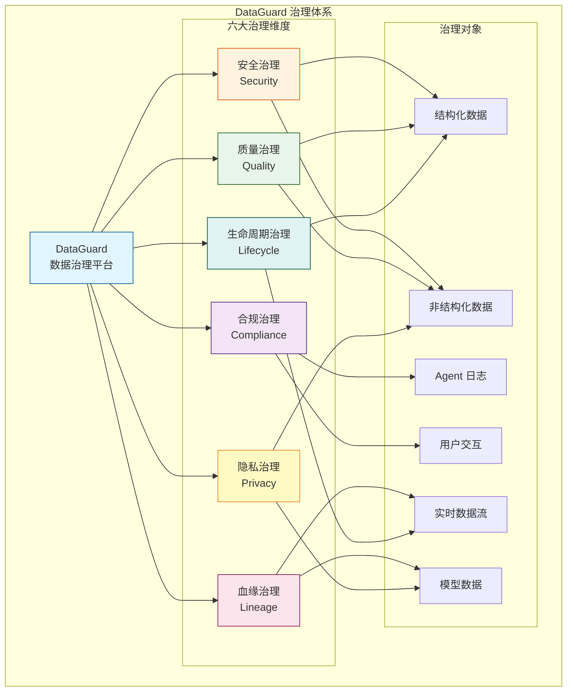
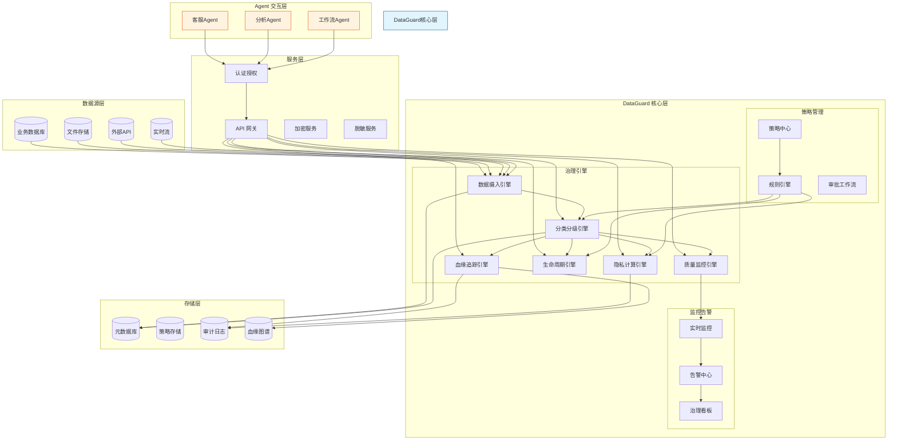
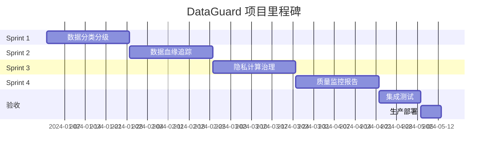

# DataGuard — Agent 数据治理与隐私保护平台

## 项目定位

DataGuard 是一个面向企业级 AI 应用的**数据全生命周期治理平台**，专注于解决 Agent 系统中的数据安全、合规性、质量、血缘追踪、隐私保护和生命周期管理等核心问题。在传统数据治理的基础上，DataGuard 创新性地引入了 Agent-native 的治理能力，能够理解、监控和优化 Agent 与数据交互的全过程。

### 核心价值主张

- **Agent-Aware 治理**：深度理解 Agent 的数据访问模式，提供针对性的治理策略
- **全生命周期覆盖**：从数据采集、存储、处理到销毁的完整治理链路
- **智能合规保障**：基于 LLM 的自动分类分级，确保符合 GDPR、CCPA、个人信息保护法等法规
- **实时血缘追踪**：动态追踪数据在 Agent 系统中的流转路径和影响范围
- **隐私优先设计**：内置差分隐私、联邦学习等隐私保护技术

### 业务场景

1. **金融行业**：AI 客服 Agent 访问客户数据时的实时合规检查和脱敏
2. **医疗健康**：医疗诊断 Agent 的患者数据隐私保护和使用审计
3. **企业知识库**：RAG 系统中的文档分类分级和访问控制
4. **政务数据**：跨部门数据共享时的安全治理和追溯

## 数据治理六大维度



### 1. 安全治理 (Security Governance)

**目标**：确保数据在 Agent 系统中的机密性、完整性和可用性

- **访问控制**：基于角色的细粒度权限管理 (RBAC + ABAC)
- **加密管理**：静态加密 (AES-256) 和传输加密 (TLS 1.3)
- **审计追踪**：完整记录所有数据访问和操作日志
- **威胁检测**：异常访问模式识别和安全事件响应

### 2. 合规治理 (Compliance Governance)

**目标**：确保数据处理符合法律法规和行业标准

- **分类分级**：自动识别数据敏感级别（公开/内部/机密/绝密）
- **法规映射**：GDPR、CCPA、个人信息保护法、等保2.0
- **合规报告**：自动生成合规性评估报告
- **风险预警**：违规操作实时拦截和告警

### 3. 质量治理 (Quality Governance)

**目标**：保障数据质量，提升 Agent 决策准确性

- **数据质量监控**：完整性、准确性、一致性、时效性、唯一性
- **智能评分**：基于 LLM 的数据质量多维评估
- **异常检测**：自动识别数据异常和漂移
- **自动修复**：数据清洗和标准化建议

### 4. 血缘治理 (Lineage Governance)

**目标**：追踪数据流转路径，支持影响分析和故障回溯

- **自动血缘追踪**：捕获 Agent 读写操作的数据依赖关系
- **可视化图谱**：实时展示数据流向和转换过程
- **影响分析**：变更影响范围自动评估
- **故障定位**：数据问题根因分析

### 5. 隐私治理 (Privacy Governance)

**目标**：在数据可用性和隐私保护之间取得平衡

- **差分隐私**：向查询添加噪声保护个体隐私
- **合成数据**：生成符合统计特征的隐私安全数据
- **联邦治理**：跨组织协作中的隐私保护机制
- **隐私预算管理**：差分隐私预算的动态分配和监控

### 6. 生命周期治理 (Lifecycle Governance)

**目标**：规范数据从产生到销毁的全过程管理

- **数据归档**：冷热数据分层存储策略
- **保留策略**：基于法规要求的自动保留和删除
- **版本管理**：数据变更历史和版本回溯
- **安全销毁**：数据彻底删除和证伪擦除

## 架构总览



### 技术栈选型

| 层级 | 技术选择 | 说明 |
|------|---------|------|
| **后端框架** | Spring Boot 3.x | 企业级 Java 开发框架 |
| **数据存储** | PostgreSQL + Neo4j | 关系型数据库 + 图数据库（血缘） |
| **消息队列** | Apache Kafka | 数据流处理和事件驱动 |
| **缓存** | Redis | 高频访问策略和元数据缓存 |
| **搜索引擎** | Elasticsearch | 审计日志全文检索 |
| **LLM 集成** | LangChain4j | 分类分级和质量评估 |
| **安全** | Spring Security + JWT | 认证授权机制 |
| **监控** | Prometheus + Grafana | 指标监控和可视化 |
| **血缘可视化** | D3.js + Cytoscape.js | 前端图谱渲染 |

## Sprint 规划

### Sprint 1: 数据分类分级与标签体系（4周）

**目标**：建立自动化的数据分类分级能力

**V1 - 手动标签阶段**
- 实现基础元数据管理
- 支持手动打标签和分类
- 简单的基于规则的访问控制

**V2 - LLM 自动分类分级阶段**
- 集成 LLM 进行内容分析
- 自动识别敏感级别（公开/内部/机密/绝密）
- 智能标签推荐和自动分类

**V3 - 动态数据感知阶段**
- 实时数据流分类
- 上下文感知的动态标签
- 自适应分类模型优化

**交付物**：
- DataClassifier 核心组件
- 标签管理系统
- 分类分级 API

### Sprint 2: 数据血缘与影响分析（4周）

**目标**：实现自动化的血缘追踪和影响分析

**V1 - 手动血缘阶段**
- 支持手动录入血缘关系
- 简单的表格展示
- 基础的上下游查询

**V2 - 自动血缘追踪阶段**
- Agent 操作自动捕获
- 血缘图谱自动构建
- SQL 解析和依赖分析

**V3 - 实时影响分析阶段**
- 实时血缘更新
- 变更影响范围评估
- 根因分析和故障定位

**交付物**：
- LineageTracker 核心组件
- 血缘图谱可视化
- 影响分析 API

### Sprint 3: 隐私计算与联邦治理（4周）

**目标**：集成隐私保护技术，实现安全的数据协作

**V1 - 脱敏 + 访问控制阶段**
- 静态脱敏算法
- 基于角色的访问控制
- 审计日志记录

**V2 - 差分隐私 + 合成数据阶段**
- 差分隐私查询引擎
- 合成数据生成器
- 隐私预算管理

**V3 - 联邦数据治理阶段**
- 联邦学习集成
- 跨组织隐私保护
- 分布式审计和合规

**交付物**：
- PrivacyEngine 核心组件
- 差分隐私 API
- 联邦治理接口

### Sprint 4: 数据质量监控与治理报告（4周）

**目标**：建立全面的数据质量监控和治理报告体系

**V1 - 规则检查阶段**
- 基于规则的质量检查
- 基础指标计算
- 简单的质量报告

**V2 - 智能质量评分阶段**
- LLM 驱动的质量评估
- 多维质量评分模型
- 异常自动检测

**V3 - 自动修复 + 治理看板阶段**
- 智能数据修复建议
- 实时治理看板
- 自动化治理工作流

**交付物**：
- QualityMonitor 核心组件
- 治理看板
- 自动修复 API

## 知识点映射表

| Sprint | 核心技术 | LLM 应用 | 数据治理概念 | Java 技术点 | 分布式技术 |
|--------|---------|---------|-------------|-------------|-----------|
| Sprint 1 | 文本分类、标签系统 | 内容理解、分类推理 | 数据分类分级、元数据管理 | Spring Data、自定义注解 | Redis 缓存、分布式锁 |
| Sprint 2 | 图数据库、SQL 解析 | 关系抽取、影响分析 | 数据血缘、依赖分析 | Neo4j OGM、JPA | Kafka 事件流 |
| Sprint 3 | 差分隐私、数据脱敏 | 隐私风险评估 | 隐私保护、联邦学习 | 加密算法、SecureRandom | 分布式审计 |
| Sprint 4 | 规则引擎、异常检测 | 质量评估、修复建议 | 数据质量维度、治理指标 | 规则引擎(Drools)、批处理 | Prometheus 指标 |

### 前置知识要求

**必备知识**：
- Java 17+ 核心特性（Record、Pattern Matching）
- Spring Boot 生态（Spring Data、Spring Security）
- SQL 基础和数据库设计
- RESTful API 设计

**加分知识**：
- LLM 基础概念（Prompt Engineering、Function Calling）
- 图数据库基础（Neo4j、Cypher）
- 数据治理基础概念（DAM-DMBOK）
- 基础加密和隐私保护知识

### 学习产出

完成本项目后，你将掌握：

1. **企业级数据治理架构设计**：从零构建完整的数据治理平台
2. **Agent-native 治理能力**：深度理解 AI 应用中的数据治理挑战
3. **LLM 在治理中的应用**：分类分级、质量评估的智能化实践
4. **隐私保护技术**：差分隐私、联邦学习的工程实现
5. **血缘追踪和影响分析**：图数据库在数据治理中的应用
6. **实时监控和告警**：构建生产级的数据质量监控系统

## 项目里程碑



## 快速开始

### 环境准备

```bash
# 克隆项目
git clone https://github.com/your-org/dataguard.git
cd dataguard

# 启动依赖服务（Docker Compose）
docker-compose up -d postgres neo4j kafka redis

# 运行项目
./gradlew bootRun
```

### 示例代码

```java
// 数据分类分级示例
DataClassifier classifier = new DataClassifier();
ClassificationResult result = classifier.classify(
    "客户张三的身份证号是 110101199001011234，手机号 13800138000"
);
// result.level = SECRET
// result.tags = [PII, ID_NUMBER, PHONE]

// 血缘追踪示例
LineageTracker tracker = new LineageTracker();
tracker.trackOperation(
    "agent-123",
    "SELECT * FROM customers WHERE id = ?",
    "customer-table"
);
// 自动建立血缘关系

// 隐私查询示例
PrivacyEngine privacy = new PrivacyEngine();
QueryResult result = privacy.queryWithDP(
    "SELECT AVG(income) FROM customers",
    epsilon = 1.0
);
// 添加拉普拉斯噪声保护隐私
```

## 参考资源

- [DAM-DMBOK 数据管理知识体系指南](https://dama.org/)
- [GDPR 合规指南](https://gdpr.eu/)
- [Neo4j 数据血缘最佳实践](https://neo4j.com/developer-blog/data-lineage/)
- [差分隐私入门](https://www.cis.upenn.edu/~aaroth/Papers/privacybook.pdf)
- [个人信息保护法全文](http://www.npc.gov.cn/npc/c30834/202108/a8c4e3672c74491a80b53a172bb753fe.shtml)

---

**下一步**：阅读 [Sprint 1-数据分类分级与标签体系](./Sprint1-数据分类分级与标签体系.md)
