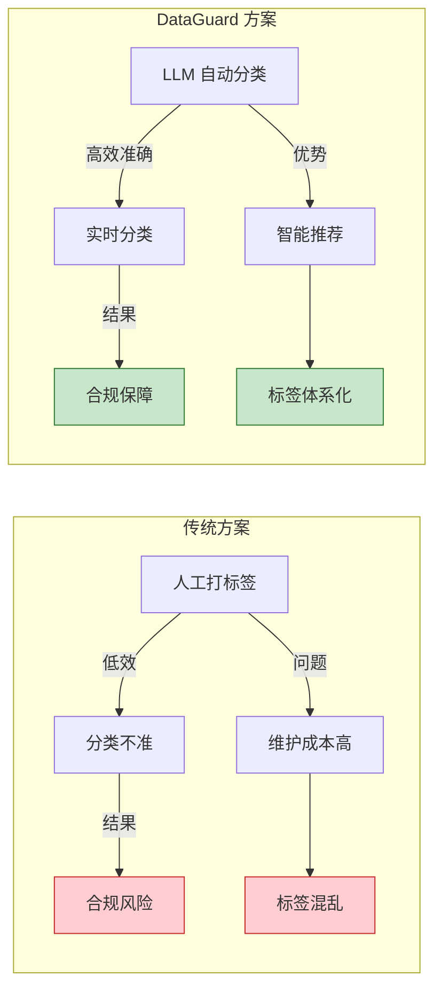
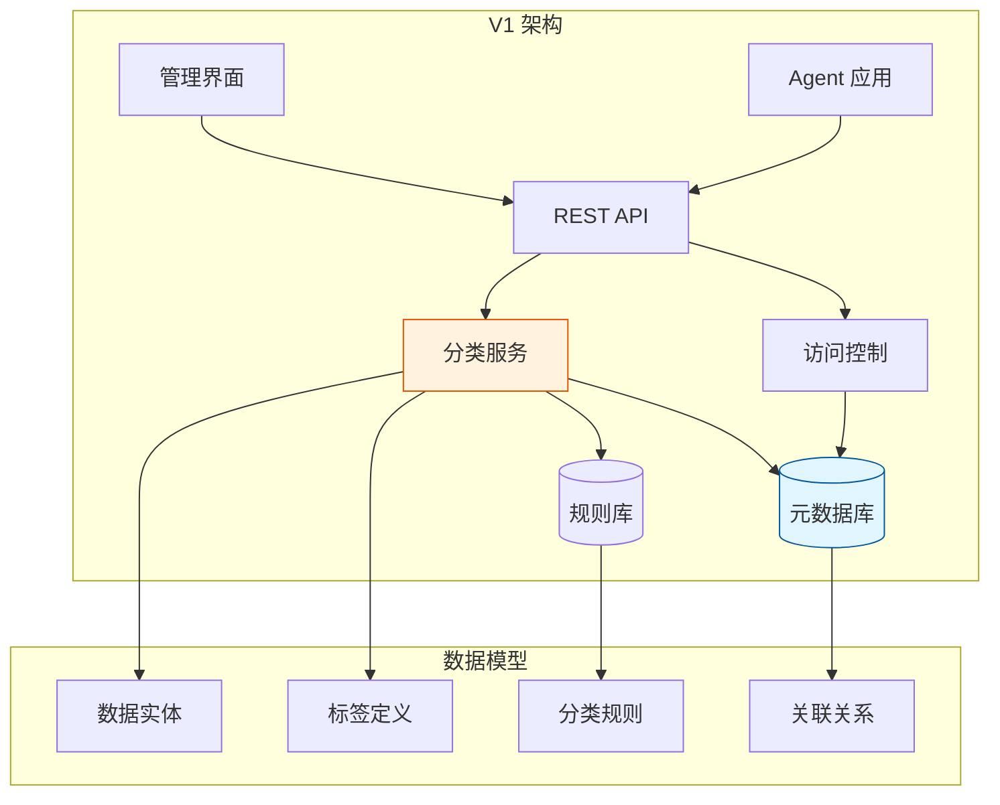
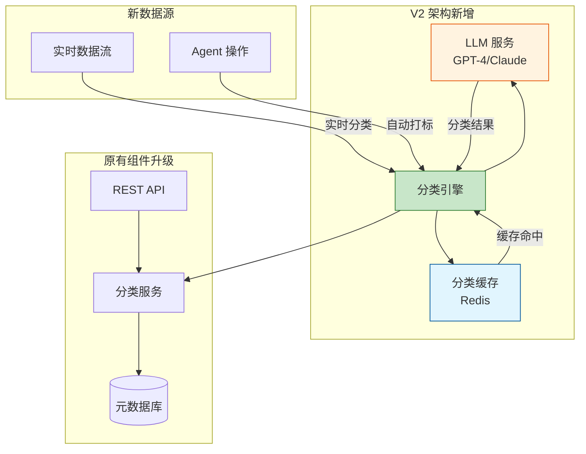
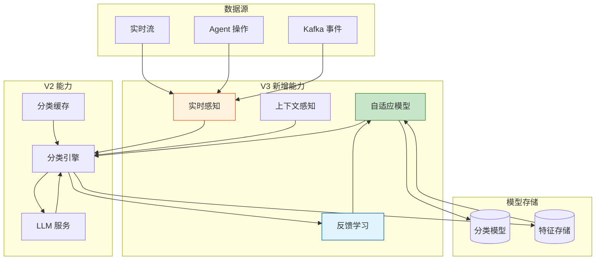

# Sprint 1: 数据分类分级与标签体系

## Sprint 目标

建立自动化的数据分类分级能力，实现从手动标签管理到 LLM 智能分类，再到动态数据感知的完整演进。本 Sprint 是 DataGuard 平台的基石，后续所有治理能力都建立在准确的分类分级基础之上。

## 业务背景

### 为什么需要分类分级

在 AI Agent 应用中，数据治理面临前所未有的挑战：

1. **数据量爆炸**：Agent 产生的日志、对话、推理结果呈指数级增长
2. **访问模式复杂**：传统 RBAC 无法应对 Agent 的动态数据访问
3. **合规要求严格**：GDPR、个人信息保护法要求精确的数据分类
4. **实时性需求**：数据需要在产生时立即被正确分类

### 传统方案的痛点



## V1: 手动标签阶段

### 架构设计

V1 阶段建立基础的元数据管理和手动打标签能力，为后续自动化打下基础。



### 核心数据模型

```java
package com.dataguard.core.metadata;

import jakarta.persistence.*;
import java.time.LocalDateTime;
import java.util.Set;

/**
 * 数据实体 - 代表需要治理的数据资源
 */
@Entity
@Table(name = "data_entities")
public class DataEntity {
    
    @Id
    @GeneratedValue(strategy = GenerationType.IDENTITY)
    private Long id;
    
    /**
     * 数据源类型：DATABASE, API, FILE, STREAM, AGENT_LOG
     */
    @Enumerated(EnumType.STRING)
    @Column(nullable = false)
    private DataSourceType sourceType;
    
    /**
     * 资源唯一标识
     */
    @Column(unique = true, nullable = false)
    private String resourceId;
    
    /**
     * 资源名称
     */
    @Column(nullable = false)
    private String name;
    
    /**
     * 资源描述
     */
    @Column(length = 1000)
    private String description;
    
    /**
     * 所有者系统
     */
    @Column(nullable = false)
    private String ownerSystem;
    
    /**
     * 数据敏感级别
     */
    @Enumerated(EnumType.STRING)
    @Column(nullable = false)
    private SensitivityLevel sensitivityLevel;
    
    /**
     * 关联的标签
     */
    @ManyToMany(mappedBy = "entities")
    private Set<DataTag> tags;
    
    /**
     * 创建时间
     */
    @Column(nullable = false, updatable = false)
    private LocalDateTime createdAt;
    
    /**
     * 更新时间
     */
    @Column(nullable = false)
    private LocalDateTime updatedAt;
    
    /**
     * 创建人
     */
    @Column(nullable = false, updatable = false)
    private String createdBy;
    
    /**
     * 更新人
     */
    @Column(nullable = false)
    private String updatedBy;
    
    // 枚举定义
    public enum DataSourceType {
        DATABASE,    // 数据库表/视图
        API,         // API 端点
        FILE,        // 文件资源
        STREAM,      // 实时数据流
        AGENT_LOG,   // Agent 日志
        MODEL_OUTPUT // 模型输出
    }
    
    public enum SensitivityLevel {
        PUBLIC("公开"),      // 公开数据，无限制访问
        INTERNAL("内部"),    // 内部数据，仅公司内部访问
        CONFIDENTIAL("机密"),// 机密数据，需要授权访问
        SECRET("绝密");     // 绝密数据，严格控制访问
        
        private final String description;
        
        SensitivityLevel(String description) {
            this.description = description;
        }
    }
    
    // Getters and Setters
    // equals() and hashCode() based on resourceId
    // Builder pattern support
}
```

```java
package com.dataguard.core.metadata;

import jakarta.persistence.*;
import java.util.Set;

/**
 * 数据标签 - 用于细粒度分类
 */
@Entity
@Table(name = "data_tags")
public class DataTag {
    
    @Id
    @GeneratedValue(strategy = GenerationType.IDENTITY)
    private Long id;
    
    /**
     * 标签代码，全局唯一
     */
    @Column(unique = true, nullable = false)
    private String code;
    
    /**
     * 标签名称
     */
    @Column(nullable = false)
    private String name;
    
    /**
     * 标签分类
     */
    @Enumerated(EnumType.STRING)
    @Column(nullable = false)
    private TagCategory category;
    
    /**
     * 标签描述
     */
    @Column(length = 1000)
    private String description;
    
    /**
     * 标签颜色（用于UI展示）
     */
    @Column(length = 7)
    private String color;
    
    /**
     * 是否为系统标签
     */
    @Column(nullable = false)
    private Boolean isSystemTag;
    
    /**
     * 使用此标签的数据实体
     */
    @ManyToMany
    @JoinTable(
        name = "entity_tags",
        joinColumns = @JoinColumn(name = "tag_id"),
        inverseJoinColumns = @JoinColumn(name = "entity_id")
    )
    private Set<DataEntity> entities;
    
    public enum TagCategory {
        PII("个人身份信息"),
        FINANCIAL("财务信息"),
        HEALTH("健康信息"),
        BUSINESS("商业信息"),
        TECHNICAL("技术信息"),
        LEGAL("法律信息"),
        LOCATION("位置信息");
        
        private final String description;
        
        TagCategory(String description) {
            this.description = description;
        }
    }
    
    // Getters, Setters, equals, hashCode, Builder
}
```

### 核心服务实现

```java
package com.dataguard.core.classification;

import com.dataguard.core.metadata.*;
import lombok.RequiredArgsConstructor;
import lombok.extern.slf4j.Slf4j;
import org.springframework.stereotype.Service;
import org.springframework.transaction.annotation.Transactional;

import java.time.LocalDateTime;
import java.util.Set;

/**
 * V1 分类服务 - 手动标签管理
 */
@Slf4j
@Service
@RequiredArgsConstructor
public class V1ClassificationService {
    
    private final DataEntityRepository entityRepository;
    private final DataTagRepository tagRepository;
    private final AccessControlService accessControlService;
    
    /**
     * 创建数据实体
     */
    @Transactional
    public DataEntity createEntity(CreateEntityRequest request, String operator) {
        log.info("Creating data entity: {}", request.getResourceId());
        
        // 检查是否已存在
        if (entityRepository.findByResourceId(request.getResourceId()).isPresent()) {
            throw new DuplicateResourceException(
                "Entity already exists: " + request.getResourceId()
            );
        }
        
        DataEntity entity = DataEntity.builder()
            .sourceType(request.getSourceType())
            .resourceId(request.getResourceId())
            .name(request.getName())
            .description(request.getDescription())
            .ownerSystem(request.getOwnerSystem())
            .sensitivityLevel(request.getSensitivityLevel())
            .createdAt(LocalDateTime.now())
            .updatedAt(LocalDateTime.now())
            .createdBy(operator)
            .updatedBy(operator)
            .build();
        
        entity = entityRepository.save(entity);
        
        // 关联标签
        if (request.getTags() != null && !request.getTags().isEmpty()) {
            attachTags(entity, request.getTags(), operator);
        }
        
        log.info("Created data entity with id: {}", entity.getId());
        return entity;
    }
    
    /**
     * 为实体添加标签
     */
    @Transactional
    public void attachTags(DataEntity entity, Set<String> tagCodes, String operator) {
        log.info("Attaching {} tags to entity {}", tagCodes.size(), entity.getResourceId());
        
        Set<DataTag> tags = tagRepository.findByCodeIn(tagCodes);
        
        if (tags.size() != tagCodes.size()) {
            Set<String> found = tags.stream().map(DataTag::getCode).collect(java.util.stream.Collectors.toSet());
            Set<String> missing = new java.util.HashSet<>(tagCodes);
            missing.removeAll(found);
            throw new TagNotFoundException("Tags not found: " + missing);
        }
        
        entity.getTags().addAll(tags);
        entity.setUpdatedAt(LocalDateTime.now());
        entity.setUpdatedBy(operator);
        entityRepository.save(entity);
        
        // 更新访问控制策略
        accessControlService.updatePolicy(entity, tags);
    }
    
    /**
     * 移除标签
     */
    @Transactional
    public void removeTag(Long entityId, String tagCode, String operator) {
        log.info("Removing tag {} from entity {}", tagCode, entityId);
        
        DataEntity entity = entityRepository.findById(entityId)
            .orElseThrow(() -> new EntityNotFoundException(entityId));
        
        DataTag tag = tagRepository.findByCode(tagCode)
            .orElseThrow(() -> new TagNotFoundException(tagCode));
        
        if (entity.getTags().remove(tag)) {
            entity.setUpdatedAt(LocalDateTime.now());
            entity.setUpdatedBy(operator);
            entityRepository.save(entity);
            
            // 更新访问控制策略
            accessControlService.updatePolicy(entity, entity.getTags());
        }
    }
    
    /**
     * 批量导入分类信息
     */
    @Transactional
    public BatchImportResult batchImport(BatchImportRequest request) {
        log.info("Batch importing {} entities", request.getItems().size());
        
        BatchImportResult result = new BatchImportResult();
        
        for (BatchImportItem item : request.getItems()) {
            try {
                if (entityRepository.findByResourceId(item.getResourceId()).isPresent()) {
                    // 更新现有实体
                    updateEntity(item, request.getOperator());
                    result.incrementUpdated();
                } else {
                    // 创建新实体
                    createEntityFromItem(item, request.getOperator());
                    result.incrementCreated();
                }
            } catch (Exception e) {
                log.error("Failed to import entity: {}", item.getResourceId(), e);
                result.addError(item.getResourceId(), e.getMessage());
            }
        }
        
        return result;
    }
    
    private void updateEntity(BatchImportItem item, String operator) {
        DataEntity entity = entityRepository.findByResourceId(item.getResourceId()).get();
        entity.setName(item.getName());
        entity.setDescription(item.getDescription());
        entity.setSensitivityLevel(item.getSensitivityLevel());
        entity.setUpdatedAt(LocalDateTime.now());
        entity.setUpdatedBy(operator);
        entityRepository.save(entity);
        
        // 更新标签
        if (item.getTags() != null) {
            entity.getTags().clear();
            attachTags(entity, item.getTags(), operator);
        }
    }
    
    private void createEntityFromItem(BatchImportItem item, String operator) {
        CreateEntityRequest request = CreateEntityRequest.builder()
            .sourceType(item.getSourceType())
            .resourceId(item.getResourceId())
            .name(item.getName())
            .description(item.getDescription())
            .ownerSystem(item.getOwnerSystem())
            .sensitivityLevel(item.getSensitivityLevel())
            .tags(item.getTags())
            .build();
        
        createEntity(request, operator);
    }
}
```

### 访问控制服务

```java
package com.dataguard.core.access;

import com.dataguard.core.metadata.*;
import lombok.RequiredArgsConstructor;
import lombok.extern.slf4j.Slf4j;
import org.springframework.stereotype.Service;

import java.util.EnumMap;
import java.util.Map;
import java.util.Set;

/**
 * V1 访问控制服务 - 基于敏感级别的简单RBAC
 */
@Slf4j
@Service
@RequiredArgsConstructor
public class AccessControlService {
    
    private final PolicyRepository policyRepository;
    
    // 敏感级别到所需角色的映射
    private static final Map<SensitivityLevel, Set<String>> LEVEL_ROLES = new EnumMap<>(SensitivityLevel.class);
    
    static {
        LEVEL_ROLES.put(SensitivityLevel.PUBLIC, Set.of("GUEST", "USER", "ADMIN"));
        LEVEL_ROLES.put(SensitivityLevel.INTERNAL, Set.of("USER", "ADMIN"));
        LEVEL_ROLES.put(SensitivityLevel.CONFIDENTIAL, Set.of("ADMIN", "MANAGER"));
        LEVEL_ROLES.put(SensitivityLevel.SECRET, Set.of("ADMIN"));
    }
    
    /**
     * 检查访问权限
     */
    public AccessDecision checkAccess(String resourceId, Set<String> userRoles) {
        DataEntity entity = entityRepository.findByResourceId(resourceId)
            .orElseThrow(() -> new EntityNotFoundException(resourceId));
        
        Set<String> allowedRoles = LEVEL_ROLES.get(entity.getSensitivityLevel());
        
        boolean allowed = userRoles.stream()
            .anyMatch(allowedRoles::contains);
        
        return AccessDecision.builder()
            .allowed(allowed)
            .entityId(entity.getId())
            .sensitivityLevel(entity.getSensitivityLevel())
            .reason(allowed ? "Role authorized" : "Insufficient privileges")
            .build();
    }
    
    /**
     * 更新访问控制策略
     */
    public void updatePolicy(DataEntity entity, Set<DataTag> tags) {
        AccessPolicy policy = AccessPolicy.builder()
            .entityId(entity.getId())
            .sensitivityLevel(entity.getSensitivityLevel())
            .tagCodes(tags.stream().map(DataTag::getCode).collect(java.util.stream.Collectors.toSet()))
            .build();
        
        policyRepository.save(policy);
        
        log.debug("Updated access policy for entity: {}", entity.getResourceId());
    }
}
```

### V1 阶段的局限性

1. **手动操作繁琐**：需要人工为每个数据资源打标签
2. **分类不一致**：不同人员对相同数据的分类可能不同
3. **无法处理新数据**：新产生的数据需要等待人工处理
4. **规则僵化**：固定的级别到角色映射无法应对复杂场景

## V2: LLM 自动分类分级阶段

### 架构演进

V2 引入 LLM 能力，实现智能化的自动分类分级。



### LLM 集成架构

```java
package com.dataguard.core.classification.llm;

import dev.langchain4j.model.chat.ChatLanguageModel;
import dev.langchain4j.model.openai.OpenAiChatModel;
import dev.langchain4j.data.message.*;
import dev.langchain4j.data.message.AiMessage;
import lombok.extern.slf4j.Slf4j;
import org.springframework.beans.factory.annotation.Value;
import org.springframework.stereotype.Component;

import java.util.List;

/**
 * LLM 分类器 - 使用 LangChain4j 集成
 */
@Slf4j
@Component
public class LLMDataClassifier {
    
    private final ChatLanguageModel model;
    
    public LLMDataClassifier(
        @Value("${dataguard.llm.provider:openai}") String provider,
        @Value("${dataguard.llm.api-key}") String apiKey,
        @Value("${dataguard.llm.model:gpt-4-turbo}") String modelName,
        @Value("${dataguard.llm.temperature:0.0}") double temperature
    ) {
        this.model = OpenAiChatModel.builder()
            .apiKey(apiKey)
            .modelName(modelName)
            .temperature(temperature)
            .timeout(java.time.Duration.ofSeconds(30))
            .build();
        
        log.info("Initialized LLM classifier with provider: {}, model: {}", provider, modelName);
    }
    
    /**
     * 对文本内容进行分类分级
     */
    public ClassificationResult classify(String content, ClassificationContext context) {
        log.debug("Classifying content of {} bytes", content.length());
        
        String systemPrompt = buildSystemPrompt();
        String userPrompt = buildUserPrompt(content, context);
        
        List<ChatMessage> messages = List.of(
            SystemMessage.from(systemPrompt),
            UserMessage.from(userPrompt)
        );
        
        try {
            AiMessage response = model.generate(messages).content();
            return parseClassificationResult(response.text());
        } catch (Exception e) {
            log.error("LLM classification failed", e);
            return ClassificationResult.fallback();
        }
    }
    
    /**
     * 构建系统提示词
     */
    private String buildSystemPrompt() {
        return """
            你是一个数据安全分类专家。你的任务是分析数据内容，确定其敏感级别和标签。
            
            ## 敏感级别定义
            - PUBLIC: 公开数据，任何人都可以访问
            - INTERNAL: 内部数据，仅限公司内部人员访问
            - CONFIDENTIAL: 机密数据，包含敏感信息，需要授权访问
            - SECRET: 绝密数据，包含高度敏感信息，严格控制访问
            
            ## 数据标签
            - PII: 个人身份信息（姓名、身份证、护照等）
            - PHONE: 电话号码
            - EMAIL: 电子邮件地址
            - ID_NUMBER: 身份证件号码
            - FINANCIAL: 财务信息（银行卡号、账户余额等）
            - HEALTH: 健康信息
            - BUSINESS: 商业机密
            - CONTRACT: 合同信息
            - LOCATION: 位置信息
            
            ## 输出格式
            请以 JSON 格式输出，包含以下字段：
            {
              "sensitivityLevel": "PUBLIC|INTERNAL|CONFIDENTIAL|SECRET",
              "tags": ["标签1", "标签2", ...],
              "confidence": 0.95,
              "reasoning": "分类理由"
            }
            
            注意：
            1. 只输出 JSON，不要有任何其他内容
            2. confidence 是 0-1 之间的数字
            3. reasoning 简要说明分类依据
            """;
    }
    
    /**
     * 构建用户提示词
     */
    private String buildUserPrompt(String content, ClassificationContext context) {
        StringBuilder prompt = new StringBuilder();
        prompt.append("请分析以下数据内容：\n\n");
        prompt.append("```\n").append(content).append("\n```\n\n");
        
        if (context != null) {
            prompt.append("## 上下文信息\n");
            prompt.append("- 数据源类型: ").append(context.getSourceType()).append("\n");
            prompt.append("- 所属系统: ").append(context.getOwnerSystem()).append("\n");
            if (context.getMetadata() != null) {
                prompt.append("- 元数据: ").append(context.getMetadata()).append("\n");
            }
        }
        
        return prompt.toString();
    }
    
    /**
     * 解析分类结果
     */
    private ClassificationResult parseClassificationResult(String jsonText) {
        try {
            com.fasterxml.jackson.databind.ObjectMapper mapper = new com.fasterxml.jackson.databind.ObjectMapper();
            ClassificationResult result = mapper.readValue(jsonText, ClassificationResult.class);
            
            // 验证结果
            if (result.getSensitivityLevel() == null) {
                result.setSensitivityLevel(SensitivityLevel.INTERNAL); // 默认值
            }
            
            return result;
        } catch (Exception e) {
            log.error("Failed to parse LLM response: {}", jsonText, e);
            return ClassificationResult.fallback();
        }
    }
}
```

### 分类引擎核心实现

```java
package com.dataguard.core.classification;

import com.dataguard.core.metadata.*;
import com.dataguard.core.classification.llm.*;
import lombok.RequiredArgsConstructor;
import lombok.extern.slf4j.Slf4j;
import org.springframework.cache.annotation.Cacheable;
import org.springframework.kafka.annotation.KafkaListener;
import org.springframework.stereotype.Service;
import org.springframework.transaction.annotation.Transactional;

import java.util.concurrent.CompletableFuture;
import java.util.concurrent.Executor;

/**
 * V2 分类引擎 - 智能自动分类
 */
@Slf4j
@Service
@RequiredArgsConstructor
public class DataClassificationEngine {
    
    private final LLMDataClassifier llmClassifier;
    private final DataEntityRepository entityRepository;
    private final DataTagRepository tagRepository;
    private final ClassificationCache cache;
    private final Executor classificationExecutor;
    
    /**
     * 同步分类 - 用于实时场景
     */
    @Cacheable(value = "classification", key = "#contentHash")
    public ClassificationResult classifySync(String content, ClassificationContext context) {
        log.debug("Synchronous classification for content hash: {}", context.getContentHash());
        
        // 先检查缓存
        String cacheKey = buildCacheKey(content, context);
        ClassificationResult cached = cache.get(cacheKey);
        if (cached != null) {
            log.debug("Cache hit for key: {}", cacheKey);
            return cached;
        }
        
        // 调用 LLM 分类
        ClassificationResult result = llmClassifier.classify(content, context);
        
        // 存入缓存
        cache.put(cacheKey, result);
        
        return result;
    }
    
    /**
     * 异步分类 - 用于后台处理
     */
    public CompletableFuture<ClassificationResult> classifyAsync(
        String content, 
        ClassificationContext context
    ) {
        return CompletableFuture.supplyAsync(
            () -> classifySync(content, context),
            classificationExecutor
        );
    }
    
    /**
     * 流式分类 - 用于实时数据流
     */
    @KafkaListener(topics = "data-classification-request")
    public void classifyStream(DataClassificationEvent event) {
        log.info("Processing stream classification for entity: {}", event.getResourceId());
        
        try {
            ClassificationContext context = ClassificationContext.builder()
                .sourceType(event.getSourceType())
                .ownerSystem(event.getOwnerSystem())
                .contentHash(event.getContentHash())
                .metadata(event.getMetadata())
                .build();
            
            ClassificationResult result = classifySync(event.getContent(), context);
            
            // 更新实体分类
            updateEntityClassification(event.getResourceId(), result);
            
            // 发布分类完成事件
            publishClassificationComplete(event.getResourceId(), result);
            
        } catch (Exception e) {
            log.error("Stream classification failed for: {}", event.getResourceId(), e);
            publishClassificationFailed(event.getResourceId(), e.getMessage());
        }
    }
    
    /**
     * 批量分类
     */
    public BatchClassificationResult batchClassify(BatchClassificationRequest request) {
        log.info("Batch classifying {} items", request.getItems().size());
        
        BatchClassificationResult result = new BatchClassificationResult();
        
        request.getItems().parallelStream().forEach(item -> {
            try {
                ClassificationContext context = ClassificationContext.builder()
                    .sourceType(item.getSourceType())
                    .ownerSystem(item.getOwnerSystem())
                    .contentHash(item.getContentHash())
                    .build();
                
                ClassificationResult classification = classifySync(item.getContent(), context);
                
                result.addResult(item.getResourceId(), classification);
                
                // 自动应用分类
                if (request.isAutoApply()) {
                    applyClassification(item.getResourceId(), classification);
                }
                
            } catch (Exception e) {
                log.error("Classification failed for: {}", item.getResourceId(), e);
                result.addError(item.getResourceId(), e);
            }
        });
        
        return result;
    }
    
    /**
     * 应用分类结果到实体
     */
    @Transactional
    public void applyClassification(String resourceId, ClassificationResult result) {
        log.info("Applying classification to entity: {}", resourceId);
        
        DataEntity entity = entityRepository.findByResourceId(resourceId)
            .orElseGet(() -> createEntityFromClassification(resourceId, result));
        
        // 更新敏感级别
        if (entity.getSensitivityLevel() != result.getSensitivityLevel()) {
            entity.setSensitivityLevel(result.getSensitivityLevel());
            entity.setUpdatedAt(java.time.LocalDateTime.now());
            entity.setUpdatedBy("LLM-Classifier");
        }
        
        // 更新标签
        updateEntityTags(entity, result.getTags());
        
        entityRepository.save(entity);
        
        log.info("Applied classification: level={}, tags={}", 
            result.getSensitivityLevel(), result.getTags());
    }
    
    private void updateEntityTags(DataEntity entity, java.util.Set<String> tagCodes) {
        // 清除现有标签
        entity.getTags().clear();
        
        // 添加新标签（自动创建不存在的标签）
        for (String tagCode : tagCodes) {
            DataTag tag = tagRepository.findByCode(tagCode)
                .orElseGet(() -> createTagFromCode(tagCode));
            entity.getTags().add(tag);
        }
    }
    
    private DataEntity createEntityFromClassification(String resourceId, ClassificationResult result) {
        return DataEntity.builder()
            .resourceId(resourceId)
            .name("Auto-created: " + resourceId)
            .description("Auto-created by LLM classifier")
            .sourceType(DataEntity.DataSourceType.AGENT_LOG)
            .ownerSystem("Unknown")
            .sensitivityLevel(result.getSensitivityLevel())
            .createdAt(java.time.LocalDateTime.now())
            .updatedAt(java.time.LocalDateTime.now())
            .createdBy("LLM-Classifier")
            .updatedBy("LLM-Classifier")
            .tags(new java.util.HashSet<>())
            .build();
    }
    
    private DataTag createTagFromCode(String tagCode) {
        return tagRepository.save(DataTag.builder()
            .code(tagCode)
            .name("Auto: " + tagCode)
            .category(inferTagCategory(tagCode))
            .isSystemTag(false)
            .build());
    }
    
    private DataTag.TagCategory inferTagCategory(String tagCode) {
        // 根据标签代码推断分类
        if (tagCode.contains("PII") || tagCode.contains("ID") || tagCode.contains("PHONE")) {
            return DataTag.TagCategory.PII;
        } else if (tagCode.contains("FINANCIAL")) {
            return DataTag.TagCategory.FINANCIAL;
        } else if (tagCode.contains("HEALTH")) {
            return DataTag.TagCategory.HEALTH;
        } else {
            return DataTag.TagCategory.BUSINESS;
        }
    }
    
    private String buildCacheKey(String content, ClassificationContext context) {
        return org.apache.commons.codec.digest.DigestUtils.sha256Hex(
            content + "|" + context.getSourceType() + "|" + context.getOwnerSystem()
        );
    }
    
    // 事件发布方法
    private void publishClassificationComplete(String resourceId, ClassificationResult result) {
        // 实现 Kafka 事件发布
    }
    
    private void publishClassificationFailed(String resourceId, String error) {
        // 实现 Kafka 事件发布
    }
}
```

### 分类缓存实现

```java
package com.dataguard.core.classification;

import com.dataguard.core.classification.llm.ClassificationResult;
import com.fasterxml.jackson.databind.ObjectMapper;
import lombok.RequiredArgsConstructor;
import lombok.extern.slf4j.Slf4j;
import org.springframework.data.redis.core.RedisTemplate;
import org.springframework.stereotype.Component;

import java.time.Duration;

/**
 * 分类结果缓存 - 使用 Redis
 */
@Slf4j
@Component
@RequiredArgsConstructor
public class ClassificationCache {
    
    private final RedisTemplate<String, String> redisTemplate;
    private final ObjectMapper objectMapper;
    
    private static final String CACHE_PREFIX = "classification:";
    private static final Duration CACHE_TTL = Duration.ofHours(24);
    
    public void put(String key, ClassificationResult result) {
        try {
            String cacheKey = CACHE_PREFIX + key;
            String value = objectMapper.writeValueAsString(result);
            redisTemplate.opsForValue().set(cacheKey, value, CACHE_TTL);
            log.debug("Cached classification result for key: {}", key);
        } catch (Exception e) {
            log.error("Failed to cache classification result", e);
        }
    }
    
    public ClassificationResult get(String key) {
        try {
            String cacheKey = CACHE_PREFIX + key;
            String value = redisTemplate.opsForValue().get(cacheKey);
            if (value != null) {
                return objectMapper.readValue(value, ClassificationResult.class);
            }
        } catch (Exception e) {
            log.error("Failed to retrieve cached classification", e);
        }
        return null;
    }
    
    public void invalidate(String key) {
        String cacheKey = CACHE_PREFIX + key;
        redisTemplate.delete(cacheKey);
        log.debug("Invalidated cache for key: {}", key);
    }
    
    public void clearAll() {
        java.util.Set<String> keys = redisTemplate.keys(CACHE_PREFIX + "*");
        if (keys != null && !keys.isEmpty()) {
            redisTemplate.delete(keys);
            log.info("Cleared {} classification cache entries", keys.size());
        }
    }
}
```

### V2 阶段的增强

相比 V1，V2 提供了以下能力：

1. **自动分类**：LLM 自动分析内容并分类
2. **智能推荐**：提供分类建议，人工确认
3. **批量处理**：高效的批量分类能力
4. **缓存优化**：相似内容复用分类结果
5. **实时支持**：通过 Kafka 支持流式分类

## V3: 动态数据感知阶段

### 架构演进

V3 引入动态感知和自适应学习能力。



### 上下文感知分类

```java
package com.dataguard.core.classification.context;

import lombok.Builder;
import lombok.Data;
import java.time.LocalDateTime;
import java.util.Map;

/**
 * 丰富的分类上下文 - V3 增强
 */
@Data
@Builder
public class ClassificationContext {
    
    // 基础信息（V2）
    private DataEntity.DataSourceType sourceType;
    private String ownerSystem;
    private String contentHash;
    private String metadata;
    
    // V3 新增：增强上下文
    private AgentContext agentContext;
    private UserContext userContext;
    private TemporalContext temporalContext;
    private RelationalContext relationalContext;
    
    /**
     * Agent 上下文
     */
    @Data
    @Builder
    public static class AgentContext {
        private String agentId;
        private String agentType;
        private String sessionId;
        private String conversationId;
        private Map<String, Object> agentState;
    }
    
    /**
     * 用户上下文
     */
    @Data
    @Builder
    public static class UserContext {
        private String userId;
        private String department;
        private String role;
        private java.util.Set<String> permissions;
        private String location;
    }
    
    /**
     * 时间上下文
     */
    @Data
    @Builder
    public static class TemporalContext {
        private LocalDateTime timestamp;
        private String timeOfDay;  // MORNING, AFTERNOON, EVENING, NIGHT
        private String dayOfWeek;   // WEEKDAY, WEEKEND
        private boolean isBusinessHours;
    }
    
    /**
     * 关系上下文 - 与其他数据的关系
     */
    @Data
    @Builder
    public static class RelationalContext {
        private java.util.Set<String> relatedResourceIds;
        private String parentResourceId;
        private java.util.Set<String> derivedFrom;
    }
}
```

### 自适应分类模型

```java
package com.dataguard.core.classification.adaptive;

import com.dataguard.core.classification.llm.ClassificationResult;
import com.dataguard.core.classification.context.ClassificationContext;
import lombok.RequiredArgsConstructor;
import lombok.extern.slf4j.Slf4j;
import org.springframework.stereotype.Component;
import org.springframework.transaction.annotation.Transactional;

import java.math.BigDecimal;
import java.math.RoundingMode;
import java.time.LocalDateTime;
import java.util.*;
import java.util.concurrent.ConcurrentHashMap;

/**
 * 自适应分类模型 - V3 核心能力
 */
@Slf4j
@Component
@RequiredArgsConstructor
public class AdaptiveClassificationModel {
    
    private final ClassificationFeedbackRepository feedbackRepository;
    private final ModelParameterRepository modelParameterRepository;
    
    // 本地模型参数缓存
    private final Map<String, ModelParameters> localModelCache = new ConcurrentHashMap<>();
    
    /**
     * 基于上下文的智能分类
     */
    public ClassificationResult classifyWithContext(
        String content,
        ClassificationContext context,
        ClassificationResult llmResult
    ) {
        // 获取该上下文的模型参数
        ModelParameters params = getModelParameters(context);
        
        // 基于历史反馈调整分类结果
        ClassificationResult adjustedResult = adjustBasedOnFeedback(
            llmResult,
            context,
            params
        );
        
        // 应用业务规则调整
        adjustedResult = applyBusinessRules(adjustedResult, context, params);
        
        return adjustedResult;
    }
    
    /**
     * 基于反馈历史调整分类
     */
    private ClassificationResult adjustBasedOnFeedback(
        ClassificationResult original,
        ClassificationContext context,
        ModelParameters params
    ) {
        // 获取相关反馈
        List<ClassificationFeedback> relevantFeedback = feedbackRepository
            .findRelevantFeedback(context, LocalDateTime.now().minusDays(30));
        
        if (relevantFeedback.isEmpty()) {
            return original;
        }
        
        // 分析反馈模式
        FeedbackPattern pattern = analyzeFeedbackPattern(relevantFeedback);
        
        // 调整置信度
        BigDecimal adjustedConfidence = original.getConfidence()
            .multiply(pattern.getConfidenceMultiplier())
            .min(BigDecimal.ONE)
            .max(BigDecimal.ZERO);
        
        // 如果模式强烈建议不同的分类
        if (pattern.getSuggestedLevel() != null && 
            pattern.getConfidence() > params.getAdoptionThreshold()) {
            original.setSensitivityLevel(pattern.getSuggestedLevel());
            original.setConfidence(adjustedConfidence);
            original.setReasoning(original.getReasoning() + 
                " [Adjusted based on " + relevantFeedback.size() + " feedback samples]");
        }
        
        return original;
    }
    
    /**
     * 应用业务规则
     */
    private ClassificationResult applyBusinessRules(
        ClassificationResult result,
        ClassificationContext context,
        ModelParameters params
    ) {
        // 规则1：工作时间外的访问提升敏感级别
        if (context.getTemporalContext() != null && 
            !context.getTemporalContext().isBusinessHours()) {
            if (result.getSensitivityLevel() == SensitivityLevel.PUBLIC) {
                result.setSensitivityLevel(SensitivityLevel.INTERNAL);
                result.setReasoning(result.getReasoning() + " [Elevated due to non-business hours]");
            }
        }
        
        // 规则2：特定部门的数据自动标记
        if (context.getUserContext() != null && 
            "HR".equals(context.getUserContext().getDepartment())) {
            result.getTags().add("HR-DATA");
            result.getReasoning(result.getReasoning() + " [Added HR-DATA tag]");
        }
        
        // 规则3：关系继承 - 子数据继承父数据的分类
        if (context.getRelationalContext() != null && 
            context.getRelationalContext().getParentResourceId() != null) {
            // 获取父数据分类并继承
            inheritParentClassification(result, context.getRelationalContext());
        }
        
        return result;
    }
    
    /**
     * 学习反馈 - 模型训练
     */
    @Transactional
    public void learnFromFeedback(ClassificationFeedback feedback) {
        log.info("Learning from feedback for entity: {}", feedback.getResourceId());
        
        // 保存反馈
        feedbackRepository.save(feedback);
        
        // 更新模型参数
        updateModelParameters(feedback);
        
        // 清除本地缓存，强制重新加载
        invalidateLocalCache(feedback.getContext());
    }
    
    /**
     * 分析反馈模式
     */
    private FeedbackPattern analyzeFeedbackPattern(List<ClassificationFeedback> feedbacks) {
        FeedbackPattern pattern = new FeedbackPattern();
        
        // 统计分类调整
        Map<SensitivityLevel, Long> levelAdjustments = feedbacks.stream()
            .filter(f -> f.getOriginalLevel() != f.getCorrectedLevel())
            .collect(java.util.stream.Collectors.groupingBy(
                ClassificationFeedback::getCorrectedLevel,
                java.util.stream.Collectors.counting()
            ));
        
        // 找出最常见的调整
        Optional<Map.Entry<SensitivityLevel, Long>> mostCommon = levelAdjustments.entrySet().stream()
            .max(Map.Entry.comparingByValue());
        
        if (mostCommon.isPresent() && mostCommon.get().getValue() >= 3) {
            pattern.setSuggestedLevel(mostCommon.get().getKey());
            pattern.setConfidence(BigDecimal.valueOf(mostCommon.get().getValue())
                .divide(BigDecimal.valueOf(feedbacks.size()), 2, RoundingMode.HALF_UP));
        }
        
        // 计算置信度乘数
        BigDecimal avgConfidenceReduction = feedbacks.stream()
            .filter(f -> f.getOriginalConfidence() != null)
            .map(f -> f.getOriginalConfidence().subtract(BigDecimal.ONE))
            .reduce(BigDecimal.ZERO, BigDecimal::add)
            .divide(BigDecimal.valueOf(feedbacks.size()), 2, RoundingMode.HALF_UP);
        
        pattern.setConfidenceMultiplier(BigDecimal.ONE.subtract(avgConfidenceReduction));
        
        return pattern;
    }
    
    /**
     * 获取或创建模型参数
     */
    private ModelParameters getModelParameters(ClassificationContext context) {
        String contextKey = buildContextKey(context);
        
        return localModelCache.computeIfAbsent(contextKey, key -> {
            return modelParameterRepository.findByContextKey(key)
                .orElseGet(() -> createDefaultParameters(context, key));
        });
    }
    
    private ModelParameters createDefaultParameters(ClassificationContext context, String contextKey) {
        ModelParameters params = ModelParameters.builder()
            .contextKey(contextKey)
            .sourceType(context.getSourceType())
            .ownerSystem(context.getOwnerSystem())
            .adoptionThreshold(BigDecimal.valueOf(0.7))
            .confidenceMultiplier(BigDecimal.ONE)
            .businessRulesEnabled(true)
            .feedbackLearningEnabled(true)
            .lastTrainedAt(LocalDateTime.now())
            .build();
        
        return modelParameterRepository.save(params);
    }
    
    private void updateModelParameters(ClassificationFeedback feedback) {
        String contextKey = buildContextKey(feedback.getContext());
        ModelParameters params = getModelParameters(feedback.getContext());
        
        // 更新参数
        params.setLastTrainedAt(LocalDateTime.now());
        params.setTrainingSamples(params.getTrainingSamples() + 1);
        
        modelParameterRepository.save(params);
    }
    
    private void invalidateLocalCache(ClassificationContext context) {
        String contextKey = buildContextKey(context);
        localModelCache.remove(contextKey);
    }
    
    private String buildContextKey(ClassificationContext context) {
        return String.format("%s:%s", 
            context.getSourceType(), 
            context.getOwnerSystem()
        );
    }
    
    private void inheritParentClassification(
        ClassificationResult result, 
        ClassificationContext.RelationalContext relationalContext
    ) {
        // 实现父分类继承逻辑
    }
    
    /**
     * 反馈模式
     */
    @Data
    private static class FeedbackPattern {
        private SensitivityLevel suggestedLevel;
        private BigDecimal confidence;
        private BigDecimal confidenceMultiplier = BigDecimal.ONE;
    }
}
```

### 实时感知分类器

```java
package com.dataguard.core.classification.realtime;

import com.dataguard.core.classification.*;
import com.dataguard.core.classification.context.*;
import com.dataguard.core.classification.adaptive.*;
import lombok.RequiredArgsConstructor;
import lombok.extern.slf4j.Slf4j;
import org.springframework.kafka.annotation.KafkaListener;
import org.springframework.messaging.simp.SimpMessagingTemplate;
import org.springframework.stereotype.Component;

import java.time.LocalDateTime;

/**
 * 实时数据感知分类器 - V3 核心组件
 */
@Slf4j
@Component
@RequiredArgsConstructor
public class RealtimeDataClassifier {
    
    private final DataClassificationEngine classificationEngine;
    private final AdaptiveClassificationModel adaptiveModel;
    private final SimpMessagingTemplate websocketTemplate;
    
    /**
     * 实时流分类 - Kafka 监听
     */
    @KafkaListener(topics = "data-events", 
                   containerFactory = "batchKafkaListenerContainerFactory")
    public void classifyRealtimeStream(List<DataEvent> events) {
        log.debug("Processing {} realtime events", events.size());
        
        for (DataEvent event : events) {
            try {
                // 构建丰富的上下文
                ClassificationContext context = buildRichContext(event);
                
                // 执行分类
                ClassificationResult llmResult = classificationEngine.classifySync(
                    event.getContent(), 
                    context
                );
                
                // 应用自适应模型调整
                ClassificationResult finalResult = adaptiveModel.classifyWithContext(
                    event.getContent(),
                    context,
                    llmResult
                );
                
                // 实时应用分类
                classificationEngine.applyClassification(
                    event.getResourceId(),
                    finalResult
                );
                
                // 推送 WebSocket 更新
                pushRealtimeUpdate(event, finalResult);
                
            } catch (Exception e) {
                log.error("Realtime classification failed for event: {}", 
                    event.getResourceId(), e);
                handleRealtimeError(event, e);
            }
        }
    }
    
    /**
     * 构建丰富的分类上下文
     */
    private ClassificationContext buildRichContext(DataEvent event) {
        return ClassificationContext.builder()
            .sourceType(event.getSourceType())
            .ownerSystem(event.getOwnerSystem())
            .contentHash(event.getContentHash())
            .metadata(event.getMetadata())
            
            // V3：增强上下文
            .agentContext(buildAgentContext(event))
            .userContext(buildUserContext(event))
            .temporalContext(buildTemporalContext(event))
            .relationalContext(buildRelationalContext(event))
            .build();
    }
    
    private ClassificationContext.AgentContext buildAgentContext(DataEvent event) {
        return ClassificationContext.AgentContext.builder()
            .agentId(event.getAgentId())
            .agentType(event.getAgentType())
            .sessionId(event.getSessionId())
            .conversationId(event.getConversationId())
            .agentState(event.getAgentState())
            .build();
    }
    
    private ClassificationContext.UserContext buildUserContext(DataEvent event) {
        return ClassificationContext.UserContext.builder()
            .userId(event.getUserId())
            .department(event.getDepartment())
            .role(event.getRole())
            .permissions(event.getPermissions())
            .location(event.getLocation())
            .build();
    }
    
    private ClassificationContext.TemporalContext buildTemporalContext(DataEvent event) {
        LocalDateTime now = LocalDateTime.now();
        int hour = now.getHour();
        
        return ClassificationContext.TemporalContext.builder()
            .timestamp(now)
            .timeOfDay(getTimeOfDay(hour))
            .dayOfWeek(isWeekend(now) ? "WEEKEND" : "WEEKDAY")
            .isBusinessHours(isBusinessHours(hour))
            .build();
    }
    
    private ClassificationContext.RelationalContext buildRelationalContext(DataEvent event) {
        // 查询关系数据库构建关系上下文
        return ClassificationContext.RelationalContext.builder()
            .parentResourceId(event.getParentResourceId())
            .relatedResourceIds(java.util.Collections.emptySet())
            .derivedFrom(java.util.Collections.emptySet())
            .build();
    }
    
    private String getTimeOfDay(int hour) {
        if (hour >= 6 && hour < 12) return "MORNING";
        if (hour >= 12 && hour < 18) return "AFTERNOON";
        if (hour >= 18 && hour < 22) return "EVENING";
        return "NIGHT";
    }
    
    private boolean isWeekend(LocalDateTime dateTime) {
        java.time.DayOfWeek day = dateTime.getDayOfWeek();
        return day == java.time.DayOfWeek.SATURDAY || 
               day == java.time.DayOfWeek.SUNDAY;
    }
    
    private boolean isBusinessHours(int hour) {
        return hour >= 9 && hour < 18;
    }
    
    private void pushRealtimeUpdate(DataEvent event, ClassificationResult result) {
        try {
            RealtimeClassificationUpdate update = RealtimeClassificationUpdate.builder()
                .resourceId(event.getResourceId())
                .sensitivityLevel(result.getSensitivityLevel())
                .tags(result.getTags())
                .confidence(result.getConfidence())
                .timestamp(LocalDateTime.now())
                .build();
            
            websocketTemplate.convertAndSend(
                "/topic/classification-updates",
                update
            );
        } catch (Exception e) {
            log.error("Failed to push websocket update", e);
        }
    }
    
    private void handleRealtimeError(DataEvent event, Exception error) {
        // 错误处理逻辑
    }
}
```

### 反馈收集接口

```java
package com.dataguard.core.classification.feedback;

import com.dataguard.core.classification.context.ClassificationContext;
import com.dataguard.core.metadata.SensitivityLevel;
import lombok.Builder;
import lombok.Data;
import org.springframework.web.bind.annotation.*;

import java.math.BigDecimal;
import java.time.LocalDateTime;

/**
 * 分类反馈控制器 - V3 人机协同
 */
@RestController
@RequestMapping("/api/v1/classification/feedback")
@RequiredArgsConstructor
public class ClassificationFeedbackController {
    
    private final AdaptiveClassificationModel adaptiveModel;
    
    /**
     * 提交分类反馈
     */
    @PostMapping
    public void submitFeedback(@RequestBody FeedbackRequest request) {
        ClassificationFeedback feedback = ClassificationFeedback.builder()
            .resourceId(request.getResourceId())
            .originalLevel(request.getOriginalLevel())
            .correctedLevel(request.getCorrectedLevel())
            .originalConfidence(request.getOriginalConfidence())
            .originalTags(request.getOriginalTags())
            .correctedTags(request.getCorrectedTags())
            .feedbackReason(request.getReason())
            .context(request.getContext())
            .feedbackBy(request.getUserId())
            .feedbackAt(LocalDateTime.now())
            .build();
        
        // 提交给自适应模型学习
        adaptiveModel.learnFromFeedback(feedback);
    }
    
    /**
     * 获取待审核的分类（低置信度）
     */
    @GetMapping("/pending-review")
    public PendingClassificationsResponse getPendingReview(
        @RequestParam(defaultValue = "0.8") double maxConfidence
    ) {
        // 返回需要人工审核的分类
        return null;
    }
}

@Data
@Builder
class FeedbackRequest {
    private String resourceId;
    private SensitivityLevel originalLevel;
    private SensitivityLevel correctedLevel;
    private BigDecimal originalConfidence;
    private java.util.Set<String> originalTags;
    private java.util.Set<String> correctedTags;
    private String reason;
    private ClassificationContext context;
    private String userId;
}
```

## Sprint 总结

### 演进对比

| 特性 | V1 手动 | V2 LLM 自动 | V3 动态感知 |
|------|---------|-------------|-----------|
| 分类方式 | 人工打标签 | LLM 自动分析 | 上下文感知 + 自适应 |
| 实时性 | 批处理 | 近实时 | 实时流处理 |
| 准确性 | 依赖人员 | 较高 | 持续优化 |
| 上下文感知 | 无 | 基础 | 丰富（Agent/User/时间/关系） |
| 学习能力 | 无 | 无 | 反馈学习 |
| 适用场景 | 静态数据 | 新数据导入 | 全场景覆盖 |

### 核心交付物

1. **DataClassifier**：智能分类引擎
2. **标签管理系统**：完整的标签 CRUD
3. **分类 API**：REST + WebSocket
4. **反馈系统**：人机协同优化
5. **缓存层**：Redis 性能优化

### 技术亮点

- **LLM 集成**：LangChain4j + GPT-4/Claude
- **流式处理**：Kafka 实时分类
- **自适应学习**：反馈驱动的模型优化
- **上下文感知**：多维度上下文构建
- **WebSocket 推送**：实时分类结果推送

---

**下一步**：阅读 [Sprint 2-数据血缘与影响分析](./Sprint2-数据血缘与影响分析.md)
