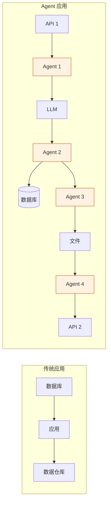
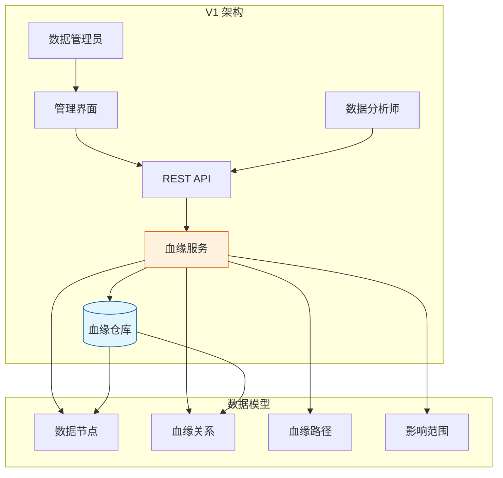
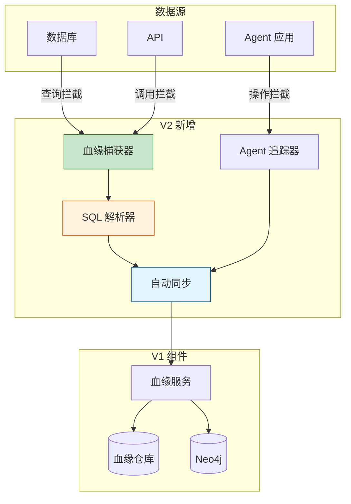
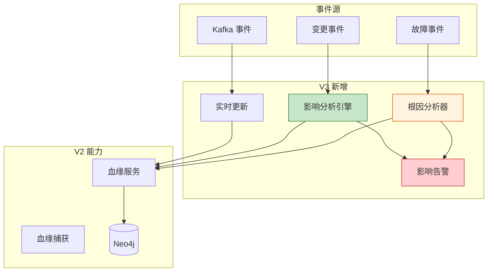

# Sprint 2: 数据血缘与影响分析

## Sprint 目标

实现自动化的数据血缘追踪和影响分析能力，从手动血缘管理演进到实时血缘追踪和智能影响分析。血缘图谱是理解 Agent 系统中数据流转的基础，也是故障排查、合规审计和影响评估的核心工具。

## 业务背景

### 数据血缘的必要性

在 Agent 驱动的应用中，数据流转呈现前所未有的复杂性：



**核心挑战**：

1. **多跳转换**：数据经过多次 LLM 处理和 Agent 协作
2. **隐式依赖**：Agent 推理产生的数据依赖难以显式追踪
3. **实时性要求**：血缘信息需要实时更新以支持决策
4. **影响评估**：变更影响范围难以预估

### 血缘追踪的价值

- **故障排查**：快速定位数据问题的根源
- **影响分析**：评估变更的影响范围
- **合规审计**：满足数据来源可追溯的监管要求
- **性能优化**：识别高频访问的数据路径
- **成本控制**：发现重复计算和不必要的数据流转

## V1: 手动血缘阶段

### 架构设计

V1 阶段建立基础的血缘管理能力，支持手动录入和简单查询。



### 核心数据模型

```java
package com.dataguard.core.lineage;

import jakarta.persistence.*;
import lombok.*;
import java.time.LocalDateTime;
import java.util.*;

/**
 * 数据节点 - 血缘图中的节点
 */
@Entity
@Table(name = "data_nodes")
@Getter
@Setter
@Builder
@NoArgsConstructor
@AllArgsConstructor
public class DataNode {
    
    @Id
    @GeneratedValue(strategy = GenerationType.IDENTITY)
    private Long id;
    
    /**
     * 节点唯一标识
     */
    @Column(unique = true, nullable = false)
    private String nodeId;
    
    /**
     * 节点类型
     */
    @Enumerated(EnumType.STRING)
    @Column(nullable = false)
    private NodeType nodeType;
    
    /**
     * 节点名称
     */
    @Column(nullable = false)
    private String name;
    
    /**
     * 所属系统
     */
    @Column(nullable = false)
    private String system;
    
    /**
     * 数据源信息
     */
    @Embedded
    private DataSourceInfo dataSource;
    
    /**
     * 元数据
     */
    @Column(columnDefinition = "jsonb")
    private Map<String, Object> metadata;
    
    /**
     * 创建时间
     */
    @Column(nullable = false, updatable = false)
    private LocalDateTime createdAt;
    
    /**
     * 更新时间
     */
    @Column(nullable = false)
    private LocalDateTime updatedAt;
    
    /**
     * 节点状态
     */
    @Enumerated(EnumType.STRING)
    @Column(nullable = false)
    private NodeStatus status = NodeStatus.ACTIVE;
    
    public enum NodeType {
        TABLE,           // 数据表
        VIEW,            // 视图
        API_ENDPOINT,    // API 端点
        FILE,            // 文件
        STREAM,          // 数据流
        AGENT_OUTPUT,    // Agent 输出
        MODEL_RESULT,    // 模型结果
        FEATURE,         // 特征
        REPORT           // 报表
    }
    
    public enum NodeStatus {
        ACTIVE,          // 活跃
        DEPRECATED,      // 已弃用
        ARCHIVED         // 已归档
    }
    
    @Embeddable
    @Data
    public static class DataSourceInfo {
        private String type;
        private String connection;
        private String schema;
        private String database;
    }
}
```

```java
package com.dataguard.core.lineage;

import jakarta.persistence.*;
import lombok.*;
import java.time.LocalDateTime;
import java.util.*;

/**
 * 血缘关系 - 节点之间的关系
 */
@Entity
@Table(name = "lineage_relationships")
@Getter
@Setter
@Builder
@NoArgsConstructor
@AllArgsConstructor
public class LineageRelationship {
    
    @Id
    @GeneratedValue(strategy = GenerationType.IDENTITY)
    private Long id;
    
    /**
     * 源节点ID
     */
    @Column(nullable = false)
    private String sourceNodeId;
    
    /**
     * 目标节点ID
     */
    @Column(nullable = false)
    private String targetNodeId;
    
    /**
     * 关系类型
     */
    @Enumerated(EnumType.STRING)
    @Column(nullable = false)
    private RelationshipType relationshipType;
    
    /**
     * 转换描述
     */
    @Column(length = 1000)
    private String transformation;
    
    /**
     * 字段映射
     */
    @Column(columnDefinition = "jsonb")
    private Map<String, String> fieldMapping;
    
    /**
     * 产生者
     */
    @Column(nullable = false)
    private String producer;
    
    /**
     * 产生时间
     */
    @Column(nullable = false, updatable = false)
    private LocalDateTime producedAt;
    
    /**
     * 上下文信息
     */
    @Column(columnDefinition = "jsonb")
    private Map<String, Object> context;
    
    public enum RelationshipType {
        DIRECT,          // 直接依赖
        INDIRECT,        // 间接依赖
        TRANSFORM,       // 转换关系
        AGGREGATE,       // 聚合关系
        DERIVE,          // 派生关系
        REFERENCE,       // 引用关系
        FLOW             // 流动关系
    }
}
```

### 核心服务实现

```java
package com.dataguard.core.lineage;

import lombok.RequiredArgsConstructor;
import lombok.extern.slf4j.Slf4j;
import org.springframework.neo4j.core.Neo4jClient;
import org.springframework.stereotype.Service;
import org.springframework.transaction.annotation.Transactional;

import java.util.*;

/**
 * V1 血缘服务 - 手动管理
 */
@Slf4j
@Service
@RequiredArgsConstructor
public class LineageService {
    
    private final DataNodeRepository nodeRepository;
    private final LineageRelationshipRepository relationshipRepository;
    private final Neo4jClient neo4jClient;
    
    /**
     * 创建数据节点
     */
    @Transactional
    public DataNode createNode(CreateNodeRequest request) {
        log.info("Creating data node: {}", request.getNodeId());
        
        if (nodeRepository.findByNodeId(request.getNodeId()).isPresent()) {
            throw new DuplicateNodeException(request.getNodeId());
        }
        
        DataNode node = DataNode.builder()
            .nodeId(request.getNodeId())
            .nodeType(request.getNodeType())
            .name(request.getName())
            .system(request.getSystem())
            .dataSource(request.getDataSource())
            .metadata(request.getMetadata())
            .createdAt(java.time.LocalDateTime.now())
            .updatedAt(java.time.LocalDateTime.now())
            .status(DataNode.NodeStatus.ACTIVE)
            .build();
        
        return nodeRepository.save(node);
    }
    
    /**
     * 创建血缘关系
     */
    @Transactional
    public LineageRelationship createRelationship(CreateRelationshipRequest request) {
        log.info("Creating lineage: {} -> {}", 
            request.getSourceNodeId(), 
            request.getTargetNodeId()
        );
        
        // 验证节点存在
        validateNodesExist(request.getSourceNodeId(), request.getTargetNodeId());
        
        // 检查是否已存在
        relationshipRepository
            .findBySourceAndTarget(request.getSourceNodeId(), request.getTargetNodeId())
            .ifPresent(existing -> {
                throw new DuplicateRelationshipException(
                    existing.getSourceNodeId() + " -> " + existing.getTargetNodeId()
                );
            });
        
        LineageRelationship relationship = LineageRelationship.builder()
            .sourceNodeId(request.getSourceNodeId())
            .targetNodeId(request.getTargetNodeId())
            .relationshipType(request.getRelationshipType())
            .transformation(request.getTransformation())
            .fieldMapping(request.getFieldMapping())
            .producer(request.getProducer())
            .producedAt(java.time.LocalDateTime.now())
            .context(request.getContext())
            .build();
        
        LineageRelationship saved = relationshipRepository.save(relationship);
        
        // 同步到 Neo4j
        syncToNeo4j(saved);
        
        return saved;
    }
    
    /**
     * 查询上游血缘
     */
    public List<LineagePath> traceUpstream(String nodeId, int maxDepth) {
        log.info("Tracing upstream for node: {}, depth: {}", nodeId, maxDepth);
        
        String cypher = """
            MATCH path = (target:DataNode {nodeId: $nodeId})<-[:DEPENDS_ON*1..%d]-(source:DataNode)
            RETURN path,
                   [n in nodes(path) | n.nodeId] as nodeIds,
                   [r in relationships(path) | r.type] as relationshipTypes
            ORDER BY length(path) ASC
            """.formatted(maxDepth);
        
        return neo4jClient.query(cypher)
            .bind(nodeId).to("nodeId")
            .fetchAs(LineagePath.class)
            .mappedBy((typeSystem, record) -> {
                // 映射逻辑
                return buildLineagePath(record);
            })
            .all()
            .stream()
            .toList();
    }
    
    /**
     * 查询下游血缘
     */
    public List<LineagePath> traceDownstream(String nodeId, int maxDepth) {
        log.info("Tracing downstream for node: {}, depth: {}", nodeId, maxDepth);
        
        String cypher = """
            MATCH path = (source:DataNode {nodeId: $nodeId})-[:DEPENDS_ON*1..%d]->(target:DataNode)
            RETURN path,
                   [n in nodes(path) | n.nodeId] as nodeIds,
                   [r in relationships(path) | r.type] as relationshipTypes
            ORDER BY length(path) ASC
            """.formatted(maxDepth);
        
        return neo4jClient.query(cypher)
            .bind(nodeId).to("nodeId")
            .fetchAs(LineagePath.class)
            .mappedBy((typeSystem, record) -> buildLineagePath(record))
            .all()
            .stream()
            .toList();
    }
    
    /**
     * 获取节点间最短路径
     */
    public Optional<LineagePath> findShortestPath(String fromNodeId, String toNodeId) {
        String cypher = """
            MATCH path = shortestPath(
                (from:DataNode {nodeId: $from})-[:DEPENDS_ON*]-(to:DataNode {nodeId: $to})
            )
            RETURN path, length(path) as distance
            ORDER BY distance ASC
            LIMIT 1
            """;
        
        return neo4jClient.query(cypher)
            .bind(fromNodeId).to("from")
            .bind(toNodeId).to("to")
            .fetchAs(LineagePath.class)
            .mappedBy((typeSystem, record) -> buildLineagePath(record))
            .one();
    }
    
    private void validateNodesExist(String... nodeIds) {
        for (String nodeId : nodeIds) {
            if (nodeRepository.findByNodeId(nodeId).isEmpty()) {
                throw new NodeNotFoundException(nodeId);
            }
        }
    }
    
    private void syncToNeo4j(LineageRelationship relationship) {
        String cypher = """
            MERGE (source:DataNode {nodeId: $sourceNodeId})
            MERGE (target:DataNode {nodeId: $targetNodeId})
            MERGE (source)-[r:DEPENDS_ON {
                type: $type,
                transformation: $transformation
            }]->(target)
            SET r.producedAt = datetime(),
                r.producer = $producer
            """;
        
        neo4jClient.query(cypher)
            .bind(relationship.getSourceNodeId()).to("sourceNodeId")
            .bind(relationship.getTargetNodeId()).to("targetNodeId")
            .bind(relationship.getRelationshipType().name()).to("type")
            .bind(relationship.getTransformation()).to("transformation")
            .bind(relationship.getProducer()).to("producer")
            .run();
    }
    
    private LineagePath buildLineagePath(org.neo4j.driver.Record record) {
        // 实现路径构建逻辑
        return LineagePath.builder().build();
    }
}
```

### V1 阶段的局限性

1. **手动维护成本高**：需要人工录入所有血缘关系
2. **滞后性**：血缘更新滞后于实际数据变化
3. **不完整性**：容易遗漏隐式依赖关系
4. **静态查询**：无法支持动态影响分析

## V2: 自动血缘追踪阶段

### 架构演进

V2 引入自动血缘捕获能力，通过拦截 Agent 操作自动构建血缘图谱。



### SQL 解析与血缘提取

```java
package com.dataguard.core.lineage.parser;

import lombok.RequiredArgsConstructor;
import lombok.extern.slf4j.Slf4j;
import net.sf.jsqlparser.parser.CCJSqlParserUtil;
import net.sf.jsqlparser.st.Statement;
import net.sf.jsqlparser.statement.select.*;
import net.sf.jsqlparser.statement.insert.Insert;
import net.sf.jsqlparser.statement.update.Update;
import net.sf.jsqlparser.statement.delete.Delete;
import org.springframework.stereotype.Component;

import java.util.*;

/**
 * SQL 血缘解析器 - 从 SQL 语句中提取血缘关系
 */
@Slf4j
@Component
@RequiredArgsConstructor
public class SqlLineageParser {
    
    /**
     * 解析 SQL 提取血缘关系
     */
    public SqlLineageResult parse(String sql, String contextNodeId) {
        try {
            Statement statement = CCJSqlParserUtil.parse(sql);
            return parseStatement(statement, contextNodeId);
        } catch (Exception e) {
            log.error("Failed to parse SQL: {}", sql, e);
            return SqlLineageResult.error(sql, e.getMessage());
        }
    }
    
    /**
     * 解析各类 SQL 语句
     */
    private SqlLineageResult parseStatement(Statement statement, String contextNodeId) {
        return switch (statement) {
            case Select select -> parseSelect(select, contextNodeId);
            case Insert insert -> parseInsert(insert, contextNodeId);
            case Update update -> parseUpdate(update, contextNodeId);
            case Delete delete -> parseDelete(delete, contextNodeId);
            default -> SqlLineageResult.unsupported(statement.getClass().getSimpleName());
        };
    }
    
    /**
     * 解析 SELECT 语句
     */
    private SqlLineageResult parseSelect(Select select, String contextNodeId) {
        SqlLineageResult result = new SqlLineageResult();
        
        PlainSelect plainSelect = (PlainSelect) select.getSelectBody();
        
        // 解析 FROM 子句
        if (plainSelect.getFromItem() != null) {
            FromItemContext fromContext = parseFromItem(plainSelect.getFromItem());
            result.addSource(fromContext.getTableId(), fromContext.getAlias());
            
            // 解析 JOIN
            if (plainSelect.getJoins() != null) {
                for (Join join : plainSelect.getJoins()) {
                    FromItemContext joinContext = parseFromItem(join.getRightItem());
                    result.addSource(joinContext.getTableId(), joinContext.getAlias());
                }
            }
        }
        
        // 解析字段映射
        Map<String, String> fieldMapping = extractFieldMapping(plainSelect);
        result.setFieldMapping(fieldMapping);
        
        result.setTarget(contextNodeId);
        result.setStatementType("SELECT");
        result.setSuccess(true);
        
        return result;
    }
    
    /**
     * 解析 INSERT 语句
     */
    private SqlLineageResult parseInsert(Insert insert, String contextNodeId) {
        SqlLineageResult result = new SqlLineageResult();
        
        // 目标表
        String targetTable = extractTable(insert.getTable());
        result.setTarget(targetTable);
        
        // 如果是 INSERT SELECT，解析 SELECT 部分
        if (insert.getSelect() != null) {
            SqlLineageResult selectResult = parseSelect(
                insert.getSelect(), 
                targetTable
            );
            result.addSources(selectResult.getSources());
            result.setFieldMapping(selectResult.getFieldMapping());
        }
        
        result.setStatementType("INSERT");
        result.setSuccess(true);
        
        return result;
    }
    
    /**
     * 解析 FROM 子句
     */
    private FromItemContext parseFromItem(FromItem fromItem) {
        if (fromItem instanceof Table table) {
            String tableId = buildTableId(table);
            String alias = table.getAlias() != null ? table.getAlias().getName() : null;
            return new FromItemContext(tableId, alias);
        } else if (fromItem instanceof SubSelect subSelect) {
            // 处理子查询
            return parseSubSelect(subSelect);
        }
        return new FromItemContext(fromItem.toString(), null);
    }
    
    /**
     * 提取字段映射关系
     */
    private Map<String, String> extractFieldMapping(PlainSelect select) {
        Map<String, String> mapping = new LinkedHashMap<>();
        
        List<SelectItem> items = select.getSelectItems();
        for (SelectItem item : items) {
            if (item instanceof SelectExpressionItem sei) {
                String sourceField = sei.getExpression().toString();
                String targetField = sei.getAlias() != null ? 
                    sei.getAlias().getName() : sourceField;
                mapping.put(targetField, sourceField);
            } else if (item instanceof AllColumns) {
                mapping.put("*", "*");
            }
        }
        
        return mapping;
    }
    
    private String buildTableId(Table table) {
        // 构建完整的表标识：database.schema.table
        StringBuilder sb = new StringBuilder();
        if (table.getDatabase() != null) {
            sb.append(table.getDatabase()).append(".");
        }
        if (table.getSchema() != null) {
            sb.append(table.getSchema()).append(".");
        }
        sb.append(table.getName());
        return sb.toString();
    }
    
    private String extractTable(Table table) {
        return buildTableId(table);
    }
    
    private FromItemContext parseSubSelect(SubSelect subSelect) {
        // 生成子查询的唯一 ID
        String subQueryId = "subquery_" + UUID.randomUUID().toString().substring(0, 8);
        return new FromItemContext(subQueryId, null);
    }
    
    /**
     * FROM 项上下文
     */
    private record FromItemContext(String tableId, String alias) {}
}
```

### 血缘捕获器

```java
package com.dataguard.core.lineage.capture;

import com.dataguard.core.lineage.*;
import com.dataguard.core.lineage.parser.*;
import lombok.RequiredArgsConstructor;
import lombok.extern.slf4j.Slf4j;
import org.springframework.stereotype.Component;
import org.springframework.transaction.support.TransactionSynchronization;
import org.springframework.transaction.support.TransactionSynchronizationManager;

import jakarta.servlet.http.HttpServletRequest;
import java.util.*;

/**
 * 血缘捕获器 - 拦截数据操作
 */
@Slf4j
@Component
@RequiredArgsConstructor
public class LineageCapture {
    
    private final SqlLineageParser sqlParser;
    private final LineageService lineageService;
    private final LineageBuffer lineageBuffer;
    
    /**
     * 捕获 JDBC 操作
     */
    public void captureJdbcOperation(String sql, Map<String, Object> context) {
        String nodeId = extractNodeId(context);
        String producer = extractProducer(context);
        
        try {
            SqlLineageResult result = sqlParser.parse(sql, nodeId);
            if (result.isSuccess()) {
                // 存入缓冲区，事务提交后处理
                lineageBuffer.add(result, producer, context);
            }
        } catch (Exception e) {
            log.error("Failed to capture lineage for SQL: {}", sql, e);
        }
    }
    
    /**
     * 捕获 Agent 操作
     */
    public void captureAgentOperation(AgentOperationContext context) {
        log.debug("Capturing Agent operation: {}", context.getOperationId());
        
        try {
            // 解析 Agent 操作产生的数据依赖
            List<DataDependency> dependencies = analyzeAgentDependencies(context);
            
            for (DataDependency dependency : dependencies) {
                lineageBuffer.addAgentDependency(dependency, context);
            }
        } catch (Exception e) {
            log.error("Failed to capture Agent lineage", e);
        }
    }
    
    /**
     * 分析 Agent 操作的数据依赖
     */
    private List<DataDependency> analyzeAgentDependencies(AgentOperationContext context) {
        List<DataDependency> dependencies = new ArrayList<>();
        
        // 分析输入依赖
        for (AgentDataSource input : context.getInputs()) {
            DataDependency dependency = DataDependency.builder()
                .sourceNodeId(input.getNodeId())
                .targetNodeId(context.getOutputNodeId())
                .dependencyType(DataDependency.Type.TRANSFORM)
                .transformation("LLM_" + context.getAgentType())
                .fieldMapping(input.getFieldMapping())
                .build();
            dependencies.add(dependency);
        }
        
        // 分析工具调用依赖
        for (ToolCall call : context.getToolCalls()) {
            if ("database_query".equals(call.getToolName())) {
                // SQL 查询依赖
                SqlLineageResult sqlResult = sqlParser.parse(
                    call.getParameters().get("query").toString(),
                    context.getOutputNodeId()
                );
                // 转换为依赖关系
                dependencies.addAll(convertToDependencies(sqlResult));
            }
        }
        
        return dependencies;
    }
    
    /**
     * 在事务提交后处理血缘
     */
    public void registerTransactionCallback(Runnable commitAction) {
        if (TransactionSynchronizationManager.isActualTransactionActive()) {
            TransactionSynchronizationManager.registerSynchronization(
                new TransactionSynchronization() {
                    @Override
                    public void afterCommit() {
                        commitAction.run();
                    }
                }
            );
        } else {
            commitAction.run();
        }
    }
    
    private String extractNodeId(Map<String, Object> context) {
        return (String) context.getOrDefault("nodeId", "unknown");
    }
    
    private String extractProducer(Map<String, Object> context) {
        return (String) context.getOrDefault("producer", "system");
    }
    
    private List<DataDependency> convertToDependencies(SqlLineageResult result) {
        // 转换逻辑
        return Collections.emptyList();
    }
}
```

### 自动血缘同步

```java
package com.dataguard.core.lineage.sync;

import com.dataguard.core.lineage.*;
import com.dataguard.core.lineage.capture.*;
import com.dataguard.core.lineage.parser.*;
import lombok.RequiredArgsConstructor;
import lombok.extern.slf4j.Slf4j;
import org.springframework.scheduling.annotation.Async;
import org.springframework.stereotype.Component;
import org.springframework.transaction.event.TransactionPhase;
import org.springframework.transaction.event.TransactionalEventListener;

import java.util.List;
import java.util.concurrent.CompletableFuture;

/**
 * 自动血缘同步服务
 */
@Slf4j
@Component
@RequiredArgsConstructor
public class AutomaticLineageSync {
    
    private final LineageService lineageService;
    private final NodeResolver nodeResolver;
    
    /**
     * 监听事务提交事件，自动同步血缘
     */
    @TransactionalEventListener(phase = TransactionPhase.AFTER_COMMIT)
    public void onLineageEvent(LineageEvent event) {
        syncLineageAsync(event);
    }
    
    /**
     * 异步同步血缘关系
     */
    @Async("lineageSyncExecutor")
    public CompletableFuture<Void> syncLineageAsync(LineageEvent event) {
        return CompletableFuture.runAsync(() -> {
            try {
                switch (event.getType()) {
                    case SQL_OPERATION -> syncSqlLineage(event);
                    case AGENT_OPERATION -> syncAgentLineage(event);
                    case BATCH_OPERATION -> syncBatchLineage(event);
                }
                log.info("Successfully synced lineage for event: {}", event.getEventId());
            } catch (Exception e) {
                log.error("Failed to sync lineage for event: {}", event.getEventId(), e);
                handleSyncFailure(event, e);
            }
        });
    }
    
    /**
     * 同步 SQL 血缘
     */
    private void syncSqlLineage(LineageEvent event) {
        SqlLineageResult result = event.getSqlLineageResult();
        
        // 确保节点存在
        ensureNodesExist(result);
        
        // 创建血缘关系
        for (Map.Entry<String, String> entry : result.getSources().entrySet()) {
            String sourceNode = entry.getKey();
            String targetNode = result.getTarget();
            
            CreateRelationshipRequest request = CreateRelationshipRequest.builder()
                .sourceNodeId(sourceNode)
                .targetNodeId(targetNode)
                .relationshipType(LineageRelationship.RelationshipType.DIRECT)
                .transformation("SQL_" + result.getStatementType())
                .fieldMapping(result.getFieldMapping())
                .producer(event.getProducer())
                .context(event.getContext())
                .build();
            
            try {
                lineageService.createRelationship(request);
            } catch (DuplicateRelationshipException e) {
                // 血缘关系已存在，更新元数据
                lineageService.updateRelationshipMetadata(
                    sourceNode, 
                    targetNode, 
                    event.getContext()
                );
            }
        }
    }
    
    /**
     * 同步 Agent 血缘
     */
    private void syncAgentLineage(LineageEvent event) {
        List<DataDependency> dependencies = event.getAgentDependencies();
        
        for (DataDependency dependency : dependencies) {
            // 确保 Agent 输出节点存在
            nodeResolver.resolveOrCreateNode(
                dependency.getTargetNodeId(),
                DataNode.NodeType.AGENT_OUTPUT
            );
            
            CreateRelationshipRequest request = CreateRelationshipRequest.builder()
                .sourceNodeId(dependency.getSourceNodeId())
                .targetNodeId(dependency.getTargetNodeId())
                .relationshipType(mapDependencyType(dependency.getDependencyType()))
                .transformation(dependency.getTransformation())
                .fieldMapping(dependency.getFieldMapping())
                .producer(event.getProducer())
                .context(event.getContext())
                .build();
            
            try {
                lineageService.createRelationship(request);
            } catch (Exception e) {
                log.warn("Failed to create Agent lineage: {} -> {}", 
                    dependency.getSourceNodeId(),
                    dependency.getTargetNodeId()
                );
            }
        }
    }
    
    private void ensureNodesExist(SqlLineageResult result) {
        // 确保源节点存在
        for (String sourceNode : result.getSources().keySet()) {
            nodeResolver.resolveOrCreateNode(sourceNode, inferNodeType(sourceNode));
        }
        
        // 确保目标节点存在
        nodeResolver.resolveOrCreateNode(result.getTarget(), inferNodeType(result.getTarget()));
    }
    
    private DataNode.NodeType inferNodeType(String nodeId) {
        if (nodeId.contains(".")) {
            return DataNode.NodeType.TABLE;
        } else if (nodeId.startsWith("agent_")) {
            return DataNode.NodeType.AGENT_OUTPUT;
        } else if (nodeId.startsWith("api_")) {
            return DataNode.NodeType.API_ENDPOINT;
        }
        return DataNode.NodeType.TABLE;
    }
    
    private LineageRelationship.RelationshipType mapDependencyType(DataDependency.Type type) {
        return switch (type) {
            case DIRECT -> LineageRelationship.RelationshipType.DIRECT;
            case TRANSFORM -> LineageRelationship.RelationshipType.TRANSFORM;
            case AGGREGATE -> LineageRelationship.RelationshipType.AGGREGATE;
            case DERIVE -> LineageRelationship.RelationshipType.DERIVE;
        };
    }
    
    private void syncBatchLineage(LineageEvent event) {
        // 批量同步逻辑
    }
    
    private void handleSyncFailure(LineageEvent event, Exception error) {
        // 错误处理：存储到失败队列，稍后重试
    }
}
```

### JDBC 拦截器

```java
package com.dataguard.core.lineage.jdbc;

import com.dataguard.core.lineage.capture.LineageCapture;
import lombok.RequiredArgsConstructor;
import lombok.extern.slf4j.Slf4j;
import org.aopalliance.intercept.MethodInterceptor;
import org.aopalliance.intercept.MethodInvocation;

import java.sql.Connection;
import java.util.HashMap;
import java.util.Map;

/**
 * JDBC 拦截器 - 拦截 SQL 执行
 */
@Slf4j
@RequiredArgsConstructor
public class JdbcLineageInterceptor implements MethodInterceptor {
    
    private final LineageCapture lineageCapture;
    
    @Override
    public Object invoke(MethodInvocation invocation) throws Throwable {
        String methodName = invocation.getMethod().getName();
        Object[] args = invocation.getArguments();
        
        // 拦截 execute、executeUpdate、executeQuery 等方法
        if (isSqlExecutionMethod(methodName)) {
            String sql = extractSql(args);
            
            // 构建上下文
            Map<String, Object> context = new HashMap<>();
            context.put("sql", sql);
            context.put("method", methodName);
            context.put("connection", extractConnectionInfo(invocation));
            
            // 捕获血缘
            lineageCapture.captureJdbcOperation(sql, context);
        }
        
        // 执行原方法
        return invocation.proceed();
    }
    
    private boolean isSqlExecutionMethod(String methodName) {
        return methodName.equals("execute") ||
               methodName.equals("executeUpdate") ||
               methodName.equals("executeQuery") ||
               methodName.equals("executeBatch");
    }
    
    private String extractSql(Object[] args) {
        if (args != null && args.length > 0) {
            Object firstArg = args[0];
            if (firstArg instanceof String) {
                return (String) firstArg;
            }
        }
        return "";
    }
    
    private Map<String, Object> extractConnectionInfo(MethodInvocation invocation) {
        Map<String, Object> info = new HashMap<>();
        // 提取连接信息
        return info;
    }
}
```

## V3: 实时影响分析阶段

### 架构演进

V3 引入实时影响分析和智能根因定位能力。



### 影响分析引擎

```java
package com.dataguard.core.lineage.impact;

import lombok.RequiredArgsConstructor;
import lombok.extern.slf4j.Slf4j;
import org.springframework.neo4j.core.Neo4jClient;
import org.springframework.stereotype.Service;
import org.springframework.web.socket.WebSocketSession;
import org.springframework.web.socket.handler.TextWebSocketHandler;

import java.util.*;
import java.util.concurrent.ConcurrentHashMap;

/**
 * 影响分析引擎 - V3 核心能力
 */
@Slf4j
@Service
@RequiredArgsConstructor
public class ImpactAnalysisEngine {
    
    private final Neo4jClient neo4jClient;
    private final ImpactNotifier impactNotifier;
    
    /**
     * 分析变更影响范围
     */
    public ImpactAnalysisResult analyzeImpact(String nodeId, ImpactScope scope) {
        log.info("Analyzing impact for node: {}, scope: {}", nodeId, scope);
        
        ImpactAnalysisResult result = new ImpactAnalysisResult(nodeId);
        
        // 1. 直接下游影响
        Set<String> directDownstream = findDirectDownstream(nodeId);
        result.addDirectImpact(directDownstream);
        
        // 2. 传递影响（基于深度）
        if (scope.getMaxDepth() > 1) {
            Set<String> transitiveImpact = findTransitiveDownstream(
                nodeId, 
                scope.getMaxDepth()
            );
            result.addTransitiveImpact(transitiveImpact);
        }
        
        // 3. 按类型分析影响
        analyzeImpactByType(result, scope);
        
        // 4. 风险评估
        assessImpactRisk(result);
        
        // 5. 生成推荐行动
        generateRecommendations(result);
        
        return result;
    }
    
    /**
     * 查找直接下游
     */
    private Set<String> findDirectDownstream(String nodeId) {
        String cypher = """
            MATCH (source:DataNode {nodeId: $nodeId})-[:DEPENDS_ON]->(target:DataNode)
            RETURN target.nodeId as nodeId,
                   target.nodeType as nodeType,
                   target.system as system
            """;
        
        Set<String> downstream = new HashSet<>();
        neo4jClient.query(cypher)
            .bind(nodeId).to("nodeId")
            .fetch().forEach(record -> {
                String targetId = record.get("nodeId").asString();
                downstream.add(targetId);
            });
        
        return downstream;
    }
    
    /**
     * 查找传递下游
     */
    private Set<String> findTransitiveDownstream(String nodeId, int maxDepth) {
        String cypher = """
            MATCH path = (source:DataNode {nodeId: $nodeId})-[:DEPENDS_ON*1..%d]->(target:DataNode)
            RETURN DISTINCT target.nodeId as nodeId,
                   length(path) as distance,
                   [n in nodes(path) | n.nodeId] as path
            ORDER BY distance ASC
            """.formatted(maxDepth);
        
        Set<String> transitive = new HashSet<>();
        neo4jClient.query(cypher)
            .bind(nodeId).to("nodeId")
            .fetch().forEach(record -> {
                transitive.add(record.get("nodeId").asString());
            });
        
        return transitive;
    }
    
    /**
     * 按类型分析影响
     */
    private void analyzeImpactByType(ImpactAnalysisResult result, ImpactScope scope) {
        // 按 Agent 类型分析
        Map<String, Integer> impactByAgentType = new HashMap<>();
        
        for (String impactedNode : result.getAllImpactedNodes()) {
            String agentType = getAgentTypeForNode(impactedNode);
            impactByAgentType.merge(agentType, 1, Integer::sum);
        }
        
        result.setImpactByAgentType(impactByAgentType);
        
        // 按系统分析
        Map<String, Integer> impactBySystem = new HashMap<>();
        for (String impactedNode : result.getAllImpactedNodes()) {
            String system = getSystemForNode(impactedNode);
            impactBySystem.merge(system, 1, Integer::sum);
        }
        
        result.setImpactBySystem(impactBySystem);
        
        // 按敏感级别分析
        Map<String, Integer> impactBySensitivity = new HashMap<>();
        for (String impactedNode : result.getAllImpactedNodes()) {
            String sensitivity = getSensitivityForNode(impactedNode);
            impactBySensitivity.merge(sensitivity, 1, Integer::sum);
        }
        
        result.setImpactBySensitivity(impactBySensitivity);
    }
    
    /**
     * 评估影响风险
     */
    private void assessImpactRisk(ImpactAnalysisResult result) {
        ImpactRisk risk = new ImpactRisk();
        
        // 基于影响节点数量
        int impactCount = result.getAllImpactedNodes().size();
        if (impactCount > 50) {
            risk.setLevel(ImpactRisk.Level.CRITICAL);
        } else if (impactCount > 20) {
            risk.setLevel(ImpactRisk.Level.HIGH);
        } else if (impactCount > 5) {
            risk.setLevel(ImpactRisk.Level.MEDIUM);
        } else {
            risk.setLevel(ImpactRisk.Level.LOW);
        }
        
        // 基于敏感节点数量
        long sensitiveCount = result.getAllImpactedNodes().stream()
            .filter(this::isSensitiveNode)
            .count();
        
        if (sensitiveCount > 0) {
            risk.setLevel(increaseRiskLevel(risk.getLevel()));
        }
        
        // 基于关键业务影响
        boolean affectsCriticalSystem = result.getAllImpactedNodes().stream()
            .anyMatch(this::isCriticalSystemNode);
        
        if (affectsCriticalSystem) {
            risk.setLevel(increaseRiskLevel(risk.getLevel()));
        }
        
        result.setRisk(risk);
    }
    
    /**
     * 生成推荐行动
     */
    private void generateRecommendations(ImpactAnalysisResult result) {
        List<String> recommendations = new ArrayList<>();
        
        // 基于风险等级
        switch (result.getRisk().getLevel()) {
            case CRITICAL -> {
                recommendations.add("立即通知所有相关团队");
                recommendations.add("启动回滚计划");
                recommendations.add("安排值班人员监控");
            }
            case HIGH -> {
                recommendations.add("通知受影响系统负责人");
                recommendations.add("准备回滚方案");
            }
            case MEDIUM -> {
                recommendations.add("更新相关文档");
                recommendations.add("通知可能受影响的团队");
            }
            case LOW -> {
                recommendations.add("记录变更日志");
            }
        }
        
        // 基于影响类型
        if (result.getImpactByAgentType().containsKey("RAG_AGENT")) {
            recommendations.add("验证知识库索引状态");
        }
        
        if (result.getImpactBySystem().containsKey("payment")) {
            recommendations.add("验证支付流程完整性");
        }
        
        result.setRecommendations(recommendations);
    }
    
    /**
     * 实时变更影响分析
     */
    @org.springframework.kafka.annotation.KafkaListener(
        topics = "data-change-events"
    )
    public void onDataChangeEvent(DataChangeEvent event) {
        log.info("Processing data change event: {}", event.getResourceId());
        
        // 分析影响
        ImpactAnalysisResult impact = analyzeImpact(
            event.getResourceId(),
            ImpactScope.builder()
                .maxDepth(5)
                .includeAgentTypes(true)
                .includeSensitiveData(true)
                .build()
        );
        
        // 发送通知
        if (impact.getRisk().getLevel().ordinal() >= ImpactRisk.Level.MEDIUM.ordinal()) {
            impactNotifier.notifyImpact(impact);
        }
        
        // 记录到历史
        recordImpactHistory(event, impact);
    }
    
    private String getAgentTypeForNode(String nodeId) {
        // 查询节点类型
        return "UNKNOWN";
    }
    
    private String getSystemForNode(String nodeId) {
        return "UNKNOWN";
    }
    
    private String getSensitivityForNode(String nodeId) {
        return "UNKNOWN";
    }
    
    private boolean isSensitiveNode(String nodeId) {
        return false;
    }
    
    private boolean isCriticalSystemNode(String nodeId) {
        return false;
    }
    
    private ImpactRisk.Level increaseRiskLevel(ImpactRisk.Level current) {
        return ImpactRisk.Level.values()[
            Math.min(current.ordinal() + 1, ImpactRisk.Level.values().length - 1)
        ];
    }
    
    private void recordImpactHistory(DataChangeEvent event, ImpactAnalysisResult impact) {
        // 记录历史
    }
}
```

### 根因分析器

```java
package com.dataguard.core.lineage.rootcause;

import lombok.RequiredArgsConstructor;
import lombok.extern.slf4j.Slf4j;
import org.springframework.neo4j.core.Neo4jClient;
import org.springframework.stereotype.Service;

import java.time.LocalDateTime;
import java.util.*;

/**
 * 根因分析器 - V3 故障定位能力
 */
@Slf4j
@Service
@RequiredArgsConstructor
public class RootCauseAnalyzer {
    
    private final Neo4jClient neo4jClient;
    private final AnomalyDetector anomalyDetector;
    
    /**
     * 分析数据问题的根本原因
     */
    public RootCauseResult analyzeRootCause(DataIssue issue) {
        log.info("Analyzing root cause for issue: {}", issue.getIssueId());
        
        RootCauseResult result = new RootCauseResult(issue.getIssueId());
        
        // 1. 向上游追踪
        List<UpstreamAnalysis> upstreamAnalyses = traceUpstream(issue);
        result.addUpstreamAnalyses(upstreamAnalyses);
        
        // 2. 检测异常模式
        List<AnomalyPattern> anomalies = detectAnomalies(issue);
        result.addAnomalies(anomalies);
        
        // 3. 分析变更历史
        List<ChangeHistory> recentChanges = findRecentChanges(issue);
        result.addRecentChanges(recentChanges);
        
        // 4. 关联分析
        List<RelatedIssue> relatedIssues = findRelatedIssues(issue);
        result.addRelatedIssues(relatedIssues);
        
        // 5. 确定根本原因
        RootCauseConclusion conclusion = determineRootCause(result);
        result.setConclusion(conclusion);
        
        return result;
    }
    
    /**
     * 向上游追踪
     */
    private List<UpstreamAnalysis> traceUpstream(DataIssue issue) {
        String cypher = """
            MATCH path = (issueNode:DataNode {nodeId: $nodeId})<-[:DEPENDS_ON*1..5]-(source:DataNode)
            WITH source, 
                 [r in relationships(path) | {
                    type: r.type,
                    transformation: r.transformation,
                    producedAt: r.producedAt
                 }] as relationships
            RETURN source.nodeId as nodeId,
                   source.nodeType as nodeType,
                   relationships
            ORDER BY length(path) ASC
            """;
        
        List<UpstreamAnalysis> analyses = new ArrayList<>();
        
        neo4jClient.query(cypher)
            .bind(issue.getAffectedNodeId()).to("nodeId")
            .fetch().forEach(record -> {
                UpstreamAnalysis analysis = new UpstreamAnalysis();
                analysis.setNodeId(record.get("nodeId").asString());
                analysis.setNodeType(record.get("nodeType").asString());
                analysis.setPathLength(record.get("relationships").size());
                analyses.add(analysis);
            });
        
        return analyses;
    }
    
    /**
     * 检测异常
     */
    private List<AnomalyPattern> detectAnomalies(DataIssue issue) {
        List<AnomalyPattern> anomalies = new ArrayList<>();
        
        // 时间序列异常
        AnomalyPattern timeSeriesAnomaly = anomalyDetector.detectTimeSeriesAnomaly(
            issue.getAffectedNodeId(),
            issue.getDetectedAt()
        );
        if (timeSeriesAnomaly != null) {
            anomalies.add(timeSeriesAnomaly);
        }
        
        // 数据质量异常
        AnomalyPattern qualityAnomaly = anomalyDetector.detectQualityAnomaly(
            issue.getAffectedNodeId()
        );
        if (qualityAnomaly != null) {
            anomalies.add(qualityAnomaly);
        }
        
        // Schema 变更异常
        AnomalyPattern schemaAnomaly = anomalyDetector.detectSchemaChangeAnomaly(
            issue.getAffectedNodeId(),
            issue.getDetectedAt().minusDays(7)
        );
        if (schemaAnomaly != null) {
            anomalies.add(schemaAnomaly);
        }
        
        return anomalies;
    }
    
    /**
     * 查找最近的变更
     */
    private List<ChangeHistory> findRecentChanges(DataIssue issue) {
        String cypher = """
            MATCH (node:DataNode {nodeId: $nodeId})-[r:DEPENDS_ON]->(other:DataNode)
            WHERE r.producedAt > $since
            RETURN other.nodeId as nodeId,
                   r.type as changeType,
                   r.transformation as transformation,
                   r.producedAt as changedAt,
                   r.producer as producer
            ORDER BY r.producedAt DESC
            """;
        
        List<ChangeHistory> changes = new ArrayList<>();
        
        neo4jClient.query(cypher)
            .bind(issue.getAffectedNodeId()).to("nodeId")
            .bind(issue.getDetectedAt().minusDays(7)).to("since")
            .fetch().forEach(record -> {
                ChangeHistory change = new ChangeHistory();
                change.setNodeId(record.get("nodeId").asString());
                change.setChangeType(record.get("changeType").asString());
                change.setChangedAt(record.get("changedAt").asLocalDateTime());
                change.setProducer(record.get("producer").asString());
                changes.add(change);
            });
        
        return changes;
    }
    
    /**
     * 查找相关问题
     */
    private List<RelatedIssue> findRelatedIssues(DataIssue issue) {
        // 查找时间窗口内的相关问题
        return Collections.emptyList();
    }
    
    /**
     * 确定根本原因
     */
    private RootCauseConclusion determineRootCause(RootCauseResult result) {
        RootCauseConclusion conclusion = new RootCauseConclusion();
        
        // 基于异常模式评分
        double anomalyScore = result.getAnomalies().stream()
            .mapToDouble(AnomalyPattern::getScore)
            .sum();
        
        // 基于变更时间相关性
        double changeCorrelation = calculateChangeCorrelation(result);
        
        // 综合判断
        if (anomalyScore > 0.8) {
            conclusion.setType(RootCauseConclusion.Type.DATA_ANOMALY);
            conclusion.setConfidence(0.9);
        } else if (changeCorrelation > 0.7) {
            conclusion.setType(RootCauseConclusion.Type.RECENT_CHANGE);
            conclusion.setConfidence(0.85);
        } else {
            conclusion.setType(RootCauseConclusion.Type.COMPLEX);
            conclusion.setConfidence(0.6);
        }
        
        // 生成解释
        conclusion.setExplanation(buildExplanation(result, conclusion));
        
        return conclusion;
    }
    
    private double calculateChangeCorrelation(RootCauseResult result) {
        // 计算变更与问题发生的时间相关性
        return 0.0;
    }
    
    private String buildExplanation(RootCauseResult result, RootCauseConclusion conclusion) {
        StringBuilder sb = new StringBuilder();
        sb.append("Root cause analysis completed.\n");
        sb.append("Type: ").append(conclusion.getType()).append("\n");
        sb.append("Confidence: ").append(String.format("%.2f%%", conclusion.getConfidence() * 100)).append("\n");
        sb.append("Key factors:\n");
        
        for (AnomalyPattern anomaly : result.getAnomalies()) {
            sb.append("- ").append(anomaly.getDescription()).append("\n");
        }
        
        return sb.toString();
    }
}
```

### 实时血缘更新

```java
package com.dataguard.core.lineage.realtime;

import lombok.RequiredArgsConstructor;
import lombok.extern.slf4j.Slf4j;
import org.springframework.kafka.annotation.KafkaListener;
import org.springframework.stereotype.Component;
import org.springframework.web.socket.TextMessage;
import org.springframework.web.socket.WebSocketSession;

import java.io.IOException;
import java.util.List;
import java.util.concurrent.CopyOnWriteArrayList;

/**
 * 实时血缘更新服务
 */
@Slf4j
@Component
@RequiredArgsConstructor
public class RealtimeLineageUpdate {
    
    private final List<WebSocketSession> subscribers = new CopyOnWriteArrayList<>();
    private final ImpactAnalysisEngine impactEngine;
    
    /**
     * WebSocket 订阅管理
     */
    public void subscribe(WebSocketSession session) {
        subscribers.add(session);
        log.info("Added lineage update subscriber: {}", session.getId());
    }
    
    public void unsubscribe(WebSocketSession session) {
        subscribers.remove(session);
        log.info("Removed lineage update subscriber: {}", session.getId());
    }
    
    /**
     * 监听血缘更新事件
     */
    @KafkaListener(topics = "lineage-updates")
    public void onLineageUpdate(LineageUpdateEvent event) {
        log.debug("Processing lineage update: {}", event.getUpdateId());
        
        // 广播给所有订阅者
        broadcastUpdate(event);
        
        // 如果是高影响变更，触发影响分析
        if (event.isHighImpact()) {
            triggerImpactAnalysis(event);
        }
    }
    
    /**
     * 广播更新
     */
    private void broadcastUpdate(LineageUpdateEvent event) {
        String message = convertToJson(event);
        TextMessage textMessage = new TextMessage(message);
        
        for (WebSocketSession subscriber : subscribers) {
            try {
                if (subscriber.isOpen()) {
                    subscriber.sendMessage(textMessage);
                }
            } catch (IOException e) {
                log.error("Failed to send update to subscriber: {}", 
                    subscriber.getId(), e);
            }
        }
    }
    
    /**
     * 触发影响分析
     */
    private void triggerImpactAnalysis(LineageUpdateEvent event) {
        // 异步分析
        java.util.concurrent.CompletableFuture.runAsync(() -> {
            ImpactAnalysisResult impact = impactEngine.analyzeImpact(
                event.getAffectedNodeId(),
                ImpactScope.builder()
                    .maxDepth(3)
                    .includeAgentTypes(true)
                    .includeSensitiveData(true)
                    .build()
            );
            
            // 广播影响分析结果
            broadcastImpactUpdate(impact);
        });
    }
    
    private void broadcastImpactUpdate(ImpactAnalysisResult impact) {
        // 广播逻辑
    }
    
    private String convertToJson(LineageUpdateEvent event) {
        // JSON 转换
        return "{}";
    }
}
```

## Sprint 总结

### 演进对比

| 特性 | V1 手动血缘 | V2 自动追踪 | V3 实时分析 |
|------|------------|-------------|-----------|
| 血缘捕获 | 手动录入 | 自动捕获 | 实时流式 |
| SQL 解析 | 无 | JSQLParser | 增强 |
| Agent 追踪 | 无 | 基础 | 完整 |
| 影响分析 | 手动查询 | 自动计算 | 实时智能 |
| 根因定位 | 无 | 无 | LLM 辅助 |
| 可视化 | 表格 | 静态图谱 | 实时图谱 |

### 核心交付物

1. **LineageTracker**：血缘追踪核心引擎
2. **SqlLineageParser**：SQL 解析器
3. **ImpactAnalysisEngine**：影响分析引擎
4. **RootCauseAnalyzer**：根因分析器
5. **Neo4j 集成**：图数据库血缘图谱

### 技术亮点

- **JSQLParser**：SQL 语句解析和血缘提取
- **Neo4j**：图数据库血缘存储和查询
- **AOP 拦截**：自动捕获数据操作
- **Kafka 事件**：实时血缘更新
- **WebSocket 推送**：实时血缘图谱更新

---

**下一步**：阅读 [Sprint 3-隐私计算与联邦治理](./Sprint3-隐私计算与联邦治理.md)
