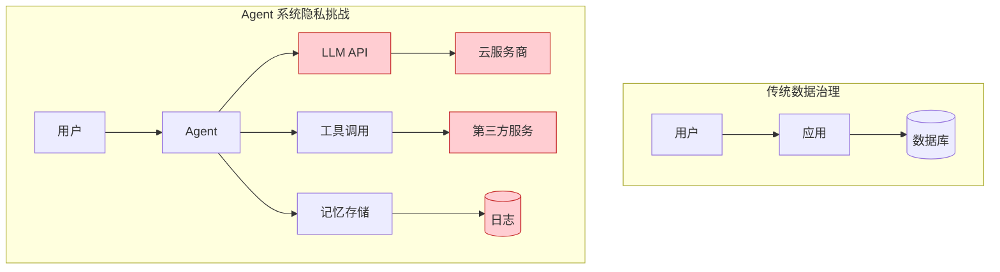
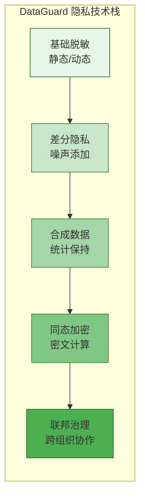
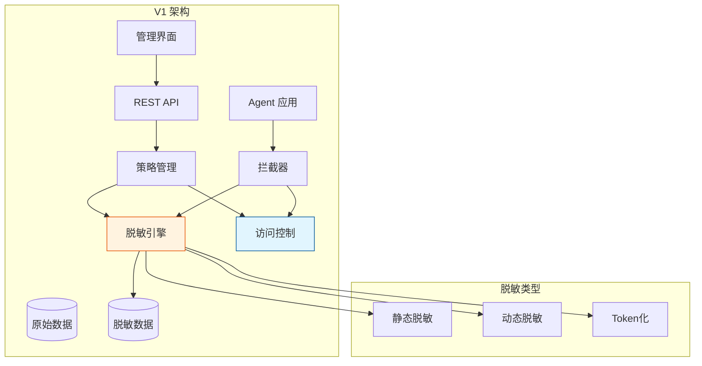
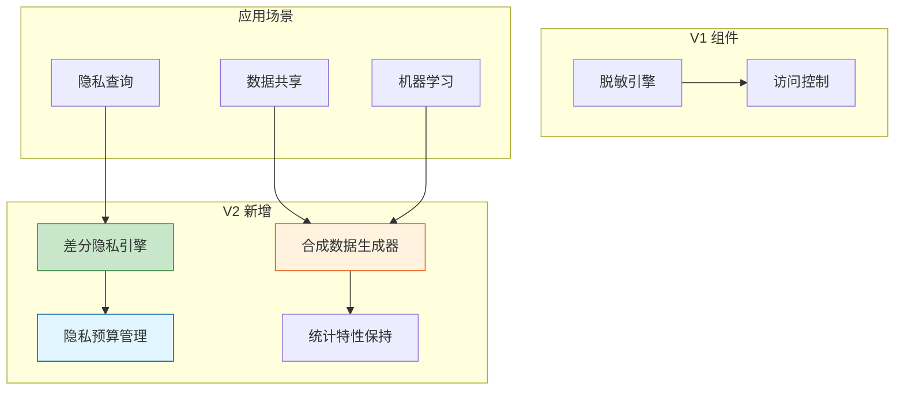
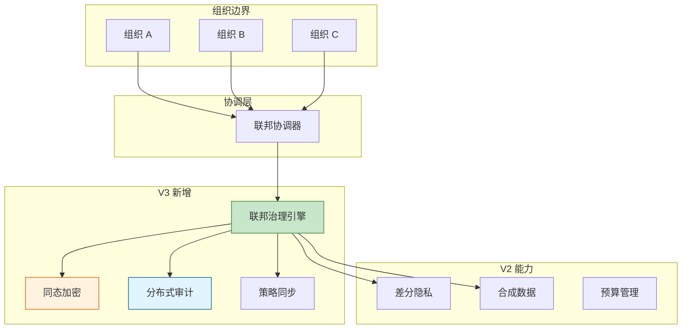

# Sprint 3: 隐私计算与联邦治理

## Sprint 目标

集成隐私保护技术，实现从基础脱敏到差分隐私、再到联邦数据治理的完整隐私保护体系。在 AI Agent 应用中，隐私保护是合规运营的基石，本 Sprint 建立全面的隐私计算能力和跨组织协作框架。

## 业务背景

### Agent 系统的隐私挑战



**核心隐私风险点**：

1. **数据外传**：Agent 调用 LLM API 时数据离开本地环境
2. **记忆泄露**：Agent 记忆功能可能长期存储敏感信息
3. **工具调用**：Agent 调用外部工具时的数据泄露
4. **日志记录**：对话日志中的个人信息暴露
5. **协作风险**：跨组织数据协作时的隐私边界

### 隐私保护技术栈



## V1: 脱敏 + 访问控制阶段

### 架构设计

V1 阶段建立基础的脱敏和访问控制能力。



### 脱敏引擎核心实现

```java
package com.dataguard.core.privacy.masking;

import lombok.RequiredArgsConstructor;
import lombok.extern.slf4j.Slf4j;
import org.springframework.stereotype.Component;

import java.util.*;
import java.util.regex.Pattern;

/**
 * 数据脱敏引擎 - V1 核心组件
 */
@Slf4j
@Component
@RequiredArgsConstructor
public class DataMaskingEngine {
    
    private final MaskingPolicyRepository policyRepository;
    private final TokenizationService tokenizationService;
    
    // 脱敏器注册表
    private final Map<MaskingType, Masker> maskerRegistry = new EnumMap<>(MaskingType.class);
    
    /**
     * 初始化脱敏器
     */
    @jakarta.annotation.PostConstruct
    public void initialize() {
        maskerRegistry.put(MaskingType.PHONE, new PhoneMasker());
        maskerRegistry.put(MaskingType.EMAIL, new EmailMasker());
        maskerRegistry.put(MaskingType.ID_CARD, new IdCardMasker());
        maskerRegistry.put(MaskingType.CREDIT_CARD, new CreditCardMasker());
        maskerRegistry.put(MaskingType.NAME, new NameMasker());
        maskerRegistry.put(MaskingType.ADDRESS, new AddressMasker());
        maskerRegistry.put(MaskingType.CUSTOM, new CustomRegexMasker());
        
        log.info("Initialized {} maskers", maskerRegistry.size());
    }
    
    /**
     * 脱敏处理
     */
    public String mask(String data, MaskingContext context) {
        if (data == null || data.isEmpty()) {
            return data;
        }
        
        // 获取适用的脱敏策略
        MaskingPolicy policy = getEffectivePolicy(context);
        if (policy == null || policy.getMaskingType() == MaskingType.NONE) {
            return data; // 不脱敏
        }
        
        // 应用脱敏
        Masker masker = maskerRegistry.get(policy.getMaskingType());
        if (masker == null) {
            log.warn("No masker found for type: {}", policy.getMaskingType());
            return data;
        }
        
        String masked = masker.mask(data, policy);
        
        // 审计记录
        recordMaskingAudit(data, masked, context);
        
        return masked;
    }
    
    /**
     * 批量脱敏
     */
    public Map<String, String> maskBatch(Map<String, String> dataMap, MaskingContext context) {
        Map<String, String> result = new HashMap<>();
        
        for (Map.Entry<String, String> entry : dataMap.entrySet()) {
            MaskingContext fieldContext = context.withFieldName(entry.getKey());
            result.put(entry.getKey(), mask(entry.getValue(), fieldContext));
        }
        
        return result;
    }
    
    /**
     * 动态脱敏 - 根据用户权限
     */
    public String maskDynamic(String data, MaskingContext context, Set<String> userRoles) {
        // 检查用户是否有权限查看明文
        if (hasFullAccessPermission(userRoles, context)) {
            return data;
        }
        
        return mask(data, context);
    }
    
    /**
     * Token化 - 可逆脱敏
     */
    public String tokenize(String data, MaskingContext context) {
        return tokenizationService.tokenize(data, context);
    }
    
    /**
     * Token 反解析
     */
    public String detokenize(String token, MaskingContext context) {
        return tokenizationService.detokenize(token, context);
    }
    
    private MaskingPolicy getEffectivePolicy(MaskingContext context) {
        // 1. 查找字段级别策略
        if (context.getFieldName() != null) {
            Optional<MaskingPolicy> fieldPolicy = policyRepository
                .findByFieldName(context.getFieldName());
            if (fieldPolicy.isPresent()) {
                return fieldPolicy.get();
            }
        }
        
        // 2. 查找数据类型级别策略
        if (context.getDataType() != null) {
            Optional<MaskingPolicy> typePolicy = policyRepository
                .findByDataType(context.getDataType());
            if (typePolicy.isPresent()) {
                return typePolicy.get();
            }
        }
        
        // 3. 查找敏感级别策略
        if (context.getSensitivityLevel() != null) {
            Optional<MaskingPolicy> levelPolicy = policyRepository
                .findBySensitivityLevel(context.getSensitivityLevel());
            if (levelPolicy.isPresent()) {
                return levelPolicy.get();
            }
        }
        
        // 4. 默认策略
        return policyRepository.findDefaultPolicy().orElse(null);
    }
    
    private boolean hasFullAccessPermission(Set<String> userRoles, MaskingContext context) {
        // 权限检查逻辑
        return userRoles.contains("DATA_ADMIN") || 
               userRoles.contains("PRIVACY_OFFICER");
    }
    
    private void recordMaskingAudit(String original, String masked, MaskingContext context) {
        // 审计记录逻辑
    }
    
    /**
     * 脱敏类型
     */
    public enum MaskingType {
        NONE,           // 不脱敏
        PHONE,          // 电话号码
        EMAIL,          // 电子邮件
        ID_CARD,        // 身份证
        CREDIT_CARD,    // 信用卡
        NAME,           // 姓名
        ADDRESS,        // 地址
        CUSTOM          // 自定义
    }
}
```

### 具体脱敏器实现

```java
package com.dataguard.core.privacy.masking.masker;

import lombok.Data;
import java.util.regex.Pattern;

/**
 * 电话号码脱敏器
 */
public class PhoneMasker implements Masker {
    
    private static final Pattern PHONE_PATTERN = 
        Pattern.compile("(\\d{3})\\d{4}(\\d{4})");
    
    @Override
    public String mask(String phone, MaskingPolicy policy) {
        if (phone == null || phone.isEmpty()) {
            return phone;
        }
        
        // 移除非数字字符
        String digits = phone.replaceAll("\\D", "");
        
        if (digits.length() != 11) {
            return phone; // 格式不对，返回原值
        }
        
        var matcher = PHONE_PATTERN.matcher(digits);
        if (matcher.matches()) {
            return matcher.group(1) + "****" + matcher.group(2);
        }
        
        // 备用方案
        return digits.substring(0, 3) + "****" + digits.substring(7);
    }
}

/**
 * 电子邮件脱敏器
 */
class EmailMasker implements Masker {
    
    @Override
    public String mask(String email, MaskingPolicy policy) {
        if (email == null || email.isEmpty() || !email.contains("@")) {
            return email;
        }
        
        String[] parts = email.split("@");
        String username = parts[0];
        String domain = parts[1];
        
        // 用户名只显示首字母
        if (username.length() > 1) {
            username = username.charAt(0) + "*****";
        }
        
        // 域名部分脱敏
        String[] domainParts = domain.split("\\.");
        if (domainParts.length > 1) {
            domainParts[0] = maskString(domainParts[0]);
            domain = String.join(".", domainParts);
        }
        
        return username + "@" + domain;
    }
    
    private String maskString(String str) {
        if (str.length() <= 2) {
            return str;
        }
        return str.charAt(0) + "***" + str.charAt(str.length() - 1);
    }
}

/**
 * 身份证脱敏器
 */
class IdCardMasker implements Masker {
    
    @Override
    public String mask(String idCard, MaskingPolicy policy) {
        if (idCard == null || idCard.length() < 15) {
            return idCard;
        }
        
        // 保留前6位和后4位
        int length = idCard.length();
        int visiblePrefix = 6;
        int visibleSuffix = 4;
        
        if (length <= visiblePrefix + visibleSuffix) {
            return idCard; // 太短，不脱敏
        }
        
        String prefix = idCard.substring(0, visiblePrefix);
        String suffix = idCard.substring(length - visibleSuffix);
        int maskLength = length - visiblePrefix - visibleSuffix;
        
        return prefix + "*".repeat(maskLength) + suffix;
    }
}

/**
 * 信用卡脱敏器
 */
class CreditCardMasker implements Masker {
    
    @Override
    public String mask(String cardNumber, MaskingPolicy policy) {
        if (cardNumber == null || cardNumber.isEmpty()) {
            return cardNumber;
        }
        
        // 移除空格和横线
        String digits = cardNumber.replaceAll("[\\s-]", "");
        
        if (digits.length() < 13) {
            return cardNumber;
        }
        
        // 只显示后4位
        return "**** **** **** " + digits.substring(digits.length() - 4);
    }
}

/**
 * 姓名脱敏器
 */
class NameMasker implements Masker {
    
    @Override
    public String mask(String name, MaskingPolicy policy) {
        if (name == null || name.isEmpty()) {
            return name;
        }
        
        // 中文名：保留姓氏，名字用*代替
        if (name.matches("^[\\u4e00-\\u9fa5]{2,4}$")) {
            if (name.length() == 2) {
                return name.charAt(0) + "*";
            } else if (name.length() == 3) {
                return name.charAt(0) + "**";
            } else {
                return name.charAt(0) + "***";
            }
        }
        
        // 英文名：保留首字母
        String[] parts = name.split("\\s+");
        if (parts.length >= 2) {
            return parts[0].charAt(0) + ". " + maskString(parts[1]);
        }
        
        return maskString(name);
    }
    
    private String maskString(String str) {
        if (str.length() <= 1) {
            return str;
        }
        return str.charAt(0) + "*".repeat(str.length() - 1);
    }
}

/**
 * 地址脱敏器
 */
class AddressMasker implements Masker {
    
    @Override
    public String mask(String address, MaskingPolicy policy) {
        if (address == null || address.isEmpty()) {
            return address;
        }
        
        // 保留省市区，具体地址脱敏
        // 简化实现：保留前10个字符
        if (address.length() <= 10) {
            return address;
        }
        
        return address.substring(0, 10) + "****";
    }
}

/**
 * 自定义正则脱敏器
 */
class CustomRegexMasker implements Masker {
    
    @Override
    public String mask(String data, MaskingPolicy policy) {
        if (data == null || policy.getCustomPattern() == null) {
            return data;
        }
        
        try {
            java.util.regex.Pattern pattern = java.util.regex.Pattern.compile(policy.getCustomPattern());
            java.util.regex.Matcher matcher = pattern.matcher(data);
            
            StringBuffer result = new StringBuffer();
            while (matcher.find()) {
                String replacement = "*".repeat(matcher.group().length());
                matcher.appendReplacement(result, replacement);
            }
            matcher.appendTail(result);
            
            return result.toString();
        } catch (Exception e) {
            return data;
        }
    }
}
```

### 访问控制增强

```java
package com.dataguard.core.privacy.access;

import com.dataguard.core.metadata.*;
import com.dataguard.core.privacy.masking.MaskingContext;
import lombok.RequiredArgsConstructor;
import lombok.extern.slf4j.Slf4j;
import org.springframework.stereotype.Service;

import java.util.Set;

/**
 * 隐私访问控制服务
 */
@Slf4j
@Service
@RequiredArgsConstructor
public class PrivacyAccessControl {
    
    private final DataEntityRepository entityRepository;
    private final UserRepository userRepository;
    private final ConsentRepository consentRepository;
    
    /**
     * 检查访问权限 - 隐私增强
     */
    public AccessDecision checkPrivacyAccess(
        String resourceId,
        String userId,
        Set<String> userRoles,
        AccessPurpose purpose
    ) {
        // 1. 基础权限检查
        DataEntity entity = entityRepository.findByResourceId(resourceId)
            .orElseThrow(() -> new EntityNotFoundException(resourceId));
        
        // 2. 检查敏感级别权限
        if (!hasSensitivityLevelAccess(userRoles, entity.getSensitivityLevel())) {
            return AccessDecision.denied("Insufficient sensitivity level access");
        }
        
        // 3. 检查目的限制
        if (!isPurposeAllowed(entity, purpose)) {
            return AccessDecision.denied("Purpose not allowed: " + purpose);
        }
        
        // 4. 检查用户同意（针对个人数据）
        if (entity.getTags().stream().anyMatch(t -> t.getCategory() == DataTag.TagCategory.PII)) {
            if (!hasUserConsent(userId, resourceId, purpose)) {
                return AccessDecision.denied("No user consent for this purpose");
            }
        }
        
        // 5. 检查访问频次限制
        if (!checkRateLimit(userId, resourceId)) {
            return AccessDecision.denied("Rate limit exceeded");
        }
        
        return AccessDecision.granted();
    }
    
    /**
     * 基于目的的访问控制
     */
    public boolean isPurposeAllowed(DataEntity entity, AccessPurpose purpose) {
        // 查找数据的目的限制策略
        return switch (purpose) {
            case ANALYTICS -> entity.getTags().stream()
                .noneMatch(t -> t.getCode().equals("NO_ANALYTICS"));
            case MARKETING -> entity.getTags().stream()
                .noneMatch(t -> t.getCode().equals("NO_MARKETING"));
            case OPERATIONAL -> true; // 运营目的通常允许
            case THIRD_PARTY -> entity.getTags().stream()
                .anyMatch(t -> t.getCode().equals("THIRD_PARTY_ALLOWED"));
        };
    }
    
    /**
     * 检查用户同意
     */
    private boolean hasUserConsent(String userId, String resourceId, AccessPurpose purpose) {
        return consentRepository.findValidConsent(userId, resourceId, purpose)
            .isPresent();
    }
    
    /**
     * 访问目的枚举
     */
    public enum AccessPurpose {
        ANALYTICS,      // 分析目的
        MARKETING,      // 营销目的
        OPERATIONAL,    // 运营目的
        THIRD_PARTY,    // 第三方使用
        COMPLIANCE      // 合规目的
    }
}
```

### V1 阶段的局限性

1. **静态脱敏**：无法适应动态访问场景
2. **无隐私保证**：脱敏后的数据仍可能被重新识别
3. **单向保护**：无法支持安全的数据共享和协作
4. **缺少计算**：无法对加密数据进行计算

## V2: 差分隐私 + 合成数据阶段

### 架构演进

V2 引入差分隐私和合成数据技术。



### 差分隐私引擎

```java
package com.dataguard.core.privacy.dp;

import lombok.RequiredArgsConstructor;
import lombok.extern.slf4j.Slf4j;
import org.springframework.stereotype.Component;

import java.security.SecureRandom;
import java.util.*;

/**
 * 差分隐私引擎 - V2 核心组件
 */
@Slf4j
@Component
@RequiredArgsConstructor
public class DifferentialPrivacyEngine {
    
    private final PrivacyBudgetManager budgetManager;
    private final SecureRandom random = new SecureRandom();
    
    /**
     * 对数值添加拉普拉斯噪声
     */
    public double addLaplacianNoise(
        double value,
        double sensitivity,
        double epsilon
    ) {
        // 检查隐私预算
        if (!budgetManager.tryConsume(epsilon)) {
            throw new PrivacyBudgetExceededException(
                "Insufficient privacy budget. Epsilon requested: " + epsilon
            );
        }
        
        // 计算噪声参数
        double lambda = sensitivity / epsilon;
        
        // 生成拉普拉斯噪声
        double u = random.nextDouble() - 0.5;
        double noise = -lambda * Math.signum(u) * Math.log(1 - 2 * Math.abs(u));
        
        double result = value + noise;
        
        log.debug("Added Laplacian noise: value={}, sensitivity={}, epsilon={}, noise={}", 
            value, sensitivity, epsilon, noise);
        
        return result;
    }
    
    /**
     * 对计数结果添加噪声
     */
    public long noisyCount(long exactCount, double epsilon) {
        // 计数的灵敏度是 1
        double noisy = addLaplacianNoise(exactCount, 1.0, epsilon);
        return Math.max(0, (long) Math.round(noisy));
    }
    
    /**
     * 对平均值添加噪声
     */
    public double noisyAverage(List<Double> values, double epsilon, double lowerBound, double upperBound) {
        if (values.isEmpty()) {
            return 0.0;
        }
        
        // 分配隐私预算
        double epsilonCount = epsilon / 2;
        double epsilonSum = epsilon / 2;
        
        // 噪声计数
        long noisyCount = noisyCount(values.size(), epsilonCount);
        
        // 噪声和
        double sensitivity = upperBound - lowerBound;
        double sum = values.stream().mapToDouble(Double::doubleValue).sum();
        double noisySum = addLaplacianNoise(sum, sensitivity, epsilonSum);
        
        return noisySum / Math.max(1, noisyCount);
    }
    
    /**
     * 直方图隐私化
     */
    public Map<String, Long> privateHistogram(Map<String, Long> histogram, double epsilon) {
        Map<String, Long> privateHistogram = new LinkedHashMap<>();
        
        // 均匀分配隐私预算
        double epsilonPerBin = epsilon / histogram.size();
        
        for (Map.Entry<String, Long> entry : histogram.entrySet()) {
            long noisyValue = noisyCount(entry.getValue(), epsilonPerBin);
            privateHistogram.put(entry.getKey(), Math.max(0, noisyValue));
        }
        
        return privateHistogram;
    }
    
    /**
     * Local Differential Privacy - 本地差分隐私
     */
    public boolean localRandomizedResponse(boolean value, double epsilon) {
        // 随机响应机制
        double p = Math.exp(epsilon) / (1 + Math.exp(epsilon));
        double rand = random.nextDouble();
        
        if (rand < p / 2) {
            return true;
        } else if (rand < p) {
            return false;
        } else {
            return value; // 返回真实值
        }
    }
    
    /**
     * 高斯机制 - 用于多维查询
     */
    public double[] addGaussianNoise(
        double[] values,
        double sensitivity,
        double epsilon,
        double delta
    ) {
        // 检查隐私预算
        if (!budgetManager.tryConsume(epsilon)) {
            throw new PrivacyBudgetExceededException("Insufficient privacy budget");
        }
        
        // 计算高斯噪声参数
        double sigma = sensitivity * Math.sqrt(2 * Math.log(1.25 / delta)) / epsilon;
        
        double[] result = new double[values.length];
        for (int i = 0; i < values.length; i++) {
            double noise = random.nextGaussian() * sigma;
            result[i] = values[i] + noise;
        }
        
        return result;
    }
    
    /**
     * 指数机制 - 用于离散选择
     */
    public <T> T exponentialMechanism(
        List<T> options,
        java.util.function.Function<T, Double> scoreFunction,
        double sensitivity,
        double epsilon
    ) {
        // 计算分数
        List<Double> scores = new ArrayList<>();
        for (T option : options) {
            scores.add(scoreFunction.apply(option));
        }
        
        // 找到最大分数
        double maxScore = Collections.max(scores);
        
        // 计算权重
        List<Double> weights = new ArrayList<>();
        double totalWeight = 0.0;
        for (Double score : scores) {
            double weight = Math.exp(epsilon * (score - maxScore) / (2 * sensitivity));
            weights.add(weight);
            totalWeight += weight;
        }
        
        // 归一化并采样
        double rand = random.nextDouble() * totalWeight;
        double cumulativeWeight = 0.0;
        
        for (int i = 0; i < options.size(); i++) {
            cumulativeWeight += weights.get(i);
            if (rand <= cumulativeWeight) {
                return options.get(i);
            }
        }
        
        return options.get(options.size() - 1);
    }
}
```

### 隐私预算管理

```java
package com.dataguard.core.privacy.dp;

import lombok.RequiredArgsConstructor;
import lombok.extern.slf4j.Slf4j;
import org.springframework.data.redis.core.RedisTemplate;
import org.springframework.stereotype.Component;

import java.time.Duration;
import java.time.LocalDateTime;
import java.util.concurrent.ConcurrentHashMap;

/**
 * 隐私预算管理器
 */
@Slf4j
@Component
@RequiredArgsConstructor
public class PrivacyBudgetManager {
    
    private final RedisTemplate<String, String> redisTemplate;
    
    // 预算配置
    private static final double DEFAULT_EPSILON_PER_QUERY = 0.1;
    private static final double DEFAULT_EPSILON_PER_DAY = 2.0;
    private static final Duration DEFAULT_RESET_PERIOD = Duration.ofDays(1);
    
    // 本地缓存
    private final ConcurrentHashMap<String, BudgetState> localCache = new ConcurrentHashMap<>();
    
    /**
     * 尝试消费隐私预算
     */
    public boolean tryConsume(double epsilon) {
        return tryConsume("global", epsilon);
    }
    
    /**
     * 尝试消费指定资源的隐私预算
     */
    public synchronized boolean tryConsume(String resourceId, double epsilon) {
        String key = buildBudgetKey(resourceId);
        
        // 获取当前预算状态
        BudgetState state = getBudgetState(key);
        
        // 检查是否足够
        if (state.getRemaining() < epsilon) {
            log.warn("Insufficient privacy budget for resource: {}, required: {}, remaining: {}", 
                resourceId, epsilon, state.getRemaining());
            return false;
        }
        
        // 消费预算
        state.consume(epsilon);
        
        // 持久化到 Redis
        persistBudgetState(key, state);
        
        log.debug("Consumed privacy budget: resource={}, epsilon={}, remaining={}", 
            resourceId, epsilon, state.getRemaining());
        
        return true;
    }
    
    /**
     * 重置预算
     */
    public void resetBudget(String resourceId) {
        String key = buildBudgetKey(resourceId);
        BudgetState state = new BudgetState(DEFAULT_EPSILON_PER_DAY);
        localCache.put(key, state);
        persistBudgetState(key, state);
        
        log.info("Reset privacy budget for resource: {}", resourceId);
    }
    
    /**
     * 获取预算状态
     */
    public BudgetStatus getBudgetStatus(String resourceId) {
        BudgetState state = getBudgetState(buildBudgetKey(resourceId));
        
        return BudgetStatus.builder()
            .resourceId(resourceId)
            .totalBudget(state.getTotal())
            .consumedBudget(state.getTotal() - state.getRemaining())
            .remainingBudget(state.getRemaining())
            .resetAt(state.getResetAt())
            .utilization((state.getTotal() - state.getRemaining()) / state.getTotal())
            .build();
    }
    
    /**
     * 获取预算状态
     */
    private BudgetState getBudgetState(String key) {
        // 先从本地缓存获取
        BudgetState cached = localCache.get(key);
        if (cached != null && !cached.isExpired()) {
            return cached;
        }
        
        // 从 Redis 获取
        String value = redisTemplate.opsForValue().get(key);
        if (value != null) {
            BudgetState state = BudgetState.fromJson(value);
            localCache.put(key, state);
            return state;
        }
        
        // 创建新状态
        BudgetState newState = new BudgetState(DEFAULT_EPSILON_PER_DAY);
        localCache.put(key, newState);
        return newState;
    }
    
    /**
     * 持久化预算状态
     */
    private void persistBudgetState(String key, BudgetState state) {
        redisTemplate.opsForValue().set(
            key, 
            state.toJson(),
            DEFAULT_RESET_PERIOD
        );
    }
    
    private String buildBudgetKey(String resourceId) {
        return "privacy:budget:" + resourceId;
    }
    
    /**
     * 预算状态
     */
    public static class BudgetState {
        private final double total;
        private double remaining;
        private final LocalDateTime createdAt;
        private LocalDateTime resetAt;
        
        public BudgetState(double total) {
            this.total = total;
            this.remaining = total;
            this.createdAt = LocalDateTime.now();
            this.resetAt = LocalDateTime.now().plus(DEFAULT_RESET_PERIOD);
        }
        
        public void consume(double epsilon) {
            this.remaining = Math.max(0, this.remaining - epsilon);
        }
        
        public boolean isExpired() {
            return LocalDateTime.now().isAfter(resetAt);
        }
        
        // Getter 方法
        public double getTotal() { return total; }
        public double getRemaining() { return remaining; }
        public LocalDateTime getResetAt() { return resetAt; }
        
        public String toJson() {
            return String.format("{\"total\":%f,\"remaining\":%f,\"resetAt\":\"%s\"}", 
                total, remaining, resetAt.toString());
        }
        
        public static BudgetState fromJson(String json) {
            // 简化实现
            return new BudgetState(2.0);
        }
    }
}
```

### 合成数据生成器

```java
package com.dataguard.core.privacy.synthetic;

import lombok.RequiredArgsConstructor;
import lombok.extern.slf4j.Slf4j;
import org.springframework.stereotype.Component;

import java.util.*;
import java.util.stream.Collectors;

/**
 * 合成数据生成器 - V2 核心组件
 */
@Slf4j
@Component
@RequiredArgsConstructor
public class SyntheticDataGenerator {
    
    private final MarginalDistribution marginalDistribution;
    private final CorrelationAnalyzer correlationAnalyzer;
    
    /**
     * 生成合成数据集
     */
    public List<Map<String, Object>> generateSyntheticData(
        List<Map<String, Object>> originalData,
        SyntheticDataConfig config
    ) {
        log.info("Generating synthetic data: originalSize={}, targetSize={}", 
            originalData.size(), config.getTargetSize());
        
        // 1. 分析数据分布
        MarginalDistribution.Profile profile = marginalDistribution.fit(originalData);
        
        // 2. 分析相关性
        CorrelationMatrix correlation = correlationAnalyzer.analyze(originalData);
        
        // 3. 生成合成数据
        List<Map<String, Object>> syntheticData = new ArrayList<>();
        
        switch (config.getGenerationMethod()) {
            case INDEPENDENT -> 
                syntheticData = generateIndependent(profile, config);
            case CORRELATED -> 
                syntheticData = generateCorrelated(profile, correlation, config);
            case DP_SYNTHETIC -> 
                syntheticData = generateDPSynthetic(profile, config);
            case LLM_BASED -> 
                syntheticData = generateLLM(originalData, profile, config);
        }
        
        // 4. 验证质量
        SyntheticDataQuality quality = evaluateQuality(originalData, syntheticData);
        log.info("Synthetic data quality: {}", quality);
        
        return syntheticData;
    }
    
    /**
     * 独立生成 - 基于边缘分布
     */
    private List<Map<String, Object>> generateIndependent(
        MarginalDistribution.Profile profile,
        SyntheticDataConfig config
    ) {
        List<Map<String, Object>> synthetic = new ArrayList<>();
        Random random = new Random(config.getSeed());
        
        for (int i = 0; i < config.getTargetSize(); i++) {
            Map<String, Object> row = new HashMap<>();
            
            for (String column : profile.getColumns()) {
                Object value = marginalDistribution.sample(column, random);
                row.put(column, value);
            }
            
            synthetic.add(row);
        }
        
        return synthetic;
    }
    
    /**
     * 相关性保持生成
     */
    private List<Map<String, Object>> generateCorrelated(
        MarginalDistribution.Profile profile,
        CorrelationMatrix correlation,
        SyntheticDataConfig config
    ) {
        // 使用高斯 Copula 保持相关性
        return generateWithCorrelation(profile, correlation, config);
    }
    
    /**
     * 差分隐私合成数据
     */
    private List<Map<String, Object>> generateDPSynthetic(
        MarginalDistribution.Profile profile,
        SyntheticDataConfig config
    ) {
        // 对边缘分布添加噪声
        MarginalDistribution.Profile privateProfile = 
            marginalDistribution.addNoise(profile, config.getEpsilon());
        
        return generateIndependent(privateProfile, config);
    }
    
    /**
     * LLM 驱动的合成数据生成
     */
    private List<Map<String, Object>> generateLLM(
        List<Map<String, Object>> originalData,
        MarginalDistribution.Profile profile,
        SyntheticDataConfig config
    ) {
        // 使用 LLM 生成保持统计特性的合成数据
        // 这里简化实现
        List<Map<String, Object>> synthetic = new ArrayList<>();
        
        String prompt = buildSyntheticPrompt(originalData, profile, config);
        // 调用 LLM 生成...
        
        return synthetic;
    }
    
    /**
     * 评估合成数据质量
     */
    private SyntheticDataQuality evaluateQuality(
        List<Map<String, Object>> original,
        List<Map<String, Object>> synthetic
    ) {
        SyntheticDataQuality quality = new SyntheticDataQuality();
        
        // 1. 统计相似度
        quality.setStatisticalSimilarity(
            calculateStatisticalSimilarity(original, synthetic)
        );
        
        // 2. 相关性保持
        quality.setCorrelationPreservation(
            calculateCorrelationPreservation(original, synthetic)
        );
        
        // 3. 分布相似度
        quality.setDistributionSimilarity(
            calculateDistributionSimilarity(original, synthetic)
        );
        
        // 4. 隐私保护
        quality.setPrivacyGuarantee(
            assessPrivacyGuarantee(original, synthetic)
        );
        
        return quality;
    }
    
    private String buildSyntheticPrompt(
        List<Map<String, Object>> originalData,
        MarginalDistribution.Profile profile,
        SyntheticDataConfig config
    ) {
        return "";
    }
    
    private List<Map<String, Object>> generateWithCorrelation(
        MarginalDistribution.Profile profile,
        CorrelationMatrix correlation,
        SyntheticDataConfig config
    ) {
        return Collections.emptyList();
    }
    
    private double calculateStatisticalSimilarity(
        List<Map<String, Object>> original,
        List<Map<String, Object>> synthetic
    ) {
        return 0.0;
    }
    
    private double calculateCorrelationPreservation(
        List<Map<String, Object>> original,
        List<Map<String, Object>> synthetic
    ) {
        return 0.0;
    }
    
    private double calculateDistributionSimilarity(
        List<Map<String, Object>> original,
        List<Map<String, Object>> synthetic
    ) {
        return 0.0;
    }
    
    private double assessPrivacyGuarantee(
        List<Map<String, Object>> original,
        List<Map<String, Object>> synthetic
    ) {
        return 0.0;
    }
}
```

## V3: 联邦数据治理阶段

### 架构演进

V3 引入联邦数据治理能力，支持跨组织的安全协作。



### 联邦治理引擎

```java
package com.dataguard.core.privacy.federation;

import lombok.RequiredArgsConstructor;
import lombok.extern.slf4j.Slf4j;
import org.springframework.stereotype.Service;
import org.springframework.web.client.RestTemplate;

import java.security.*;
import java.util.*;
import java.util.concurrent.CompletableFuture;

/**
 * 联邦数据治理引擎 - V3 核心组件
 */
@Slf4j
@Service
@RequiredArgsConstructor
public class FederationGovernanceEngine {
    
    private final FederationRegistry federationRegistry;
    private final SecureAggregationEngine secureAggregation;
    private final PolicySynchronizer policySynchronizer;
    private final DistributedAuditor distributedAuditor;
    
    /**
     * 联邦查询 - 跨组织安全查询
     */
    public <T> CompletableFuture<FederationResult<T>> federatedQuery(
        FederationQuery<T> query
    ) {
        log.info("Executing federated query: {}", query.getQueryId());
        
        // 1. 验证参与者权限
        if (!validateParticipantAccess(query)) {
            return CompletableFuture.failedFuture(
                new FederationAccessException("Access denied for federated query")
            );
        }
        
        // 2. 分发查询到各组织
        List<CompletableFuture<ParticipantResult>> futures = new ArrayList<>();
        for (String participantId : query.getParticipantIds()) {
            CompletableFuture<ParticipantResult> future = executeAtParticipant(
                participantId, 
                query
            );
            futures.add(future);
        }
        
        // 3. 等待所有参与者完成
        return CompletableFuture.allOf(futures.toArray(new CompletableFuture[0]))
            .thenApply(v -> {
                // 4. 收集结果
                List<ParticipantResult> results = futures.stream()
                    .map(CompletableFuture::join)
                    .toList();
                
                // 5. 安全聚合
                T aggregatedResult = secureAggregation.aggregate(
                    results, 
                    query.getAggregationMethod()
                );
                
                // 6. 构建返回结果
                return FederationResult.<T>builder()
                    .queryId(query.getQueryId())
                    .result(aggregatedResult)
                    .participantResults(results)
                    .success(true)
                    .build();
            })
            .exceptionally(ex -> {
                log.error("Federated query failed: {}", query.getQueryId(), ex);
                return FederationResult.<T>failed(query.getQueryId(), ex.getMessage());
            });
    }
    
    /**
     * 联邦学习 - 隐私保护的模型训练
     */
    public CompletableFuture<FederationTrainingResult> federatedLearning(
        FederationLearningConfig config
    ) {
        log.info("Starting federated learning: {}", config.getExperimentId());
        
        // 1. 初始化全局模型
        GlobalModel globalModel = initializeModel(config);
        
        // 2. 迭代训练
        int round = 0;
        while (round < config.getMaxRounds() && !shouldStop(round, globalModel)) {
            round++;
            log.info("Training round: {}", round);
            
            // 3. 分发模型到参与者
            List<CompletableFuture<ParticipantUpdate>> updates = new ArrayList<>();
            for (String participantId : config.getParticipantIds()) {
                CompletableFuture<ParticipantUpdate> future = trainAtParticipant(
                    participantId, 
                    globalModel, 
                    config
                );
                updates.add(future);
            }
            
            // 4. 聚合更新
            List<ParticipantUpdate> participantUpdates = updates.stream()
                .map(CompletableFuture::join)
                .toList();
            
            // 5. 安全聚合模型更新
            ModelUpdate aggregatedUpdate = secureAggregation.aggregateModelUpdates(
                participantUpdates, 
                config.getAggregationStrategy()
            );
            
            // 6. 更新全局模型
            globalModel.applyUpdate(aggregatedUpdate);
            
            // 7. 评估模型
            ModelEvaluation evaluation = evaluateModel(globalModel, config);
            log.info("Round {} evaluation: accuracy={}", round, evaluation.getAccuracy());
        }
        
        // 8. 记录训练结果
        return CompletableFuture.completedFuture(
            FederationTrainingResult.builder()
                .experimentId(config.getExperimentId())
                .finalModel(globalModel)
                .roundsCompleted(round)
                .success(true)
                .build()
        );
    }
    
    /**
     * 联邦数据共享 - 基于智能合约的数据交易
     */
    public CompletableFuture<SharingResult> federatedDataSharing(
        DataSharingRequest request
    ) {
        log.info("Processing federated data sharing: {}", request.getSharingId());
        
        // 1. 验证共享策略
        if (!validateSharingPolicy(request)) {
            return CompletableFuture.failedFuture(
                new PolicyViolationException("Sharing policy validation failed")
            );
        }
        
        // 2. 生成共享凭证
        SharingCredential credential = generateSharingCredential(request);
        
        // 3. 数据提供者处理
        CompletableFuture<DataPackage> providerFuture = processProviderData(
            request.getProviderId(), 
            request, 
            credential
        );
        
        // 4. 数据消费者验证
        return providerFuture.thenCompose(packageData -> {
            return verifyAndDeliverData(request.getConsumerId(), packageData, credential);
        });
    }
    
    /**
     * 跨组织审计
     */
    public CompletableFuture<AuditReport> crossOrganizationAudit(
        AuditRequest request
    ) {
        log.info("Starting cross-organization audit: {}", request.getAuditId());
        
        // 收集各组织的审计信息
        List<CompletableFuture<OrganizationAudit>> futures = new ArrayList<>();
        for (String orgId : request.getOrganizationIds()) {
            futures.add(distributedAuditor.auditOrganization(orgId, request));
        }
        
        return CompletableFuture.allOf(futures.toArray(new CompletableFuture[0]))
            .thenApply(v -> {
                List<OrganizationAudit> audits = futures.stream()
                    .map(CompletableFuture::join)
                    .toList();
                
                return compileAuditReport(request, audits);
            });
    }
    
    private boolean validateParticipantAccess(FederationQuery<?> query) {
        // 权限验证逻辑
        return true;
    }
    
    private CompletableFuture<ParticipantResult> executeAtParticipant(
        String participantId, 
        FederationQuery<?> query
    ) {
        // 调用参与者的查询 API
        return CompletableFuture.completedFuture(null);
    }
    
    private GlobalModel initializeModel(FederationLearningConfig config) {
        return new GlobalModel();
    }
    
    private boolean shouldStop(int round, GlobalModel model) {
        return false;
    }
    
    private CompletableFuture<ParticipantUpdate> trainAtParticipant(
        String participantId,
        GlobalModel globalModel,
        FederationLearningConfig config
    ) {
        return CompletableFuture.completedFuture(null);
    }
    
    private ModelEvaluation evaluateModel(GlobalModel model, FederationLearningConfig config) {
        return new ModelEvaluation();
    }
    
    private boolean validateSharingPolicy(DataSharingRequest request) {
        return true;
    }
    
    private SharingCredential generateSharingCredential(DataSharingRequest request) {
        return new SharingCredential();
    }
    
    private CompletableFuture<DataPackage> processProviderData(
        String providerId,
        DataSharingRequest request,
        SharingCredential credential
    ) {
        return CompletableFuture.completedFuture(null);
    }
    
    private CompletableFuture<SharingResult> verifyAndDeliverData(
        String consumerId,
        DataPackage packageData,
        SharingCredential credential
    ) {
        return CompletableFuture.completedFuture(null);
    }
    
    private AuditReport compileAuditReport(AuditRequest request, List<OrganizationAudit> audits) {
        return new AuditReport();
    }
}
```

### 安全聚合引擎

```java
package com.dataguard.core.privacy.federation;

import lombok.RequiredArgsConstructor;
import lombok.extern.slf4j.Slf4j;
import org.springframework.stereotype.Component;

import java.math.BigInteger;
import java.security.*;
import java.util.*;
import java.util.concurrent.ConcurrentHashMap;

/**
 * 安全聚合引擎 - 支持加密聚合
 */
@Slf4j
@Component
@RequiredArgsConstructor
public class SecureAggregationEngine {
    
    private final KeyManager keyManager;
    
    /**
     * 加密聚合 - 基于同态加密
     */
    public <T> T aggregate(
        List<ParticipantResult> results,
        AggregationMethod method
    ) {
        return switch (method) {
            case SUM -> secureSum(results);
            case AVERAGE -> secureAverage(results);
            case COUNT -> secureCount(results);
            case MAX -> secureMax(results);
            case MIN -> secureMin(results);
        };
    }
    
    /**
     * 安全求和 - 使用同态加密
     */
    private <T> T secureSum(List<ParticipantResult> results) {
        // 1. 验证参与者数量
        int participantCount = results.size();
        if (participantCount < 2) {
            log.warn("Secure sum requires at least 2 participants");
            return extractSingleResult(results);
        }
        
        // 2. 加密聚合
        try {
            // 获取聚合密钥
            PrivateKey aggregationKey = keyManager.getAggregationKey();
            
            // 对每个加密结果进行同态加法
            BigInteger encryptedSum = BigInteger.ONE;
            for (ParticipantResult result : results) {
                BigInteger encryptedValue = result.getEncryptedValue();
                encryptedSum = encryptedSum.multiply(encryptedValue)
                    .mod(keyManager.getModulus());
            }
            
            // 解密聚合结果
            BigInteger decryptedSum = decrypt(encryptedSum, aggregationKey);
            
            return (T) decryptedSum;
            
        } catch (Exception e) {
            log.error("Secure sum failed", e);
            return fallbackSum(results);
        }
    }
    
    /**
     * 模型更新安全聚合
     */
    public ModelUpdate aggregateModelUpdates(
        List<ParticipantUpdate> updates,
        AggregationStrategy strategy
    ) {
        return switch (strategy) {
            case FED_AVG -> federatedAveraging(updates);
            case SECURE_AGG -> secureAggregation(updates);
            case WEIGHTED_AGG -> weightedAggregation(updates);
        };
    }
    
    /**
     * 联邦平均
     */
    private ModelUpdate federatedAveraging(List<ParticipantUpdate> updates) {
        if (updates.isEmpty()) {
            return ModelUpdate.empty();
        }
        
        // 计算总样本数
        long totalSamples = updates.stream()
            .mapToLong(ParticipantUpdate::getSampleCount)
            .sum();
        
        // 加权平均
        Map<String, Double> averagedWeights = new HashMap<>();
        
        for (ParticipantUpdate update : updates) {
            double weight = (double) update.getSampleCount() / totalSamples;
            
            for (Map.Entry<String, Double> entry : update.getModelWeights().entrySet()) {
                String layer = entry.getKey();
                double value = entry.getValue() * weight;
                averagedWeights.merge(layer, value, Double::sum);
            }
        }
        
        return ModelUpdate.builder()
            .modelWeights(averagedWeights)
            .aggregationMethod(AggregationStrategy.FED_AVG)
            .build();
    }
    
    /**
     * 安全聚合 - 使用秘密共享
     */
    private ModelUpdate secureAggregation(List<ParticipantUpdate> updates) {
        // 1. 生成随机掩码
        List<BigInteger> masks = generateMasks(updates.size());
        
        // 2. 掩码共享
        List<List<BigInteger>> shares = distributeShares(masks);
        
        // 3. 参与者添加掩码
        List<ParticipantUpdate> maskedUpdates = new ArrayList<>();
        for (int i = 0; i < updates.size(); i++) {
            ParticipantUpdate masked = updates.get(i).addMask(masks.get(i));
            maskedUpdates.add(masked);
        }
        
        // 4. 聚合掩码后的更新
        ModelUpdate aggregatedUpdate = federatedAveraging(maskedUpdates);
        
        // 5. 移除掩码
        BigInteger totalMask = masks.stream().reduce(BigInteger.ZERO, BigInteger::add);
        aggregatedUpdate = aggregatedUpdate.subtractMask(totalMask);
        
        return aggregatedUpdate;
    }
    
    /**
     * 加权聚合
     */
    private ModelUpdate weightedAggregation(List<ParticipantUpdate> updates) {
        Map<String, Double> weights = calculateParticipantWeights(updates);
        return federatedAveraging(updates);
    }
    
    private <T> T secureAverage(List<ParticipantResult> results) {
        T sum = secureSum(results);
        // 实现除法
        return sum;
    }
    
    private <T> T secureCount(List<ParticipantResult> results) {
        return (T) (Integer) results.size();
    }
    
    private <T> T secureMax(List<ParticipantResult> results) {
        return null;
    }
    
    private <T> T secureMin(List<ParticipantResult> results) {
        return null;
    }
    
    private BigInteger decrypt(BigInteger encrypted, PrivateKey key) {
        return BigInteger.ZERO;
    }
    
    private <T> T extractSingleResult(List<ParticipantResult> results) {
        return null;
    }
    
    private <T> T fallbackSum(List<ParticipantResult> results) {
        return null;
    }
    
    private List<BigInteger> generateMasks(int count) {
        Random random = new SecureRandom();
        List<BigInteger> masks = new ArrayList<>();
        for (int i = 0; i < count - 1; i++) {
            masks.add(new BigInteger(256, random));
        }
        masks.add(BigInteger.ZERO); // 最后一个用于校验
        return masks;
    }
    
    private List<List<BigInteger>> distributeShares(List<BigInteger> masks) {
        return Collections.emptyList();
    }
    
    private Map<String, Double> calculateParticipantWeights(List<ParticipantUpdate> updates) {
        return Collections.emptyMap();
    }
}
```

## Sprint 总结

### 演进对比

| 特性 | V1 脱敏控制 | V2 差分隐私 | V3 联邦治理 |
|------|------------|-------------|-----------|
| 脱敏能力 | 静态/动态 | ✅ | ✅ |
| 差分隐私 | 无 | ✅ | ✅ |
| 合成数据 | 无 | ✅ | ✅ |
| 隐私预算 | 无 | ✅ | ✅ |
| 同态加密 | 无 | 无 | ✅ |
| 联邦协作 | 无 | 无 | ✅ |
| 分布式审计 | 无 | 无 | ✅ |

### 核心交付物

1. **PrivacyEngine**：隐私计算核心引擎
2. **DataMaskingEngine**：数据脱敏引擎
3. **DifferentialPrivacyEngine**：差分隐私引擎
4. **SyntheticDataGenerator**：合成数据生成器
5. **FederationGovernanceEngine**：联邦治理引擎

### 技术亮点

- **多种脱敏算法**：支持各种数据类型的脱敏
- **差分隐私**：完整的 DP 机制实现
- **隐私预算**：细粒度的隐私预算管理
- **合成数据**：保持统计特性的安全数据生成
- **联邦学习**：跨组织的隐私保护机器学习
- **同态加密**：密文计算能力

---

**下一步**：阅读 [Sprint 4-数据质量监控与治理报告](./Sprint4-数据质量监控与治理报告.md)
