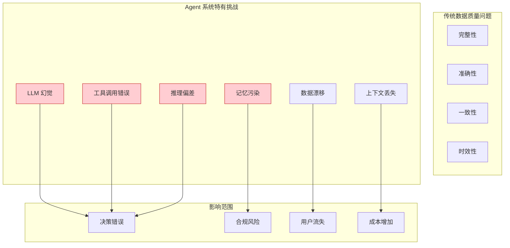
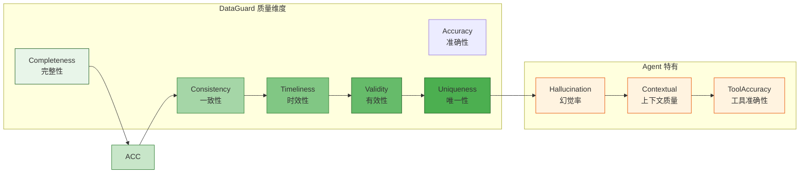
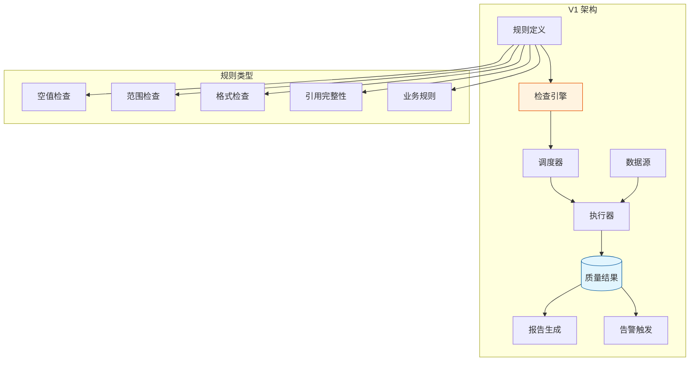
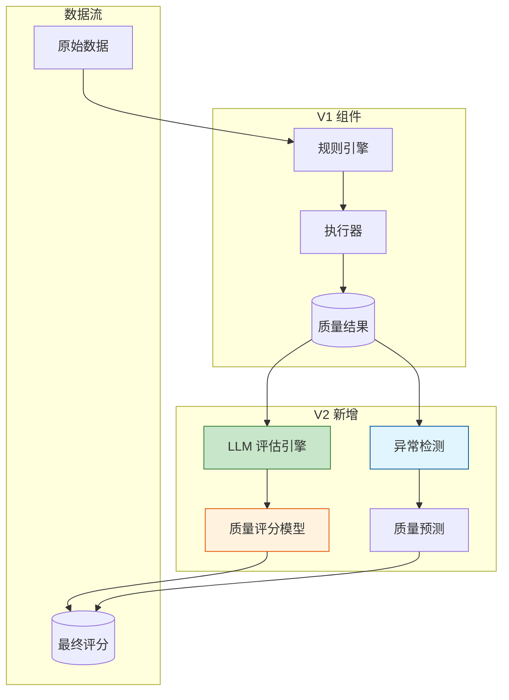
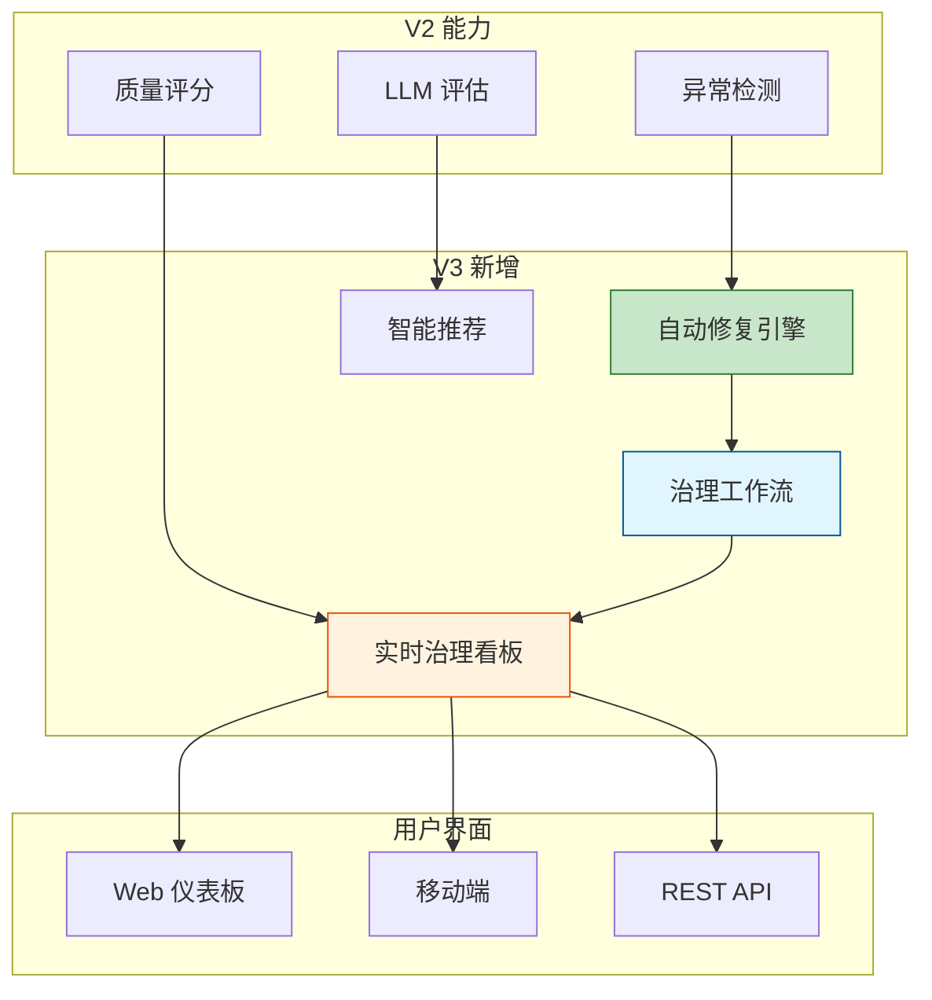

# Sprint 4: 数据质量监控与治理报告

## Sprint 目标

建立全面的数据质量监控和治理报告体系，从基于规则的质量检查演进到 LLM 智能质量评分，再到自动修复和实时治理看板的完整闭环。数据质量是 Agent 系统可靠性的保障，本 Sprint 实现端到端的质量治理能力。

## 业务背景

### Agent 系统的数据质量挑战



### 数据质量六大维度



## V1: 规则检查阶段

### 架构设计

V1 阶段建立基于规则的数据质量检查能力。



### 核心数据模型

```java
package com.dataguard.core.quality;

import jakarta.persistence.*;
import lombok.*;
import java.time.LocalDateTime;
import java.util.*;

/**
 * 数据质量规则
 */
@Entity
@Table(name = "quality_rules")
@Getter
@Setter
@Builder
@NoArgsConstructor
@AllArgsConstructor
public class QualityRule {
    
    @Id
    @GeneratedValue(strategy = GenerationType.IDENTITY)
    private Long id;
    
    /**
     * 规则唯一标识
     */
    @Column(unique = true, nullable = false)
    private String ruleId;
    
    /**
     * 规则名称
     */
    @Column(nullable = false)
    private String name;
    
    /**
     * 规则描述
     */
    @Column(length = 1000)
    private String description;
    
    /**
     * 规则类型
     */
    @Enumerated(EnumType.STRING)
    @Column(nullable = false)
    private RuleType ruleType;
    
    /**
     * 目标数据源
     */
    @Column(nullable = false)
    private String targetDataSource;
    
    /**
     * 目标表/集合
     */
    @Column(nullable = false)
    private String targetTable;
    
    /**
     * 目标字段
     */
    private String targetColumn;
    
    /**
     * 规则表达式
     */
    @Lob
    private String ruleExpression;
    
    /**
     * 规则参数
     */
    @Column(columnDefinition = "jsonb")
    private Map<String, Object> parameters;
    
    /**
     * 严重级别
     */
    @Enumerated(EnumType.STRING)
    @Column(nullable = false)
    private SeverityLevel severity;
    
    /**
     * 启用状态
     */
    @Column(nullable = false)
    private Boolean enabled;
    
    /**
     * 创建时间
     */
    @Column(nullable = false, updatable = false)
    private LocalDateTime createdAt;
    
    /**
     * 创建人
     */
    @Column(nullable = false, updatable = false)
    private String createdBy;
    
    /**
     * 调度表达式
     */
    private String scheduleExpression;
    
    public enum RuleType {
        NULL_CHECK,              // 空值检查
        RANGE_CHECK,             // 范围检查
        FORMAT_CHECK,            // 格式检查
        UNIQUE_CHECK,            // 唯一性检查
        REFERENTIAL_INTEGRITY,   // 引用完整性
        BUSINESS_RULE,           // 业务规则
        CUSTOM_SQL               // 自定义 SQL
    }
    
    public enum SeverityLevel {
        CRITICAL,    // 严重 - 立即处理
        HIGH,        // 高 - 尽快处理
        MEDIUM,      // 中 - 计划处理
        LOW,         // 低 - 记录即可
        INFO         // 信息 - 仅记录
    }
}
```

```java
package com.dataguard.core.quality;

import lombok.*;
import java.time.LocalDateTime;
import java.util.*;

/**
 * 质量检查结果
 */
@Data
@Builder
@NoArgsConstructor
@AllArgsConstructor
public class QualityCheckResult {
    
    /**
     * 检查ID
     */
    private String checkId;
    
    /**
     * 规则ID
     */
    private String ruleId;
    
    /**
     * 目标数据源
     */
    private String dataSource;
    
    /**
     * 检查状态
     */
    private CheckStatus status;
    
    /**
     * 总记录数
     */
    private long totalRecords;
    
    /**
     * 通过记录数
     */
    private long passedRecords;
    
    /**
     * 失败记录数
     */
    private long failedRecords;
    
    /**
     * 通过率
     */
    private double passRate;
    
    /**
     * 失败详情
     */
    private List<FailureDetail> failureDetails;
    
    /**
     * 检查开始时间
     */
    private LocalDateTime startTime;
    
    /**
     * 检查结束时间
     */
    private LocalDateTime endTime;
    
    /**
     * 执行时长(毫秒)
     */
    private long durationMs;
    
    /**
     * 错误信息
     */
    private String errorMessage;
    
    public enum CheckStatus {
        PENDING,      // 待执行
        RUNNING,      // 执行中
        PASSED,       // 通过
        FAILED,       // 失败
        ERROR,        // 错误
        SKIPPED       // 跳过
    }
    
    @Data
    @Builder
    @NoArgsConstructor
    @AllArgsConstructor
    public static class FailureDetail {
        private String recordId;
        private String field;
        private Object value;
        private String reason;
        private String expected;
    }
}
```

### 质量检查引擎

```java
package com.dataguard.core.quality.engine;

import com.dataguard.core.quality.*;
import lombok.RequiredArgsConstructor;
import lombok.extern.slf4j.Slf4j;
import org.springframework.stereotype.Component;
import org.springframework.transaction.annotation.Transactional;

import java.sql.*;
import java.util.*;
import java.util.regex.Pattern;

/**
 * 数据质量检查引擎 - V1 核心组件
 */
@Slf4j
@Component
@RequiredArgsConstructor
public class QualityCheckEngine {
    
    private final QualityRuleRepository ruleRepository;
    private final QualityResultRepository resultRepository;
    private final DataSourceRouter dataSourceRouter;
    private final AlertService alertService;
    
    /**
     * 执行质量检查
     */
    @Transactional
    public QualityCheckResult executeCheck(String ruleId) {
        log.info("Executing quality check for rule: {}", ruleId);
        
        // 获取规则
        QualityRule rule = ruleRepository.findByRuleId(ruleId)
            .orElseThrow(() -> new RuleNotFoundException(ruleId));
        
        if (!rule.getEnabled()) {
            return QualityCheckResult.builder()
                .ruleId(ruleId)
                .status(QualityCheckResult.CheckStatus.SKIPPED)
                .build();
        }
        
        // 创建检查记录
        QualityCheckResult result = QualityCheckResult.builder()
            .checkId(UUID.randomUUID().toString())
            .ruleId(ruleId)
            .dataSource(rule.getTargetDataSource())
            .status(QualityCheckResult.CheckStatus.RUNNING)
            .startTime(LocalDateTime.now())
            .build();
        
        try {
            // 获取数据连接
            Connection connection = dataSourceRouter.getConnection(rule.getTargetDataSource());
            
            // 根据规则类型执行检查
            switch (rule.getRuleType()) {
                case NULL_CHECK -> result = executeNullCheck(rule, connection, result);
                case RANGE_CHECK -> result = executeRangeCheck(rule, connection, result);
                case FORMAT_CHECK -> result = executeFormatCheck(rule, connection, result);
                case UNIQUE_CHECK -> result = executeUniqueCheck(rule, connection, result);
                case REFERENTIAL_INTEGRITY -> result = executeReferentialIntegrity(rule, connection, result);
                case BUSINESS_RULE -> result = executeBusinessRule(rule, connection, result);
                case CUSTOM_SQL -> result = executeCustomSql(rule, connection, result);
            }
            
            // 计算通过率
            result.setPassRate(calculatePassRate(result));
            
            // 保存结果
            resultRepository.save(result);
            
            // 触发告警
            if (result.getFailedRecords() > 0 && 
                result.getFailedRecords() >= getFailureThreshold(rule)) {
                alertService.triggerQualityAlert(result);
            }
            
            return result;
            
        } catch (Exception e) {
            log.error("Quality check failed for rule: {}", ruleId, e);
            result.setStatus(QualityCheckResult.CheckStatus.ERROR);
            result.setErrorMessage(e.getMessage());
            resultRepository.save(result);
            return result;
        } finally {
            result.setEndTime(LocalDateTime.now());
            result.setDurationMs(
                java.time.Duration.between(result.getStartTime(), result.getEndTime()).toMillis()
            );
        }
    }
    
    /**
     * 执行空值检查
     */
    private QualityCheckResult executeNullCheck(
        QualityRule rule,
        Connection connection,
        QualityCheckResult result
    ) throws SQLException {
        String sql = String.format(
            "SELECT COUNT(*) as total, COUNT(%s) as non_null FROM %s",
            rule.getTargetColumn(),
            rule.getTargetTable()
        );
        
        try (Statement stmt = connection.createStatement();
             ResultSet rs = stmt.executeQuery(sql)) {
            
            if (rs.next()) {
                result.setTotalRecords(rs.getLong("total"));
                result.setPassedRecords(rs.getLong("non_null"));
                result.setFailedRecords(result.getTotalRecords() - result.getPassedRecords());
            }
        }
        
        result.setStatus(result.getFailedRecords() == 0 ? 
            QualityCheckResult.CheckStatus.PASSED : 
            QualityCheckResult.CheckStatus.FAILED);
        
        return result;
    }
    
    /**
     * 执行范围检查
     */
    private QualityCheckResult executeRangeCheck(
        QualityRule rule,
        Connection connection,
        QualityCheckResult result
    ) throws SQLException {
        
        Map<String, Object> params = rule.getParameters();
        double minValue = ((Number) params.getOrDefault("minValue", Double.MIN_VALUE)).doubleValue();
        double maxValue = ((Number) params.getOrDefault("maxValue", Double.MAX_VALUE)).doubleValue();
        
        String sql = String.format(
            "SELECT COUNT(*) as total, SUM(CASE WHEN %s BETWEEN %s AND %s THEN 1 ELSE 0 END) as passed FROM %s",
            rule.getTargetColumn(),
            minValue,
            maxValue,
            rule.getTargetTable()
        );
        
        try (Statement stmt = connection.createStatement();
             ResultSet rs = stmt.executeQuery(sql)) {
            
            if (rs.next()) {
                result.setTotalRecords(rs.getLong("total"));
                result.setPassedRecords(rs.getLong("passed"));
                result.setFailedRecords(result.getTotalRecords() - result.getPassedRecords());
            }
        }
        
        // 收集失败详情
        if (result.getFailedRecords() > 0 && result.getFailedRecords() <= 1000) {
            result.setFailureDetails(collectRangeFailures(rule, connection, minValue, maxValue));
        }
        
        result.setStatus(result.getFailedRecords() == 0 ? 
            QualityCheckResult.CheckStatus.PASSED : 
            QualityCheckResult.CheckStatus.FAILED);
        
        return result;
    }
    
    /**
     * 执行格式检查
     */
    private QualityCheckResult executeFormatCheck(
        QualityRule rule,
        Connection connection,
        QualityCheckResult result
    ) throws SQLException {
        
        String pattern = (String) rule.getParameters().get("pattern");
        Pattern regex = Pattern.compile(pattern);
        
        String sql = String.format(
            "SELECT %s FROM %s WHERE %s IS NOT NULL LIMIT 1000",
            rule.getTargetColumn(),
            rule.getTargetTable(),
            rule.getTargetColumn()
        );
        
        long total = 0;
        long passed = 0;
        List<QualityCheckResult.FailureDetail> failures = new ArrayList<>();
        
        try (Statement stmt = connection.createStatement();
             ResultSet rs = stmt.executeQuery(sql)) {
            
            while (rs.next()) {
                total++;
                String value = rs.getString(1);
                if (regex.matcher(value).matches()) {
                    passed++;
                } else {
                    failures.add(QualityCheckResult.FailureDetail.builder()
                        .field(rule.getTargetColumn())
                        .value(value)
                        .reason("Format mismatch")
                        .expected(pattern)
                        .build());
                }
            }
        }
        
        result.setTotalRecords(total);
        result.setPassedRecords(passed);
        result.setFailedRecords(total - passed);
        result.setFailureDetails(failures);
        
        result.setStatus(result.getFailedRecords() == 0 ? 
            QualityCheckResult.CheckStatus.PASSED : 
            QualityCheckResult.CheckStatus.FAILED);
        
        return result;
    }
    
    /**
     * 执行唯一性检查
     */
    private QualityCheckResult executeUniqueCheck(
        QualityRule rule,
        Connection connection,
        QualityCheckResult result
    ) throws SQLException {
        
        String sql = String.format(
            "SELECT COUNT(*) as total, COUNT(DISTINCT %s) as unique_count FROM %s",
            rule.getTargetColumn(),
            rule.getTargetTable()
        );
        
        try (Statement stmt = connection.createStatement();
             ResultSet rs = stmt.executeQuery(sql)) {
            
            if (rs.next()) {
                result.setTotalRecords(rs.getLong("total"));
                result.setPassedRecords(rs.getLong("unique_count"));
                result.setFailedRecords(result.getTotalRecords() - result.getPassedRecords());
            }
        }
        
        result.setStatus(result.getFailedRecords() == 0 ? 
            QualityCheckResult.CheckStatus.PASSED : 
            QualityCheckResult.CheckStatus.FAILED);
        
        return result;
    }
    
    /**
     * 执行引用完整性检查
     */
    private QualityCheckResult executeReferentialIntegrity(
        QualityRule rule,
        Connection connection,
        QualityCheckResult result
    ) throws SQLException {
        
        String referencedTable = (String) rule.getParameters().get("referencedTable");
        String referencedColumn = (String) rule.getParameters().get("referencedColumn");
        
        String sql = String.format(
            "SELECT COUNT(*) as total, SUM(CASE WHEN %s IS NULL OR EXISTS (SELECT 1 FROM %s WHERE %s = %s.%s) THEN 1 ELSE 0 END) as passed FROM %s",
            rule.getTargetColumn(),
            referencedTable,
            referencedColumn,
            rule.getTargetTable(),
            rule.getTargetColumn(),
            rule.getTargetTable()
        );
        
        try (Statement stmt = connection.createStatement();
             ResultSet rs = stmt.executeQuery(sql)) {
            
            if (rs.next()) {
                result.setTotalRecords(rs.getLong("total"));
                result.setPassedRecords(rs.getLong("passed"));
                result.setFailedRecords(result.getTotalRecords() - result.getPassedRecords());
            }
        }
        
        result.setStatus(result.getFailedRecords() == 0 ? 
            QualityCheckResult.CheckStatus.PASSED : 
            QualityCheckResult.CheckStatus.FAILED);
        
        return result;
    }
    
    /**
     * 执行业务规则
     */
    private QualityCheckResult executeBusinessRule(
        QualityRule rule,
        Connection connection,
        QualityCheckResult result
    ) throws SQLException {
        
        String businessRule = (String) rule.getParameters().get("rule");
        
        String sql = String.format(
            "SELECT COUNT(*) as total, SUM(CASE WHEN %s THEN 1 ELSE 0 END) as passed FROM %s",
            businessRule,
            rule.getTargetTable()
        );
        
        try (Statement stmt = connection.createStatement();
             ResultSet rs = stmt.executeQuery(sql)) {
            
            if (rs.next()) {
                result.setTotalRecords(rs.getLong("total"));
                result.setPassedRecords(rs.getLong("passed"));
                result.setFailedRecords(result.getTotalRecords() - result.getPassedRecords());
            }
        }
        
        result.setStatus(result.getFailedRecords() == 0 ? 
            QualityCheckResult.CheckStatus.PASSED : 
            QualityCheckResult.CheckStatus.FAILED);
        
        return result;
    }
    
    /**
     * 执行自定义 SQL
     */
    private QualityCheckResult executeCustomSql(
        QualityRule rule,
        Connection connection,
        QualityCheckResult result
    ) throws SQLException {
        
        String customSql = rule.getRuleExpression();
        
        try (Statement stmt = connection.createStatement();
             ResultSet rs = stmt.executeQuery(customSql)) {
            
            if (rs.next()) {
                result.setTotalRecords(rs.getLong("total"));
                result.setPassedRecords(rs.getLong("passed"));
                result.setFailedRecords(rs.getLong("failed"));
            }
        }
        
        result.setStatus(result.getFailedRecords() == 0 ? 
            QualityCheckResult.CheckStatus.PASSED : 
            QualityCheckResult.CheckStatus.FAILED);
        
        return result;
    }
    
    private double calculatePassRate(QualityCheckResult result) {
        if (result.getTotalRecords() == 0) {
            return 100.0;
        }
        return (result.getPassedRecords() * 100.0) / result.getTotalRecords();
    }
    
    private long getFailureThreshold(QualityRule rule) {
        return switch (rule.getSeverity()) {
            case CRITICAL -> 0;
            case HIGH -> 10;
            case MEDIUM -> 100;
            case LOW -> 1000;
            case INFO -> Long.MAX_VALUE;
        };
    }
    
    private List<QualityCheckResult.FailureDetail> collectRangeFailures(
        QualityRule rule,
        Connection connection,
        double minValue,
        double maxValue
    ) throws SQLException {
        List<QualityCheckResult.FailureDetail> failures = new ArrayList<>();
        
        String sql = String.format(
            "SELECT * FROM %s WHERE %s NOT BETWEEN %s AND %s LIMIT 100",
            rule.getTargetTable(),
            rule.getTargetColumn(),
            minValue,
            maxValue
        );
        
        try (Statement stmt = connection.createStatement();
             ResultSet rs = stmt.executeQuery(sql)) {
            
            while (rs.next() && failures.size() < 100) {
                failures.add(QualityCheckResult.FailureDetail.builder()
                    .field(rule.getTargetColumn())
                    .value(rs.getObject(rule.getTargetColumn()))
                    .reason("Value out of range")
                    .expected("Between " + minValue + " and " + maxValue)
                    .build());
            }
        }
        
        return failures;
    }
}
```

### 质量报告生成

```java
package com.dataguard.core.quality.report;

import com.dataguard.core.quality.QualityCheckResult;
import com.dataguard.core.quality.QualityRule;
import lombok.RequiredArgsConstructor;
import lombok.extern.slf4j.Slf4j;
import org.apache.poi.ss.usermodel.*;
import org.apache.poi.xssf.usermodel.XSSFWorkbook;
import org.springframework.stereotype.Service;

import java.io.ByteArrayOutputStream;
import java.time.LocalDateTime;
import java.time.format.DateTimeFormatter;
import java.util.List;

/**
 * 质量报告生成器
 */
@Slf4j
@Service
@RequiredArgsConstructor
public class QualityReportGenerator {
    
    /**
     * 生成 Excel 报告
     */
    public byte[] generateExcelReport(QualityReportRequest request) {
        try (XSSFWorkbook workbook = new XSSFWorkbook()) {
            
            // 概览 Sheet
            createSummarySheet(workbook, request);
            
            // 详细结果 Sheet
            createDetailsSheet(workbook, request);
            
            // 趋势分析 Sheet
            createTrendSheet(workbook, request);
            
            // 写入字节数组
            ByteArrayOutputStream baos = new ByteArrayOutputStream();
            workbook.write(baos);
            return baos.toByteArray();
            
        } catch (Exception e) {
            log.error("Failed to generate Excel report", e);
            throw new ReportGenerationException("Excel generation failed", e);
        }
    }
    
    /**
     * 创建概览 Sheet
     */
    private void createSummarySheet(XSSFWorkbook workbook, QualityReportRequest request) {
        Sheet sheet = workbook.createSheet("质量概览");
        
        int rowNum = 0;
        
        // 标题
        Row titleRow = sheet.createRow(rowNum++);
        titleRow.createCell(0).setCellValue("数据质量报告");
        
        // 报告信息
        Row infoRow = sheet.createRow(rowNum++);
        infoRow.createCell(0).setCellValue("报告生成时间: " + 
            LocalDateTime.now().format(DateTimeFormatter.ofPattern("yyyy-MM-dd HH:mm:ss")));
        
        // 统计信息
        rowNum += 2;
        createSummaryStatistics(sheet, rowNum, request);
    }
    
    /**
     * 创建统计信息
     */
    private void createSummaryStatistics(Sheet sheet, int startRow, QualityReportRequest request) {
        List<QualityCheckResult> results = request.getCheckResults();
        
        // 计算统计数据
        long totalChecks = results.size();
        long passedChecks = results.stream()
            .filter(r -> r.getStatus() == QualityCheckResult.CheckStatus.PASSED)
            .count();
        long failedChecks = results.stream()
            .filter(r -> r.getStatus() == QualityCheckResult.CheckStatus.FAILED)
            .count();
        
        double overallPassRate = results.stream()
            .mapToDouble(QualityCheckResult::getPassRate)
            .average()
            .orElse(0.0);
        
        // 创建统计表格
        String[][] stats = {
            {"总检查数", String.valueOf(totalChecks)},
            {"通过数", String.valueOf(passedChecks)},
            {"失败数", String.valueOf(failedChecks)},
            {"总体通过率", String.format("%.2f%%", overallPassRate)},
            {"总记录数", String.valueOf(results.stream().mapToLong(QualityCheckResult::getTotalRecords).sum())},
            {"总失败记录", String.valueOf(results.stream().mapToLong(QualityCheckResult::getFailedRecords).sum())}
        };
        
        for (int i = 0; i < stats.length; i++) {
            Row row = sheet.createRow(startRow + i);
            row.createCell(0).setCellValue(stats[i][0]);
            row.createCell(1).setCellValue(stats[i][1]);
        }
        
        // 设置列宽
        sheet.setColumnWidth(0, 5000);
        sheet.setColumnWidth(1, 5000);
    }
    
    /**
     * 创建详细结果 Sheet
     */
    private void createDetailsSheet(XSSFWorkbook workbook, QualityReportRequest request) {
        Sheet sheet = workbook.createSheet("详细结果");
        
        // 表头
        Row headerRow = sheet.createRow(0);
        String[] headers = {"规则ID", "规则名称", "数据源", "状态", "总记录数", "通过数", "失败数", "通过率(%)"};
        
        for (int i = 0; i < headers.length; i++) {
            Cell cell = headerRow.createCell(i);
            cell.setCellValue(headers[i]);
            
            // 设置样式
            CellStyle headerStyle = workbook.createCellStyle();
            Font font = workbook.createFont();
            font.setBold(true);
            headerStyle.setFont(font);
            cell.setCellStyle(headerStyle);
        }
        
        // 数据行
        int rowNum = 1;
        for (QualityCheckResult result : request.getCheckResults()) {
            Row row = sheet.createRow(rowNum++);
            
            row.createCell(0).setCellValue(result.getRuleId());
            row.createCell(1).setCellValue(result.getRuleId()); // 应该是规则名称
            row.createCell(2).setCellValue(result.getDataSource());
            row.createCell(3).setCellValue(result.getStatus().name());
            row.createCell(4).setCellValue(result.getTotalRecords());
            row.createCell(5).setCellValue(result.getPassedRecords());
            row.createCell(6).setCellValue(result.getFailedRecords());
            row.createCell(7).setCellValue(result.getPassRate());
        }
        
        // 自动调整列宽
        for (int i = 0; i < headers.length; i++) {
            sheet.autoSizeColumn(i);
        }
    }
    
    /**
     * 创建趋势分析 Sheet
     */
    private void createTrendSheet(XSSFWorkbook workbook, QualityReportRequest request) {
        Sheet sheet = workbook.createSheet("趋势分析");
        
        // 这里简化实现，实际应该绘制图表
        Row headerRow = sheet.createRow(0);
        headerRow.createCell(0).setCellValue("日期");
        headerRow.createCell(1).setCellValue("通过率(%)");
        headerRow.createCell(2).setCellValue("失败记录数");
        
        // TODO: 从历史数据中获取趋势数据
    }
}
```

### V1 阶段的局限性

1. **规则僵化**：无法处理复杂的数据质量场景
2. **维护成本高**：需要人工编写和维护规则
3. **被动检测**：只能事后发现问题，无法预测
4. **缺少智能化**：无法自适应调整

## V2: 智能质量评分阶段

### 架构演进

V2 引入 LLM 驱动的智能质量评估。



### LLM 质量评估引擎

```java
package com.dataguard.core.quality.llm;

import com.dataguard.core.quality.QualityCheckResult;
import dev.langchain4j.model.chat.ChatLanguageModel;
import dev.langchain4j.data.message.*;
import lombok.RequiredArgsConstructor;
import lombok.extern.slf4j.Slf4j;
import org.springframework.stereotype.Component;

import java.util.List;
import java.util.Map;

/**
 * LLM 数据质量评估引擎 - V2 核心组件
 */
@Slf4j
@Component
@RequiredArgsConstructor
public class LLMQualityAssessmentEngine {
    
    private final ChatLanguageModel chatModel;
    
    /**
     * 综合质量评估
     */
    public QualityAssessment assessQuality(QualityAssessmentContext context) {
        log.info("Assessing data quality with LLM for: {}", context.getDataSource());
        
        String systemPrompt = buildQualityAssessmentPrompt();
        String userPrompt = buildUserPrompt(context);
        
        List<ChatMessage> messages = List.of(
            SystemMessage.from(systemPrompt),
            UserMessage.from(userPrompt)
        );
        
        try {
            AiMessage response = chatModel.generate(messages).content();
            return parseQualityAssessment(response.text(), context);
        } catch (Exception e) {
            log.error("LLM quality assessment failed", e);
            return QualityAssessment.fallback(context);
        }
    }
    
    /**
     * 评估 Agent 输出质量
     */
    public AgentOutputQuality assessAgentOutput(AgentOutputContext context) {
        log.info("Assessing Agent output quality for conversation: {}", context.getConversationId());
        
        String prompt = buildAgentOutputPrompt(context);
        
        List<ChatMessage> messages = List.of(
            SystemMessage.from(getAgentQualitySystemPrompt()),
            UserMessage.from(prompt)
        );
        
        try {
            AiMessage response = chatModel.generate(messages).content();
            return parseAgentOutputQuality(response.text());
        } catch (Exception e) {
            log.error("Agent output quality assessment failed", e);
            return AgentOutputQuality.unknown();
        }
    }
    
    /**
     * 构建质量评估系统提示词
     */
    private String buildQualityAssessmentPrompt() {
        return """
            你是一个数据质量评估专家。你的任务是分析数据并提供详细的质量评估报告。
            
            ## 评估维度
            1. 完整性
               - 空值比例
               - 必填字段完整性
            
            2. 准确性
               - 数据格式正确性
               - 数值范围合理性
               - 逻辑一致性
            
            3. 一致性
               - 跨字段一致性
               - 跨记录一致性
               - 与历史数据一致性
            
            4. 时效性
               - 数据新鲜度
               - 更新频率
            
            5. 有效性
               - 业务规则符合度
               - 域值有效性
            
            6. 唯一性
               - 重复记录检测
               - 主键唯一性
            
            ## 输出格式
            请以 JSON 格式输出评估结果：
            {
              "overallScore": 85.5,
              "dimensionScores": {
                "completeness": 90.0,
                "accuracy": 85.0,
                "consistency": 80.0,
                "timeliness": 88.0,
                "validity": 82.0,
                "uniqueness": 95.0
              },
              "issues": [
                {
                  "dimension": "completeness",
                  "severity": "high",
                  "description": "email字段空值率15%",
                  "recommendation": "建议验证email收集流程"
                }
              ],
              "strengths": [
                "主键唯一性良好",
                "更新频率符合预期"
              ],
              "recommendations": [
                "修复email字段空值问题",
                "加强跨字段一致性验证"
              ]
            }
            
            注意：
            - overallScore 范围 0-100
            - 只输出 JSON，不要有任何其他内容
            """;
    }
    
    /**
     * 构建用户提示词
     */
    private String buildUserPrompt(QualityAssessmentContext context) {
        StringBuilder prompt = new StringBuilder();
        prompt.append("请评估以下数据质量：\n\n");
        
        // 基本信息
        prompt.append("## 数据源信息\n");
        prompt.append("- 数据源: ").append(context.getDataSource()).append("\n");
        prompt.append("- 表名: ").append(context.getTableName()).append("\n");
        prompt.append("- 记录数: ").append(context.getRecordCount()).append("\n");
        
        // 规则检查结果
        if (context.getRuleResults() != null && !context.getRuleResults().isEmpty()) {
            prompt.append("\n## 规则检查结果\n");
            for (QualityCheckResult result : context.getRuleResults()) {
                prompt.append(String.format("- %s: 通过率 %.2f%%\n",
                    result.getRuleId(),
                    result.getPassRate()));
            }
        }
        
        // 数据样本
        if (context.getDataSample() != null) {
            prompt.append("\n## 数据样本\n");
            prompt.append("```json\n");
            prompt.append(context.getDataSample());
            prompt.append("\n```\n");
        }
        
        // Schema 信息
        if (context.getSchema() != null) {
            prompt.append("\n## Schema 信息\n");
            for (Map.Entry<String, String> entry : context.getSchema().entrySet()) {
                prompt.append(String.format("- %s: %s\n", entry.getKey(), entry.getValue()));
            }
        }
        
        return prompt.toString();
    }
    
    /**
     * Agent 质量评估提示词
     */
    private String getAgentQualitySystemPrompt() {
        return """
            你是一个 AI Agent 输出质量评估专家。你的任务是分析 Agent 的回复并评估其质量。
            
            ## 评估维度
            1. 准确性
               - 事实准确性
               - 引用准确性
            
            2. 相关性
               - 回答相关性
               - 上下文理解
            
            3. 完整性
               - 信息完整性
               - 逻辑完整性
            
            4. 清晰性
               - 表达清晰度
               - 结构清晰度
            
            5. 幻觉检测
               - 无根据断言
               - 虚构事实
            
            ## 输出格式
            {
              "overallScore": 85.0,
              "dimensionScores": {
                "accuracy": 88.0,
                "relevance": 90.0,
                "completeness": 82.0,
                "clarity": 85.0,
                "hallucination": 80.0
              },
              "hasHallucination": false,
              "issues": [...],
              "recommendations": [...]
            }
            """;
    }
    
    private String buildAgentOutputPrompt(AgentOutputContext context) {
        StringBuilder prompt = new StringBuilder();
        
        prompt.append("## 用户查询\n");
        prompt.append(context.getUserQuery()).append("\n\n");
        
        prompt.append("## Agent 回复\n");
        prompt.append(context.getAgentResponse()).append("\n\n");
        
        if (context.getRetrievedContext() != null) {
            prompt.append("## 检索的上下文\n");
            prompt.append(context.getRetrievedContext()).append("\n\n");
        }
        
        return prompt.toString();
    }
    
    private QualityAssessment parseQualityAssessment(String jsonText, QualityAssessmentContext context) {
        try {
            com.fasterxml.jackson.databind.ObjectMapper mapper = new com.fasterxml.jackson.databind.ObjectMapper();
            return mapper.readValue(jsonText, QualityAssessment.class);
        } catch (Exception e) {
            log.error("Failed to parse LLM assessment: {}", jsonText, e);
            return QualityAssessment.fallback(context);
        }
    }
    
    private AgentOutputQuality parseAgentOutputQuality(String jsonText) {
        try {
            com.fasterxml.jackson.databind.ObjectMapper mapper = new com.fasterxml.jackson.databind.ObjectMapper();
            return mapper.readValue(jsonText, AgentOutputQuality.class);
        } catch (Exception e) {
            log.error("Failed to parse agent output quality: {}", jsonText, e);
            return AgentOutputQuality.unknown();
        }
    }
}
```

### 异常检测引擎

```java
package com.dataguard.core.quality.anomaly;

import lombok.RequiredArgsConstructor;
import lombok.extern.slf4j.Slf4j;
import org.springframework.stereotype.Component;

import java.time.LocalDateTime;
import java.util.*;

/**
 * 数据质量异常检测引擎 - V2 核心组件
 */
@Slf4j
@Component
@RequiredArgsConstructor
public class QualityAnomalyDetector {
    
    private final AnomalyModelRepository modelRepository;
    
    /**
     * 检测质量异常
     */
    public List<QualityAnomaly> detectAnomalies(QualityMetrics metrics) {
        List<QualityAnomaly> anomalies = new ArrayList<>();
        
        // 1. 通过率异常
        anomalies.addAll(detectPassRateAnomalies(metrics));
        
        // 2. 数据量异常
        anomalies.addAll(detectVolumeAnomalies(metrics));
        
        // 3. 数据漂移
        anomalies.addAll(detectDataDrift(metrics));
        
        // 4. 模式异常
        anomalies.addAll(detectPatternAnomalies(metrics));
        
        return anomalies;
    }
    
    /**
     * 检测通过率异常
     */
    private List<QualityAnomaly> detectPassRateAnomalies(QualityMetrics metrics) {
        List<QualityAnomaly> anomalies = new ArrayList<>();
        
        // 获取历史基线
        QualityBaseline baseline = modelRepository.getBaseline(metrics.getDataSource());
        if (baseline == null) {
            return anomalies;
        }
        
        // 计算偏差
        double currentScore = metrics.getOverallQualityScore();
        double baselineScore = baseline.getAverageScore();
        double deviation = Math.abs(currentScore - baselineScore);
        
        // 标准差阈值
        double threshold = baseline.getStandardDeviation() * 2;
        
        if (deviation > threshold) {
            anomalies.add(QualityAnomaly.builder()
                .type(AnomalyType.PASS_RATE_DEVIATION)
                .severity(deviation > threshold * 2 ? AnomalySeverity.HIGH : AnomalySeverity.MEDIUM)
                .description(String.format("质量分数偏离基线 %.2f (当前: %.2f, 基线: %.2f)",
                    deviation, currentScore, baselineScore))
                .detectedAt(LocalDateTime.now())
                .dataSource(metrics.getDataSource())
                .metrics(Map.of(
                    "currentScore", currentScore,
                    "baselineScore", baselineScore,
                    "deviation", deviation,
                    "threshold", threshold
                ))
                .build());
        }
        
        return anomalies;
    }
    
    /**
     * 检测数据量异常
     */
    private List<QualityAnomaly> detectVolumeAnomalies(QualityMetrics metrics) {
        List<QualityAnomaly> anomalies = new ArrayList<>();
        
        QualityBaseline baseline = modelRepository.getBaseline(metrics.getDataSource());
        if (baseline == null) {
            return anomalies;
        }
        
        long currentVolume = metrics.getTotalRecords();
        long baselineVolume = baseline.getAverageVolume();
        
        // 计算变化率
        double changeRate = Math.abs((double)(currentVolume - baselineVolume) / baselineVolume);
        
        if (changeRate > 0.3) { // 30% 变化率阈值
            anomalies.add(QualityAnomaly.builder()
                .type(AnomalyType.VOLUME_CHANGE)
                .severity(changeRate > 0.5 ? AnomalySeverity.HIGH : AnomalySeverity.MEDIUM)
                .description(String.format("数据量变化 %.1f%% (当前: %d, 基线: %d)",
                    changeRate * 100, currentVolume, baselineVolume))
                .detectedAt(LocalDateTime.now())
                .dataSource(metrics.getDataSource())
                .metrics(Map.of(
                    "currentVolume", currentVolume,
                    "baselineVolume", baselineVolume,
                    "changeRate", changeRate
                ))
                .build());
        }
        
        return anomalies;
    }
    
    /**
     * 检测数据漂移
     */
    private List<QualityAnomaly> detectDataDrift(QualityMetrics metrics) {
        List<QualityAnomaly> anomalies = new ArrayList<>();
        
        // 获取当前数据分布
        DataDistribution currentDist = metrics.getDataDistribution();
        
        // 获取参考分布
        DataDistribution referenceDist = modelRepository.getReferenceDistribution(
            metrics.getDataSource()
        );
        
        if (referenceDist == null) {
            return anomalies;
        }
        
        // 计算 KL 散度
        double klDivergence = calculateKLDivergence(currentDist, referenceDist);
        
        if (klDivergence > 0.2) { // 阈值
            anomalies.add(QualityAnomaly.builder()
                .type(AnomalyType.DATA_DRIFT)
                .severity(klDivergence > 0.5 ? AnomalySeverity.HIGH : AnomalySeverity.MEDIUM)
                .description(String.format("检测到数据漂移 (KL散度: %.4f)", klDivergence))
                .detectedAt(LocalDateTime.now())
                .dataSource(metrics.getDataSource())
                .metrics(Map.of("klDivergence", klDivergence))
                .build());
        }
        
        return anomalies;
    }
    
    /**
     * 检测模式异常
     */
    private List<QualityAnomaly> detectPatternAnomalies(QualityMetrics metrics) {
        List<QualityAnomaly> anomalies = new ArrayList<>();
        
        // 检查字段值分布变化
        Map<String, Object> fieldDistributions = metrics.getFieldDistributions();
        
        for (Map.Entry<String, Object> entry : fieldDistributions.entrySet()) {
            String field = entry.getKey();
            FieldDistribution currentDist = (FieldDistribution) entry.getValue();
            
            // 获取历史分布
            FieldDistribution historicalDist = modelRepository.getFieldDistribution(
                metrics.getDataSource(),
                field
            );
            
            if (historicalDist != null) {
                double similarity = calculateDistributionSimilarity(currentDist, historicalDist);
                
                if (similarity < 0.7) { // 相似度阈值
                    anomalies.add(QualityAnomaly.builder()
                        .type(AnomalyType.PATTERN_CHANGE)
                        .severity(AnomalySeverity.MEDIUM)
                        .description(String.format("字段 %s 的分布模式发生变化 (相似度: %.2f)",
                            field, similarity))
                        .detectedAt(LocalDateTime.now())
                        .dataSource(metrics.getDataSource())
                        .affectedField(field)
                        .metrics(Map.of("similarity", similarity))
                        .build());
                }
            }
        }
        
        return anomalies;
    }
    
    /**
     * 计算 KL 散度
     */
    private double calculateKLDivergence(DataDistribution p, DataDistribution q) {
        double kl = 0.0;
        
        for (String key : p.getKeys()) {
            double pValue = p.getProbability(key);
            double qValue = q.getProbability(key);
            
            if (pValue > 0 && qValue > 0) {
                kl += pValue * Math.log(pValue / qValue);
            }
        }
        
        return kl;
    }
    
    /**
     * 计算分布相似度
     */
    private double calculateDistributionSimilarity(FieldDistribution dist1, FieldDistribution dist2) {
        // 简化实现：计算重叠度
        Set<String> allKeys = new HashSet<>();
        allKeys.addAll(dist1.getUniqueValues());
        allKeys.addAll(dist2.getUniqueValues());
        
        int intersection = 0;
        for (String key : allKeys) {
            if (dist1.containsValue(key) && dist2.containsValue(key)) {
                intersection++;
            }
        }
        
        return (double) intersection / allKeys.size();
    }
}
```

## V3: 自动修复 + 治理看板阶段

### 架构演进

V3 引入自动修复和实时治理看板。



### 自动修复引擎

```java
package com.dataguard.core.quality.repair;

import com.dataguard.core.quality.*;
import com.dataguard.core.quality.llm.*;
import lombok.RequiredArgsConstructor;
import lombok.extern.slf4j.Slf4j;
import org.springframework.stereotype.Service;
import org.springframework.transaction.annotation.Transactional;

import java.util.*;
import java.util.concurrent.CompletableFuture;

/**
 * 自动数据修复引擎 - V3 核心组件
 */
@Slf4j
@Service
@RequiredArgsConstructor
public class AutomaticDataRepairEngine {
    
    private final LLMQualityAssessmentEngine llmEngine;
    private final RepairStrategyRepository strategyRepository;
    private final DataRepairExecutor repairExecutor;
    
    /**
     * 分析并生成修复建议
     */
    public List<RepairSuggestion> analyzeAndSuggest(QualityCheckResult result) {
        log.info("Analyzing quality result for repair suggestions: {}", result.getCheckId());
        
        List<RepairSuggestion> suggestions = new ArrayList<>();
        
        // 基于失败类型的修复建议
        for (QualityCheckResult.FailureDetail failure : result.getFailureDetails()) {
            RepairSuggestion suggestion = generateSuggestion(failure, result);
            if (suggestion != null) {
                suggestions.add(suggestion);
            }
        }
        
        // 去重和优先级排序
        suggestions = deduplicateAndPrioritize(suggestions);
        
        return suggestions;
    }
    
    /**
     * LLM 驱动的智能修复建议
     */
    public List<RepairSuggestion> generateSmartSuggestions(
        QualityCheckResult result,
        QualityContext context
    ) {
        log.info("Generating smart repair suggestions with LLM");
        
        // 构建提示词
        String prompt = buildRepairPrompt(result, context);
        
        // 调用 LLM
        // 这里简化，实际应该调用 LLM
        List<RepairSuggestion> suggestions = new ArrayList<>();
        
        return suggestions;
    }
    
    /**
     * 执行自动修复
     */
    @Transactional
    public RepairResult executeRepair(RepairRequest request) {
        log.info("Executing repair: {}", request.getRepairId());
        
        RepairResult result = RepairResult.builder()
            .repairId(request.getRepairId())
            .ruleId(request.getRuleId())
            .startTime(LocalDateTime.now())
            .build();
        
        try {
            // 1. 验证修复权限
            if (!validateRepairPermission(request)) {
                return result.withError("Repair permission denied");
            }
            
            // 2. 备份原始数据
            backupOriginalData(request);
            
            // 3. 执行修复
            List<RepairAction> actions = request.getRepairActions();
            int successCount = 0;
            int failureCount = 0;
            
            for (RepairAction action : actions) {
                try {
                    repairExecutor.executeAction(action);
                    successCount++;
                } catch (Exception e) {
                    log.error("Failed to execute repair action: {}", action.getActionId(), e);
                    failureCount++;
                }
            }
            
            // 4. 验证修复结果
            QualityCheckResult validationResult = validateRepair(request);
            
            // 5. 构建结果
            result.setSuccessCount(successCount);
            result.setFailureCount(failureCount);
            result.setValidationResult(validationResult);
            result.setEndTime(LocalDateTime.now());
            result.setStatus(failureCount == 0 ? 
                RepairResult.Status.SUCCESS : 
                RepairResult.Status.PARTIAL_SUCCESS);
            
            return result;
            
        } catch (Exception e) {
            log.error("Repair execution failed", e);
            return result.withError(e.getMessage());
        }
    }
    
    /**
     * 批量自动修复
     */
    public CompletableFuture<BatchRepairResult> executeBatchRepair(BatchRepairRequest request) {
        log.info("Executing batch repair: {} items", request.getItems().size());
        
        return CompletableFuture.supplyAsync(() -> {
            BatchRepairResult batchResult = new BatchRepairResult(request.getBatchId());
            
            request.getItems().parallelStream().forEach(item -> {
                try {
                    RepairResult result = executeRepair(item);
                    batchResult.addResult(result);
                } catch (Exception e) {
                    log.error("Batch repair item failed: {}", item.getRepairId(), e);
                    batchResult.addError(item.getRepairId(), e.getMessage());
                }
            });
            
            return batchResult;
        });
    }
    
    /**
     * 生成修复建议
     */
    private RepairSuggestion generateSuggestion(
        QualityCheckResult.FailureDetail failure,
        QualityCheckResult result
    ) {
        RepairStrategy strategy = strategyRepository.findByFailureReason(failure.getReason());
        if (strategy == null) {
            return null;
        }
        
        return RepairSuggestion.builder()
            .suggestionId(UUID.randomUUID().toString())
            .ruleId(result.getRuleId())
            .field(failure.getField())
            .currentValue(failure.getValue())
            .reason(failure.getReason())
            .repairType(strategy.getRepairType())
            .description(strategy.getDescription())
            .estimatedImpact(strategy.getEstimatedImpact())
            .riskLevel(strategy.getRiskLevel())
            .autoExecutable(strategy.isAutoExecutable())
            .build();
    }
    
    private List<RepairSuggestion> deduplicateAndPrioritize(List<RepairSuggestion> suggestions) {
        // 去重
        Map<String, RepairSuggestion> unique = new LinkedHashMap<>();
        for (RepairSuggestion suggestion : suggestions) {
            String key = suggestion.getField() + ":" + suggestion.getRepairType();
            if (!unique.containsKey(key)) {
                unique.put(key, suggestion);
            }
        }
        
        // 优先级排序
        return unique.values().stream()
            .sorted(Comparator.comparing(RepairSuggestion::getRiskLevel)
                .thenComparing(RepairSuggestion::getEstimatedImpact).reversed())
            .toList();
    }
    
    private String buildRepairPrompt(QualityCheckResult result, QualityContext context) {
        return "";
    }
    
    private boolean validateRepairPermission(RepairRequest request) {
        return true;
    }
    
    private void backupOriginalData(RepairRequest request) {
        // 备份逻辑
    }
    
    private QualityCheckResult validateRepair(RepairRequest request) {
        // 验证逻辑
        return null;
    }
}
```

### 实时治理看板

```java
package com.dataguard.core.quality.dashboard;

import lombok.RequiredArgsConstructor;
import lombok.extern.slf4j.Slf4j;
import org.springframework.messaging.simp.SimpMessagingTemplate;
import org.springframework.scheduling.annotation.Scheduled;
import org.springframework.stereotype.Component;

import java.time.LocalDateTime;
import java.util.*;
import java.util.concurrent.ConcurrentHashMap;

/**
 * 实时治理看板服务 - V3 核心组件
 */
@Slf4j
@Component
@RequiredArgsConstructor
public class GovernanceDashboardService {
    
    private final SimpMessagingTemplate messagingTemplate;
    private final QualityMetricsCollector metricsCollector;
    
    // 实时数据缓存
    private final Map<String, DataSourceDashboard> dashboards = new ConcurrentHashMap<>();
    
    /**
     * 获取数据源看板
     */
    public DataSourceDashboard getDashboard(String dataSourceId) {
        return dashboards.computeIfAbsent(dataSourceId, this::buildDashboard);
    }
    
    /**
     * 构建看板
     */
    private DataSourceDashboard buildDashboard(String dataSourceId) {
        DataSourceDashboard dashboard = new DataSourceDashboard(dataSourceId);
        
        // 收集指标
        QualitySnapshot snapshot = metricsCollector.collectSnapshot(dataSourceId);
        dashboard.setCurrentSnapshot(snapshot);
        
        // 获取历史趋势
        List<QualitySnapshot> history = metricsCollector.getHistory(dataSourceId, 7);
        dashboard.setHistoricalSnapshots(history);
        
        // 计算趋势
        QualityTrend trend = calculateTrend(history);
        dashboard.setTrend(trend);
        
        // 获取活跃问题
        List<QualityIssue> activeIssues = metricsCollector.getActiveIssues(dataSourceId);
        dashboard.setActiveIssues(activeIssues);
        
        // 计算健康度
        double healthScore = calculateHealthScore(snapshot, activeIssues);
        dashboard.setHealthScore(healthScore);
        
        return dashboard;
    }
    
    /**
     * 定时更新看板数据
     */
    @Scheduled(fixedRate = 60000) // 每分钟更新
    public void updateDashboards() {
        log.debug("Updating governance dashboards");
        
        for (String dataSourceId : dashboards.keySet()) {
            try {
                DataSourceDashboard dashboard = buildDashboard(dataSourceId);
                dashboards.put(dataSourceId, dashboard);
                
                // 推送更新
                pushDashboardUpdate(dashboard);
                
            } catch (Exception e) {
                log.error("Failed to update dashboard for: {}", dataSourceId, e);
            }
        }
    }
    
    /**
     * 推送看板更新
     */
    private void pushDashboardUpdate(DataSourceDashboard dashboard) {
        try {
            messagingTemplate.convertAndSend(
                "/topic/dashboard-updates",
                dashboard
            );
        } catch (Exception e) {
            log.error("Failed to push dashboard update", e);
        }
    }
    
    /**
     * 获取治理概览
     */
    public GovernanceOverview getGovernanceOverview() {
        GovernanceOverview overview = new GovernanceOverview();
        
        // 总体健康度
        double overallHealth = dashboards.values().stream()
            .mapToDouble(DataSourceDashboard::getHealthScore)
            .average()
            .orElse(0.0);
        overview.setOverallHealthScore(overallHealth);
        
        // 数据源统计
        long totalSources = dashboards.size();
        long healthySources = dashboards.values().stream()
            .filter(d -> d.getHealthScore() >= 80)
            .count();
        long warningSources = dashboards.values().stream()
            .filter(d -> d.getHealthScore() >= 60 && d.getHealthScore() < 80)
            .count();
        long criticalSources = dashboards.values().stream()
            .filter(d -> d.getHealthScore() < 60)
            .count();
        
        overview.setTotalDataSources(totalSources);
        overview.setHealthySources(healthySources);
        overview.setWarningSources(warningSources);
        overview.setCriticalSources(criticalSources);
        
        // 活跃问题统计
        int totalIssues = dashboards.values().stream()
            .mapToInt(d -> d.getActiveIssues().size())
            .sum();
        overview.setTotalActiveIssues(totalIssues);
        
        // 修复统计
        int pendingRepairs = dashboards.values().stream()
            .mapToInt(d -> d.getPendingRepairs())
            .sum();
        overview.setPendingRepairs(pendingRepairs);
        
        // 时间戳
        overview.setUpdatedAt(LocalDateTime.now());
        
        return overview;
    }
    
    /**
     * 计算质量趋势
     */
    private QualityTrend calculateTrend(List<QualitySnapshot> snapshots) {
        if (snapshots.size() < 2) {
            return QualityTrend.STABLE;
        }
        
        QualitySnapshot latest = snapshots.get(0);
        QualitySnapshot previous = snapshots.get(snapshots.size() - 1);
        
        double change = latest.getOverallScore() - previous.getOverallScore();
        
        if (change > 5) {
            return QualityTrend.IMPROVING;
        } else if (change < -5) {
            return QualityTrend.DEGRADING;
        } else {
            return QualityTrend.STABLE;
        }
    }
    
    /**
     * 计算健康度
     */
    private double calculateHealthScore(QualitySnapshot snapshot, List<QualityIssue> issues) {
        double baseScore = snapshot.getOverallScore();
        
        // 根据严重问题扣分
        double penalty = issues.stream()
            .mapToDouble(issue -> switch (issue.getSeverity()) {
                case CRITICAL -> 20.0;
                case HIGH -> 10.0;
                case MEDIUM -> 5.0;
                case LOW -> 1.0;
            })
            .sum();
        
        return Math.max(0, baseScore - penalty);
    }
    
    /**
     * 质量趋势
     */
    public enum QualityTrend {
        IMPROVING,   // 改善
        STABLE,      // 稳定
        DEGRADING    // 恶化
    }
}
```

### 治理工作流

```java
package com.dataguard.core.quality.workflow;

import lombok.RequiredArgsConstructor;
import lombok.extern.slf4j.Slf4j;
import org.springframework.statemachine.StateMachine;
import org.springframework.statemachine.config.StateMachineFactory;
import org.springframework.stereotype.Service;

import java.util.*;

/**
 * 治理工作流引擎 - V3 核心组件
 */
@Slf4j
@Service
@RequiredArgsConstructor
public class GovernanceWorkflowEngine {
    
    private final StateMachineFactory<WorkflowState, WorkflowEvent> stateMachineFactory;
    private final WorkflowInstanceRepository instanceRepository;
    
    /**
     * 启动治理工作流
     */
    public WorkflowInstance startWorkflow(WorkflowDefinition definition, Map<String, Object> context) {
        log.info("Starting governance workflow: {}", definition.getWorkflowId());
        
        // 创建工作流实例
        WorkflowInstance instance = WorkflowInstance.builder()
            .instanceId(UUID.randomUUID().toString())
            .workflowId(definition.getWorkflowId())
            .currentState(WorkflowState.STARTED)
            .context(context)
            .startedAt(LocalDateTime.now())
            .build();
        
        // 保存实例
        instanceRepository.save(instance);
        
        // 启动状态机
        StateMachine<WorkflowState, WorkflowEvent> stateMachine = 
            stateMachineFactory.getStateMachine(definition.getWorkflowId());
        stateMachine.start();
        
        // 执行第一步
        executeNextStep(instance, stateMachine);
        
        return instance;
    }
    
    /**
     * 执行下一步
     */
    public void executeNextStep(WorkflowInstance instance, StateMachine<WorkflowState, WorkflowEvent> stateMachine) {
        WorkflowState currentState = instance.getCurrentState();
        
        // 根据当前状态执行相应动作
        switch (currentState) {
            case STARTED -> {
                // 初始化步骤
                performInitialization(instance);
                transitionTo(stateMachine, WorkflowState.ANALYZING);
            }
            case ANALYZING -> {
                // 分析数据质量问题
                performAnalysis(instance);
                // 根据分析结果决定下一步
                if (needsRepair(instance)) {
                    transitionTo(stateMachine, WorkflowState.REPAIRING);
                } else {
                    transitionTo(stateMachine, WorkflowState.COMPLETED);
                }
            }
            case REPAIRING -> {
                // 执行修复
                performRepair(instance);
                // 验证修复结果
                transitionTo(stateMachine, WorkflowState.VALIDATING);
            }
            case VALIDATING -> {
                // 验证修复结果
                boolean validated = performValidation(instance);
                if (validated) {
                    transitionTo(stateMachine, WorkflowState.COMPLETED);
                } else {
                    transitionTo(stateMachine, WorkflowState.FAILED);
                }
            }
            case COMPLETED -> {
                // 完成工作流
                completeWorkflow(instance);
            }
            case FAILED -> {
                // 处理失败
                handleFailure(instance);
            }
        }
        
        // 更新实例状态
        instance.setCurrentState(stateMachine.getState().getId());
        instanceRepository.save(instance);
    }
    
    private void performInitialization(WorkflowInstance instance) {
        log.info("Initializing workflow instance: {}", instance.getInstanceId());
        // 初始化逻辑
    }
    
    private void performAnalysis(WorkflowInstance instance) {
        log.info("Analyzing data quality for workflow: {}", instance.getInstanceId());
        // 分析逻辑
    }
    
    private boolean needsRepair(WorkflowInstance instance) {
        // 判断是否需要修复
        return true;
    }
    
    private void performRepair(WorkflowInstance instance) {
        log.info("Performing repair for workflow: {}", instance.getInstanceId());
        // 修复逻辑
    }
    
    private boolean performValidation(WorkflowInstance instance) {
        log.info("Validating repair for workflow: {}", instance.getInstanceId());
        // 验证逻辑
        return true;
    }
    
    private void completeWorkflow(WorkflowInstance instance) {
        log.info("Completing workflow: {}", instance.getInstanceId());
        instance.setCompletedAt(LocalDateTime.now());
        instance.setStatus(WorkflowStatus.COMPLETED);
    }
    
    private void handleFailure(WorkflowInstance instance) {
        log.error("Workflow failed: {}", instance.getInstanceId());
        instance.setCompletedAt(LocalDateTime.now());
        instance.setStatus(WorkflowStatus.FAILED);
    }
    
    private void transitionTo(StateMachine<WorkflowState, WorkflowEvent> stateMachine, WorkflowState targetState) {
        // 发送事件以触发状态转换
        // stateMachine.sendEvent(...);
    }
    
    /**
     * 工作流状态
     */
    public enum WorkflowState {
        STARTED,
        ANALYZING,
        REPAIRING,
        VALIDATING,
        COMPLETED,
        FAILED
    }
    
    /**
     * 工作流事件
     */
    public enum WorkflowEvent {
        START,
        ANALYZE,
        REPAIR,
        VALIDATE,
        COMPLETE,
        FAIL
    }
    
    /**
     * 工作流状态
     */
    public enum WorkflowStatus {
        RUNNING,
        COMPLETED,
        FAILED,
        CANCELLED
    }
}
```

## Sprint 总结

### 演进对比

| 特性 | V1 规则检查 | V2 智能评分 | V3 自动修复看板 |
|------|------------|-------------|---------------|
| 规则检查 | ✅ | ✅ | ✅ |
| LLM 评估 | 无 | ✅ | ✅ |
| 异常检测 | 无 | ✅ | ✅ |
| 质量预测 | 无 | ✅ | ✅ |
| 自动修复 | 无 | 无 | ✅ |
| 实时看板 | 无 | 无 | ✅ |
| 治理工作流 | 无 | 无 | ✅ |

### 核心交付物

1. **QualityMonitor**：质量监控核心引擎
2. **LLMQualityAssessmentEngine**：LLM 质量评估引擎
3. **QualityAnomalyDetector**：异常检测引擎
4. **AutomaticDataRepairEngine**：自动修复引擎
5. **GovernanceDashboardService**：治理看板服务

### 技术亮点

- **规则引擎**：灵活的数据质量规则定义和执行
- **LLM 集成**：智能化的质量评估和异常分析
- **异常检测**：基于统计学的数据漂移和模式异常检测
- **自动修复**：LLM 驱动的智能修复建议和执行
- **实时看板**：WebSocket 推送的实时治理数据
- **工作流引擎**：状态机驱动的治理工作流

---

**项目完成**！你已成功构建了完整的 DataGuard — Agent 数据治理与隐私保护平台。
