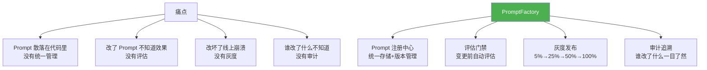
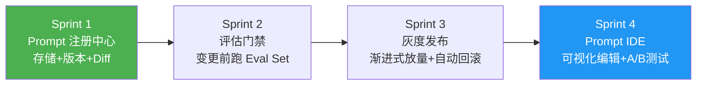
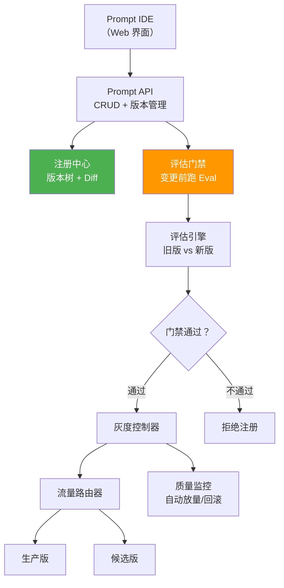

# ⑯ PromptFactory — Prompt 工程化管理平台

> **代号**：PromptFactory
> **核心问题**：团队 10 个人改 Prompt 全靠 Git + 微信沟通，没有版本管理、没有评估门禁、没有灰度发布——怎么系统化管理 Prompt 全生命周期？

---

## 项目定位



---

## 四个 Sprint



| Sprint | 目标 | V1→V2→V3 | 时间 |
|--------|------|---------|------|
| Sprint 1 | Prompt 注册中心 | V1 内存存储 → V2 持久化 → V3 版本树 | 1 周 |
| Sprint 2 | 评估门禁 | V1 全量评估 → V2 增量评估 → V3 差异分析 | 1 周 |
| Sprint 3 | 灰度发布 | V1 按比例 → V2 按用户群 → V3 自动决策 | 1 周 |
| Sprint 4 | Prompt IDE | V1 在线编辑 → V2 预览测试 → V3 A/B 实验 | 1 周 |

---

## 架构设计



---

## 目录结构

```
项目实践/16-企业项目-Prompt工程化管理平台/
├── 00-总览.md                          ← 本文件
├── Sprint1-Prompt注册中心.md            ← 版本管理 + Diff + 回滚
├── Sprint2-评估门禁.md                  ← 变更前评估 + 质量门禁
├── Sprint3-灰度发布.md                  ← 渐进式放量 + 自动回滚
└── Sprint4-PromptIDE.md                ← 可视化编辑 + A/B 测试
```

---

## 技术栈

| 层 | 技术 |
|----|------|
| 前端 | React + Monaco Editor（代码编辑器风格） |
| 后端 | Spring Boot + Spring AI |
| 存储 | PostgreSQL（版本管理）+ Redis（缓存） |
| 评估 | Spring AI Eval + LLM-as-Judge |
| 部署 | Docker + K8s |
