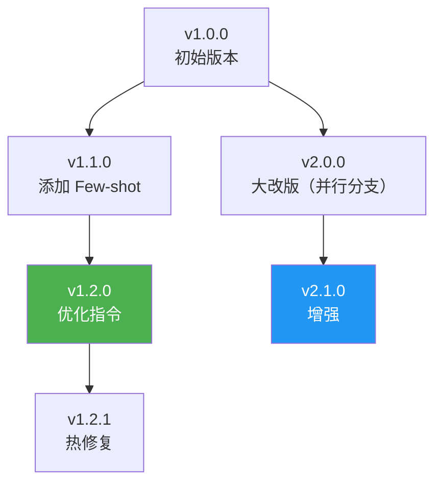

# Sprint 1: Prompt 注册中心

> **目标**：Prompt 有唯一的 name + version，支持注册、版本对比、回滚。

---

## V1: 内存注册中心

```java
/**
 * V1: 最简单的 Prompt 注册中心
 *
 * 每个 Prompt 用 name + version 标识
 * 支持：注册新版本、获取当前版本、回滚
 */
@Component
public class PromptRegistryV1 {

    private final Map<String, TreeMap<String, String>> registry = new ConcurrentHashMap<>();

    public String register(String name, String content) {
        TreeMap<String, String> versions = registry.computeIfAbsent(name, k -> new TreeMap<>());
        int nextVersion = versions.size() + 1;
        String version = "v" + nextVersion;
        versions.put(version, content);
        return version;
    }

    public String get(String name, String version) {
        return registry.getOrDefault(name, new TreeMap<>()).get(version);
    }

    public String getLatest(String name) {
        TreeMap<String, String> versions = registry.get(name);
        if (versions == null || versions.isEmpty()) return null;
        return versions.lastEntry().getValue();
    }

    public String rollback(String name, String targetVersion) {
        TreeMap<String, String> versions = registry.get(name);
        if (versions == null) return null;
        // 删除 targetVersion 之后的所有版本
        versions.tailMap(targetVersion, false).clear();
        return versions.get(targetVersion);
    }
}
```

---

## V2: 持久化 + 审计

```java
/**
 * V2: 持久化到数据库 + 审计日志
 */
@Component
public class PromptRegistryV2 {

    private final PromptVersionRepository repository;

    public PromptVersion register(String name, String content,
                                   String author, String changeLog) {
        String latestVersion = repository.findLatestVersion(name);
        String newVersion = incrementVersion(latestVersion);

        PromptVersion pv = PromptVersion.builder()
            .name(name)
            .version(newVersion)
            .content(content)
            .author(author)
            .changeLog(changeLog)
            .parentVersion(latestVersion)
            .diff(latestVersion != null ?
                diffCalculator.diff(get(name, latestVersion), content) : "initial")
            .status(PromptStatus.DRAFT)
            .createdAt(Instant.now())
            .build();

        return repository.save(pv);
    }

    /**
     * 发布版本（DRAFT → ACTIVE）
     */
    public PromptVersion publish(String name, String version) {
        PromptVersion pv = repository.findByNameAndVersion(name, version);
        pv.setStatus(PromptStatus.ACTIVE);

        // 将之前的 ACTIVE 版本标记为 ARCHIVED
        repository.deactivatePreviousVersions(name, version);

        return repository.save(pv);
    }
}
```

---

## V3: 版本树 + 可视化



---

## 版本树 REST API

```
POST   /api/prompts                    # 注册新 Prompt
GET    /api/prompts/{name}             # 获取所有版本
GET    /api/prompts/{name}/active      # 获取当前激活版本
GET    /api/prompts/{name}/{version}   # 获取指定版本
POST   /api/prompts/{name}/{version}/publish   # 发布版本
POST   /api/prompts/{name}/rollback/{version}  # 回滚
GET    /api/prompts/{name}/diff?v1=x&v2=y      # 版本对比
```

---

## 关键收获

| 要点 | 说明 |
|------|------|
| Prompt 是资产 | 不是代码中的字符串常量，是需要管理的资产 |
| 版本管理必须有 | 没有版本 = 无法回滚 = 改坏了就炸 |
| Diff 是核心 | 看不出两个版本差异 = 无法 review |
| 审计是合规要求 | 谁在什么时候改了什么必须可追溯 |
