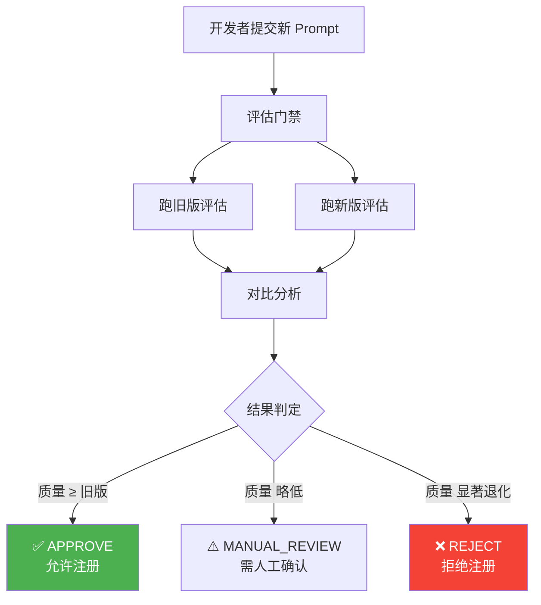
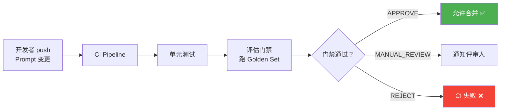

# Sprint 2: 评估门禁

> **目标**：Prompt 变更前，自动跑 Eval Set 对比新旧版本，阻止质量退化。

---

## 门禁流程



---

## V1: 全量评估门禁

```java
@Component
public class PromptChangeGateV1 {

    private final PromptRegistryV2 registry;
    private final EvalRunner evalRunner;
    private final ChatClient llm;

    public GateResult assess(String promptName, String newContent) {
        // 1. 获取当前版本
        PromptVersion current = registry.getActive(promptName);

        // 2. 评估旧版
        EvalReport oldReport = evaluatePrompt(current.content());

        // 3. 评估新版
        EvalReport newReport = evaluatePrompt(newContent);

        // 4. 对比
        double delta = newReport.avgScore() - oldReport.avgScore();

        GateVerdict verdict;
        if (delta >= 0) verdict = GateVerdict.APPROVE;
        else if (delta >= -0.05) verdict = GateVerdict.MANUAL_REVIEW;
        else verdict = GateVerdict.REJECT;

        return new GateResult(
            current.version(), oldReport.avgScore(),
            newReport.avgScore(), delta, verdict
        );
    }

    private EvalReport evaluatePrompt(String prompt) {
        List<EvalCase> cases = goldenSet.getAll();
        int passed = 0;
        double totalScore = 0;

        for (EvalCase c : cases) {
            String output = llm.prompt()
                .system(prompt)
                .user(c.input())
                .call().content();

            double score = evaluator.score(output, c.expected());
            totalScore += score;
            if (score >= 0.7) passed++;
        }

        return new EvalReport(
            cases.size(), passed,
            totalScore / cases.size()
        );
    }
}
```

---

## V2: 分类评估 + 回退检测

```java
/**
 * V2: 不只看总分，还要看每个类别的表现
 * 确保没有特定场景的质量暴跌
 */
@Component
public class PromptChangeGateV2 {

    public DetailedGateResult assess(String promptName, String newContent) {
        PromptVersion current = registry.getActive(promptName);

        // 按类别分别评估
        Map<String, CategoryResult> oldResults = evaluateByCategory(current.content());
        Map<String, CategoryResult> newResults = evaluateByCategory(newContent);

        // 找出回退的类别
        List<CategoryRegression> regressions = new ArrayList<>();
        for (String category : oldResults.keySet()) {
            double oldScore = oldResults.get(category).avgScore();
            double newScore = newResults.getOrDefault(category,
                new CategoryResult(0,0)).avgScore();

            if (newScore < oldScore - 0.1) {
                regressions.add(new CategoryRegression(
                    category, oldScore, newScore,
                    newScore - oldScore
                ));
            }
        }

        // 综合判定
        double overallDelta = getOverallScore(newResults) - getOverallScore(oldResults);
        GateVerdict verdict;
        if (overallDelta >= 0 && regressions.isEmpty()) {
            verdict = GateVerdict.APPROVE;
        } else if (overallDelta >= -0.05 && regressions.size() <= 1) {
            verdict = GateVerdict.MANUAL_REVIEW;
        } else {
            verdict = GateVerdict.REJECT;
        }

        return new DetailedGateResult(
            oldResults, newResults, overallDelta,
            regressions, verdict
        );
    }
}
```

---

## V3: CI/CD 集成



```yaml
# .github/workflows/prompt-gate.yml
name: Prompt Quality Gate
on:
  pull_request:
    paths:
      - 'prompts/**'

jobs:
  eval-gate:
    steps:
      - uses: actions/checkout@v4
      - name: Run Prompt Eval Gate
        run: |
          ./gradlew promptEval --name=${{ matrix.prompt }}
          # 门禁失败 → CI 失败 → PR 无法合并
```

---

## 关键收获

| 要点 | 说明 |
|------|------|
| 门禁必须自动化 | 人肉 review Prompt = 形同虚设 |
| 分类评估很重要 | 总分掩盖局部退化 |
| CI 集成是终极 | PR 提交时自动跑 → 防止坏 Prompt 合并 |
| 门禁阈值可调 | 不同项目不同标准 |
