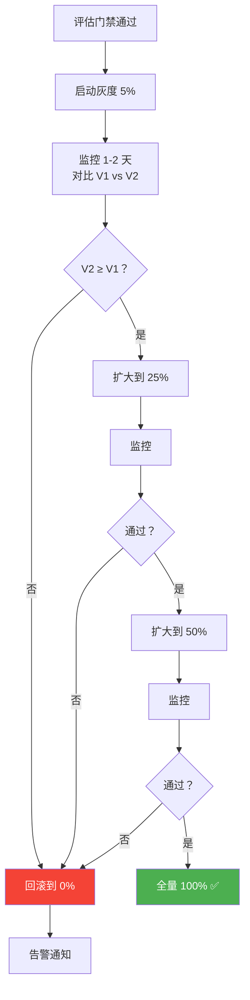
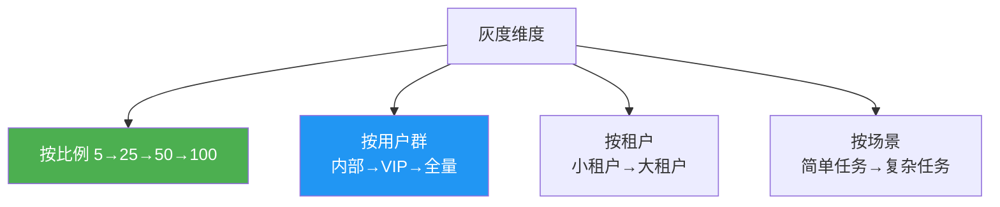
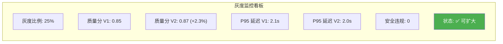

# Sprint 3: 灰度发布

> **目标**：Prompt 通过门禁后，渐进式放量到生产环境，自动监控质量，异常时自动回滚。

---

## 灰度发布流程



---

## V1: 按比例灰度

```java
@Component
public class PromptCanaryV1 {

    private final AtomicInteger canaryPercentage = new AtomicInteger(0);
    private volatile String stableVersion;
    private volatile String canaryVersion;

    /**
     * 路由决策
     */
    public String route(String sessionId) {
        int hash = Math.abs(sessionId.hashCode()) % 100;
        if (hash < canaryPercentage.get()) {
            return canaryVersion;
        }
        return stableVersion;
    }

    /**
     * 扩大灰度
     */
    public void expand(int newPercentage) {
        canaryPercentage.set(newPercentage);
        metrics.record("canary.expanded", newPercentage);
    }

    /**
     * 回滚
     */
    public void rollback() {
        canaryPercentage.set(0);
        alerting.send("Prompt 灰度回滚: " + canaryVersion);
        canaryVersion = null;
    }
}
```

---

## V2: 自动决策

```java
/**
 * V2: 自动监控 + 自动决策
 *
 * 定时检查 V1/V2 质量对比，自动决定放量/回滚
 */
@Component
public class PromptCanaryV2 {

    /**
     * 每 5 分钟检查一次
     */
    @Scheduled(fixedRate = 5 * 60 * 1000)
    public void autoCheck() {
        if (canaryVersion == null) return;

        QualityComparison cmp = compareQuality(stableVersion, canaryVersion);

        CanaryAction action = decide(cmp);
        execute(action);
    }

    private CanaryAction decide(QualityComparison cmp) {
        // 样本不足
        if (cmp.canarySamples < 50) {
            return CanaryAction.WAIT;
        }
        // 安全违规 → 立即回滚
        if (cmp.canarySafetyRate > 0.01) {
            return CanaryAction.ROLLBACK;
        }
        // 质量显著退化 → 回滚
        if (cmp.qualityDelta < -0.1) {
            return CanaryAction.ROLLBACK;
        }
        // 质量持平或更好 → 扩大
        if (cmp.qualityDelta >= -0.02) {
            return CanaryAction.EXPAND;
        }
        // 轻微退化 → 保持
        return CanaryAction.HOLD;
    }

    private void execute(CanaryAction action) {
        switch (action) {
            case EXPAND -> {
                int next = nextStage(canaryPercentage.get());
                if (next >= 100) {
                    completeCanary();
                } else {
                    expand(next);
                }
            }
            case ROLLBACK -> rollback();
            case WAIT, HOLD -> {} // 什么都不做
        }
    }

    private static final int[] STAGES = {5, 25, 50, 100};
    private int nextStage(int current) {
        for (int s : STAGES) if (s > current) return s;
        return 100;
    }
}
```

---

## V3: 多维度灰度



---

## 监控看板



---

## 关键收获

| 要点 | 说明 |
|------|------|
| 灰度必须自动 | 人盯监控不可持续 |
| 回滚要快 | 发现问题 → 秒级回零 |
| 灰度阶梯要稳 | 5→25→50→100，不跳步 |
| 一致性哈希 | 同一用户不反复切换版本 |
