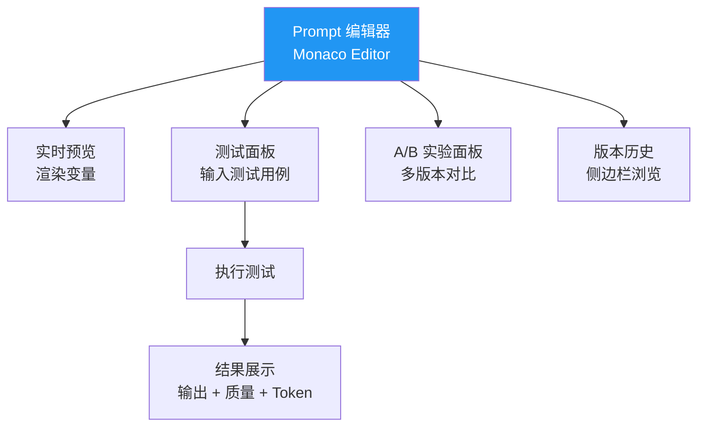
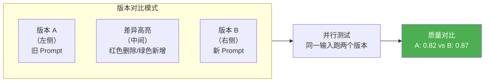
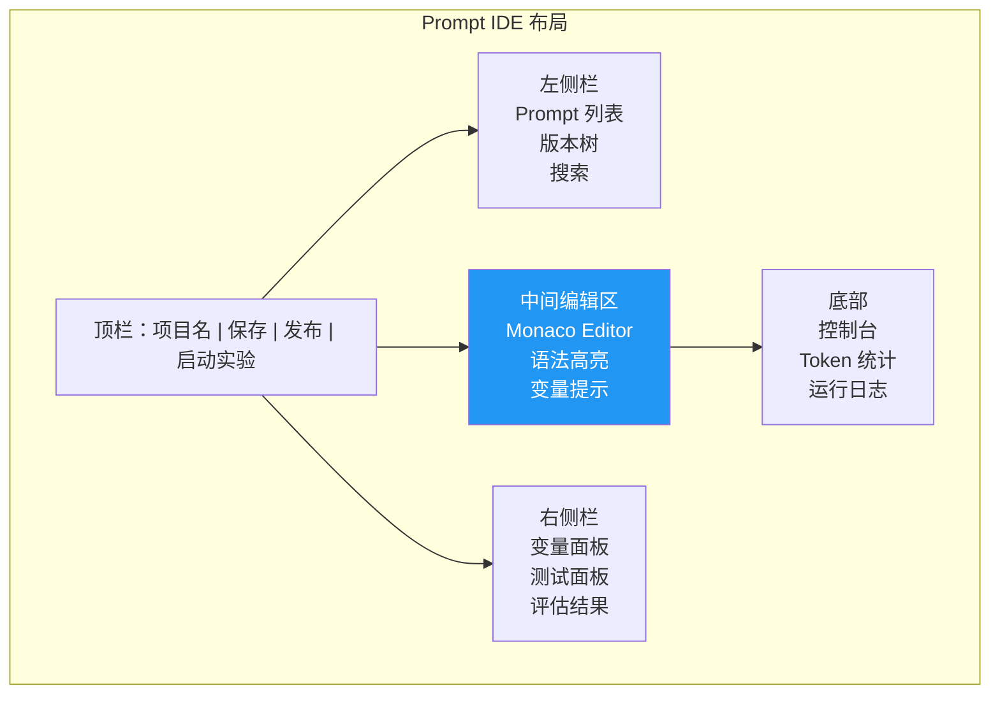

# Sprint 4: Prompt IDE

> **目标**：可视化的 Prompt 编辑器，支持实时预览、变量调试、A/B 测试。

---

## Prompt IDE 功能架构



---

## V1: 在线编辑器

```java
@RestController
@RequestMapping("/api/prompt-ide")
public class PromptIdeController {

    /**
     * 渲染预览
     */
    @PostMapping("/preview")
    public PreviewResult preview(@RequestBody PreviewRequest req) {
        // 渲染模板变量
        String rendered = renderer.render(req.content(), req.variables());
        return new PreviewResult(rendered, estimateTokens(rendered));
    }

    /**
     * 执行测试
     */
    @PostMapping("/test")
    public TestResult test(@RequestBody TestRequest req) {
        String rendered = renderer.render(req.prompt(), req.variables());

        long start = System.currentTimeMillis();
        String output = chatClient.prompt()
            .system(rendered)
            .user(req.testInput())
            .call().content();
        long latency = System.currentTimeMillis() - start;

        double quality = evaluator.score(output, req.expectedOutput());

        return new TestResult(
            output, quality, latency,
            tokenCounter.count(rendered, output)
        );
    }
}
```

---

## V2: 多版本对比



---

## V3: A/B 实验集成

```java
/**
 * V3: 从 IDE 直接启动 A/B 实验
 */
@RestController
@RequestMapping("/api/prompt-ide/experiment")
public class ExperimentController {

    @PostMapping("/create")
    public Experiment createExperiment(@RequestBody ExperimentRequest req) {
        // 验证两个版本都通过门禁
        gateResult gateA = gate.assess(req.promptName(), req.versionA());
        GateResult gateB = gate.assess(req.promptName(), req.versionB());

        if (gateA.verdict() == REJECT || gateB.verdict() == REJECT) {
            throw new ResponseStatusException(BAD_REQUEST, "门禁未通过");
        }

        // 创建实验
        Experiment exp = experimentManager.create(ExperimentConfig.builder()
            .name(req.experimentName())
            .variants(List.of(
                new Variant("A", "control", 50, Map.of("version", req.versionA()), true),
                new Variant("B", "treatment", 50, Map.of("version", req.versionB()), false)
            ))
            .metrics(List.of("quality_score", "latency", "cost"))
            .build()
        );

        return exp;
    }

    @GetMapping("/{id}/report")
    public ExperimentReport getReport(@PathVariable String id) {
        return experimentManager.analyze(id);
    }
}
```

---

## IDE 界面布局



---

## 关键收获

| 要点 | 说明 |
|------|------|
| IDE 降低门槛 | 非技术人员也能编辑 Prompt |
| 实时预览是关键 | 不用部署就能看到效果 |
| A/B 实验集成 | 从编辑到实验无缝衔接 |
| 版本对比必须 | Code Review Prompt 的基础 |
