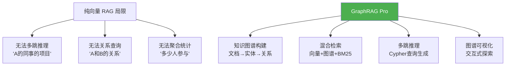
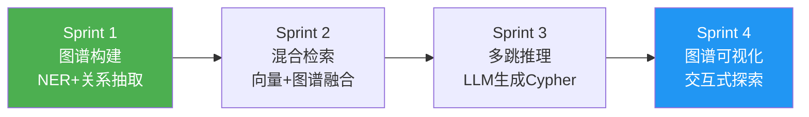
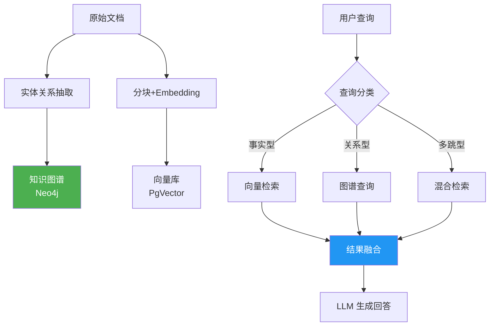

# ⑰ GraphRAG Pro — 知识图谱与 GraphRAG 平台

> **代号**：GraphRAG Pro
> **核心问题**：纯向量 RAG 只能做"相似度匹配"，无法做多跳推理和关系查询——企业知识库需要更强。

---

## 项目定位



---

## 四个 Sprint



| Sprint | 目标 | V1→V2→V3 | 时间 |
|--------|------|---------|------|
| Sprint 1 | 图谱构建 | V1 LLM抽取 → V2 实体消歧 → V3 增量更新 | 1.5 周 |
| Sprint 2 | 混合检索 | V1 串行检索 → V2 并行融合 → V3 自适应路由 | 1 周 |
| Sprint 3 | 多跳推理 | V1 单跳 → V2 多跳 → V3 复杂聚合 | 1 周 |
| Sprint 4 | 可视化 | V1 图谱浏览 → V2 查询可视化 → V3 编辑 | 1 周 |

---

## 架构设计



---

## 目录结构

```
项目实践/17-企业项目-知识图谱与GraphRAG平台/
├── 00-总览.md
├── Sprint1-图谱构建.md
├── Sprint2-混合检索.md
├── Sprint3-多跳推理.md
└── Sprint4-图谱可视化.md
```

---

## 技术栈

| 层 | 技术 |
|----|------|
| 图数据库 | Neo4j / NebulaGraph |
| 向量库 | PgVector / Milvus |
| 框架 | Spring Boot + Spring AI |
| 前端可视化 | D3.js / Cytoscape.js |
| 部署 | Docker Compose（Neo4j + Postgres + App） |
