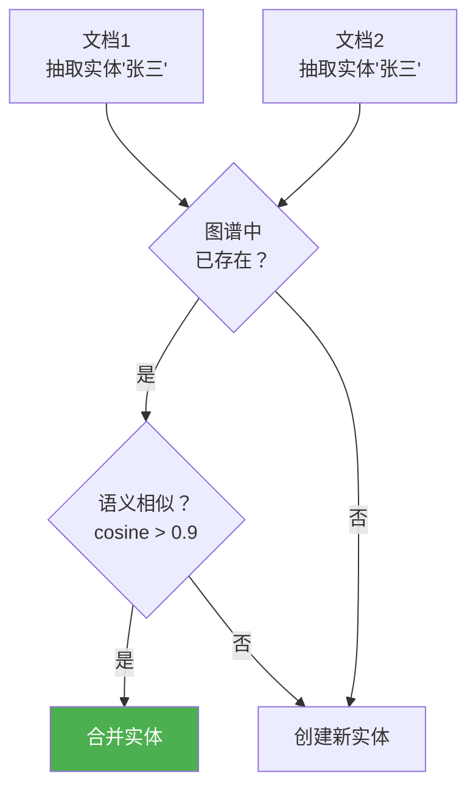

# Sprint 1: 图谱构建

> **目标**：从非结构化文档中抽取实体和关系，构建知识图谱。

---

## V1: LLM 联合抽取

```java
@Component
public class EntityRelationExtractorV1 {

    /**
     * 从文本抽取实体和关系
     */
    public ExtractionResult extract(String text) {
        String prompt = """
            从以下文本中抽取实体和关系，以 JSON 格式返回。

            文本：%s

            输出格式：
            {"entities":[{"id":"","name":"","type":"Person|Org|Project|Concept","props":{}}],
             "relations":[{"src":"","tgt":"","type":"WORKS_AT|MANAGES|PARTICIPATES","props":{}}]}
            """.formatted(text);

        String json = chatClient.prompt().user(prompt).call().content();
        return jsonParser.parse(json, ExtractionResult.class);
    }

    /**
     * 写入 Neo4j
     */
    public void writeToGraph(ExtractionResult result) {
        for (Entity e : result.entities()) {
            graphClient.query(
                "MERGE (n:%s {id: $id}) SET n.name = $name, n += $props"
                    .formatted(e.type()))
                .bind(e.id()).to("id")
                .bind(e.name()).to("name")
                .bind(e.props()).to("props")
                .run();
        }
        for (Relation r : result.relations()) {
            graphClient.query(
                "MATCH (s {id: $src}), (t {id: $tgt}) " +
                "MERGE (s)-[r:%s]->(t) SET r += $props"
                    .formatted(r.type()))
                .bind(r.src()).to("src")
                .bind(r.tgt()).to("tgt")
                .bind(r.props()).to("props")
                .run();
        }
    }
}
```

---

## V2: 实体消歧与合并



```java
@Component
public class EntityDisambiguator {

    /**
     * 实体消歧：判断两个同名实体是否是同一个
     */
    public boolean isSameEntity(Entity a, Entity b) {
        if (!a.name().equalsIgnoreCase(b.name())) return false;

        // 计算上下文相似度
        double sim = embeddingSimilarity(a.context(), b.context());

        // 计算属性重叠度
        double overlap = propertyOverlap(a.props(), b.props());

        return sim > 0.85 && overlap > 0.5;
    }

    /**
     * 合并两个实体
     */
    public Entity merge(Entity a, Entity b) {
        Map<String, Object> mergedProps = new HashMap<>(a.props());
        mergedProps.putAll(b.props());

        List<String> aliases = new ArrayList<>(a.aliases());
        aliases.addAll(b.aliases());

        return new Entity(
            a.id(),  // 保留第一个 ID
            a.name(),
            a.type(),
            mergedProps,
            aliases.stream().distinct().toList()
        );
    }
}
```

---

## V3: 增量更新

```java
/**
 * V3: 文档更新时，增量更新图谱
 */
@Component
public class IncrementalGraphUpdater {

    public void onDocumentChanged(String docId, String oldContent, String newContent) {
        // 1. 删除旧的关系
        graphClient.query(
            "MATCH ()-[r {source: $docId}]->() DELETE r")
            .bind(docId).to("docId").run();

        // 2. 从新内容抽取
        ExtractionResult newExtraction = extractor.extract(newContent);

        // 3. 写入新关系
        writeToGraph(newExtraction);

        // 4. 清理孤立节点
        graphClient.query(
            "MATCH (n) WHERE NOT (n)--() DELETE n").run();
    }
}
```

---

## 抽取质量评估

| 指标 | 说明 | 健康范围 |
|------|------|---------|
| 实体召回率 | 正确实体被抽出的比例 | > 80% |
| 关系准确率 | 抽出的关系正确的比例 | > 70% |
| 消歧准确率 | 合并决策正确的比例 | > 90% |
| 图谱覆盖率 | 文档中实体进入图谱的比例 | > 85% |
