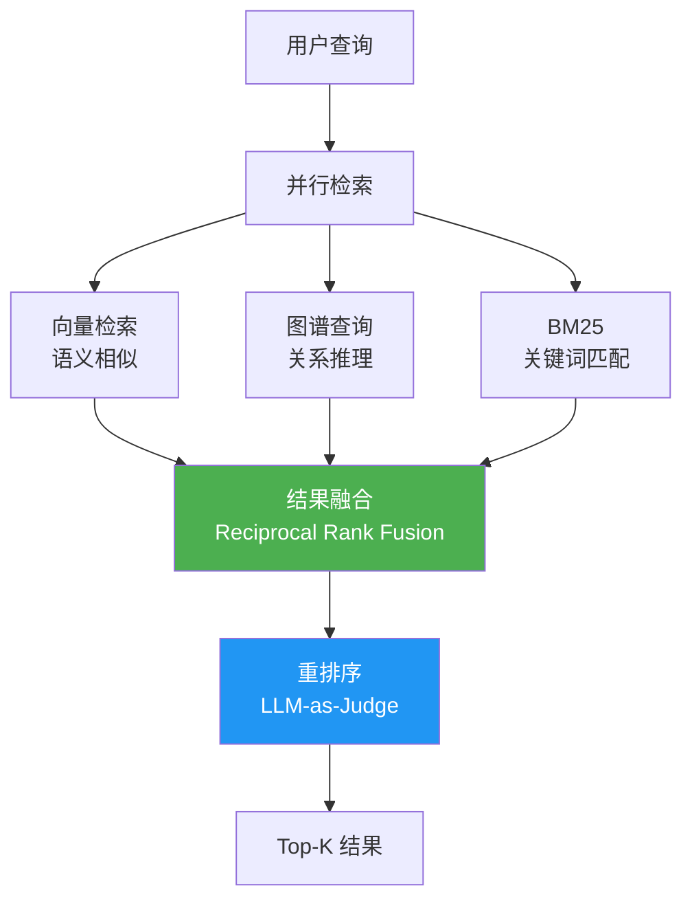

# Sprint 2: 混合检索

> **目标**：融合向量检索 + 图谱查询 + BM25，取三者之长。

---

## 混合检索架构



---

## V1: 串行检索

```java
@Component
public class HybridRetrieverV1 {

    public List<SearchResult> retrieve(String query, int topK) {
        // 1. 向量检索
        List<SearchResult> vecResults = vectorStore.search(
            embeddingService.embed(query), topK * 2);

        // 2. 图谱检索
        Set<String> entityIds = extractEntities(query);
        List<SearchResult> graphResults = graphStore.expand(entityIds, 2);

        // 3. BM25
        List<SearchResult> bm25Results = bm25Index.search(query, topK);

        // 4. 简单合并 + 去重
        Map<String, SearchResult> merged = new LinkedHashMap<>();
        for (SearchResult r : vecResults) merged.putIfAbsent(r.id(), r);
        for (SearchResult r : graphResults) merged.putIfAbsent(r.id(), r);
        for (SearchResult r : bm25Results) merged.putIfAbsent(r.id(), r);

        return merged.values().stream().limit(topK).toList();
    }
}
```

---

## V2: Reciprocal Rank Fusion

```java
/**
 * V2: 使用 RRF 融合多个检索器的排名
 *
 * RRF 公式：score(d) = Σ 1/(k + rank_i(d))
 * k 通常取 60
 */
@Component
public class HybridRetrieverV2 {

    private static final int RRF_K = 60;

    public List<SearchResult> retrieve(String query, int topK) {
        // 并行检索
        CompletableFuture<List<SearchResult>> vecFuture =
            CompletableFuture.supplyAsync(
                () -> vectorStore.search(embed(query), topK * 2));
        CompletableFuture<List<SearchResult>> graphFuture =
            CompletableFuture.supplyAsync(
                () -> graphSearch(query, topK * 2));
        CompletableFuture<List<SearchResult>> bm25Future =
            CompletableFuture.supplyAsync(
                () -> bm25Index.search(query, topK * 2));

        CompletableFuture.allOf(vecFuture, graphFuture, bm25Future).join();

        List<SearchResult> vec = vecFuture.join();
        List<SearchResult> graph = graphFuture.join();
        List<SearchResult> bm25 = bm25Future.join();

        // RRF 融合
        Map<String, Double> scores = new HashMap<>();
        Map<String, SearchResult> docs = new HashMap<>();

        rrfAdd(vec, scores, docs);
        rrfAdd(graph, scores, docs);
        rrfAdd(bm25, scores, docs);

        // 按融合分数排序
        return scores.entrySet().stream()
            .sorted(Map.Entry.<String, Double>comparingByValue().reversed())
            .limit(topK)
            .map(e -> docs.get(e.getKey()).withScore(e.getValue()))
            .toList();
    }

    private void rrfAdd(List<SearchResult> results,
                        Map<String, Double> scores,
                        Map<String, SearchResult> docs) {
        for (int i = 0; i < results.size(); i++) {
            String id = results.get(i).id();
            double rrfScore = 1.0 / (RRF_K + i + 1);
            scores.merge(id, rrfScore, Double::sum);
            docs.putIfAbsent(id, results.get(i));
        }
    }
}
```

---

## V3: 自适应路由

```java
/**
 * V3: 根据查询类型自动选择最佳检索策略
 */
@Component
public class AdaptiveRetriever {

    public List<SearchResult> retrieve(String query, int topK) {
        QueryType type = classifyQuery(query);

        return switch (type) {
            case FACT -> vectorStore.search(embed(query), topK);
            case RELATION -> graphSearch(query, topK);
            case MULTI_HOP -> hybridRetrieve(query, topK);
            case KEYWORD -> bm25Index.search(query, topK);
        };
    }

    private QueryType classifyQuery(String query) {
        String prompt = """
            将以下查询分类为一个类型：
            - FACT: 事实查询（"什么是X"）
            - RELATION: 关系查询（"A和B的关系"）
            - MULTI_HOP: 多跳推理（"A的同事的项目"）
            - KEYWORD: 关键词匹配（"K8s 配置"）

            查询：%s
            只返回类型名称。
            """.formatted(query);

        String type = chatClient.prompt().user(prompt).call().content().trim();
        return QueryType.valueOf(type);
    }

    private enum QueryType { FACT, RELATION, MULTI_HOP, KEYWORD }
}
```

---

## 检索效果对比

| 策略 | 事实查询 | 关系查询 | 多跳推理 | 关键词 |
|------|---------|---------|---------|--------|
| 纯向量 | ✅ 90% | ❌ 30% | ❌ 20% | ⚠️ 70% |
| 纯图谱 | ⚠️ 60% | ✅ 95% | ✅ 90% | ❌ 40% |
| 混合 | ✅ 92% | ✅ 88% | ✅ 85% | ✅ 80% |
| 自适应 | ✅ 95% | ✅ 95% | ✅ 90% | ✅ 90% |
