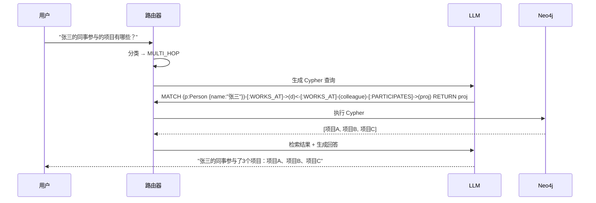
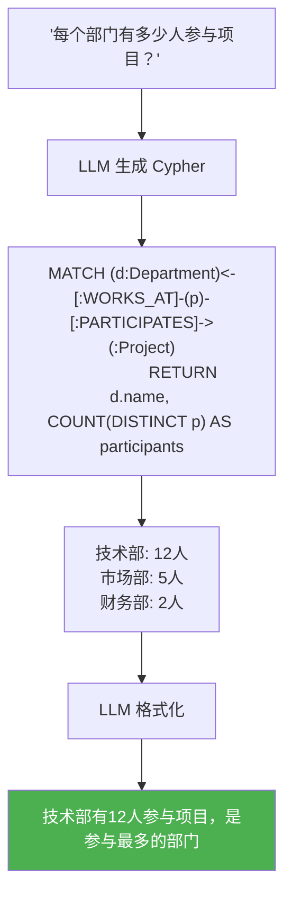

# Sprint 3: 多跳推理

> **目标**：LLM 自动生成 Cypher 查询，在知识图谱上做多跳推理。

---

## 多跳推理流程



---

## V1: LLM 生成 Cypher

```java
@Component
public class MultiHopReasonerV1 {

    /**
     * Schema 描述（给 LLM 的上下文）
     */
    private static final String SCHEMA = """
        节点类型：Person, Organization, Department, Project, Concept
        关系类型：
          (Person)-[:WORKS_AT]->(Department)
          (Person)-[:MANAGES]->(Department)
          (Person)-[:PARTICIPATES]->(Project)
          (Department)-[:BELONGS_TO]->(Organization)
          (Project)-[:DEPENDS_ON]->(Project)
          (Concept)-[:RELATED_TO]->(Concept)
        """;

    public String generateCypher(String question) {
        String prompt = """
            知识图谱 Schema：
            %s

            用户问题：%s

            生成一个 Cypher 查询来回答这个问题。只返回 Cypher 语句。
            """.formatted(SCHEMA, question);

        return chatClient.prompt().user(prompt).call().content().trim();
    }

    public ReasoningResult reason(String question) {
        // 1. 生成 Cypher
        String cypher = generateCypher(question);

        // 2. 执行查询
        List<Map<String, Object>> results = graphClient.query(cypher)
            .run()
            .stream()
            .map(r -> r.asMap())
            .toList();

        // 3. 格式化为自然语言
        String answer = formatResults(question, results);

        return new ReasoningResult(cypher, results, answer);
    }

    private String formatResults(String question,
                                  List<Map<String, Object>> results) {
        if (results.isEmpty()) {
            return "在知识库中未找到相关信息。";
        }

        String prompt = """
            用户问题：%s
            查询结果（JSON）：%s

            请用自然语言回答用户问题。
            """.formatted(question, objectMapper.writeValueAsString(results));

        return chatClient.prompt().user(prompt).call().content();
    }
}
```

---

## V2: Cypher 验证与修复

```java
/**
 * V2: LLM 生成的 Cypher 可能有语法错误
 * 加入验证 + 自动修复
 */
@Component
public class MultiHopReasonerV2 {

    public ReasoningResult reason(String question) {
        for (int attempt = 0; attempt < 3; attempt++) {
            String cypher = attempt == 0
                ? generateCypher(question)
                : fixCypher(cypher, lastError, question);

            try {
                List<Map<String, Object>> results = executeCypher(cypher);
                String answer = formatResults(question, results);
                return ReasoningResult.success(cypher, results, answer);
            } catch (CypherSyntaxException e) {
                lastError = e.getMessage();
                // 继续重试
            }
        }

        return ReasoningResult.failed("Cypher 生成失败，回退到向量检索");
    }

    private String fixCypher(String cypher, String error, String question) {
        String prompt = """
            以下 Cypher 查询有语法错误，请修复。

            原始问题：%s
            错误 Cypher：%s
            错误信息：%s

            Schema：%s

            请返回修复后的 Cypher。
            """.formatted(question, cypher, error, SCHEMA);

        return chatClient.prompt().user(prompt).call().content().trim();
    }
}
```

---

## V3: 复杂聚合查询



---

## 查询类型与 Cypher 模式

| 查询类型 | Cypher 模式 | 示例 |
|---------|------------|------|
| 单跳关系 | `MATCH (a)-[:R]->(b)` | "A 的部门" |
| 多跳推理 | `MATCH (a)-[:R]->()<-[:S]-(b)` | "A 的同事" |
| 聚合统计 | `MATCH ... RETURN COUNT/AVG/SUM` | "多少人在做项目" |
| 路径查找 | `MATCH p = shortestPath(...)` | "A 到 B 的最短关系链" |
| 推荐 | `MATCH ... WHERE NOT (a)-[:R]->(b)` | "推荐 A 可能认识的人" |
