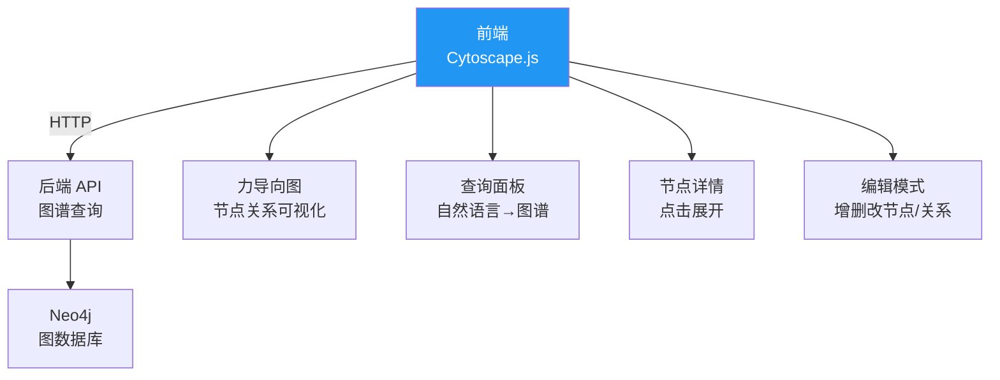
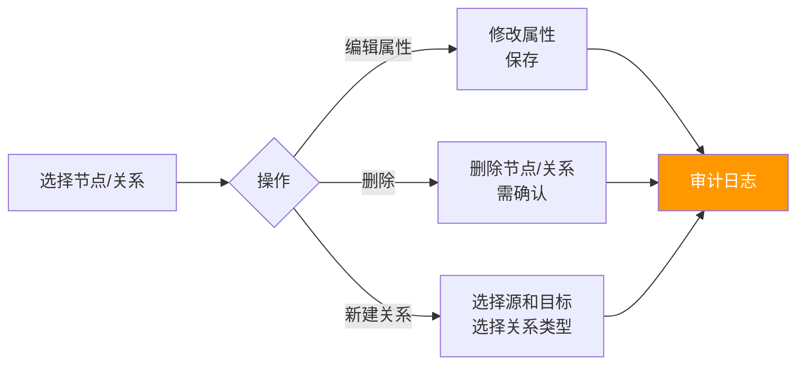

# Sprint 4: 图谱可视化

> **目标**：交互式的知识图谱可视化界面，支持浏览、查询和编辑。

---

## 可视化架构



---

## V1: 图谱浏览器

```javascript
// 前端：Cytoscape.js 渲染知识图谱
const cy = cytoscape({
    container: document.getElementById('graph'),
    elements: await fetch('/api/graph/subgraph?centerEntityId=A001&depth=2'),
    style: [
        { selector: 'node[type="Person"]', style: { 'background-color': '#4caf50' }},
        { selector: 'node[type="Organization"]', style: { 'background-color': '#2196f3' }},
        { selector: 'node[type="Project"]', style: { 'background-color': '#ff9800' }},
        { selector: 'edge', style: { 'label': 'data(type)', 'font-size': 10 }}
    ],
    layout: { name: 'cose' }  // 力导向布局
});

// 点击节点 → 展开邻居
cy.on('tap', 'node', async (evt) => {
    const nodeId = evt.target.id();
    const neighbors = await fetch(`/api/graph/neighbors?id=${nodeId}&limit=10`);
    cy.add(neighbors);
    cy.layout({ name: 'cose' }).run();
});
```

---

## V2: 查询结果可视化

```java
@RestController
@RequestMapping("/api/graph")
public class GraphVisualizationController {

    /**
     * 多跳查询结果可视化
     */
    @PostMapping("/query/visualize")
    public GraphData visualizeQuery(@RequestBody String question) {
        // 1. 多跳推理
        ReasoningResult result = multiHopReasoner.reason(question);

        // 2. 转换为可视化格式
        List<GraphNode> nodes = result.results().stream()
            .flatMap(row -> extractNodes(row).stream())
            .distinct()
            .toList();

        List<GraphEdge> edges = result.results().stream()
            .flatMap(row -> extractEdges(row).stream())
            .distinct()
            .toList();

        return new GraphData(nodes, edges, result.cypher(), result.answer());
    }
}
```

---

## V3: 图谱编辑



---

## 可视化设计原则

| 原则 | 说明 |
|------|------|
| 力导向布局 | 自动排列，关系紧密的聚在一起 |
| 颜色编码 | 不同实体类型不同颜色 |
| 渐进加载 | 先显示中心节点，点击展开邻居 |
| 高亮路径 | 多跳推理时高亮推理路径 |
| 筛选过滤 | 按类型/关系/时间过滤 |
