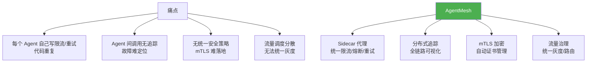
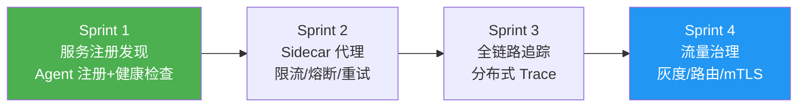
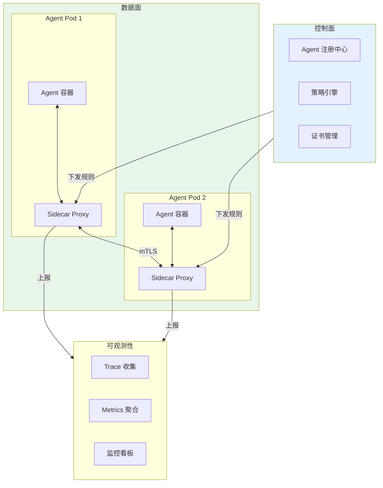

# ⑱ AgentMesh — Agent 服务网格与 Sidecar 平台

> **代号**：AgentMesh
> **核心问题**：50 个 Agent 互相调用，限流/熔断/追踪/加密散落在各处——用服务网格统一治理。

---

## 项目定位



---

## 四个 Sprint



| Sprint | 目标 | V1→V2→V3 | 时间 |
|--------|------|---------|------|
| Sprint 1 | 服务注册发现 | V1 注册 → V2 健康检查 → V3 负载均衡 | 1 周 |
| Sprint 2 | Sidecar 代理 | V1 限流 → V2 熔断 → V3 重试+退避 | 1 周 |
| Sprint 3 | 全链路追踪 | V1 日志 → V2 OpenTelemetry → V3 采样 | 1 周 |
| Sprint 4 | 流量治理 | V1 路由 → V2 灰度 → V3 mTLS | 1.5 周 |

---

## 架构设计



---

## 目录结构

```
项目实践/18-企业项目-AgentMesh服务网格平台/
├── 00-总览.md
├── Sprint1-服务注册发现.md
├── Sprint2-Sidecar代理.md
├── Sprint3-全链路追踪.md
└── Sprint4-流量治理.md
```

---

## 技术栈

| 层 | 技术 |
|----|------|
| Sidecar | Envoy / 自研 Java Proxy |
| 控制面 | Spring Boot + Consul/etcd |
| 追踪 | OpenTelemetry + Jaeger |
| 监控 | Prometheus + Grafana |
| 部署 | Kubernetes + Sidecar Injection |
