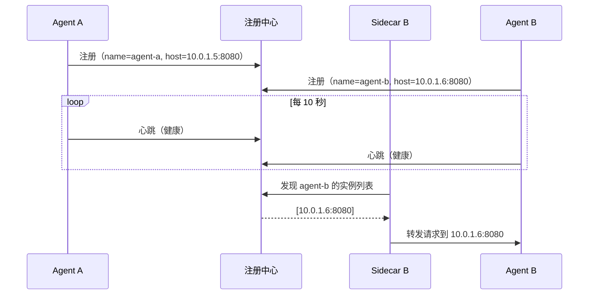

# Sprint 1: 服务注册发现

> **目标**：Agent 启动时自动注册，Sidecar 通过注册中心发现目标。

---

## 注册发现流程



---

## V1: 注册中心

```java
@Component
public class AgentRegistryV1 {

    private final Map<String, Set<AgentInstance>> services = new ConcurrentHashMap<>();

    public void register(String serviceName, String host, int port) {
        AgentInstance instance = new AgentInstance(
            UUID.randomUUID().toString(), serviceName, host, port);
        services.computeIfAbsent(serviceName, k -> ConcurrentHashMap.newKeySet())
                .add(instance);
    }

    public List<AgentInstance> discover(String serviceName) {
        return List.copyOf(services.getOrDefault(serviceName, Set.of()));
    }

    public void deregister(String instanceId) {
        services.values().forEach(set ->
            set.removeIf(i -> i.id().equals(instanceId)));
    }
}
```

---

## V2: 健康检查

```java
@Component
public class HealthChecker {

    @Scheduled(fixedRate = 10000)
    public void checkAll() {
        for (Set<AgentInstance> instances : registry.getAllInstances()) {
            for (AgentInstance inst : instances) {
                boolean healthy = ping(inst);
                inst.setHealthStatus(healthy ? HEALTHY : UNHEALTHY);

                if (!healthy) {
                    inst.incrementFailureCount();
                    if (inst.getFailureCount() >= 3) {
                        registry.deregister(inst.id());
                    }
                } else {
                    inst.resetFailureCount();
                }
            }
        }
    }

    private boolean ping(AgentInstance inst) {
        try {
            return httpClient.GET(inst.healthUrl())
                .timeout(2000)
                .execute()
                .statusCode() == 200;
        } catch (Exception e) {
            return false;
        }
    }
}
```

---

## V3: 负载均衡

```java
/**
 * V3: 多种负载均衡策略
 */
public interface LoadBalancer {
    AgentInstance select(List<AgentInstance> instances);
}

// 轮询
class RoundRobinBalancer implements LoadBalancer {
    private final AtomicInteger counter = new AtomicInteger(0);
    public AgentInstance select(List<AgentInstance> instances) {
        List<AgentInstance> healthy = instances.stream()
            .filter(i -> i.healthStatus() == HEALTHY).toList();
        if (healthy.isEmpty()) throw new NoAvailableInstanceException();
        return healthy.get(counter.getAndIncrement() % healthy.size());
    }
}

// 会话亲和（同一 session 路由到同一实例）
class SessionAffinityBalancer implements LoadBalancer {
    private final Map<String, AgentInstance> sessionMap = new ConcurrentHashMap<>();
    public AgentInstance select(String sessionId, List<AgentInstance> instances) {
        return sessionMap.computeIfAbsent(sessionId,
            k -> new RoundRobinBalancer().select(instances));
    }
}

// 最少连接
class LeastConnectionBalancer implements LoadBalancer {
    public AgentInstance select(List<AgentInstance> instances) {
        return instances.stream()
            .min(Comparator.comparingInt(AgentInstance::activeConnections))
            .orElseThrow();
    }
}
```

---

## 关键收获

| 要点 | 说明 |
|------|------|
| 注册要自动 | Agent 启动自动注册，关闭自动注销 |
| 健康检查必须 | 不健康的实例要及时剔除 |
| 负载均衡策略 | Agent 场景优先用会话亲和 |
| 优雅停机 | 注销 → 等待流量排空 → 关闭 |
