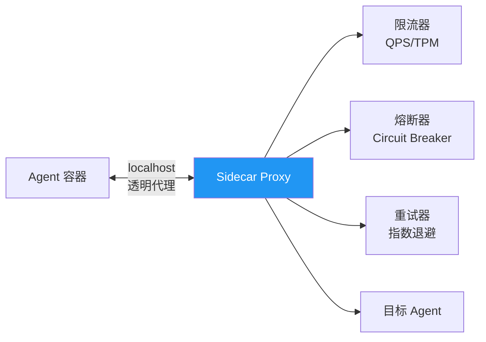
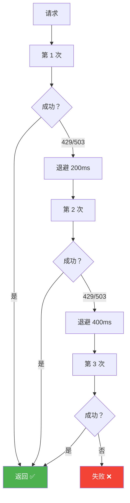
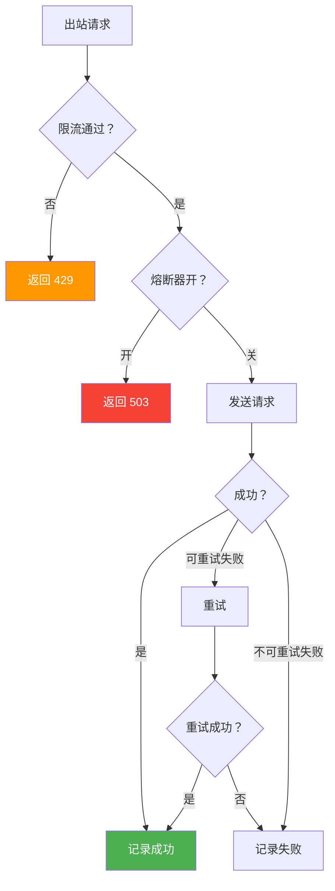

# Sprint 2: Sidecar 代理

> **目标**：Sidecar 代理统一处理限流、熔断、重试。

---

## Sidecar 架构



---

## V1: 限流器

```java
@Component
public class SidecarRateLimiter {

    private final Map<String, RateLimiter> limiters = new ConcurrentHashMap<>();

    public boolean tryAcquire(String serviceName, int permits) {
        RateLimiter limiter = limiters.computeIfAbsent(serviceName,
            k -> RateLimiter.create(config.getRateLimit(serviceName)));
        return limiter.tryAcquire(permits);
    }

    public Response handle(Request request) {
        String target = request.targetService();

        // 1. QPS 限流
        if (!tryAcquire(target, 1)) {
            return Response.tooManyRequests();
        }

        // 2. TPM 限流（Agent 特有：Token/分钟）
        int estimatedTokens = estimateTokens(request);
        if (!tokenLimiter.tryAcquire(target, estimatedTokens)) {
            return Response.tooManyRequests("TPM 超限");
        }

        // 3. 转发
        return forward(request);
    }
}
```

---

## V2: 熔断器

```java
@Component
public class SidecarCircuitBreaker {

    private final Map<String, CircuitBreaker> breakers = new ConcurrentHashMap<>();

    public Response handle(Request request) {
        CircuitBreaker cb = breakers.computeIfAbsent(
            request.targetService(),
            k -> CircuitBreaker.builder()
                .failureRateThreshold(50)       // 失败率 > 50% 触发
                .slowCallRateThreshold(60)      // 慢调用 > 60% 触发
                .slowCallDurationThreshold(5, SECONDS)
                .waitDurationInOpenState(30, SECONDS)
                .slidingWindowSize(20)
                .build());

        return cb.executeSupplier(() -> forward(request));
    }
}
```

---

## V3: 重试 + 指数退避



```java
@Component
public class SidecarRetryHandler {

    public Response handleWithRetry(Request request) {
        int maxRetries = config.getMaxRetries(request.targetService());
        long baseDelay = 200; // ms

        Exception lastError = null;
        for (int attempt = 0; attempt <= maxRetries; attempt++) {
            try {
                Response response = forward(request);

                // 可重试的状态码
                if (response.statusCode() == 429 || response.statusCode() == 503) {
                    if (attempt < maxRetries) {
                        long delay = baseDelay * (1L << attempt); // 指数退避
                        Thread.sleep(delay + jitter(delay));
                        continue;
                    }
                }

                return response;
            } catch (Exception e) {
                lastError = e;
                if (attempt < maxRetries && isRetryable(e)) {
                    try {
                        Thread.sleep(baseDelay * (1L << attempt));
                    } catch (InterruptedException ie) {
                        Thread.currentThread().interrupt();
                        break;
                    }
                }
            }
        }

        throw new RuntimeException("重试耗尽", lastError);
    }

    private long jitter(long delay) {
        return ThreadLocalRandom.current().nextLong(delay / 2);
    }
}
```

---

## 三层防护组合



| 防护层 | 保护什么 | 触发条件 | 恢复方式 |
|--------|---------|---------|---------|
| 限流 | 下游过载 | QPS/TPM 超限 | 滑动窗口 |
| 熔断 | 连锁故障 | 失败率 > 阈值 | 定时探测 |
| 重试 | 偶发失败 | 429/503 | 指数退避 |
