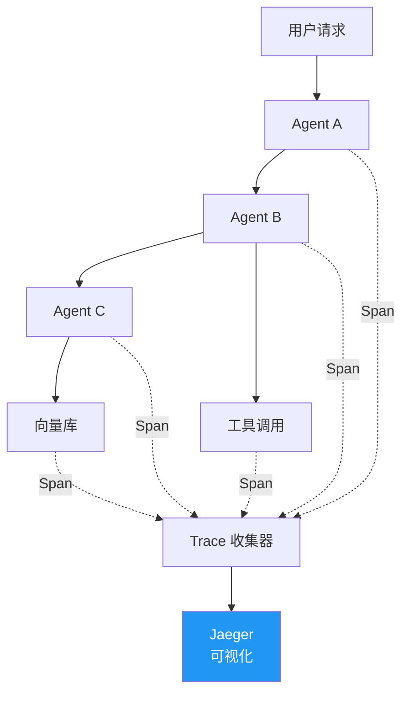
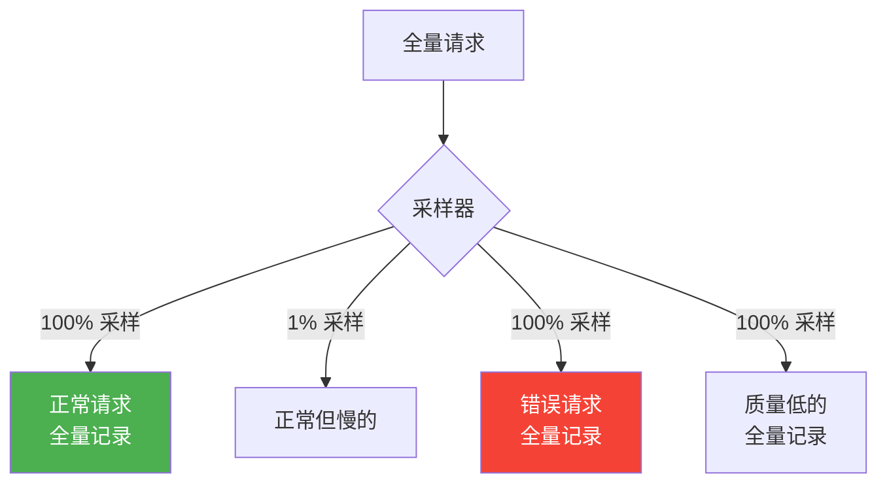

# Sprint 3: 全链路追踪

> **目标**：一次用户请求经过 5 个 Agent——全链路追踪让你看到每一步。

---

## 追踪架构



---

## V1: Span 埋点

```java
@Component
public class SidecarTracer {

    public Response handle(Request request) {
        // 从请求头提取 Trace 上下文
        TraceContext ctx = extractContext(request.headers());

        // 创建 Span
        Span span = tracer.spanBuilder("agent.call." + request.targetService())
            .setParent(ctx)
            .setAttribute("agent.source", request.sourceService())
            .setAttribute("agent.target", request.targetService())
            .setAttribute("agent.input_tokens", estimateTokens(request))
            .startSpan();

        try {
            Response response = forward(request);
            span.setAttribute("agent.output_tokens", response.tokenCount());
            span.setAttribute("agent.latency_ms", response.latencyMs());
            span.setAttribute("agent.status", response.statusCode());
            span.setStatus(StatusCode.OK);
            return response;
        } catch (Exception e) {
            span.recordException(e);
            span.setStatus(StatusCode.ERROR, e.getMessage());
            throw e;
        } finally {
            span.end();
        }
    }
}
```

---

## V2: Agent 专属追踪属性

```java
/**
 * V2: 在标准 HTTP 追踪基础上，增加 Agent 专属维度
 */
public class AgentSpanAttributes {
    // LLM 层
    public static final String LLM_MODEL = "llm.model";
    public static final String LLM_INPUT_TOKENS = "llm.input_tokens";
    public static final String LLM_OUTPUT_TOKENS = "llm.output_tokens";
    public static final String LLM_TEMPERATURE = "llm.temperature";
    public static final String LLM_TTFT_MS = "llm.ttft_ms";  // 首 Token 延迟

    // 工具层
    public static final String TOOL_NAME = "tool.name";
    public static final String TOOL_DURATION_MS = "tool.duration_ms";
    public static final String TOOL_SUCCESS = "tool.success";

    // RAG 层
    public static final String RAG_QUERY = "rag.query";
    public static final String RAG_DOC_COUNT = "rag.doc_count";
    public static final String RAG_TOP_SCORE = "rag.top_score";

    // 决策层
    public static final String AGENT_TURN = "agent.turn_number";
    public static final String AGENT_DECISION = "agent.decision";  // tool_call/respond/stop
    public static final String AGENT_COST = "agent.cost_usd";
}
```

---

## V3: 采样策略



```java
@Component
public class AgentTraceSampler {

    public boolean shouldSample(Request request, Response response) {
        // 1. 错误请求 → 100% 采样
        if (response.statusCode() >= 500) return true;

        // 2. 慢请求 → 100% 采样
        if (response.latencyMs() > 5000) return true;

        // 3. 质量低 → 100% 采样
        if (response.qualityScore() < 0.5) return true;

        // 4. 正常请求 → 1% 采样
        return ThreadLocalRandom.current().nextDouble() < 0.01;
    }
}
```

---

## 追踪看板

| 视图 | 说明 |
|------|------|
| 调用拓扑图 | Agent 之间的调用关系网络 |
| 耗时瀑布图 | 单次请求各步骤耗时 |
| Token 消耗分布 | 每个 Agent/工具的 Token 用量 |
| 错误链路 | 失败请求的完整链路 |
| 慢查询列表 | P99 延迟最高的请求 |
