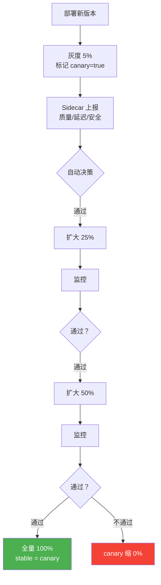

# Sprint 4: 流量治理

> **目标**：统一的路由、灰度、mTLS 加密。

---

## V1: 流量路由

```java
@Component
public class TrafficRouter {

    public String route(String serviceName, RequestContext ctx) {
        // 规则路由：按 Header 路由
        if (ctx.header("X-Canary") != null) {
            return instances.find(serviceName, "canary");
        }

        // 灰度路由：按比例
        CanaryConfig canary = canaryConfigStore.get(serviceName);
        if (canary != null) {
            int hash = Math.abs(ctx.sessionId().hashCode()) % 100;
            if (hash < canary.percentage()) {
                return instances.find(serviceName, canary.version());
            }
        }

        // 默认：最新稳定版
        return instances.find(serviceName, "stable");
    }
}
```

---

## V2: 灰度发布



---

## V3: mTLS 加密

```java
@Component
public class MtlsManager {

    /**
     * 自动证书管理
     *
     * Sidecar 启动时自动获取证书
     * 证书过期前自动轮转
     * Agent 容器无感知
     */
    public void startCertRotation() {
        ScheduledExecutorService scheduler = Executors.newSingleThreadScheduledExecutor();

        // 每 12 小时检查一次证书
        scheduler.scheduleAtFixedRate(() -> {
            X509Certificate cert = certStore.getCurrent();
            if (cert.getNotAfter().before(Date.from(
                    Instant.now().plus(7, DAYS)))) {
                // 7 天内过期 → 轮转
                X509Certificate newCert = certAuthority.issueCertificate(agentIdentity());
                certStore.rotate(newCert);
                sidecarProxy.reloadCertificate(newCert);
            }
        }, 0, 12, HOURS);
    }

    /**
     * Sidecar 间 mTLS 握手
     */
    public SSLEngine createTlsEngine() {
        SSLContext ctx = SSLContext.getInstance("TLS");
        ctx.init(
            keyManagerFactory.getKeyManagers(),     // 本端证书
            trustManagerFactory.getTrustManagers(), // 信任 CA
            null
        );
        SSLEngine engine = ctx.createSSLEngine();
        engine.setUseClientMode(true);
        engine.setNeedClientAuth(true);  // 双向认证
        return engine;
    }
}
```

---

## 流量治理矩阵

| 功能 | 实现方式 | 配置粒度 |
|------|---------|---------|
| 路由 | Header / 比例 / 用户群 | 全局/租户 |
| 灰度 | 版本标签 + 比例 | 全局 |
| 限流 | QPS + TPM | 租户/用户 |
| 熔断 | 失败率/慢调用 | 服务级 |
| 重试 | 次数/退避 | 服务级 |
| 加密 | mTLS + 自动轮转 | 全局 |

---

## 关键收获

| 要点 | 说明 |
|------|------|
| Sidecar 解耦 | Agent 只管业务，基础设施由 Sidecar 处理 |
| 控制面统一 | 所有策略从控制面下发，热更新 |
| mTLS 自动化 | Agent 无感知，Sidecar 管证书 |
| 灰度无代码 | 改配置不改代码，即可灰度 |
