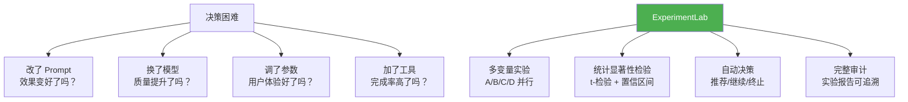
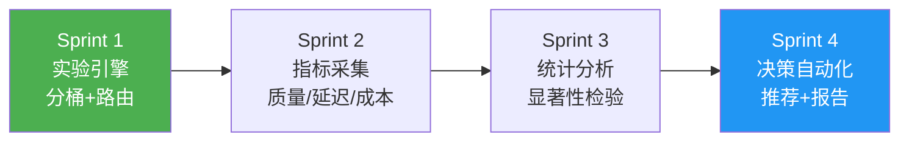
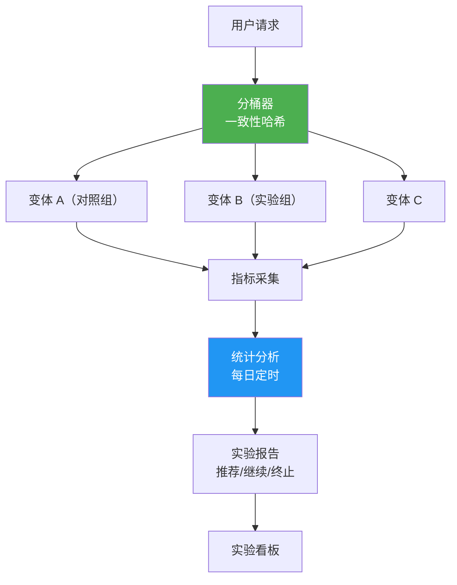

# ⑲ ExperimentLab — A/B 测试与实验平台

> **代号**：ExperimentLab
> **核心问题**：改了 Prompt 效果好不好？换了模型质量高不高？——用科学的 A/B 实验回答，不用"我觉得"。

---

## 项目定位



---

## 四个 Sprint



| Sprint | 目标 | V1→V2→V3 | 时间 |
|--------|------|---------|------|
| Sprint 1 | 实验引擎 | V1 简单分桶 → V2 一致性哈希 → V3 多层实验 | 1 周 |
| Sprint 2 | 指标采集 | V1 同步采集 → V2 异步 → V3 实时看板 | 1 周 |
| Sprint 3 | 统计分析 | V1 均值对比 → V2 t-检验 → V3 序贯检验 | 1 周 |
| Sprint 4 | 决策自动化 | V1 手动决策 → V2 建议推荐 → V3 自动执行 | 1 周 |

---

## 架构设计



---

## 目录结构

```
项目实践/19-企业项目-AB测试与实验平台/
├── 00-总览.md
├── Sprint1-实验引擎.md
├── Sprint2-指标采集.md
├── Sprint3-统计分析.md
└── Sprint4-决策自动化.md
```

---

## 技术栈

| 层 | 技术 |
|----|------|
| 后端 | Spring Boot + Spring AI |
| 统计 | Apache Commons Math + 自研检验 |
| 存储 | PostgreSQL + ClickHouse（分析） |
| 前端 | React + ECharts |
| 部署 | Docker + K8s |
