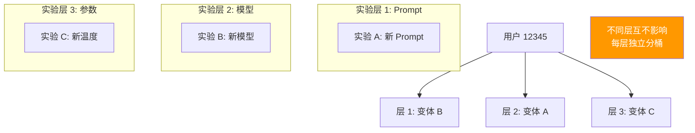

# Sprint 1: 实验引擎

> **目标**：将用户请求按比例分配到不同变体。

---

## V1: 简单分桶

```java
@Component
public class ExperimentBucketorV1 {

    public String assignVariant(String experimentId, String userId,
                                 List<Variant> variants) {
        // 简单取模分桶
        int hash = Math.abs(userId.hashCode()) % 100;
        int cumulative = 0;
        for (Variant v : variants) {
            cumulative += v.trafficPercentage();
            if (hash < cumulative) return v.id();
        }
        return variants.get(0).id();
    }
}
```

---

## V2: 一致性哈希 + 盐值

```java
/**
 * V2: 不同实验的同一用户分布不同
 * 加入实验盐值 → 避免所有实验都走同一分桶
 */
@Component
public class ExperimentBucketorV2 {

    public String assignVariant(String experimentId, String userId,
                                 List<Variant> variants) {
        // 实验 ID 作为盐值
        String key = experimentId + ":" + userId;
        int hash = Math.abs(key.hashCode()) % 100;

        int cumulative = 0;
        for (Variant v : variants) {
            cumulative += v.trafficPercentage();
            if (hash < cumulative) return v.id();
        }
        return variants.get(0).id();
    }
}
```

---

## V3: 多层正交实验



```java
/**
 * V3: 多层正交实验
 *
 * 同一用户可以同时参与多个实验
 * 不同实验层互不干扰
 */
@Component
public class MultiLayerBucketor {

    public Map<String, String> assignAll(String userId,
                                          Map<String, List<Variant>> layers) {
        Map<String, String> assignments = new HashMap<>();

        for (Map.Entry<String, List<Variant>> layer : layers.entrySet()) {
            String experimentId = layer.getKey();
            List<Variant> variants = layer.getValue();

            // 每层独立盐值
            String key = experimentId + ":" + userId;
            int hash = Math.abs(key.hashCode()) % 10000;

            int cumulative = 0;
            for (Variant v : variants) {
                cumulative += v.trafficPercentage() * 100;  // 精度到 0.01%
                if (hash < cumulative) {
                    assignments.put(experimentId, v.id());
                    break;
                }
            }
        }

        return assignments;
    }
}
```

---

## 关键收获

| 要点 | 说明 |
|------|------|
| 一致性是关键 | 同一用户始终在同一变体 |
| 盐值防偏斜 | 不同实验分布不同 |
| 多层正交 | 同时跑多个实验互不影响 |
| 流量上限 | 实验总流量不超过 100% |
