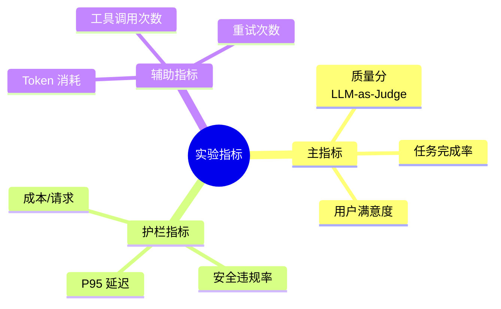
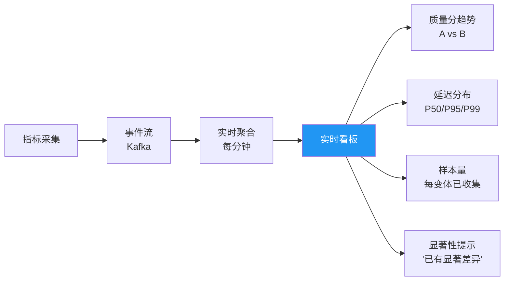

# Sprint 2: 指标采集

> **目标**：为每个变体采集质量、延迟、成本等指标。

---

## 指标体系



---

## V1: 同步采集

```java
@Component
public class MetricsCollectorV1 {

    public void record(String experimentId, String variantId,
                       String userId, Metrics metrics) {
        metricsStore.save(MetricsRecord.builder()
            .experimentId(experimentId)
            .variantId(variantId)
            .userId(userId)
            .qualityScore(metrics.qualityScore())
            .latencyMs(metrics.latencyMs())
            .costUsd(metrics.costUsd())
            .safetyViolation(metrics.safetyViolation())
            .timestamp(Instant.now())
            .build());
    }
}
```

---

## V2: 异步批量写入

```java
/**
 * V2: 高吞吐异步写入
 *
 * 用批量队列 + 后台 flush
 */
@Component
public class AsyncMetricsCollector {

    private final BlockingQueue<MetricsRecord> buffer =
        new LinkedBlockingQueue<>(100000);

    public void record(String experimentId, String variantId,
                       String userId, Metrics metrics) {
        MetricsRecord record = MetricsRecord.builder()
            .experimentId(experimentId)
            .variantId(variantId)
            .userId(userId)
            .qualityScore(metrics.qualityScore())
            .latencyMs(metrics.latencyMs())
            .costUsd(metrics.costUsd())
            .timestamp(Instant.now())
            .build();

        // 非阻塞入队
        if (!buffer.offer(record)) {
            // 队列满 → 丢弃 + 告警
            metrics.dropped();
        }
    }

    /**
     * 后台每 5 秒批量写入
     */
    @Scheduled(fixedRate = 5000)
    public void flush() {
        List<MetricsRecord> batch = new ArrayList<>();
        buffer.drainTo(batch, 5000);
        if (!batch.isEmpty()) {
            metricsStore.batchInsert(batch);
        }
    }
}
```

---

## V3: 实时看板



---

## 质量分采集方案

| 方案 | 延迟 | 成本 | 准确性 | 适用 |
|------|------|------|--------|------|
| LLM-as-Judge（同步） | +2-5s | 高 | 高 | 离线评估 |
| LLM-as-Judge（采样） | 低 | 中 | 中 | 在线监控 |
| 用户反馈 | 低 | 低 | 高 | 需用户配合 |
| 规则检查 | 低 | 低 | 中 | 安全/格式检查 |
| 延迟+成本 | 低 | 低 | 低 | 最基础 |

---

## 关键收获

| 要点 | 说明 |
|------|------|
| 采集必须异步 | 不能阻塞主流程 |
| 质量分要采样 | 100% LLM-Judge 成本太高 |
| 实时看板很重要 | 实验进展可见才有信心 |
| 护栏指标不能少 | 质量好但延迟爆炸也不行 |
