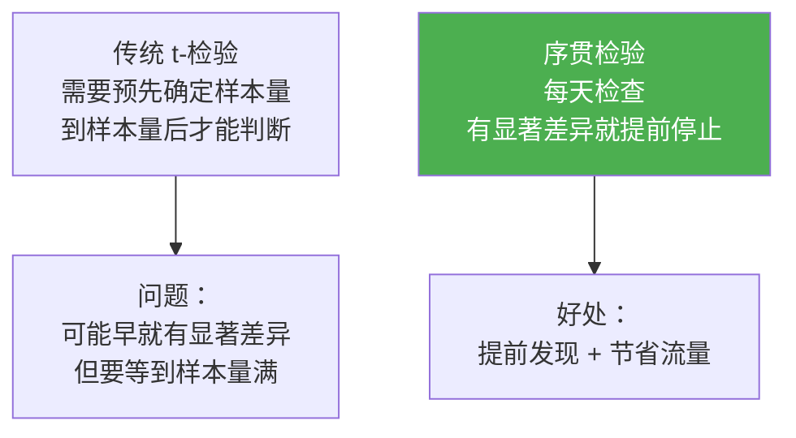
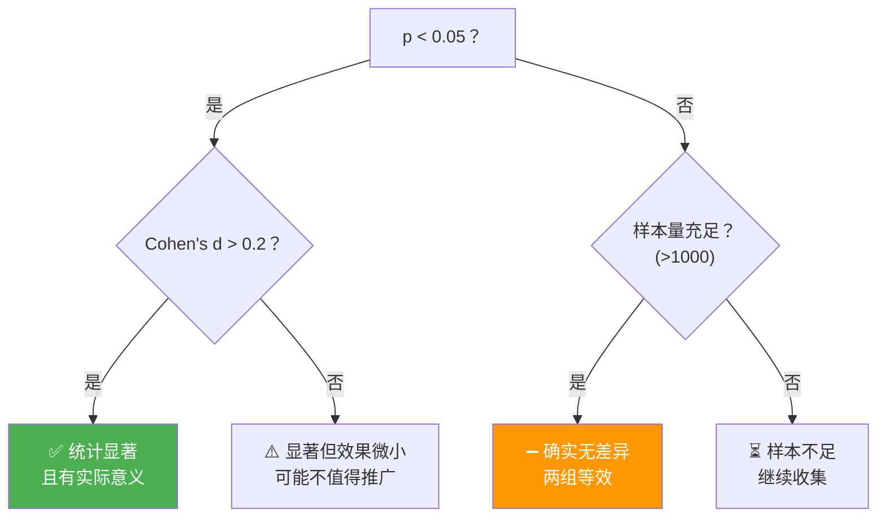

# Sprint 3: 统计分析

> **目标**：用统计方法判断"变体之间的差异是真的还是偶然的"。

---

## V1: 均值对比

```java
@Component
public class SimpleAnalyzer {

    public AnalysisResult analyze(String variantA, String variantB,
                                   List<MetricsRecord> allRecords) {
        // 分组
        List<Double> scoresA = filterAndExtract(allRecords, variantA, "quality");
        List<Double> scoresB = filterAndExtract(allRecords, variantB, "quality");

        double meanA = mean(scoresA);
        double meanB = mean(scoresB);
        double lift = (meanB - meanA) / meanA;

        return new AnalysisResult(meanA, meanB, lift, Math.abs(lift) > 0.05);
    }

    private double mean(List<Double> values) {
        return values.stream().mapToDouble(d -> d).average().orElse(0);
    }
}
```

---

## V2: t-检验

```java
/**
 * V2: 双样本 t-检验
 *
 * 判断差异是否统计显著（p < 0.05）
 */
@Component
public class TTestAnalyzer {

    public TTestResult analyze(List<Double> control, List<Double> treatment) {
        double meanC = mean(control);
        double meanT = mean(treatment);
        double varC = variance(control, meanC);
        double varT = variance(treatment, meanT);
        int nC = control.size();
        int nT = treatment.size();

        // 样本不足
        if (nC < 30 || nT < 30) {
            return TTestResult.insufficient();
        }

        // t 统计量
        double pooledStd = Math.sqrt(varC / nC + varT / nT);
        double t = pooledStd == 0 ? 0 : (meanT - meanC) / pooledStd;

        // 自由度（Welch 校正）
        double df = Math.pow(varC / nC + varT / nT, 2)
                  / (Math.pow(varC / nC, 2) / (nC - 1)
                   + Math.pow(varT / nT, 2) / (nT - 1));

        // p 值（简化：用正态近似）
        double pValue = 2 * (1 - normalCDF(Math.abs(t)));

        // 效果量（Cohen's d）
        double pooledVar = ((nC - 1) * varC + (nT - 1) * varT) / (nC + nT - 2);
        double cohensD = Math.sqrt(pooledVar) == 0 ? 0
            : (meanT - meanC) / Math.sqrt(pooledVar);

        double lift = meanC == 0 ? 0 : (meanT - meanC) / meanC;

        boolean significant = pValue < 0.05;

        return new TTestResult(
            meanC, meanT, t, df, pValue, cohensD, lift,
            significant, nC + nT
        );
    }

    private double normalCDF(double z) {
        return 0.5 * (1 + erf(z / Math.sqrt(2)));
    }

    private double erf(double z) {
        // Abramowitz-Stegun 近似
        double t = 1.0 / (1.0 + 0.5 * Math.abs(z));
        double ans = 1 - t * Math.exp(-z * z - 1.26551223 +
            t * (1.00002368 + t * (0.37409196 + t * (0.09678418 +
            t * (-0.18628806 + t * (0.27886807 + t * (-1.13520398 +
            t * (1.48851587 + t * (-0.82215223 + t * 0.17087277)))))))));
        return z >= 0 ? ans : -ans;
    }
}
```

---

## V3: 序贯检验



```java
/**
 * V3: 序贯检验
 *
 * 每天检查是否已有显著差异
 * 使用 Alpha Spending 边界控制总体错误率
 */
@Component
public class SequentialAnalyzer {

    public SequentialCheck check(List<MetricsRecord> allRecords,
                                  int plannedSampleSize) {
        int currentSamples = allRecords.size();
        double infoFraction = (double) currentSamples / plannedSampleSize;

        // Alpha Spending: 随着信息比增长，p 值边界逐渐放松
        double adjustedAlpha = alphaSpending(infoFraction);

        TTestResult tResult = tTestAnalyzer.analyze(
            extractControl(allRecords),
            extractTreatment(allRecords)
        );

        boolean stop = tResult.pValue() < adjustedAlpha
                    && currentSamples >= 100;  // 最少 100 样本

        return new SequentialCheck(
            stop,
            tResult,
            adjustedAlpha,
            infoFraction,
            stop ? "已达到统计显著，可提前停止"
                 : "继续收集数据"
        );
    }

    /**
     * O'Brien-Fleming Alpha Spending
     */
    private double alphaSpending(double infoFraction) {
        // 越接近终点，边界越宽松
        double z = inverseNormalCDF(1 - 0.025 / 2)
                 / Math.sqrt(infoFraction);
        return 2 * (1 - normalCDF(z));
    }
}
```

---

## 统计检验结果解读



---

## 关键收获

| 要点 | 说明 |
|------|------|
| 样本量很重要 | < 30 的结论不可信 |
| 显著 ≠ 有效 | p 值低不代表效果大 |
| 效果量看 Cohen's d | d > 0.2 才有实际意义 |
| 序贯检验省时间 | 有差异就提前停 |
