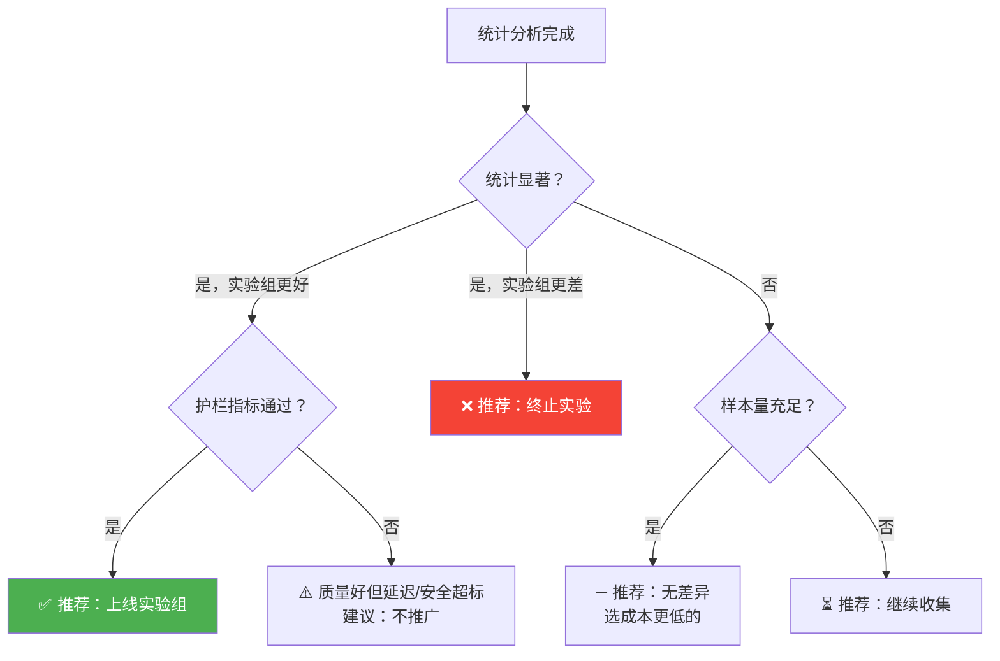

# Sprint 4: 决策自动化

> **目标**：实验结果出来后，自动推荐"上线/继续/终止"。

---

## 决策流程



---

## V1: 决策引擎

```java
@Component
public class DecisionEngine {

    public Decision decide(Experiment experiment, TTestResult result,
                           GuardrailMetrics guardrails) {
        // 护栏检查
        if (!guardrails.allPassed()) {
            return Decision.builder()
                .type(DecisionType.TERMINATE)
                .reason("护栏指标未通过: " + guardrails.failedChecks())
                .confidence(1.0)
                .build();
        }

        // 显著 + 实验组更好
        if (result.significant() && result.lift() > 0) {
            return Decision.builder()
                .type(DecisionType.PROMOTE_TREATMENT)
                .reason(String.format("实验组质量提升 %.1f%% (p=%.4f)",
                    result.lift() * 100, result.pValue()))
                .confidence(calculateConfidence(result))
                .build();
        }

        // 显著 + 实验组更差
        if (result.significant() && result.lift() < 0) {
            return Decision.builder()
                .type(DecisionType.TERMINATE)
                .reason(String.format("实验组质量下降 %.1f%%",
                    Math.abs(result.lift()) * 100))
                .confidence(calculateConfidence(result))
                .build();
        }

        // 不显著 + 样本充足 → 等效
        if (result.totalSamples() > experiment.minSampleSize()) {
            return Decision.builder()
                .type(DecisionType.NO_DIFFERENCE)
                .reason("两组无统计显著差异")
                .confidence(0.9)
                .build();
        }

        // 样本不足 → 继续
        return Decision.builder()
            .type(DecisionType.CONTINUE)
            .reason("样本不足，继续收集")
            .confidence(0.0)
            .build();
    }

    private double calculateConfidence(TTestResult result) {
        // p 值越小，置信度越高
        return Math.max(0, Math.min(1, 1 - result.pValue()));
    }
}
```

---

## V2: 实验报告生成

```java
@Component
public class ExperimentReportGenerator {

    public ExperimentReport generate(Experiment experiment,
                                      Decision decision,
                                      TTestResult statistics,
                                      GuardrailMetrics guardrails) {
        return ExperimentReport.builder()
            .experiment(experiment)
            .summary(buildSummary(decision, statistics))
            .statistics(statistics)
            .guardrails(guardrails)
            .visualizations(generateCharts(statistics))
            .recommendation(decision.type().name())
            .reasoning(decision.reason())
            .createdAt(Instant.now())
            .build();
    }

    private String buildSummary(Decision decision, TTestResult stats) {
        return """
            实验结果摘要

            决策: %s
            置信度: %.0f%%

            对照组均值: %.3f
            实验组均值: %.3f
            提升: %+.1f%%
            p 值: %.4f
            效果量(Cohen's d): %.3f
            样本量: %d

            理由: %s
            """.formatted(
                decision.type(),
                decision.confidence() * 100,
                stats.meanControl(), stats.meanTreatment(),
                stats.lift() * 100,
                stats.pValue(),
                stats.cohensD(),
                stats.totalSamples(),
                decision.reason()
            );
    }
}
```

---

## V3: 自动执行

```java
/**
 * V3: 决策通过后自动执行
 */
@Component
public class AutoExecutor {

    @Scheduled(cron = "0 0 9 * * *")  // 每天 9 点检查
    public void autoExecute() {
        for (Experiment exp : experimentStore.getCompleted()) {
            Decision decision = decisionEngine.decide(exp);

            switch (decision.type()) {
                case PROMOTE_TREATMENT -> {
                    if (decision.confidence() > 0.95) {
                        // 高置信度自动执行
                        canaryController.start(exp.winningVariant());
                        notifyTeam("实验 " + exp.name() + " 自动推广: " + decision.reason());
                    } else {
                        // 低置信度需人工确认
                        notifyTeam("实验 " + exp.name() + " 待确认: " + decision.reason());
                    }
                }
                case TERMINATE -> {
                    experimentStore.terminate(exp.id());
                    notifyTeam("实验 " + exp.name() + " 已终止: " + decision.reason());
                }
                case NO_DIFFERENCE -> {
                    experimentStore.complete(exp.id());
                    notifyTeam("实验 " + exp.name() + " 结论: 无差异");
                }
                case CONTINUE -> {} // 继续收集
            }
        }
    }
}
```

---

## 决策权限矩阵

| 决策类型 | 置信度 > 95% | 置信度 80-95% | 置信度 < 80% |
|---------|------------|-------------|-------------|
| 推广 | 自动执行 | 人工确认 | 继续 |
| 终止 | 自动执行 | 人工确认 | 继续 |
| 无差异 | 自动归档 | 人工确认 | 继续 |

---

## 关键收获

| 要点 | 说明 |
|------|------|
| 自动决策要设阈值 | 高置信自动，低置信人工 |
| 护栏指标是硬门 | 质量好但延迟爆炸也必须停 |
| 报告要可读 | 不是每个人都能看懂 p 值 |
| 决策要可追溯 | 为什么推广/终止要有记录 |
