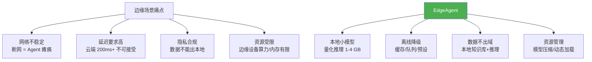
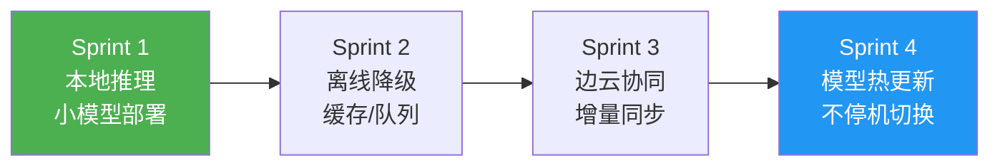
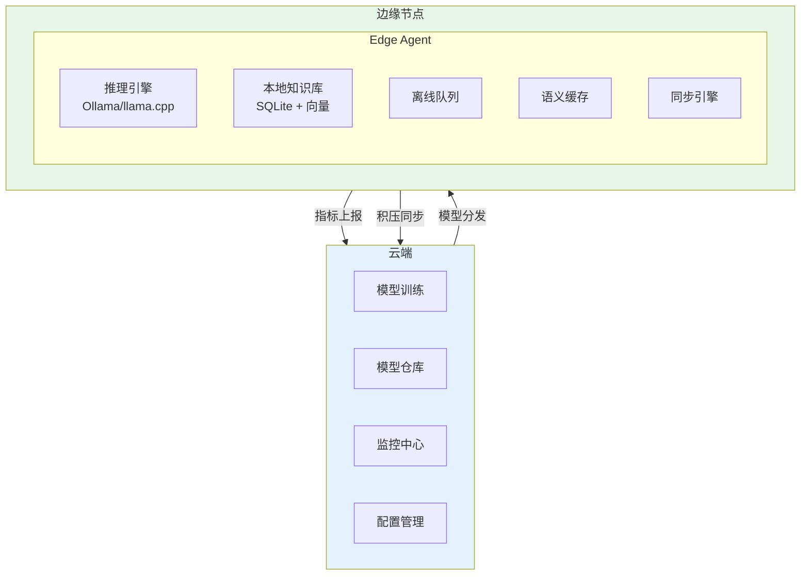

# ⑳ EdgeAgent — 边缘计算 Agent 平台

> **代号**：EdgeAgent
> **核心问题**：工厂车间、远洋货轮、战场前线——网络不稳定甚至完全断网——Agent 必须在边缘也能工作。

---

## 项目定位



---

## 四个 Sprint



| Sprint | 目标 | V1→V2→V3 | 时间 |
|--------|------|---------|------|
| Sprint 1 | 本地推理 | V1 Ollama → V2 量化 → V3 动态卸载 | 1.5 周 |
| Sprint 2 | 离线降级 | V1 缓存 → V2 队列 → V3 自适应策略 | 1 周 |
| Sprint 3 | 边云协同 | V1 指标上报 → V2 知识同步 → V3 远程管理 | 1 周 |
| Sprint 4 | 模型热更新 | V1 手动更新 → V2 自动下载 → V3 原子切换 | 1 周 |

---

## 架构设计



---

## 目录结构

```
项目实践/20-企业项目-边缘计算Agent平台/
├── 00-总览.md
├── Sprint1-本地推理引擎.md
├── Sprint2-离线降级.md
├── Sprint3-边云协同.md
└── Sprint4-模型热更新.md
```

---

## 技术栈

| 层 | 技术 |
|----|------|
| 边缘推理 | Ollama / llama.cpp / ONNX Runtime |
| 模型格式 | GGUF / 量化 (Q4_K_M / Q8) |
| 本地存储 | SQLite + sqlite-vss |
| 框架 | Spring Boot (精简版) |
| 部署 | Docker / 裸机二进制 |
| 通信 | MQTT / gRPC（弱网友好） |
