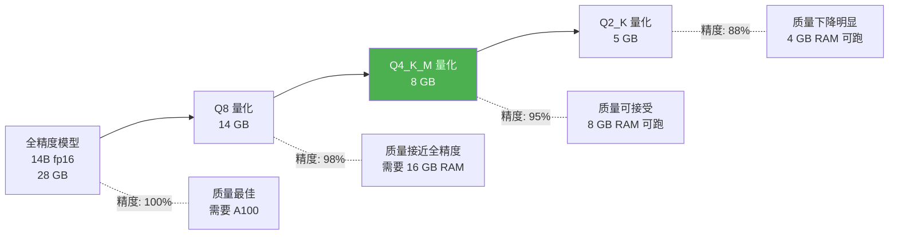

# Sprint 1: 本地推理引擎

> **目标**：在边缘设备上运行量化后的小模型，不依赖云端 API。

---

## V1: Ollama 集成

```java
@Component
public class LocalInferenceEngineV1 {

    /**
     * 通过 Ollama 运行本地模型
     */
    public String generate(String prompt, int maxTokens) {
        OllamaRequest request = new OllamaRequest(
            "qwen2.5:7b",  // 边缘设备可跑的 7B 模型
            prompt,
            false,         // 不流式
            maxTokens
        );

        OllamaResponse response = ollamaClient.generate(request);
        return response.response();
    }
}
```

---

## V2: 模型量化



```java
@Component
public class QuantizedModelManager {

    /**
     * 根据设备资源自动选择最佳量化级别
     */
    public String selectOptimalModel() {
        long availableRam = SystemInfo.getAvailableMemoryGB();

        if (availableRam >= 16) {
            return "qwen2.5:14b-q8";    // 14B Q8: ~14 GB
        } else if (availableRam >= 8) {
            return "qwen2.5:7b-q4_km";  // 7B Q4: ~5 GB
        } else if (availableRam >= 4) {
            return "qwen2.5:3b-q4_km";  // 3B Q4: ~2 GB
        } else {
            return "qwen2.5:1.5b-q4_km"; // 1.5B Q4: ~1 GB
        }
    }

    /**
     * 加载模型
     */
    public void loadModel(String modelName) {
        ollamaClient.pull(modelName);
        ollamaClient.load(modelName);
        log("模型已加载: " + modelName);
    }

    /**
     * 动态卸载（内存压力时）
     */
    public void unloadIfNeeded() {
        Runtime runtime = Runtime.getRuntime();
        double usedRatio = 1.0 - (double) runtime.freeMemory() / runtime.maxMemory();

        if (usedRatio > 0.85) {
            ollamaClient.unload();
            log("内存压力，卸载模型");
        }
    }
}
```

---

## V3: 本地 RAG

```java
/**
 * V3: 本地知识库检索（纯离线）
 */
@Component
public class LocalRAGEngine {

    private final SQLiteVectorStore vectorStore;  // sqlite-vss

    public String query(String question) {
        // 1. 本地 Embedding（小模型）
        float[] queryVec = localEmbedder.embed(question);

        // 2. 本地向量检索
        List<Document> docs = vectorStore.search(queryVec, 3);

        // 3. 本地 LLM 生成
        String context = docs.stream()
            .map(Document::content)
            .collect(joining("\n\n"));

        String prompt = """
            基于以下信息回答问题。如果信息不足，请说"我不知道"。

            参考资料：
            %s

            问题：%s
            """.formatted(context, question);

        return localInference.generate(prompt, 256);
    }
}
```

---

## 边缘设备性能基准

| 设备 | RAM | 模型 | 推理速度 | 质量 |
|------|-----|------|---------|------|
| Raspberry Pi 5 (8GB) | 8 GB | Qwen 2.5 3B Q4 | 8 tok/s | ⭐⭐⭐ |
| Intel NUC (16GB) | 16 GB | Qwen 2.5 7B Q4 | 15 tok/s | ⭐⭐⭐⭐ |
| 工控机 (32GB) | 32 GB | Qwen 2.5 14B Q4 | 12 tok/s | ⭐⭐⭐⭐⭐ |
| Jetson Orin (16GB) | 16 GB | Qwen 2.5 7B Q4 (GPU) | 35 tok/s | ⭐⭐⭐⭐ |

---

## 关键收获

| 要点 | 说明 |
|------|------|
| 量化是必须的 | 边缘设备跑不了全精度模型 |
| 自适应模型选择 | 根据设备资源自动选择最佳模型 |
| 本地 RAG 可行 | sqlite-vss 够用 |
| 动态卸载 | 内存压力时释放模型 |
