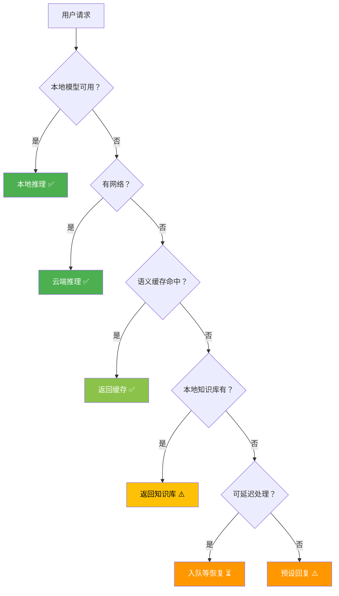

# Sprint 2: 离线降级

> **目标**：网络断开时，Agent 自动降级，不崩溃不报错。

---

## 降级策略



---

## V1: 语义缓存

```java
@Component
public class LocalSemanticCache {

    private final SQLiteVectorStore cacheStore;

    public Optional<String> lookup(String query) {
        float[] queryVec = localEmbedder.embed(query);
        List<CachedEntry> hits = cacheStore.search(queryVec, 1, 0.90);

        if (!hits.isEmpty()) {
            CachedEntry hit = hits.get(0);
            // 检查缓存是否过期
            if (hit.createdAt().isAfter(
                    Instant.now().minus(Duration.ofDays(7)))) {
                metrics.cacheHit();
                return Optional.of(hit.response());
            }
        }
        metrics.cacheMiss();
        return Optional.empty();
    }

    public void store(String query, String response) {
        float[] vec = localEmbedder.embed(query);
        cacheStore.add(new CachedEntry(
            UUID.randomUUID().toString(),
            query, response, vec,
            Instant.now()
        ));
    }
}
```

---

## V2: 离线队列

```java
/**
 * V2: 断网时请求入队
 * 网络恢复后自动处理
 */
@Component
public class OfflineQueueV2 {

    private final Queue<QueuedRequest> queue = new ConcurrentLinkedQueue<>();
    private final int maxSize = 5000;

    public boolean enqueue(Request request) {
        if (queue.size() >= maxSize) {
            metrics.queueFull();
            return false;
        }
        queue.offer(new QueuedRequest(
            UUID.randomUUID().toString(),
            request,
            Instant.now()
        ));
        metrics.queueSize(queue.size());
        return true;
    }

    @Scheduled(fixedRate = 30000)
    public void tryFlush() {
        if (!connectionMonitor.isOnline()) return;

        QueuedRequest req;
        int processed = 0;
        while ((req = queue.peek()) != null && processed < 50) {
            try {
                String result = cloudInference.infer(req.request());
                // 通知用户（如果有 callback）
                resultNotifier.notify(req.id(), result);
                queue.poll();
                processed++;
            } catch (Exception e) {
                break;  // 网络又断了
            }
        }
    }
}
```

---

## V3: 自适应降级

```java
/**
 * V3: 根据网络质量和系统负载动态选择策略
 */
@Component
public class AdaptiveDegradation {

    public DegradationLevel determine() {
        NetworkQuality net = connectionMonitor.getQuality();
        double cpuUsage = SystemInfo.getCpuUsage();
        double memUsage = SystemInfo.getMemoryUsage();

        // 综合评分
        int score = 0;

        // 网络维度
        if (net == OFFLINE) score += 3;
        else if (net == WEAK) score += 1;

        // CPU 维度
        if (cpuUsage > 0.9) score += 2;
        else if (cpuUsage > 0.7) score += 1;

        // 内存维度
        if (memUsage > 0.9) score += 2;
        else if (memUsage > 0.8) score += 1;

        // 映射到降级级别
        if (score >= 5) return DegradationLevel.EMERGENCY;
        if (score >= 3) return DegradationLevel.DEGRADED;
        if (score >= 1) return DegradationLevel.WARNING;
        return DegradationLevel.NORMAL;
    }
}
```

---

## 降级行为矩阵

| 级别 | 网络 | 模型 | 功能 | 用户体验 |
|------|------|------|------|---------|
| NORMAL | 良好 | 强模型 | 全部 | 正常 ✅ |
| WARNING | 弱/负载高 | 强模型 | 全部 | 稍慢 |
| DEGRADED | 差/负载很高 | 弱模型 | 核心 | 降级 |
| EMERGENCY | 断网/负载满 | 缓存/队列 | 只读 | 离线模式 |

---

## 关键收获

| 要点 | 说明 |
|------|------|
| 缓存是第一道防线 | 语义缓存命中率 20-40% |
| 队列处理可延迟请求 | 断网不丢请求 |
| 自适应很重要 | 不是非黑即白的开关 |
| 用户要知情 | 告诉用户"当前离线模式" |
