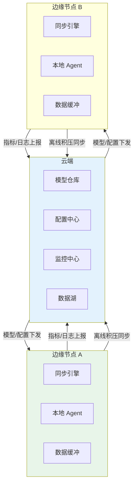
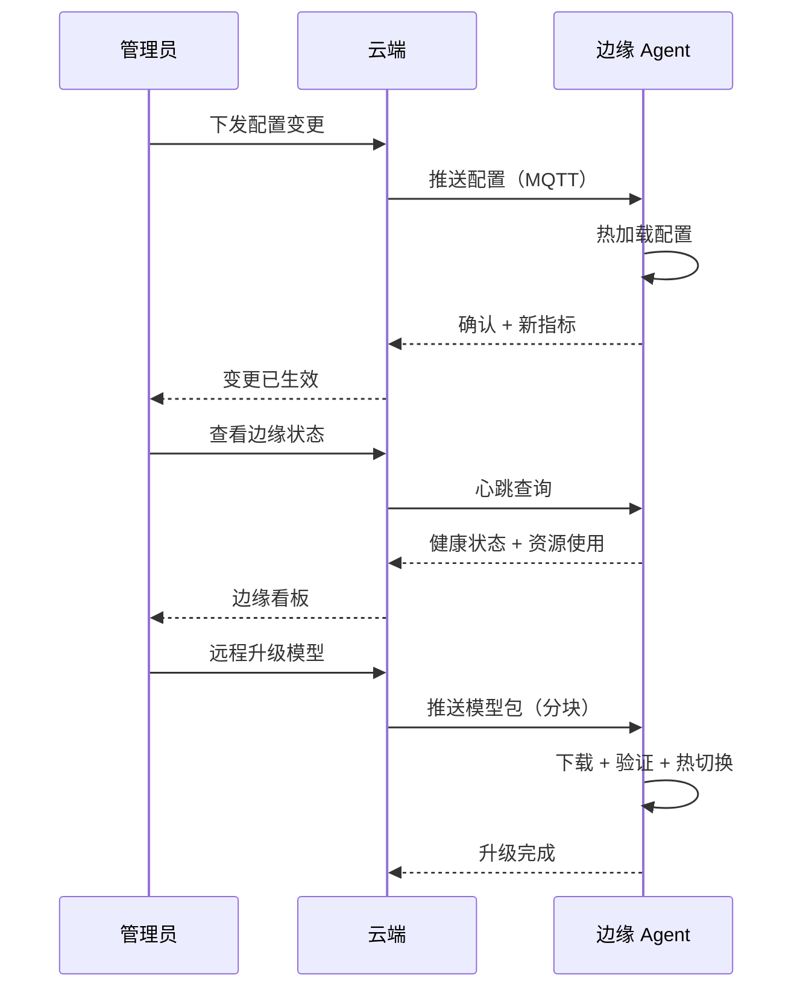

# Sprint 3: 边云协同

> **目标**：边缘节点与云端协同——云端训练/管理，边缘推理/执行。

---

## 边云协同架构



---

## V1: 指标上报

```java
@Component
public class MetricsReporter {

    private final Queue<Metric> buffer = new ConcurrentLinkedQueue<>();

    /**
     * 本地记录指标（不阻塞主流程）
     */
    public void record(String name, double value, Map<String, String> tags) {
        buffer.offer(new Metric(name, value, tags, Instant.now()));
    }

    /**
     * 有网络时批量上报
     */
    @Scheduled(fixedRate = 60000)
    public void report() {
        if (!connectionMonitor.isOnline()) return;
        if (buffer.isEmpty()) return;

        List<Metric> batch = new ArrayList<>();
        Metric m;
        while ((m = buffer.poll()) != null && batch.size() < 500) {
            batch.add(m);
        }

        try {
            cloudClient.reportMetrics(batch);
        } catch (Exception e) {
            // 上报失败 → 放回队列
            buffer.addAll(batch);
        }
    }
}
```

---

## V2: 知识库增量同步

```java
/**
 * V2: 云端知识库更新时，增量同步到边缘
 */
@Component
public class KnowledgeSyncEngine {

    private String lastSyncTimestamp;

    /**
     * 定时同步（弱网友好：小批量）
     */
    @Scheduled(initialDelay = 60000, fixedRate = 300000)
    public void sync() {
        if (!connectionMonitor.isOnline()) return;

        // 1. 获取增量变更
        DeltaResponse delta = cloudClient.getKnowledgeDelta(
            config.getAgentId(), lastSyncTimestamp);

        if (delta.isEmpty()) return;

        // 2. 应用变更
        for (DocumentChange change : delta.changes()) {
            switch (change.type()) {
                case ADDED, MODIFIED -> {
                    float[] vec = localEmbedder.embed(change.content());
                    localKB.upsert(change.id(), change.content(), vec,
                                   change.metadata());
                }
                case DELETED -> localKB.delete(change.id());
            }
        }

        lastSyncTimestamp = delta.latestTimestamp();
        log("同步完成: %d 条变更", delta.changes().size());
    }
}
```

---

## V3: 远程管理



---

## 通信协议选型

| 协议 | 延迟 | 弱网容忍 | 双向 | 适用 |
|------|------|---------|------|------|
| MQTT | 低 | ✅ 强 | ✅ | 物联网/边缘首选 |
| gRPC | 低 | ❌ 一般 | ✅ | 强网环境 |
| HTTP 轮询 | 中 | ✅ | ❌ | 最简单 |
| WebSocket | 低 | ⚠️ 中 | ✅ | 实时双向 |

---

## 关键收获

| 要点 | 说明 |
|------|------|
| 缓冲是核心 | 断网时数据不丢 |
| 增量同步省带宽 | 只传变更部分 |
| MQTT 适合弱网 | 轻量 + 断线重连 |
| 远程管理必要 | 不可能去现场调试每个边缘节点 |
