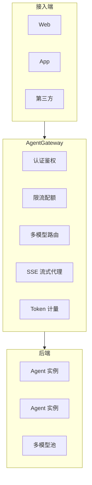

# P21 · Agent API 网关平台（AgentGateway）

> 难度：⭐⭐⭐⭐ · 预计：4 周（4 个 Sprint）

---

## 项目定位

构建一个 Agent 专用的 API 网关平台，解决多端接入、多模型路由、流量治理、Token 计量等核心问题。

## 技术栈

- **网关**：Spring Cloud Gateway / custom Reactive
- **存储**：Redis（限流/配额）、PostgreSQL（API Key/用量）
- **监控**：Micrometer + Prometheus + Grafana

## Sprint 规划

| Sprint | 目标 | 核心产出 |
|--------|------|---------|
| Sprint 1 | API Key 管理 + 认证 | 认证过滤器、Key CRUD、IP 白名单 |
| Sprint 2 | 多模型路由 | 成本/质量/延迟路由策略、健康检查 |
| Sprint 3 | SSE 流式代理 + Token 计量 | SSE 透传、实时计量、用量看板 |
| Sprint 4 | 限流配额 + 灰度路由 | TPM/RPM 限流、灰度切换、完整监控 |

## 学习收获

- 网关过滤器链设计
- Reactive 流式编程实战
- 多模型路由决策
- 实时 Token 计量
- API Key 生命周期管理
