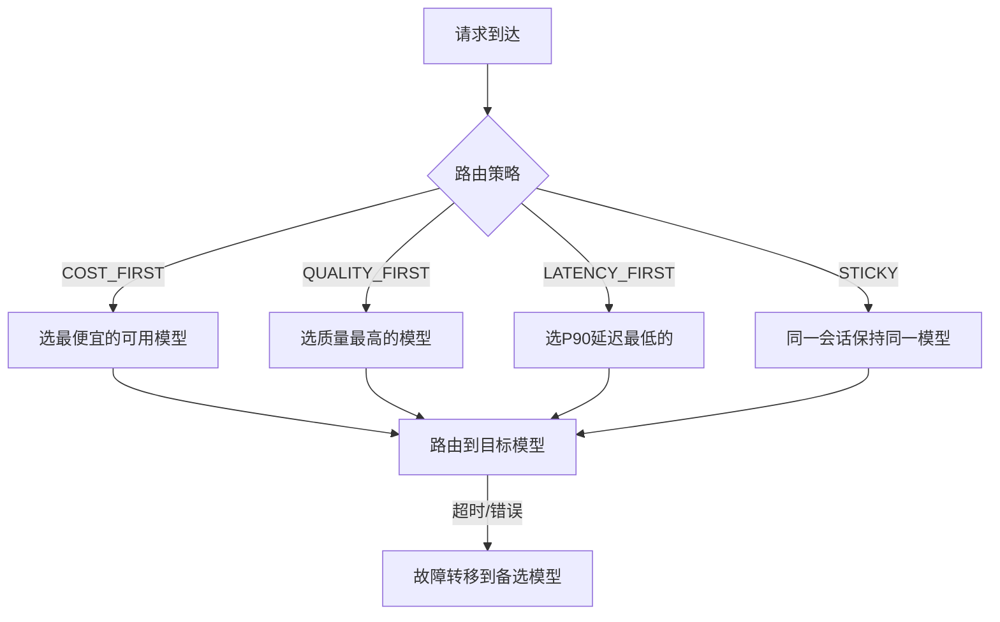

# Sprint 2 · 多模型路由

> P21 AgentGateway · 第 2 周

---

## 目标

实现多模型智能路由——按成本/质量/延迟策略选择 LLM 后端。

## 任务清单

- [ ] 模型注册表（模型 ID / Provider / 价格 / 能力）
- [ ] 路由策略（成本优先 / 质量优先 / 延迟优先 / 会话亲和）
- [ ] 健康检查（定时探测模型可用性）
- [ ] 故障转移（模型不可用时自动切换）
- [ ] 负载均衡（轮询 / 加权 / 最少连接）

## 路由决策



## 核心代码

```java
@Component
public class ModelRouter {
    private final Map<String, ModelEndpoint> models = new ConcurrentHashMap<>();

    public ModelEndpoint route(RouteContext ctx) {
        List<ModelEndpoint> available = models.values().stream()
                .filter(e -> e.healthy)
                .sorted(comparator(ctx.strategy()))
                .toList();

        if (available.isEmpty()) throw new GatewayException("无可用模型");

        // 会话亲和
        if (ctx.strategy().equals("STICKY") && ctx.sessionId() != null) {
            String cached = redis.get("model:" + ctx.sessionId());
            if (cached != null && models.containsKey(cached) && models.get(cached).healthy) {
                return models.get(cached);
            }
        }

        ModelEndpoint selected = available.get(0);
        if (ctx.sessionId() != null) {
            redis.setex("model:" + ctx.sessionId(), 3600, selected.modelId());
        }
        return selected;
    }

    private Comparator<ModelEndpoint> comparator(String strategy) {
        return switch (strategy) {
            case "COST_FIRST" -> Comparator.comparingDouble(e -> e.outputPrice);
            case "QUALITY_FIRST" -> Comparator.comparingDouble(e -> -e.qualityScore);
            case "LATENCY_FIRST" -> Comparator.comparingDouble(e -> e.p90Latency);
            default -> Comparator.comparingInt(e -> e.requestCount); // 最少连接
        };
    }

    @Scheduled(fixedRate = 30000)
    public void healthCheck() {
        models.values().parallelStream().forEach(ep -> {
            try {
                ep.healthy = ping(ep);
                if (ep.healthy) ep.p90Latency = measureLatency(ep);
            } catch (Exception e) {
                ep.healthy = false;
            }
        });
    }
}
```

## 验收

- [ ] COST_FIRST 路由到最便宜模型
- [ ] QUALITY_FIRST 路由到最强模型
- [ ] STICKY 同一会话保持同一模型
- [ ] 模型故障时自动切换到备选
- [ ] 健康检查每 30 秒执行
