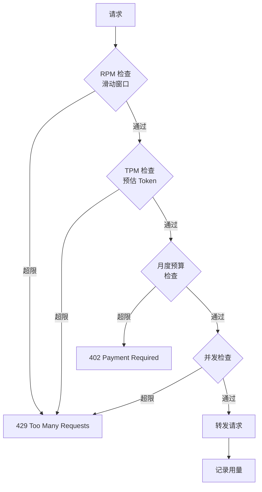

# Sprint 4 · 限流配额与灰度路由

> P21 AgentGateway · 第 4 周

---

## 目标

实现多维度限流（RPM/TPM/并发）、配额管理、灰度路由。

## 任务清单

- [ ] RPM 限流（每分钟请求数）
- [ ] TPM 限流（每分钟 Token 数）
- [ ] 并发会话限制
- [ ] 月度预算配额（超出拒绝）
- [ ] 灰度路由（按百分比切换模型）
- [ ] 完整监控看板接入

## 限流架构



## Redis 滑动窗口限流

```java
@Component
public class RateLimiter {

    private final RedisTemplate<String, String> redis;

    public boolean allow(String key, int limit, int windowSeconds) {
        String redisKey = "ratelimit:" + key;
        long now = System.currentTimeMillis();
        long cutoff = now - windowSeconds * 1000L;

        // Lua 脚本保证原子性
        String lua = """
            local key = KEYS[1]
            local cutoff = tonumber(ARGV[1])
            local now = tonumber(ARGV[2])
            local limit = tonumber(ARGV[3])
            redis.call('ZREMRANGEBYSCORE', key, 0, cutoff)
            local count = redis.call('ZCARD', key)
            if count < limit then
                redis.call('ZADD', key, now, now .. '-' .. math.random())
                redis.call('EXPIRE', key, %d)
                return 1
            else
                return 0
            end
            """.formatted(windowSeconds);

        Long result = redis.execute(
                (connection) -> connection.scriptingCommands()
                        .eval(lua.getBytes(), ReturnType.INTEGER, 1,
                              redisKey.getBytes(),
                              String.valueOf(cutoff).getBytes(),
                              String.valueOf(now).getBytes(),
                              String.valueOf(limit).getBytes()),
                true);

        return result != null && result == 1;
    }
}
```

## 灰度路由

```java
@Component
public class CanaryRouter {
    @Value("${canary.new-model.percent:0}")
    private double canaryPercent;

    public boolean shouldRouteToCanary(String sessionId) {
        // 基于 sessionId 哈希 → 稳定分流
        int hash = Math.abs(sessionId.hashCode()) % 100;
        return hash < canaryPercent * 100;
    }

    @PostMapping("/api/admin/canary/promote")
    public Map<String, Object> promote(@RequestParam double newPercent) {
        canaryPercent = newPercent;
        return Map.of("canaryPercent", canaryPercent);
    }
}
```

## 监控指标

```java
@Bean
public MeterRegistryCustomizer<MeterRegistry> metrics() {
    return registry -> {
        // 请求数 Counter
        // 延迟 Timer
        // 错误率 Gauge
        // Token 用量 Counter
        // 活跃连接 Gauge
    };
}
```

## 验收

- [ ] RPM 超限返回 429
- [ ] TPM 超限返回 429
- [ ] 月度预算用完返回 402
- [ ] 灰度路由按百分比分流
- [ ] Grafana 看板展示 QPS / 延迟 / 错误率 / Token 用量
