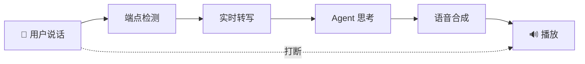

# P22 · Agent 语音对话平台（VoiceAgent）

> 难度：⭐⭐⭐⭐ · 预计：4 周（4 个 Sprint）

---

## 项目定位

构建一个支持实时语音对话的 Agent 平台——用户说话，Agent 听懂、思考、语音回复，支持打断。

## 技术栈

- **实时通信**：WebSocket
- **ASR**：Whisper / 云服务流式 ASR
- **LLM**：Spring AI ChatClient
- **TTS**：云 TTS / Edge-TTS
- **VAD**：能量检测 / WebRTC VAD

## Sprint 规划

| Sprint | 目标 | 核心产出 |
|--------|------|---------|
| Sprint 1 | WebSocket + VAD + ASR | 语音采集、端点检测、实时转写 |
| Sprint 2 | LLM 流式 + 按句切分 TTS | 边生成边合成、首字延迟 < 1s |
| Sprint 3 | 打断处理 + 多轮对话 | 用户打断立即停止、多轮上下文 |
| Sprint 4 | 多语言 + 声音定制 | 多语言切换、声音参数配置 |

## 学习收获

- 全双工语音通信
- VAD 端点检测算法
- 流式 ASR/TTS 集成
- 打断处理与上下文管理
- 延迟优化策略
