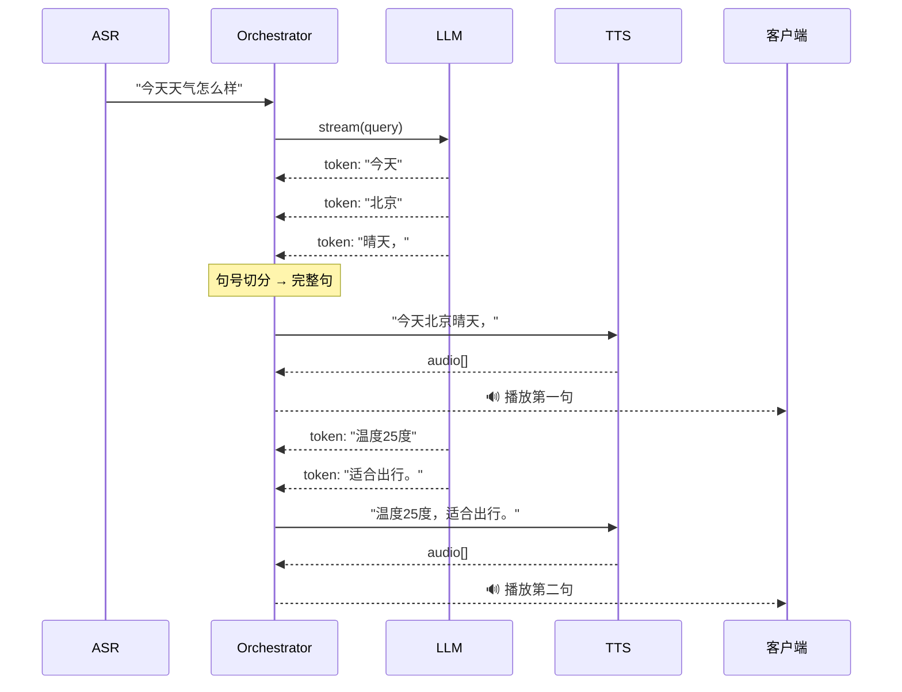

# Sprint 2 · 流式 LLM + 按句切分 TTS

> P22 VoiceAgent · 第 2 周

---

## 目标

实现 LLM 流式生成 → 按句切分 → 流式 TTS 合成 → 音频推送的完整管线，首字延迟 < 1 秒。

## 任务清单

- [ ] LLM 流式生成（ChatClient.stream）
- [ ] 按句切分（标点检测 → 完整句子）
- [ ] TTS 合成（每句独立合成）
- [ ] 音频帧推送（WebSocket Binary）
- [ ] 延迟优化（首句即响应）

## 流水线架构



## 核心代码

```java
public class VoiceOrchestrator {

    public void process(VoiceSessionContext ctx, String userText, WebSocketSession session) {
        ctx.currentFuture = pool.submit(() -> {
            StringBuilder sentence = new StringBuilder();

            chatClient.prompt()
                    .user(userText)
                    .advisors(spec -> spec.param("conversation_id", ctx.sessionId))
                    .stream()
                    .content()
                    .doOnNext(token -> {
                        sentence.append(token);
                        if (isSentenceEnd(sentence)) {
                            String s = sentence.toString().trim();
                            sentence.setLength(0);
                            synthesizeAndSend(s, session, ctx);
                        }
                    })
                    .doOnComplete(() -> {
                        if (sentence.length() > 0) {
                            synthesizeAndSend(sentence.toString().trim(), session, ctx);
                        }
                        sendJson(session, Map.of("type", "tts_done"));
                    })
                    .blockLast();
        });
    }

    private void synthesizeAndSend(String text, WebSocketSession session, VoiceSessionContext ctx) {
        if (text.isEmpty()) return;
        byte[] audio = ttsClient.synthesize(text, ctx.voiceConfig());
        try {
            session.sendMessage(new BinaryMessage(ByteBuffer.wrap(audio)));
        } catch (Exception e) { }
    }

    private boolean isSentenceEnd(StringBuilder sb) {
        if (sb.isEmpty()) return false;
        char last = sb.charAt(sb.length() - 1);
        return last == '。' || last == '？' || last == '！'
            || last == '.' || last == '?' || last == '!'
            || last == '，' || last == ',';
    }
}
```

## 延迟优化

| 优化 | 效果 |
|------|------|
| 流式 ASR（不等说完） | -300ms |
| LLM 首句即切分 | -1500ms |
| TTS 首句即合成 | -200ms |
| WebSocket 长连接 | -100ms |
| 短句优先（逗号也切） | -500ms |

## 验收

- [ ] 用户说完后 1 秒内听到第一个字
- [ ] 长回复按句切分流式播放
- [ ] 语音自然流畅（不卡顿）
